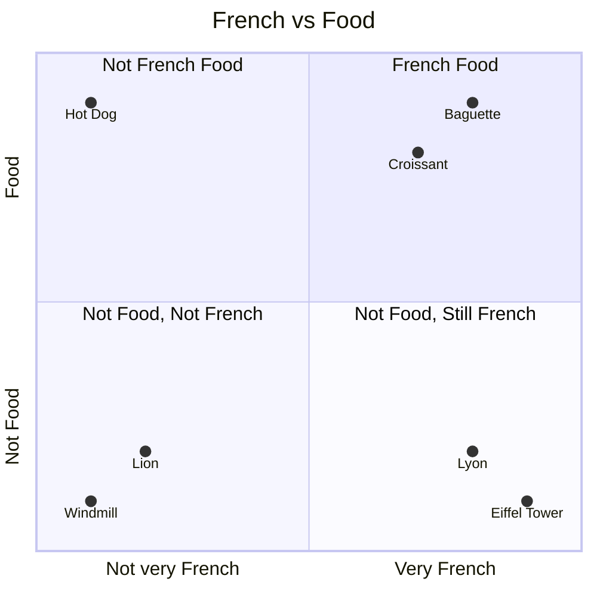

# Unlocking the Power of Your Data with Large Language Models

If you prefer listening over reading, you can watch the video version of this article on [YouTube][2].

Do you want to combine your data with large language models? To get the very most out of them? This article will take you through the basics. At Xebia, we categorise LLM-enabled applications in 3 levels. In this article, we will cover a level 2 application. First, let's cover what we mean by a level 2 application.

Level 1: Simple Prompting
In a level 1 application, we rely solely on the features of the base LLM. Every LLM was trained on a dataset. Imagine an application that helps you write a blog post or an article. We can use an LLM to provide drafts for new paragraphs or sentences. The LLM needs nothing more than a prompt, and it will respond. Models like GPT-3.5 and GPT-4 are perfect for this.

Level 2: Adding Your Data
A level 2 application builds on a level 1 application, but allows you to bring in your own data. For instance, if you want to create a chatbot for your webshop that helps users find the right information about your services: you will want the chatbot to 'know' about your products and services. For a level 2 application, you need to find a touchpoint between your data and the LLM. More about that later.

Level 3: Connected Agents
Perhaps one of the most exciting applications of a Large Language Model: allowing the LLM to take the wheel to solve a particular task. For level 3 applications, you develop skills or plugins, that essentially give an LLM "hands" and "feet" to execute tasks far beyond the capabilities of a level 1 or 2 application. Want to search the web? Level 3. Want to control a robot? Write a skill for it. Want to write a book without human intervention? That's a Level 3 application!

## Goals & Challenges

The goal of a level 2 application is to produce results that are verifiable, accurate and up-to-date.

- Up-to-date: data tends to change. This might be monthly, weekly, or even every second. If you just revamped your product line, you want your chatbot to know about it, instead of waiting for the next LLM update.
- Accurate: you want your application to provide the right information and be correct 100% of the time.
- Verifiable: perhaps the most important one to achieve, and the one we often forget. When you're producing results with AI, you don't just want to indicate to a user that this is the case. It is your responsibility to provide the user with a way to verify the results.

Note to Olaf: This quote is very important to this article.
> It is your responsibility to provide the user with a way to verify the results.

These goals, whilst seemingly straightforward, can be hard to achieve. This is because when you start to build Level 2 applications, you run into three challenges:

### 1. Knowledge Cutoff

At the time of writing, the knowledge cutoff of GPT-3.5 Turbo and GPT-4 is April 2023. This means that the data that the LLM was trained on is up to that date. If you have data that is more recent, you will need to find a way to combine your data with the LLM. This is not always straightforward and can be a challenge. Not long ago, this knowledge cutoff date used to be years in the past. Currently, it's months, and surely it will become weeks or even days in the future. However, as Large Language Models are costly to train, and training takes a considerable amount of time, it is unlikely that we will see a model that is up-to-date to the second very soon.

### 2. No Access To Your Data

The training set that was used to create GPT-3.5 and GPT-4 likely does not contain your data. That's great news because we spend a lot of time making sure that people external to our organizations don't have access to our data. However, this also means that the LLM has never been in contact with your data, so how can it answer questions about your data? Even if all of your data is public, you can't assume that it was part of the training set, as its exact contents were never disclosed.

### 3. LLMs Just Generate Likely Text

At its very core, an LLM is a text generator. It doesn't **know anything**. It generates text that is very likely to be correct, in the sense that when a human reads it, it makes sense. This is especially interesting seeing as how many people use ChatGPT as a search engine. An LLM can generate text that seems to be correct but is not **grounded in truth**. This behaviour is what we used to call "hallucination", but because we don't want to anthropomorphize the LLM, it's not a human that's capable of hallucinating, it's not lying, it's just doing what it was built to do, generating likely text. This is also why one of our goals is to provide a way for our users to verify the results. Which of course we all do after ChatGPT has given us an answer, right?

## What can we do?

If you've already spent some time reading about Azure OpenAI, you have come across the term "fine-tuning". Fine-tuning allows you to take a base model (like GPT-3.5 Turbo or the older Babbage and Davinci models) and train another layer on top of it with your own data. So if this is the solution, why are we still talking about the challenges? This is because while it does combine your data with an LLM, most of the challenges remain the same.

One benefit of fine-tuning is to teach the LLM the language of your domain. Maybe you work in a sector with a lot of jargon, or very specific terminology and abbreviations. Fine-tuning can help the LLM understand your language better.

A major issue with fine-tuning is that the data that you have, no matter how large your dataset, is but a grain of sand compared to the desert of data that the LLM was trained on. To fine-tune, your data is made "more important" when fine-tuning. This process is done through Low Rank Adaption (LoRA), which allows a new model to be created without retraining on the entire dataset. This can affect the performance of the overall model and make it more likely to generate words from your dataset. You still won't be able to verify the results, an LLM doesn't know where it got its information from.

On top of that, to keep the model up-to-date, you will need to fine-tune it often. This is not always feasible. Fine-tuning is costly, and it can be hard to maintain. If you have a lot of data, you might need to invest in a lot of compute power to fine-tune your model. And if your data changes often, you will need to fine-tune your model often. This is not always feasible.

Consider the following quote, straight from the Azure OpenAI documentation:

> Common signs you might not be ready for fine-tuning yet:
>
> 1. Starting with fine-tuning without having tested any other techniques.

In other words, implement other solutions first before you start with fine-tuning.

## Choosing the right approach

### Azure AI Studio

While we explore the solution, let's tangibly showcase the problem. Through the new [Azure AI Studio][3], we can get access to a playground environment where we can see exactly what an LLM is capable of. In this playground setting, we have different parameters we can use. In Figure 1, we limit the response to a set number of tokens and use the default temperature of 0.7. The temperature parameter controls the randomness of the output. The higher you set it, the more likely the LLM is to generate unexpected results. A default setting of 0.7 is great for a chat experience where you don't have any data to ground the LLM in.

Figure 1. Asking about myself in Azure AI Studio.

In Figure 1, you can see that I asked the model a simple question: "What is Matthijs van der Veer good at?". I'm pretty certain that my name is in the original dataset that the model was trained on. I have a blog, a StackOverflow account and I share my name with a filmmaker and musician. Yet, while my name is likely in the original dataset of the GPT-4 model, I know my name is probably not that prevalent. When the LLM inevitably replies that it doesn't know who Matthijs is (and unnecessarily hurts my feelings), I follow up with "He works at Xebia". But even with this added context, the LLM proceeds to burn me, by saying I'm not a well-known public figure. We also see why it's important to ground the LLM in truth, as in its reply, it starts making assumptions about my skillset. This is a great example of the LLM generating likely text, but not being grounded in truth.

So let's improve these results. Say I wanted to make a chat experience where I can ask about the people working at Xebia. This is extremely useful for a consulting firm like ours. Every person has a unique skill set, and everybody is on their personal authority mission. So when we have a new project coming up, this type of chatbot can be extremely helpful in finding the right person for the job. To ground the model in truth, I need a dataset that contains the work experience and wishes of all of our consultants. And I don't want to waste any time coding the application first, I need to discover how valuable my dataset is first. Luckily, Azure AI Studio has a feature that allows me to test my dataset in 5 minutes. This is the fastest way to test your data.

In Azure AI Studio, there's a feature called "Add your data", which allows you to add a dataset to the playground. You can then have the same chat experience as before, but now the results should be grounded in the truth. When you add your data, there are a couple of options to choose from. See Figure 2.


Figure 2. Choosing a data source.

In Figure 2, you can see we can choose to upload files, use blob storage, or talk to Azure Search. In the future, you will see other options appear as well, like CosmosDB and webhook support. These are in preview right now, by the time you're reading this, they might already be available. If this is your first time using this feature, choose "Upload files". When you use this feature, you're creating a blob storage account and a new Azure AI Search resource. Please be sure to create a Basic AI Search resource, as the standard tier will be very expensive for testing purposes. In the short wizard that follows, enable vector search and keep all other settings on default. When you finish the wizard, Azure AI Search will quickly index all of your uploaded files and we can get to work.


Figure 3. Adding your data to the playground.

Now, let's have another chat with our LLM. I'm going to make the initial question a bit harder, by not providing my last name. When I ask "What is Matthijs good at?", the LLM should now be able to provide a response grounded in the truth. When you look at Figure 4, you'll see we get a very detailed response. One thing that stands out as well, is the response has an inline link to the source of the information. This is a great way to verify the results. This is a great example of how you can test your dataset in 5 minutes. If you're doing this with your own data, don't forget to test different questions and prompts. You want to make sure that your data is valuable and worth the investment to build an application around it.


### Retrieval Augmented Generation

The results we just saw generated by the LLM are great. It used up-to-date data, the results were verifiable and accurate. It solves all of our challenges. But just using Azure AI Studio and calling it a day is not enough. Let's talk about how this works, so you can also build your own applications. The pattern that enables the Azure AI Studio feature is called Retrieval Augmented Generation. The pattern is simple, yet powerful. For an LLM to be able to answer questions about our data, we simply add it to the prompt. This is the "Augmented" part of the story. In the previous example, I asked a question that can be answered by my resume, so if I add it to the prompt the LLM can use it to answer my question.

The "Retrieval" part is key here, though. If I have a question about a person in my company, I would have to pass all the resumes of all the people in my company to the LLM. This is not feasible, because of the "context limit". Every LLM has one, and it is expressed in a maximum amount of tokens.

| Models | Context | Input (Per 1,000 tokens) | Output (Per 1,000 tokens) |
|--------|---------|--------------------------|---------------------------|
| GPT-3.5-Turbo-0125 | 16K | $0.0005 | $0.0015 |
| GPT-3.5-Turbo-Instruct | 4K | $0.0015 | $0.002 |
| GPT-4-Turbo | 128K | $0.01 | $0.03 |
| GPT-4-Turbo-Vision | 128K | $0.01 | $0.03 |
| GPT-4 | 8K | $0.03 | $0.06 |
| GPT-4 | 32K | $0.06 | $0.12 |
| GPT-4 Turbo| 128K | $0.01 | $0.03 |

A token is a word or part of a word. Instead of going into tokenisation, let's just say that my resume is about 1,300 tokens. At the time of writing, GPT-4 Turbo has a generous context limit of 128 thousand tokens. It could accept almost 100 resumes in the context. But that would mean every request would cost me $1.28, and the LLM would not be able to create any output, as that is also part of the same token limit. You just can't add all of your data to the prompt.

What we need is the "Retrieval" part of RAG. There is a type of software that excels in turning a user's question into pieces of data that hold the answer to that question. If you're thinking "search engine!", then please give yourself a pat on the back! Instead of adding your entire dataset to the prompt, we feed it to a search engine and create an index we can search against. The process of turning data into an index can be described with the following steps:

> Extract - Partition - Transform - Persist

The extraction part is about getting the data out of the source. This can be achieved with a simple script or a more complex data pipeline. To keep it simple, extraction is the act of reading the documents. There are libraries you can use to extract data from PDF or office files, or you can use the built-in features of Azure AI Search to do this for you.

After this, we need to partition the data. We need to split the extracted documents into partitions, or "chunks". These chunks can be large, or small, depending on the use case. A good rule of thumb for the size of a chunk is simply to read it. If the chunk makes sense on its own, it will be useful to an LLM. If you can't make out what it is, the chunk might be too small. Splitting my resume up into pages will still have enough data to make sense, but splitting up an invoice into separate line items might not be useful. A good practice is to give chunks some overlap so that if a question is on the edge of a chunk, the LLM can still find the answer if it's in another chunk added to the context.

Transforming these chunks is the next step. A common way of storing chunks is to use a vector representation. This is a mathematical representation of the text. In simple terms, text that has the same meaning will be very close to each other when translated into a vector. For example, the below diagram shows words in a 2-dimensional space. These words are a vector with 2 dimensions, graded on the level of "food" and how French they are. Similar words are grouped together. Now imagine that instead of 2 dimensions, we generate vectors with 1,536 dimensions! Luckily, we don't need to do this math ourselves, as OpenAI has several models that can be used for this. The `text-embedding-ada-002` model from OpenAI is currently the most used, but you'll start seeing its successors `text-embedding-3-small` and `text-embedding-3-large` used more often in the future.



The last step is to persist this data, so we can retrieve it later. You want to save the original text, together with its vector. This will allow us to find text later, when we need it. This can be done in a vector database of your choosing, but you will get the best results with a search engine that can do both vector and keyword search. Azure AI Search is a great example of this.

With our vectors in place, we can now take any user question and find the most relevant chunks. To do this, we simply turn the question into a vector, using the same model we used to turn our text into vectors. We then search for the most similar vectors in our index. This returns chunks that are relevant to the question. After this, we need to craft a prompt that contains the user question, the chunks, and a system prompt that explains to the LLM what it needs to do. This system prompt is an art to be mastered in a Level 1 application. Below is an example of a prompt that includes the chunks, please note that very important parts like security and tone have been left out.

```txt
You are the Xebia People Assistant. Users can ask you about people's skills, or who to staff on an assignment. 
### Context
Base your answer on the following data, do not answer questions that are not in the data.
{{chunks}}
### User question
{{user-question}}
### Instructions about safety, jailbreaking, etc
```

With this prompt, we instruct the LLM to only answer the user's question with the provided knowledge. We still need to account for the model's propensity to generate something unexpected. It would be wise to set a lower temperature for responses with this prompt. There's a lot to say about choosing the right parameters, enough to fill an entire article with. The most important thing to keep in mind is manual testing will only reap minor benefits. If you want to be sure your prompt is robust enough to withstand eventual attacks, or just clumsy questions, you can use Prompt Flow and its evaluation features. It will allow you to quickly iterate over your prompt to figure out if it's suitable for real-world usage.

Whilst RAG allows users to get answers to these questions, it's important to know what questions you can answer with this. In my example, I asked about specific topics available in the dataset. This is where RAG really shines. If I were to ask aggregation questions, such as "how many people work at Xebia" or "list all the people who know C#", we won't get the right results. These questions are better suited for a level 3 application, where we can use a skill to execute a task. But for now, we have a great level 2 application that can provide accurate, up-to-date, and verifiable results.

## Conclusion

Large Language Models have changed the way we look at AI, they hold almost magical properties. We flock to them because they can answer questions conversationally. But you need to remember an LLM just generates likely text. So let's help the model. Allow the model access to your data by providing it in your prompt. Provide it with up-to-date context so it's grounded in truth. If you provide the model with high-quality context and a robust prompt, the results will seem almost magical to your users. Retrieval Augmented Generation can be a powerful tool when used the right way. And whatever you do, always provide a way for your users to verify the results.

If you're ready to build a Level 2 application, my colleague Duncan made a great starter application using C#. You can find it [here][1].

[1]: https://roosma.dev/p/generative-ai-hello-world/
[2]: https://www.youtube.com/watch?v=JVLUA5ikahw
[3]: https://ai.azure.com
