# Kubernetes Network Policy

## Zero Trust, Network segmentation

By default, Kubernetes networking is not secure. All network traffic is open and all containers are accessible over the network. One container can connect to every other container in the cluster freely. Every port is open for ingress and egress traffic.
This is fine if you trust everybody in your environment but not so fine if your environment is shared with multiple teams across your organization. Also, when you are running a workload that is maintained by external parties or from public and open sources repositories you should be extra careful and make sure it can only access the resources it needs to access.

To protect your workload from unauthorized access from "malicious" attackers, you can use Kubernetes Network Policies to close down network access to your workload. You can see it like a firewall or compare it to an Azure Network Security Group on a virtual network. According to the Zero Trust principle "Assume breach", you should be prepared for attackers in your clusters network. Assuming that an attacker has access to run some malicious workload in your cluster, it should not be able to connect to other resources in your network. You should protect your workload even from access by the neighboring running workload. Your network should be segmented into many small segments. Each segment should have its own ingress and egress ports being opened. Traffic not allowed into or from the segment should not be permitted; you only want traffic that you explicitly specify and allow.

## Network Policy structure

Without a network policy every address and every port is open. A policy can specify if you would like to block all 'ingress' or all 'egress' or both by setting this in the policy type. The next step is to open specific ports for specific workloads so that they can communicate with each other. You can do this by specifying the 'podSelector' and the 'port' in the policy. The 'podSelector' is a label selector to specify the pods that the policy applies to. The 'port' is the port number that is being opened. With the 'namespaceSelector' you can also specify the namespace of the traffic origin or destination.

The policy is deployed into a Kubernetes namespace. This means that the policy is applied to every workload in that namespace. If you create an empty policy of type 'ingress', that will mean that every ingress traffic is then being blocked. You have to specify which traffic you want to allow. The same principle applies to an 'egress' policy. Network policies do not conflict, they are additive. If you create multiple policies they all apply, you cannot close a port again that is already opened by another policy.

# How to apply a network policy.

When you want to apply a network policy in Kubernetes, you can use the `kubectl apply --filename network-policy.yml` command. This will apply the network policy to the active namespace or specify the namespace in the command `kubectl apply --filename network-policy.yml --namespace my-namespace` or set it in the definition. To verify if the policy is applied correctly, you can use the `kubectl describe networkpolicy <name-network-policy>` command.

The following example configuration will block all incoming and outgoing traffic. This ensures that pods from other namespaces will not be allowed to open a network connection to any workload in the namespace. The workload in the namespace can't open any network connection to resources outside of the namespace.

```yaml
apiVersion: networking.k8s.io/v1
kind: NetworkPolicy
metadata:
  name: default-deny-all
spec:
  podSelector: {}
  policyTypes:
    - Ingress
    - Egress
```

Because the `podSelector` is an empty object, the policy will apply to all the pods in the namespace. The `policyTypes` specifies that both ingress and egress traffic is blocked.

# Example solution

Lets take the following simplified example solution. We have an ingress controller specified in the namespace 'ingress-namespace'. Ingress traffic from the Internet is allowed and egress traffic to the Frontend pod is allowed. The Frontend pod is allowed to make a connection to the Backend pod. The Backend pod only allowed traffic from the Frontend pod. The Frontend and Backend pod are both in the 'app-namespace' Other connections are not allowed and should be blocked by the network policy.

```mermaid
flowchart LR
    Browser[Browser 🌐] -.Port: 443.-> Ingress

    subgraph Kubernetes Cluster
        subgraph ingress-namespace
            Ingress[Ingress controller]
        end

        subgraph app-namespace
            Ingress -.Port: 8443.-> FrontEnd
            FrontEnd[Frontend] -.Port 8080.-> API[Backend]
        end
    end
```



We create a network policy for the 'ingress-namespace' to allow the traffic. With the podSelector we specify that the policy is only applied to the pods with the label `app: ingress-controller`. Other pods in this namespace are still being blocked. You can specify specific pods by labels or set `podSelector: {}` to apply this policy to all pods in the namespace.

In the ingress section we specify from which IP address block incoming traffic is allowed, in this case every IP address in the world by using the 0.0.0.0/0 range. In the ports section we specify the port 443 to allow HTTPS traffic only.

For the egress the namespaceSelector and the podSelector are used to specify the frontend pod by label `app=frontend` in the `app-namespace`. The namespaceSelector only works on labels and not on the name of the namespace. Kubernetes automatically applies a label `kubernetes.io/metadata.name` when you create a new namespace. You can use that label or add your own label to the namespace. So now the only outgoing traffic is allowed to the frontend pod in the app-namespace on port 8443.

```yaml
apiVersion: networking.k8s.io/v1
kind: NetworkPolicy
metadata:
  name: allow-ingress-namespace
  namespace: ingress-namespace
spec:
  podSelector:
    matchLabels:
      app: ingress-controller
  policyTypes:
    - Ingress
    - Egress
  ingress:
    - from:
        - ipBlock:
            cidr: 0.0.0.0/0
  ports:
    - port: 443
  egress:
    - to:
        - namespaceSelector:
            matchLabels:
              kubernetes.io/metadata.name: app-namespace
          podSelector:
            matchLabels:
              app: frontend
      ports:
        - port: 8443
```

For the 'app-namespace' we create a network policy to allow the incoming traffic. This policy will apply only to pods with label `app=frontend`. It allows ingress traffic from the ingress controller pods in the ingress namespace. Only port 8443 is opened.

```yaml
apiVersion: networking.k8s.io/v1
kind: NetworkPolicy
metadata:
  name: allow-ingress-frontend
  namespace: app-namespace
spec:
  podSelector:
    matchLabels:
      app: frontend
  policyTypes:
    - Ingress
  ingress:
    - from:
        - namespaceSelector:
            matchLabels:
              kubernetes.io/metadata.name: ingress-namespace
        - podSelector:
            matchLabels:
              app: ingress-controller
      ports:
        - port: 8443
```

The following policy allows egress traffic from the frontend to the backend pod. This doesn't automatically allow the incoming traffic on the backend pod. This should be specified in another policy.

```yaml
apiVersion: networking.k8s.io/v1
kind: NetworkPolicy
metadata:
  name: allow-egress-frontend
  namespace: app-namespace
spec:
  podSelector:
    matchLabels:
      app: frontend
  policyTypes:
    - Egress
  egress:
    - to:
        - podSelector:
            matchLabels:
              app: backend
      ports:
        - port: 8080
```

And the policy to allow the incoming traffic on the backend pod. This will block all other incoming traffic so no other pods can connect to the backend pod directly.

```yaml
apiVersion: networking.k8s.io/v1
kind: NetworkPolicy
metadata:
  name: allow-ingress-backend
  namespace: app-namespace
spec:
  podSelector:
    matchLabels:
      app: backend
  policyTypes:
    - Ingress
  ingress:
    - from:
        - podSelector:
            matchLabels:
              app: frontend
      ports:
        - port: 8080
```

With these policies applied to the Kubernetes cluster, we have blocked all unwanted network traffic. We have allowed fine-grained access from specific workload to specific workload over specified ports. All other traffic is being blocked. This will secure your workload against any unauthorized and unwanted access over the network. Happy securing your Kubernetes cluster!

## Lessons learned 1: Multiple workload in same namespace

If you have multiple workloads running in the same namespace please pay attention. When deploying a policy, the definition is applied to all the workload in that namespace. So if you apply a policy to disable ingress it will be disabled for all the workload in that namespace, unless you are explicitly allowing it for that workload again.

## Lessons learned 2: DNS Requests

When you apply the network policy to block all egress traffic, the DNS request are also being blocked. Even if you allow your pod to make a connection to, for example, https://www.xebia.com, the pod doesn't know the IP address of that website. To get the IP address of the website, the pod asked the internal DNS server running in the cluster for the IP address. These requests are using port 53. If you block all egress traffic, you also block the DNS request. To allow the DNS request, you have to open the port in the network policy.

### Enable DNS

```yaml
apiVersion: networking.k8s.io/v1
kind: NetworkPolicy
metadata:
  name: enable-dns-network-policy
spec:
  policyTypes:
    - Egress
  egress:
    - to:
        - namespaceSelector:
            matchLabels:
              kubernetes.io/metadata.name: kube-system
          podSelector:
            matchLabels:
              k8s-app: kube-dns
      ports:
        - port: 53
          protocol: UDP
```

> [!TIP]
>
> # Network Policy Editor
>
> To help with building your first network policy, you can use the **Network Policy Editor for Kubernetes** at https://app.networkpolicy.io/. This app will visualize the policy configurations and allows you to better understand the possible rules you can specify. It will visualize the rules you have specified and give you the correct yaml definition, a helpful tool to understand the different settings of the complex network policy definition.
>
> 

> [!TIP]
>
> # Kubernetes Network Policy Recipes
>
> On https://github.com/ahmetb/kubernetes-network-policy-recipes, you can find a lot of examples of network policies. You can use these examples to build your own policy and use them as a starting point for your own policy.

> [!NOTE]
>
> # Supported Network Policy Managers for Azure Kubernetes Services (AKS)
>
> This article describes network policies for Kubernetes. The network policy engine is responsible for enforcing the network policies. Azure Kubernetes Services (AKS) supports multiple network policy engines.
>
> ### - None
>
> Without a network policy engine, the applied network policy is not being used. If you deploy a policy, but no policy engine, nothing will happen and all traffic is still open.
>
> ### - Azure Network Policy Manager
>
> The Azure Network Policy Manager is a Microsoft managed network policy engine. It uses the Kubernetes network policy definition to enforce the network policies. It is a simple network policy engine and doesn't support all the features of the other engines but is a good starting point for simple network policies.
>
> ### - Cilium
>
> Microsoft recommend[^1] Cilium as their preferred network policy engine for AKS. It is the most feature-rich engine and is actively supported and maintained by Microsoft. It has support for filtering on FQDN or HTTP methods. A global network policies (CiliumClusterwideNetworkPolicy) to specify non-namespaces and so cluster-scope policies is also possible. For network observability, it provides Hubble UI to visualize the network traffic.
>
> ### - Calico
>
> The other out-of-the-box solution for AKS is Calico. It is built by Tigera and has support for Linux and Windows Server nodes. The way policies are specified is more advanced than the Kubernetes network policy definition. It has global network policies (GlobalNetworkPolicy) to specify non-namespaces and cluster-scope policies. But the basic version doesn't support filtering on FQDN or HTTP methods.
>
> ### - BYOCNI
>
> BYOCNI stands for **Bring Your Own Container Network Interface**. It allows you to deploy an AKS cluster with no CNI plugin preinstalled. You can install any third-party CNI plugin such as Cilium, Flannel and Weave and use their implementation of network policies. The downside is you have to manage the CNI plugin and the policy manager yourself.

[^1]: https://learn.microsoft.com/en-us/azure/aks/use-network-policies#network-policy-options-in-aks
