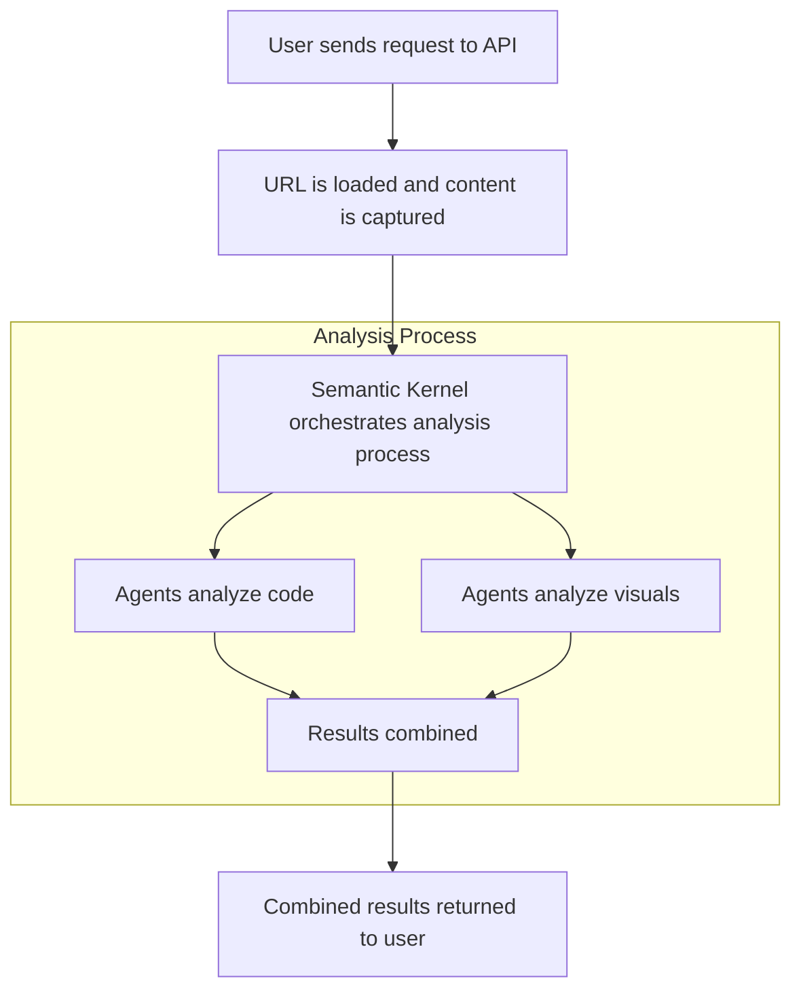
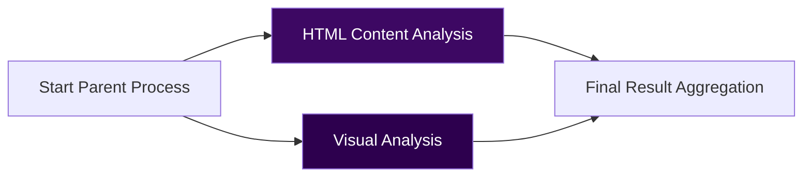
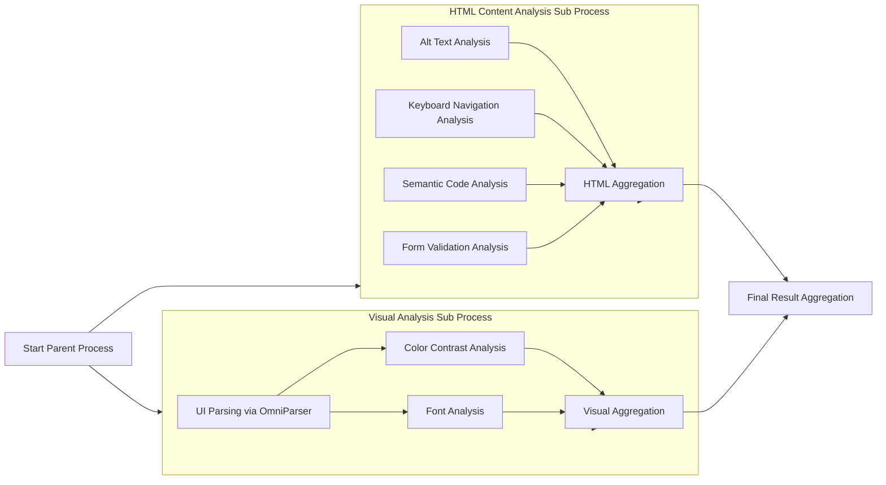

# Letting AI Help Make the World More Accessible - Analyzing Website Accessibility with Semantic Kernel and OmniParser

_Jonathan David - 07.04.2025_


_Source: https://unsplash.com/photos/a-close-up-of-a-street-sign-on-a-pole-3bPeMfGaGhw_

By July 2025, digital accessibility will no longer be a goal … it's a requirement[^1]. With AI and cutting-edge technologies, we can simplify the journey toward inclusivity and legal compliance.

This piece explores both the *why* behind accessibility and the *how* of using AI to help. We'll delve into a technical proof-of-concept, discussing the architecture and specific tools like Semantic Kernel and OmniParser. Expect a moderate level of technical detail suitable for developers and AI practitioners looking into practical applications.

## The Importance of Accessibility

A moral imperative and a legal obligation - accessibility has become a fundamental requirement for digital products and services. According to Eurostat, 101 million or 1 in 4 adults in the European Union have a disability[^2]. This number is expected to rise as the population ages. These individuals often encounter barriers that hinder equal participation in education, employment, and everyday life. At the heart of the European Accessibility Act (EAA) and Germany's Barrierefreiheitsstärkungsgesetz (BFSG) is the commitment to eliminate these barriers in the digital space. These aren't just abstract values, either, as they come with enforceable deadlines.

### Why Accessibility Design is Critical Today

Statistical evidence highlights why designing accessible websites is essential and not just for compliance, but to create meaningful digital experiences and also a competitive advantage. For example:

* 70% of users with disabilities will abandon a website if it isn't accessible[^3].
* More than 2.2 billion people worldwide have visual impairments, which means over 27% of the global population can benefit from using screen readers to navigate the web[^4].
* Businesses could unlock a market of $13 trillion by embracing disability inclusion, with web accessibility being a crucial component of this strategy[^5].
* Digital products that fully comply with WCAG 2.0 are expected to have a 50% higher market performance than their competitors[^6].
* Businesses with non-compliant digital platforms risk legal challenges, fines, and reputational harm.  In 2024, in the US alone, there were over 4,000 lawsuits related to non-compliance[^7].

There are many more statistics[^8] that underscore the importance of accessibility, but the bottom line is clear: accessibility is a strategic imperative.

### The Role of AI in Accessible Development

AI offers the potential to automate, streamline, and scale the analysis of websites against international accessibility guidelines like WCAG (Web Content Accessibility Guidelines)[^9]. By leveraging machine learning and natural language processing models, AI-powered tools can examine web content for typical accessibility issues such as:

* Missing or insufficient alt text for images.
* Improper semantic structure in HTML or ARIA (Accessible Rich Internet Applications) tags.
* Inaccessible user journeys, such as broken keyboard-only navigation paths.
* Form fields without proper types, labels, or instructions.

In addition to analyzing the content, AI can interpret visual elements such as layout, color contrast, and text size to identify potential issues that could impact users with visual or cognitive impairments. Using AI tools (e.g. Microsoft's OmniParser[^10]) we can visually extract and analyze the elements of a website and with this assist the language models in understanding the context of the content.


_Source: https://unsplash.com/photos/macbook-pro-on-white-surface-WiONHd_zYI4_

## Analyzing Accessibility

As part of our quarterly innovation days at Xebia, my colleagues and I came up with the idea to explore how AI could help us analyze the accessibility of a website as of today. The idea was to leverage modern tools and frameworks to identify accessibility issues and provide actionable insights. The goal was not just to detect problems, but to demonstrate how the findings from multiple agents could be combined into a comprehensive accessibility report. At the end of that day we had a working **proof of concept** that could analyze a website for accessibility issues.

### Overview of the Solution

The solution we built is centered around two major components, where the analysis part takes the spotlight (we'll dive deeper into the details later):

* **Capturing the website content and visuals.**
  Using a headless browser, we obtain the fully rendered HTML source code and a screenshot of the website.
* **Analyzing the captured results.**
  This involves using Semantic Kernel's process framework to orchestrate the analysis workflow with multiple specialized AI agents.

For the Proof of Concept, we selected a set of analyzers to focus on specific WCAG criteria that demonstrate the potential of this system. The POC includes the following analyzers:

* **HTML Content Analysis:**
  * Alt text analysis.
  * Semantic code validation.
  * Keyboard navigation checks.
  * Form validation.
* **Visual Analysis:**
  * Color contrast analysis.
  * Font size and readability evaluation.

Instead of building a complete testing suite to cover every WCAG criteria, we intentionally scoped the POC to include these six analyzers. This allowed us to test the concept and validate the architecture without overwhelming scope or complexity.

To house the solution, we implemented it as a Minimal API[^11] using .NET 9. Minimal APIs in .NET provide a lightweight framework for quickly developing APIs with just the core essentials.

---

From a high-level perspective, the process looks like this:



### Capturing the Rendered Website

A simple HTTP request to the URL of the website is not enough to retrieve the website's content or take an accurate screenshot. Websites today often rely heavily on client-side JavaScript for rendering dynamic elements such as buttons, menus, or even text content. To ensure the page is rendered completely as intended, we need to simulate a user environment via a headless browser.

For this Proof of Concept, we used the Playwright library[^12]. Playwright loads the website in a headless browser, giving JavaScript the chance to execute and ensuring a fully rendered page. Once rendered, the HTML source is captured along with a full-page screenshot.

> We opted to use the largest breakpoint (desktop view) to capture the screenshot, as it typically provides the most comprehensive view of a website's content. In a real-world scenario, capturing at additional breakpoints - such as mobile or tablet views - would be advisable to audit the website's accessibility across multiple devices.

### Handing over to Semantic Kernel

Once we have the content and the screenshot, we pass them to Semantic Kernel[^13], specifically using its Process Framework[^14], which efficiently manages complex workflows by organizing tasks into modular, reusable steps.

The Process Framework lets us define workflows where each step performs a specific task. This helps break our accessibility analysis into logical components - processing content, running specialized evaluations, and compiling results. Each part can be developed and improved independently, making the codebase more maintainable. It also simplifies integrating different AI capabilities to assess specific aspects of accessibility.

In our Proof of Concept, the Process Framework orchestrates our multi-step analysis. Steps are assigned to specialized AI agents focused on specific aspects of website accessibility - analyzing HTML structure, evaluating semantic elements, or checking visual aspects like text contrast and font sizes. This modular design keeps the system flexible and ready to support additional checks in the future.

We considered Semantic Kernel's Group Chat[^15] capabilities but found the Process Framework more suitable for our use case. While Group Chat is geared toward real-time collaboration, the Process Framework is better for orchestrating complex, repeatable workflows.

#### The Process' Implementation

To ensure the workflow is organized, efficient, and scalable, we split the accessibility analysis into two distinct sub-processes: HTML Content Analysis and Visual Analysis. These sub-processes operate independently and are orchestrated by a parent process, which combines their results into a unified accessibility report.



Each sub-process executes a series of specialized steps to analyze its corresponding aspect of accessibility. Tasks within a sub-process, such as **alt text detection** or **color contrast evaluation**, are executed in parallel whenever possible. This reduces the overall time required to analyze each aspect. Similarly, the HTML Content Analysis and Visual Analysis sub-processes themselves run in parallel, further optimizing performance and ensuring comprehensive results are generated quickly.

Within each process, aggregation steps collect and consolidate the outputs of the individual analysis tasks. For example, the HTML Content Analysis sub-process gathers results from tasks like **keyboard navigation checks** and **form validation**, while the Visual Analysis sub-process processes results from **font size** and **color contrast analyses**. These aggregated results are then passed back to the parent process, which merges them into a final accessibility report.

This modular and parallelized design ensures flexibility, scalability, and speed. By dividing the workflow into clearly defined processes with parallel execution, we are able to reduce processing time, reuse steps, and expand or adjust the analysis framework without disrupting the overall system.



#### Managing Parallel Execution

To manage parallel execution effectively, each process includes an **aggregation step** that consolidates the results of all the previous steps. These aggregation steps are essential for synchronizing asynchronous workflows, ensuring that no task is left incomplete before moving on to the next phase.

Each step in the process emits an event when it completes. These events are routed to specific event handlers in the aggregation step. The aggregation step maintains a state object with flags (booleans) to track the completion of each step. When an event updates the state, the handler checks whether all flags are set to true. Once all tasks in the sub-process are complete, the aggregation step emits its own event to signal the parent process or trigger the next stage.

By using this design, tasks can run in parallel without blocking, and the pipeline remains organized while ensuring that each step's results are accounted for.


### HTML Content Analysis

The steps in the HTML Content Analysis sub-process focus on analyzing the HTML source of the website. Each analysis step is implemented independently, orchestrated by Semantic Kernel, and focuses on a particular aspect of accessibility.
While the specific goals of each step vary, the structure of the steps is largely identical. Each step uses a specific system prompt tailored to its task and leverages state management and event-driven communication to collaborate with the rest of the analysis process.

At their core, the analyzer steps:

1. Start with a system prompt for the Large Language Model (LLM), providing **detailed instructions** about the **evaluation criteria** and the **expected result format**.
2. Manage step-specific state (e.g., chat history) to ensure context is preserved across interactions.
3. In a **Kernel Function**, process incoming data (e.g., HTML content from the webpage) and send it using Semantic Kernel's ChatCompletionService[^16].
4. Send results "back" using an `EmitEventAsync` call. _An event is emitted that the process knows how to handle._

A prompt example for the **Alt Text Analysis** step might look like this:

```text
You are an accessibility expert. Your role is to analyze HTML code.
Analyze the HTML_CODE for WCAG 2.1 Level AA accessibility issues, only focusing on:

Alt Text for Images:
1. Meaningful Images Without Alt Text
  - Identify images that convey meaningful content but do not have alt text
  - Ensure that all images with a functional or informational purpose have descriptive alt text
  - Check that alt text is concise, clear, and provides context

2. Decorative Images with Alt Text
  - Check that purely decorative images (such as those styled with CSS or providing no information) do not have alt text or have an empty alt="" attribute
  - Make sure that images used for visual styling (e.g., icons, borders) do not have misleading alt text
```

### Visual Analysis using OmniParser v2

The Visual Analysis sub-process operates similarly to the HTML Content Analysis sub-process, using independent steps for specific tasks such as **color contrast analysis** and **font size evaluation**. However, it also includes an additional crucial step: **UI Parsing**, which uses OmniParser v2[^17] to extract structured visual and positional data from the screenshot generated via Playwright.


#### Role of OmniParser

OmniParser, as described in the Microsoft Research blog[^18], is a trained AI model. More specifically, it is a deep learning-based computer vision model designed to understand and parse visual elements of graphical user interfaces (GUIs). OmniParser is fundamentally a standalone machine learning model that employs computer vision to interpret visual structures and extract meaningful content.

By bridging visual elements with semantic context, OmniParser transforms previously unstructured interface data into structured, machine-readable formats, enabling deeper insight and analysis.

In the context of our accessibility solution, OmniParser is used in the **UI Parsing** step of the Visual Analysis workflow. OmniParser processes the screenshot captured via Playwright and returns structured JSON data. This output provides:

- **Key**: A unique identifier for each element, matches the number on the parsed screenshot.
- **Type**: The category of the element (e.g., "text," "image").
- **Bounding Box**: Visual coordinates of the element on the page ([x1, y1, x2, y2]).
- **Interactivity**: Whether the element is actionable (e.g., a clickable button or link).
- **Content**: The visible text or description associated with the element (e.g., button labels or menu text).

For example, the OmniParser-generated JSON might look like this:

```json
[
  {
    "icon 0": {
      "type": "text",
      "bbox": [0.45530304312705994,0.004352557007223368,0.6613636612892151,0.03155604004859924],
      "interactivity": false,
      "content": "O Search resources, services, and docs (G+/)"
    }
  },
  {
    "icon 1": {
      "type": "text",
      "bbox": [0.011363636702299118,0.08487486094236374,0.15833333134651184,0.10990206897258759],
      "interactivity": false,
      "content": "Create a resource"
    }
  },
]
```

#### Structured Data and LLM

The structured data generated by OmniParser, along with the screenshot captured by Playwright, forms the foundation for the visual analysis. By including the structured data in the LLM's prompt alongside the screenshot, we aim to give the LLM additional contextual information about the website's visual elements, such as their content, placement, and interactivity.

While we hypothesize that this dual-input approach enhances the LLM's ability to evaluate accessibility issues, this has not yet been conclusively tested. In theory, the structured data could provide explicit spatial relationships and content details, helping the LLM analyze visual elements more comprehensively. Combined with the screenshot, these inputs might allow the LLM to cross-reference visual and semantic contexts to identify potential issues with layout, contrast, or interactivity.

## Working with the Results

To ensure that the output from each analysis step is structured and easy to process, we include a system message in every prompt that defines the expected output format. This approach standardizes the results from each analyzer, making it easy to deserialize the data.

Once all analysis steps and their sub-processes are complete, the parent process aggregates the results from both the HTML Content Analysis and Visual Analysis sub-processes. The final output is a structured JSON object that includes:

```json
{
  "analysis": [
    {
      "id": "2.1.1", // WCAG success criterion reference, e.g., "1.1.1"
      "error": "Code.Keyboard.Focusable", // unique error code, 'Code' if html was analyzed, 'Visual' if screenshot was analyzed
      "category": "Keyboard Accessibility", // category of the agent performing the analysis
      "description": "Element is not keyboard-focusable.", // Very brief description of the issue, acts as the title
      "detail": "All interactive elements must be accessible via keyboard navigation.", // Description of the issue
      "location": "Line 10, Column 20: <span id=\"foo\">Bar</span>" // Location of the issue in the code, or a description where in the screenshot if a screenshot is provided
    }
  ]
}
```

To help illustrate how the results appear in practice, here's an example of the JSON output generated by the analysis process:

```json
{
  "analysis": [
    {
      "id": "1.1.1",
      "error": "Code.Image.MissingAlt",
      "category": "Alt Text for Images",
      "description": "Meaningful image lacks alt text.",
      "detail": "The image at  is meaningful but does not have alt text. Add descriptive alt text.",
      "location": "Element in meta tag with attribute: property='og:image'",
      "information": []
    },
    {
      "id": "2.4.3",
      "error": "Code.Keyboard.TabOrder",
      "category": "Keyboard Accessibility",
      "description": "Incorrect Tab Order value used.",
      "detail": "`tabindex=\"-1\"` on non-modal elements disrupts logical navigation as it removes them from the tab order.",
      "location": "Line 10: <span tabindex=\"-1\"></span>",
      "information": []
    },
    {
      "id": "3.1.2",
      "error": "Forms.Missing.Label",
      "category": "Form Accessibility",
      "description": "Missing form labels.",
      "detail": "The 'Search' button lacks a proper label or an aria-label to describe its purpose.",
      "location": "Line containing `<button aria-label='Search'>`.",
      "information": []
    },
    {
      "id": "1.3.1",
      "error": "Forms.Placeholder.Misuse",
      "category": "Form Accessibility",
      "description": "Placeholder as label.",
      "detail": "The 'Search' button uses the placeholder 'Search' as the only means of labeling, which is an incorrect accessibility practice.",
      "location": "Line containing `<span class='DocSearch-Button-Placeholder'>Search</span>`.",
      "information": []
    },
        ...
  ],
  "summary": {
    "failed": 12
  }
}
```

The list of analysis results is returned to the API function called by the user and sent back as a structured JSON response. Our Proof of Concept ends here, and we did not implement a UI to visualize the results. However, the JSON output can be easily used in a front-end framework or reporting tool to display the findings.

## Conclusion

This POC demonstrated the potential of combining Semantic Kernel, OpenAI models, and tools like OmniParser to automate website accessibility analysis. The solution achieved solid results as a foundational starting point, particularly in analyzing HTML structure and visual elements for WCAG compliance.

We relied on Semantic Kernel to handle the orchestration of the analysis workflow. Its process framework simplified the implementation of the multi-step process by enabling state management, event handling, and coordination between agents. This modular design made it easy to develop and expand the system without introducing unnecessary complexity.

The OpenAI models performed well in certain areas, such as diagnosing alt text issues and semantic code validation, but they were not without limitations. Token limits presented challenges when sending larger sections of the HTML source to multiple agents, requiring careful adjustments to avoid truncating important content. To control costs, we transitioned from GPT-4 to GPT-3.5 during development. Both GPT-4 and GPT-3.5 occasionally produced hallucinations, such as generating non-existent HTML code. These issues show the need for additional layers of validation when using language models for tasks that require high accuracy.

There were also some unexpected challenges with integrating OmniParser. The instance hosted on Hugging Face[^19] returned errors during testing, which required us to self-host OmniParser to proceed.

Despite these challenges, the results showed that AI can - at this stage - uncover a range of accessibility issues and provide insights that are actionable for developers. The structured JSON outputs from our system lay the groundwork for integration into frontend tools or reporting platforms.

### What Could Be Improved

While the Demo showed promising results, there are several areas that could be refined for future iterations, including:

**Specialized Models for Accessibility Analysis**

Currently, **general-purpose** language models like GPT-3.5 and GPT-4 are being used for analysis. While these models performed well, developing or fine-tuning specialized models focused specifically on accessibility issues could improve accuracy and reduce the chances of hallucination. A model trained on accessibility-specific datasets would also be better equipped to handle nuances in WCAG compliance.

**Optimized Token Usage**

Token limits were one of the key challenges we encountered when processing larger sections of source code in parallel. This limitation required careful adjustments to ensure no critical information was truncated before analysis. One way to address this issue might be to minify the HTML code prior to sending it to the models, reducing token usage. However, further testing would be needed to verify that this doesn't degrade detection accuracy, especially for scenarios where formatting or element relationships play an important role.

Another solution is to explore Large Language Models with larger context windows. For example, newer models like Gemini 2.0 Pro[^20] offer a context window of up to 2 million tokens, far exceeding the limits of GPT-3.5 or GPT-4.

In addition, Azure OpenAI Service provides flexibility in managing token usage. Token rate limits can be adjusted via Azure AI Foundry for the selected LLM deployment, allowing developers to fine-tune the settings to better suit specific workloads. By tweaking these settings, it's possible to mitigate some of the practical limits imposed during input processing and optimize workflows for more complex, large-scale analysis.

### Discovering Playwright MCP

While writing this article, I came across Microsoft's Playwright MCP repository[^21], which provides LLMs with the ability to analyze and interact with web pages using Playwright.

MCP (Model Context Protocol) acts as a standardized way for AI applications to connect with data sources and tools. Anthropic describes MCP as a "USB-C for AI applications"[^22], simplifying how LLMs exchange context with external systems.

_This would be a whole article on its own._

Playwright MCP allows LLMs to navigate web pages, fill out forms, click buttons, and extract data. A key feature is its ability to use the accessibility tree of a webpage, which represents UI elements as seen by assistive technologies. This lets the tool analyze UI interfaces without requiring the LLM to process raw HTML directly. Playwright MCP also supports screenshot-based analysis through a visual mode, making it a flexible option for different types of workflows.

Given its ability to interact with the accessibility tree, Playwright MCP could complement OmniParser as part of future iterations. By providing a direct, standards-compliant mechanism to evaluate UI elements, it reduces reliance on standalone visual parsing tools or reliance on HTML source code, potentially simplifying the architecture while improving results.

Definitely worth checking out!

## Final Thoughts

With the July 2025 deadline for compliance with accessibility standards in the EU fast approaching, the need to prioritize digital accessibility has never been greater. AI-driven tools, such as the ones explored in this POC, can play a growing role in supporting developers and accessibility experts by identifying potential issues and providing actionable insights.

While AI is not a replacement for static analysis tools or human expertise, it can complement existing efforts by detecting areas that might otherwise be overlooked and speeding up the auditing process. Despite its current limitations, the progress achieved here demonstrates how AI can meaningfully contribute to accessibility analysis today - and its role is only set to grow as we refine these tools further.

[^1]: https://web.archive.org/web/20240812205927/https://ec.europa.eu/social/main.jsp?catId=1202&intPageId=5581
[^2]: https://www.consilium.europa.eu/en/infographics/disability-eu-facts-figures/
[^3]: https://reciteme.com/us/news/supporting-disabled-shoppers-online/
[^4]: https://devblogs.microsoft.com/xamarin/the-journey-to-accessible-apps-screen-readers/
[^5]: https://www.forbes.com/sites/forbestechcouncil/2022/05/03/unlock-business-potential-by-improving-accessibility-in-the-workplace/
[^6]: https://www.gartner.com/en/documents/3986300
[^7]: https://www.accessibility.works/blog/ada-lawsuit-trends-statistics-2024-summary/
[^8]: https://accessiblyapp.com/blog/web-accessibility-statistics/
[^9]: https://www.w3.org/WAI/standards-guidelines/wcag/
[^10]: https://github.com/microsoft/OmniParser
[^11]: https://learn.microsoft.com/en-us/aspnet/core/fundamentals/minimal-apis/overview
[^12]: https://playwright.dev/
[^13]: https://github.com/microsoft/semantic-kernel
[^14]: https://learn.microsoft.com/en-us/semantic-kernel/frameworks/process/process-framework
[^15]: https://learn.microsoft.com/en-us/semantic-kernel/frameworks/agent/agent-chat?pivots=programming-language-csharp
[^16]: https://learn.microsoft.com/en-us/semantic-kernel/concepts/ai-services/chat-completion/
[^17]: https://www.microsoft.com/en-us/research/articles/omniparser-v2-turning-any-llm-into-a-computer-use-agent/
[^18]: https://www.microsoft.com/en-us/research/articles/omniparser-for-pure-vision-based-gui-agent/
[^19]: https://huggingface.co/microsoft/OmniParser-v2.0
[^20]: https://explodingtopics.com/blog/list-of-llms#context-windows-and-knowledge-boundaries
[^21]: https://github.com/microsoft/playwright-mcp
[^22]: https://docs.anthropic.com/en/docs/agents-and-tools/mcp
