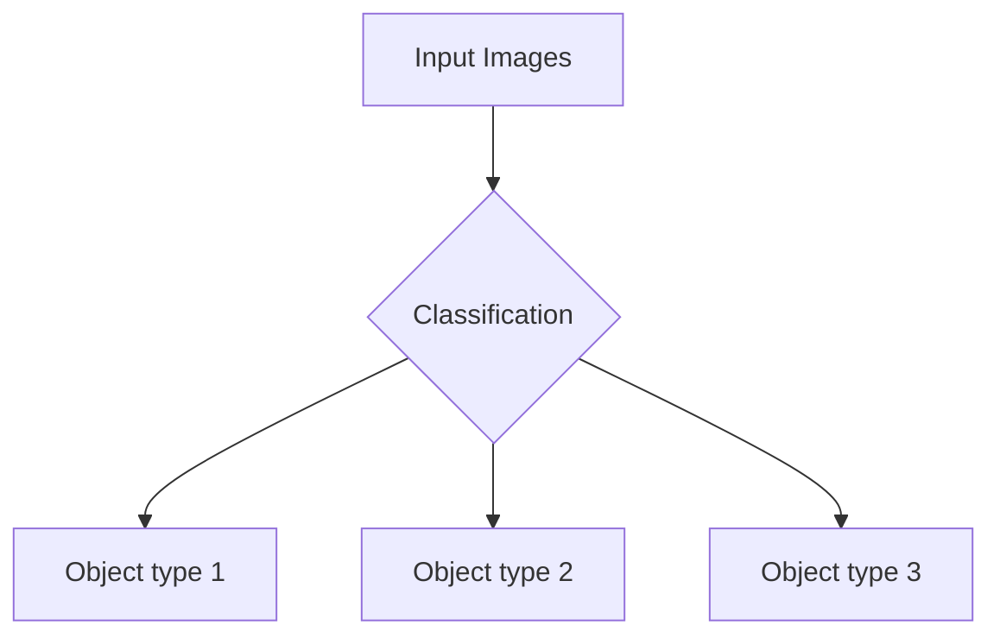
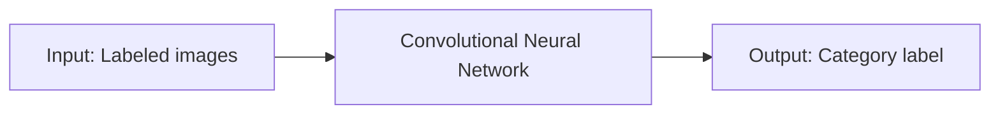
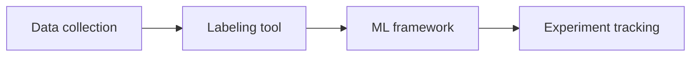
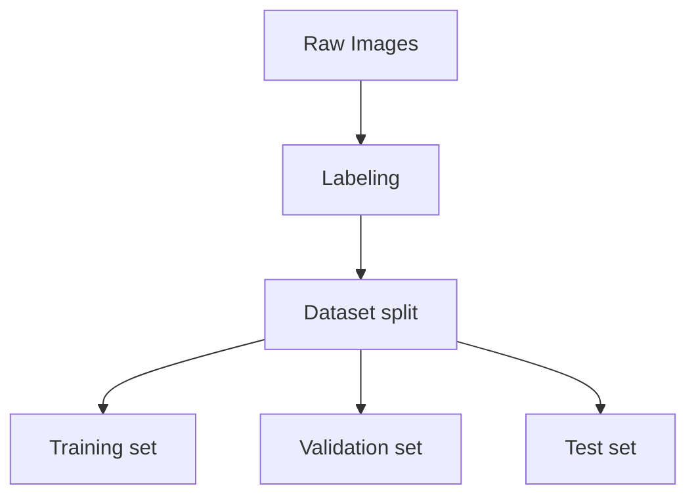
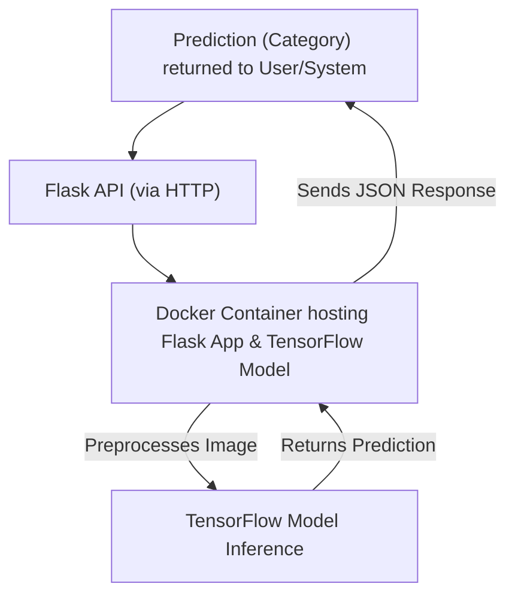

Written by Hidde de Smet, this detailed guide walks readers through each stage of building and deploying an image classification solution using machine learning, covering both conceptual and practical considerations.<!--excerpt_end-->

# A Practical Guide to Machine Learning for Image Classification

*Written by Hidde de Smet*

## Overview

This guide provides a structured, practical walkthrough for implementing image classification projects using machine learning (ML). The focus is on commonly used tools, techniques, and best practices for creating robust and scalable ML solutions.

---

## Introduction

After starting the AI Architecture course by Zach Gardner from IASA Global—which covers AI principles, frameworks, MLOps, governance, and best practices—I was inspired to share a hands-on image classification ML project. This guide emphasizes a business-first perspective, highlighting security, scalability, and performance within AI architectures.

---

## 1. Defining the Problem: Image Classification

Image classification tasks require categorizing images based on visual content—essential for automating repetitive sorting tasks prone to human error. Computers excel at processing large volumes of images with consistent accuracy. Example categories might include:

- Object type 1
- Object type 2
- Object type 3

*Figure 1: Basic image classification process*



---

## 2. Choosing the Right Approach: Supervised Learning and CNNs

- **Supervised Learning:** Use labeled datasets to train the model and recognize category patterns.
- **Convolutional Neural Networks (CNNs):** Automatically learn hierarchical image features (edges, textures, shapes) crucial for classification.

*Figure 2: Supervised learning with CNNs*



---

## 3. Essential Tools for the Workflow

- **ML Frameworks:** Building and training models (e.g., TensorFlow + Keras API, PyTorch)
- **Data Labeling Tools:** Annotate images (e.g., LabelImg, Roboflow, CVAT)
- **Experiment Tracking:** Monitor model versions and training runs (e.g., MLflow, TensorBoard, Weights & Biases)

*Data Preparation Workflow:*



---

## 4. Preparing the Data: Collection, Splitting, and Augmentation

1. **Data Collection:** Gather a diverse, labeled dataset with variations in lighting, angles, and backgrounds.
2. **Data Splitting:**
    - Training Set (~70%)
    - Validation Set (~15%)
    - Test Set (~15%)
3. **Data Augmentation:** Randomly modify images to increase diversity and robustness. Example in TensorFlow/Keras:

```python
from tensorflow.keras.preprocessing.image import ImageDataGenerator

datagen = ImageDataGenerator(
    rotation_range=20,
    width_shift_range=0.2,
    height_shift_range=0.2,
    shear_range=0.2,
    zoom_range=0.2,
    horizontal_flip=True,
    fill_mode='nearest'
)

# train_generator = datagen.flow_from_directory(...)
```

*Figure 3: Data preparation workflow*



---

## 5. Building and Training the Model

- **CNN Architecture:** Custom or pre-trained networks (transfer learning recommended for small datasets)
- **Layers:** Input → Conv2D + Activation → MaxPooling → Flatten → Dense (classification) → Output (softmax)
- **Compile:**
    - Optimizer (e.g., Adam, SGD)
    - Loss function (`categorical_crossentropy` for multi-class)
    - Metrics (e.g., `accuracy`)

**Sample TensorFlow/Keras Model Code:**

```python
import tensorflow as tf
from tensorflow.keras import layers, models

model = models.Sequential([
    layers.Input(shape=(224, 224, 3)),
    layers.Conv2D(32, (3, 3), activation='relu'),
    layers.MaxPooling2D((2, 2)),
    layers.Conv2D(64, (3, 3), activation='relu'),
    layers.MaxPooling2D((2, 2)),
    layers.Flatten(),
    layers.Dense(64, activation='relu'),
    layers.Dense(3, activation='softmax')
])

model.compile(optimizer='adam', loss='categorical_crossentropy', metrics=['accuracy'])

# model.fit(training_data, validation_data=validation_data, epochs=N)
```

---

## 6. Saving the Trained Model

Save your entire TensorFlow/Keras model for reuse:

```python
model.save('image_classifier_model')
```

This retains architecture, weights, and configuration for future inference or deployment.

---

## 7. Model Deployment: Serving with Flask

Expose model predictions via a RESTful API using Flask.

**Example Flask Service:**

```python
from flask import Flask, request, jsonify
import tensorflow as tf
from PIL import Image
import numpy as np

app = Flask(__name__)
model = tf.keras.models.load_model('image_classifier_model')
CLASSES = ['Object type 1', 'Object type 2', 'Object type 3']

def preprocess_image(image_file):
    img = Image.open(image_file.stream).convert('RGB')
    img = img.resize((224, 224))
    img_array = np.array(img) / 255.0
    img_array = np.expand_dims(img_array, axis=0)
    return img_array

@app.route('/predict', methods=['POST'])
def predict():
    if 'file' not in request.files:
        return jsonify({'error': 'No file part'}), 400
    file = request.files['file']
    if file.filename == '':
        return jsonify({'error': 'No selected file'}), 400
    try:
        img_array = preprocess_image(file)
        prediction = model.predict(img_array)
        class_idx = np.argmax(prediction, axis=1)[0]
        return jsonify({'class': CLASSES[class_idx], 'confidence': float(prediction[0][class_idx])})
    except Exception as e:
        return jsonify({'error': str(e)}), 500

if __name__ == '__main__':
    app.run(host='0.0.0.0', port=5000)
```

---

## 8. Ensuring Portability: Dockerizing the Application

A simple Dockerfile enables reliable deployment:

```dockerfile
FROM python:3.10-slim
WORKDIR /app
COPY . /app
COPY requirements.txt .
RUN pip install --no-cache-dir -r requirements.txt
EXPOSE 5000
ENV NAME World
CMD ["python", "app.py"]
```

Your `requirements.txt` would list:

```
flask
tensorflow
pillow
numpy
```

---

## 9. The Complete Workflow

*Overall image classification and serving workflow:*



---

## 10. Conclusion and Key Takeaways

- **Problem Definition:** Clarify the classification task and its real-world impact.
- **Data Management:** Comprehensive data collection, labeling, splitting, and augmentation are foundations for robust models.
- **Model Development:** Use CNNs, adopt transfer learning when appropriate, and track experiments.
- **Deployment:** RESTful APIs (Flask) make your models accessible; Docker ensures portability.
- **Scalability:** Containerization solves configuration and environment drift problems for consistent deployment.

This structured approach is adaptable to applications like flora/fauna identification, manufacturing defect detection, and landmark recognition. Leveraging the right tools and workflows ensures your AI solutions are robust and reliable.

---

*Author: Hidde de Smet*

*Certified Azure Solution Architect, specializing in cloud-based solutions with Scrum and DevOps methodologies.*

This post appeared first on "Hidde de Smet's Blog". [Read the entire article here](https://hiddedesmet.com/iasa-ai-course)
