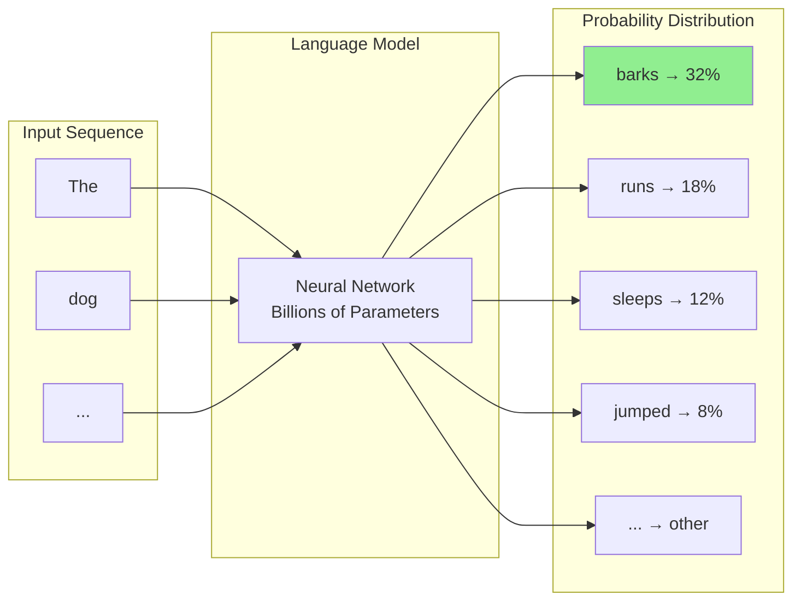
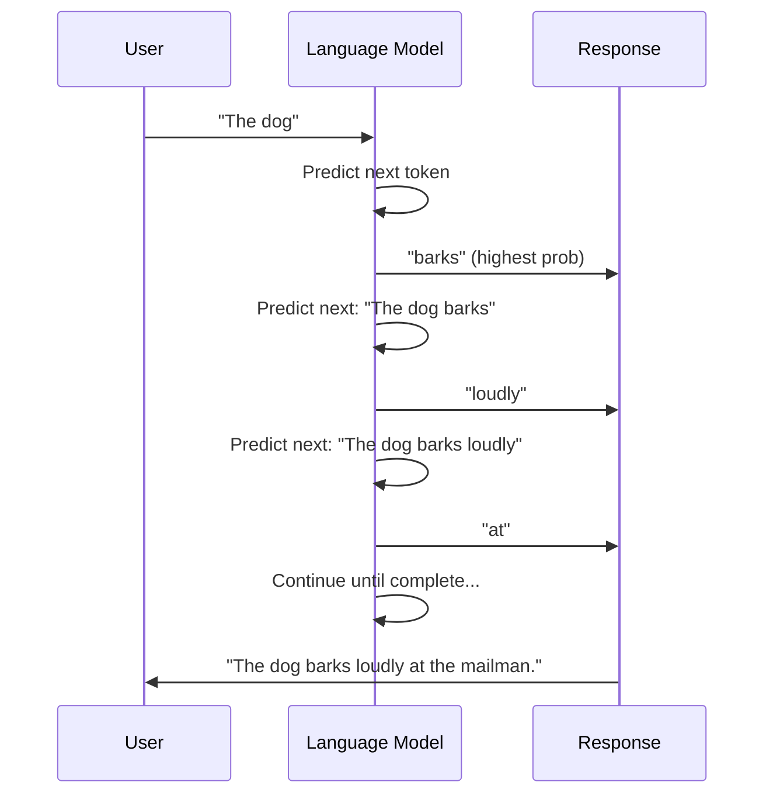
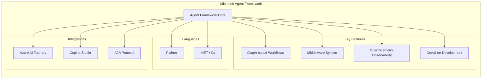

This page is designed to be a starting point for learning about AI.

- Suitable for beginners and those with some experience.
- Each section builds on concepts from previous sections, so it's best read sequentially.

**Table of Contents:**

- [History](#history)
- [ML vs AI vs GenAI](#ml-vs-ai-vs-genai)
- [GenAI basics](#genai-basics)
- [GenAI advanced](#genai-advanced)
- [Inspiration](#inspiration)
- [Integrating AI into your applications](#integrating-ai-into-your-applications)
- [Want to know more?](#want-to-know-more)
- [Conclusion](#conclusion)

## History

Some fun history facts about AI, showing how long AI has been around and how it has evolved over time:

- 1956: The term "artificial intelligence" was coined at the Dartmouth Conference.
- 1966: ELIZA, an early natural language processing program, was created by Joseph Weizenbaum.
- 1997: IBM's Deep Blue defeated world chess champion Garry Kasparov.
- 2011: IBM's Watson won the quiz show Jeopardy! against human champions.
- 2012: The breakthrough in deep learning with AlexNet winning the ImageNet competition.
- 2014: The first Generative Adversarial Network (GAN) was introduced by Ian Goodfellow.
- 2018: OpenAI released the first version of GPT (Generative Pre-trained Transformer).
- 2020: OpenAI released GPT-3, a significant advancement in natural language processing.
- 2023: OpenAI released GPT-4, further enhancing capabilities in language understanding and generation.
- 2023: Anthropic introduced the first Claude models, bringing Constitutional AI to mainstream use.
- 2024: Multimodal and tool-using LLMs became common across developer tools and products.
- 2024: Claude 3.5 Sonnet set new benchmarks for coding assistance; reasoning models like o1 emerged.
- 2025: Agentic patterns (tool calling, workflows, multi-agent collaboration) and interoperability protocols (MCP, A2A) accelerated adoption.
- 2025: GPT-4.1 and Claude 4 raised the bar for complex reasoning and extended context capabilities.
- 2025: OpenAI released GPT-5 with enhanced reasoning and multimodal capabilities.

## ML vs AI vs GenAI

Understanding the relationship between these three concepts is essential for anyone starting their AI journey.

**Machine Learning (ML)** is a method of data analysis where computers learn to identify patterns in data without being explicitly programmed for each task. Think of it as teaching a computer to recognize cats in photos by showing it thousands of cat pictures, rather than writing specific code that says "a cat has pointed ears, whiskers, and four legs."

**Artificial Intelligence (AI)** is a broader field that includes machine learning but also encompasses other approaches to creating intelligent systems. AI aims to create machines that can perform tasks that typically require human intelligence, such as reasoning, learning, planning, and understanding language.

Machine learning is one approach within the AI toolkit, but AI also includes:

- **Rule-based systems**: Follow pre-defined logical rules and conditions (like "if temperature > 80°F, then turn on air conditioning")
- **Expert systems**: Capture human expertise in specific domains through knowledge bases and inference engines (like medical diagnosis systems that apply doctor's knowledge)
- **Symbolic AI**: Uses symbols and logic to represent knowledge and reasoning (like early chess programs that evaluated board positions)
- **Evolutionary algorithms**: Solve problems by mimicking natural selection and evolution
- **Fuzzy logic**: Handles uncertainty and partial truths rather than strict true/false logic

These different approaches can be combined or used independently depending on the problem being solved.

**Generative AI (GenAI)** is a specific type of AI that can create new content - text, images, code, music, or other types of data. When you ask ChatGPT to write a story or use DALL-E to create an image, you're using generative AI. GenAI models learn patterns from existing content and use that knowledge to generate new, original content that follows similar patterns.

## GenAI basics

### Introduction

Understanding Generative AI begins with **Natural Language Processing (NLP)**, the foundational branch of AI that enables computers to understand, interpret, and generate human language. NLP represents a major breakthrough in human-computer interaction - instead of requiring users to learn programming languages or use specific commands, it allows people to interact with computers using natural human language, speaking or typing as they would to another person.

Within the broad field of NLP, modern AI systems primarily rely on language models - sophisticated AI systems that learn from vast amounts of text to understand and generate human-like responses. These language models come in different sizes and capabilities, each designed for specific use cases and computational requirements.

**Large Language Models (LLMs)** represent the current pinnacle of NLP technology. These AI systems are trained on enormous datasets containing billions of text examples from books, articles, websites, and other written sources. Through this training, they learn intricate patterns in how humans use language and develop the ability to generate remarkably human-like text responses. Popular examples include GPT-4, Claude, and Gemini. LLMs typically contain billions of parameters (the internal "settings" the AI adjusts during learning) and require significant computational resources to operate effectively.

**Small Language Models (SLMs)** serve the same fundamental purpose as their larger counterparts but prioritize efficiency and accessibility. These models are trained on more focused datasets and contain fewer parameters, making them suitable for running on local devices like smartphones, laptops, or edge computing environments. Examples include Microsoft's Phi models and various specialized versions optimized for specific tasks or industries.

Beyond text-focused language models, the NLP field has expanded to encompass various specialized model types that work with different forms of content:

- **Diffusion models** (such as DALL-E, Stable Diffusion, and Midjourney) generate images from text descriptions
- **Speech recognition models** (like Whisper) convert spoken words into written text
- **Music generation models** (such as Suno, Udio) create original musical compositions
- **Multimodal models** (like GPT-4o) can work seamlessly with multiple types of input and output - text, images, audio, and video

This diversity of model types reflects the broader evolution of AI from simple text processing to comprehensive understanding and generation across multiple forms of human communication and creative expression.

### Vendors

AI vendors are companies that develop, train, and provide access to AI models. Each vendor brings different strengths, approaches, and business models to the market.

**Major AI vendors include:**

- **OpenAI**: Creator of the GPT series and DALL-E, known for ChatGPT and pioneering conversational AI
- **Google**: Develops Gemini models and provides AI services through Google Cloud
- **Anthropic**: Focuses on AI safety and creates the Claude family of models
- **Microsoft**: Partners with OpenAI and develops its own models while integrating AI across its product suite
- **Hugging Face**: Acts as a platform for sharing and hosting AI models, both open-source and commercial

**What vendors do:**
Vendors serve as the bridge between the complex world of AI model development and practical applications. They handle the enormous costs and technical challenges of training models, then make these models available through user-friendly interfaces and APIs. This allows developers and businesses to use sophisticated AI without needing to understand the underlying mathematics or infrastructure.

**Key differences between vendors:**

- **Research focus**: Some prioritize cutting-edge capabilities, others emphasize safety and reliability
- **Business models**: Some offer free tiers with paid upgrades, others are enterprise-focused
- **Specializations**: Different vendors excel in text, images, code, or multimodal applications
- **Accessibility**: Some focus on easy-to-use consumer interfaces, others provide developer tools and APIs
- **Data policies**: Vendors differ in how they handle user data and model training

### Models

A **model** is the actual AI system that has been trained to perform specific tasks. Think of it as a specialized brain that has learned patterns from data and can apply that knowledge to new situations.

**Key characteristics that differentiate models:**

- **Training date**: When the model was trained affects what information it knows
- **Cut-off date**: The latest date of information the model was trained on
- **Size**: Larger models generally have more capabilities but require more computational resources
- **Vendor**: Different companies create models with different strengths and focuses
- **Specialization**: Some models excel at specific tasks like coding, creative writing, or analysis

**Current popular models include:**

**Large Language Models (LLMs):**

- **GPT series** (4, 4o, 4.1, 5): OpenAI's flagship models for text generation and reasoning
- **Claude** (3.5 Sonnet, 4 Sonnet, 4 Opus): Anthropic's models focused on helpful, harmless, and honest interactions
- **Gemini** (Flash, Pro): Google's multimodal models that can process text, images, and other data
- **Grok**: xAI's conversational AI model with real-time information access

**Small Language Models (SLMs):**

- **Phi-4**: Microsoft's efficient model designed to run on smaller devices with strong reasoning capabilities
- **Gemma 2/3**: Google's compact open models optimized for efficiency

**Specialized Models:**

- **DALL-E, Stable Diffusion, Midjourney, Flux**: Image generation models (diffusion models)
- **Whisper**: Speech-to-text conversion model
- **Suno, Udio**: Music generation models

**Multimodal Models:**

- **GPT-4o, GPT-4.1, GPT-5**: OpenAI models handling text, images, audio, and video
- **Gemini**: Google's multimodal models (also listed above under LLMs)
- **Claude 4 Opus**: Anthropic's multimodal model with vision capabilities

#### Models FAQ

**What is a GPT and why are not all models GPT?**
GPT stands for "Generative Pre-trained Transformer." It's a specific architecture developed by OpenAI. Not all models use this architecture - companies develop different approaches to achieve similar goals. Think of it like cars: not all cars are Toyotas, even though they all serve the same basic purpose of transportation.

**What does multimodal mean and how can I use it?**
Multimodal models can understand and generate multiple types of content - not just text, but also images, audio, and video. For example, you can upload an image to GPT-4o and ask it to describe what it sees, or ask it to create an image based on your description. This makes interactions more natural and expands what you can accomplish with AI.

**Why not train a model every month or week to keep it up-to-date?**
Training large AI models requires enormous computational resources, costs millions of dollars, and takes weeks or months to complete. The process involves analyzing billions of text examples and adjusting trillions of parameters. Additionally, frequent retraining could make models less stable and reliable. Instead, vendors typically release new versions periodically with updated knowledge and improved capabilities.

### Providers

**Providers** are services that host AI models and make them accessible to users and developers. While vendors create the models, providers handle the infrastructure needed to run them at scale and make them available through APIs, web interfaces, or applications.

**Technical components of hosted AI services include:**

- **Proxy**: Routes requests to available model instances and manages traffic
- **Load balancer**: Distributes requests across multiple servers to ensure reliable performance
- **Content filter**: Screens inputs and outputs to prevent harmful or inappropriate content
- **Rate limiting**: Controls how many requests users can make to prevent abuse
- **Authentication**: Manages user access and API keys
- **Monitoring**: Tracks usage, performance, and costs

**Major hosted providers:**

- **OpenAI**: Direct access to GPT models through their API and ChatGPT interface
- **Google Cloud**: Hosts Gemini and other Google AI models
- **Microsoft Azure**:
  - **Azure OpenAI**: Enterprise-grade access to OpenAI models with enhanced security and compliance
  - **GitHub Models**: Developer-focused platform with model catalog and development tools
- **Hugging Face**: Platform for both open-source and commercial models
- **Anthropic**: Direct access to Claude models

**Self-hosting options:**

For organizations that need complete control over their AI infrastructure, self-hosting is possible:

- **Docker containers**: Run models in containerized environments
- **Ollama**: User-friendly tool for running models locally
- **Hugging Face Transformers**: Library for deploying models on your own hardware

#### Providers FAQ

**Do all hosted solutions use my data?**
Data usage policies vary significantly between providers. Some use conversation data to improve their models (with user consent), while others, particularly enterprise-focused services, commit to not using customer data for training. Always check the specific terms of service and privacy policies.

**Where is my data stored?**
Data storage locations depend on the provider and service tier. Consumer services might store data globally, while enterprise services often allow you to specify geographic regions for compliance with local regulations like GDPR.

**Can I opt-out of data collection?**
Most providers offer ways to limit data collection, though the options vary. Some allow you to delete conversation history, others provide settings to prevent data from being used for model training.

**How does Azure OpenAI differ from using OpenAI directly?**
Azure OpenAI provides access to many OpenAI models through Azure, with Azure-native identity, networking, and governance features. Model availability and versions can differ by region and over time. Azure OpenAI states it doesn't use customer data to retrain foundation models; see the [Azure OpenAI data, privacy, and security guide](https://learn.microsoft.com/en-us/azure/ai-foundry/responsible-ai/openai/data-privacy).

**How does GitHub Models relate to GitHub Copilot?**
GitHub Models is a development platform that gives developers access to various AI models for building applications, while GitHub Copilot is a specific AI coding assistant. Think of GitHub Models as a toolbox for AI development, and Copilot as one specific tool that helps with coding. [GitHub Models](https://docs.github.com/en/github-models/about-github-models) provides model catalogs, prompt management, and evaluation tools for developers.

### Prompts & messages

**Prompts** are the instructions or questions you give to an AI model, while **messages** are the individual communications in a conversation between you and the AI. Understanding how to structure these effectively is key to getting good results from AI systems.

**Types of prompts and messages:**

- **User prompt**: Your question, instruction, or request to the AI
- **System prompt**: Background instructions that set the AI's behavior, role, or constraints (often hidden from users)
- **Assistant message**: The AI's response to your prompt
  - **Suggestions**: When the AI offers multiple options or approaches
  - **Completions**: When the AI finishes or continues text you've started

**Prompt engineering** is the practice of crafting effective prompts to get better results from AI models. Different techniques work better for different types of tasks:

**Prompt techniques:**

- **Zero-shot prompts**: Ask the AI to perform a task without providing examples
  - Example: "Summarize this article in three bullet points."
  
- **Few-shot prompts**: Provide a few examples of the desired input-output pattern
  - Example: "Translate these phrases. English: Hello → Spanish: Hola. English: Thank you → Spanish: Gracias. English: Good morning → Spanish: ?"
  
- **Chain of thought prompts**: Ask the AI to show its reasoning process
  - Example: "Solve this math problem step by step, showing your work."

**Reusable prompts** are templates or standardized instructions that you can use repeatedly for similar tasks. These save time and ensure consistency. For example, you might create a standard prompt for code reviews or document summaries that includes specific criteria and formatting instructions.

**More information:**

- [Craft Prompts That Get Copilot to Deliver What You Need](https://randypagels.com/blog/prompt-engineering-for-github-copilot-part-1-introduction-prompt-engineering-and-prompts-that-get-copilot-to-deliver-what-you-need/)
- [Best Prompt Engineering Tools (2025) for Building and Debugging LLM Agents](https://www.reddit.com/r/AI_Agents/comments/1mc4q9i/best_prompt_engineering_tools_2025_for_building/)
- [Go from Prompt to Playback: Sora Video Generation in Azure AI Foundry's Video Playground](https://devblogs.microsoft.com/azure-ai/go-from-prompt-to-playback-with-sora-from-azure-openai-in-the-video-playground-in-azure-ai-foundry/)

### Tokens & Tokenization

**Tokens** are the basic units that AI models use to process text. Think of them as the "words" that the AI actually understands, though they don't always match human words exactly.

**How tokenization works:**
When you send text to an AI model, it first breaks your message into tokens. This process, called tokenization, splits text into manageable pieces. A token might be:

- A whole word (like "hello")
- Part of a word (like "un" and "believable" for "unbelievable")
- A punctuation mark
- A space or special character

**How many tokens are in a message?**
As a rough guide, 1 token equals about 0.75 English words. So 100 words would be approximately 133 tokens. However, this varies based on:

- Language (non-English text often uses more tokens)
- Technical terms and proper nouns
- Punctuation and formatting

**Why is this important?**
Tokens directly affect:

- **Cost**: Most AI services charge per token processed
- **Speed**: More tokens mean longer processing time
- **Limits**: Models have maximum token limits for conversations

**Token limits and what happens when you exceed them:**
Every model has a maximum context window (total tokens it can process at once). When you exceed this limit:

- The model might truncate older parts of the conversation
- You might get an error message
- The quality of responses may decrease

**What to do when hitting token limits:**

- Summarize earlier parts of long conversations
- Break complex tasks into smaller pieces
- Use more concise language in your prompts
- Start a new conversation if context becomes too long

**Switching between tokenizers:**
Different models use different tokenization methods, so you can't directly transfer token counts between models. What takes 100 tokens in one model might take 90 or 110 in another.

**Tokenization differences between content types:**

- **Text**: Broken into word parts and punctuation
- **Images**: Converted into fixed-size "image tokens" representing visual information
- **Audio**: Processed into time-based segments representing sound patterns
- **Code**: Often tokenized similar to text but may handle syntax differently

**More information:**

- [GPT-5 Launches in Azure AI Foundry: New Era for AI Apps, Agents and Developers](https://devblogs.microsoft.com/azure-ai/gpt-5-launches-in-azure-ai-foundry-new-era-for-ai-apps-agents-and-developers/)
- [Maximize Your ROI for Azure OpenAI: Pricing, Deployment, and Cost Optimization Strategies](https://devblogs.microsoft.com/azure-ai/maximize-your-roi-for-azure-openai-pricing-deployment-and-cost-optimization-strategies/)
- [Introducing Deep Research in Azure AI Foundry Agent Service](https://devblogs.microsoft.com/azure-ai/introducing-deep-research-in-azure-ai-foundry-agent-service/)

### How AI models actually work

Before diving into advanced concepts, it's essential to understand the foundational building blocks that make AI possible. At its core, AI models work by converting human concepts into mathematical representations that computers can process and manipulate.

**Vectors and embeddings: How AI understands meaning**
Everything an AI processes—words, images, concepts—gets converted into **vectors**, which are simply lists of numbers. Think of a vector as a precise coordinate in multi-dimensional space that captures the essence of what something means.

**Embeddings** are sophisticated vectors that capture semantic meaning. When an AI learns that "dog" and "puppy" are related, it places their embeddings close together in this mathematical space. Similarly, "king" minus "man" plus "woman" might land near "queen"—the model has learned relationships between concepts through the geometric arrangement of their embeddings.

This mathematical representation allows AI models to understand that "vehicle" relates to both "car" and "bicycle," even if those specific connections weren't explicitly taught. The model discovers these relationships by observing patterns in how words appear together across millions of examples.

**From embeddings to responses: The inference process**
**Inference** is what happens when you send a prompt to an AI model and receive a response. The model converts your words into embeddings, processes those mathematical representations through its neural network, and converts the results back into human-readable text.

During inference, the model doesn't "think" the way humans do. Instead, it performs billions of mathematical calculations to predict the most likely next word, then the word after that, building responses token by token based on the patterns it learned during training.

#### Next-token prediction: How LLMs generate text

The core mechanism behind all modern LLMs is remarkably simple in concept: **next-token prediction**. Given a sequence of tokens, the model predicts what token is most likely to come next.



For example, given the input **"The dog..."**, the model calculates probability scores for every token in its vocabulary:

- "barks" might get 32% probability
- "runs" might get 18%
- "sleeps" might get 12%
- And thousands of other possibilities with smaller probabilities

The model then samples from this distribution (or picks the highest probability, depending on settings) and appends that token to the sequence. This process repeats: now with "The dog barks", it predicts the next token, and so on until a complete response is generated.



This autoregressive generation is why models can produce coherent, contextually appropriate text—each new token is conditioned on everything that came before it.

### Costs

Understanding AI costs helps you make informed decisions about which models and approaches to use for different tasks.

**Cost factors:**

**Context**: The amount of information the model needs to consider affects cost. This includes your current message plus any conversation history or background information (system prompts).

**Chat history**: Longer conversations cost more because the model processes the entire conversation context with each new message. If you have a 50-message conversation, the model reviews all previous messages to understand context when responding to message 51.

**Prompts**: More detailed and longer prompts cost more to process, but they often produce better results. Finding the right balance between prompt detail and cost is important for regular use.

**Cost optimization strategies:**

- Keep conversations focused and avoid unnecessary context
- Use smaller, more efficient models for simple tasks
- Reserve powerful (expensive) models for complex problems
- Consider using summarization to reduce context length in long conversations
- Clear conversation history when starting new topics that don't require previous context

**Token math and practical examples:**

- Basic formula: total_cost ≈ (input_tokens × input_rate) + (output_tokens × output_rate). Rates differ per provider and model. Always check the provider’s pricing page.
- Estimating tokens: a quick rule-of-thumb is 1 token ≈ 0.75 English words (see [Tokens & Tokenization](#tokens--tokenization)).
- Examples (estimates for planning only):
  - News article (800–1,200 words) → ~1,060–1,600 tokens. Summarizing such an article once costs 1–2k input tokens plus the summary output tokens.
  - Email thread (10 messages, ~150 words each) → ~2,000 tokens of history before your next prompt. Each reply re-sends this context unless you trim/summarize.
  - Image analysis: some multimodal models charge per “image token” in addition to text tokens. Budget for both when sending images plus captions.
  - Long chats: token usage grows with history. Without trimming, costs can rise linearly per turn and you risk context-window truncation.

**How token limits tie to failure modes:**

- Truncation: when the context window is exceeded, earlier messages may be dropped. The model can “forget” critical instructions or facts.
- Lost grounding: if retrieved citations or data are pushed out of context, the model may revert to guesses (hallucinations).
- Incomplete tools loop: long tool results + long chat history can crowd out system prompts or tool specs, degrading tool-use accuracy. Prefer structured summaries between steps.

### Problems with models

Understanding the limitations of AI models helps you use them more effectively and avoid common pitfalls.

**Hallucinations**
AI models sometimes generate information that sounds confident and plausible but is factually incorrect. This happens because models predict what text should come next based on patterns they learned, rather than accessing a database of facts. Always verify important information, especially dates, statistics, and specific claims.

**Input-poisoning**
Malicious users might try to manipulate AI responses by including hidden instructions or misleading information in their prompts. Well-designed systems include protections against this, but it's important to be aware that AI responses can be influenced by how questions are framed.

**Jailbreaking**
This refers to attempts to bypass an AI's safety guidelines or restrictions through clever prompting techniques. While providers work to prevent this, it highlights the importance of not relying solely on AI systems for content moderation or safety-critical decisions.

**Why AI struggles with calculations and counting**
Language models are designed to predict text patterns, not perform precise mathematical operations. They might correctly handle simple arithmetic they've seen many times in training data, but they're not calculators. For reliable mathematical results:

- Use dedicated calculation tools
- Ask the AI to write code that performs the calculation
- Verify mathematical results independently

When you need precise calculations or counting, consider using AI to generate code for a calculator or spreadsheet rather than asking for direct numerical results.

**Human-in-the-loop (HITL) approaches**
Given these limitations, many organizations implement Human-in-the-loop (HITL) systems where humans remain involved in AI decision-making processes. Instead of fully automated AI systems, HITL approaches include human oversight, validation, or intervention at key points. For example, an AI might flag potentially problematic content, but a human reviews and makes the final decision about whether to remove it. This approach helps mitigate risks while still benefiting from AI's efficiency and capabilities.

### When not to use AI

Use the right tool for the job. Prefer non-AI or AI-assisted approaches for:

- Exact arithmetic, counting, or unit conversions. Use a calculator, spreadsheet, or ask the model to generate code that computes the result and then run it.
- Deterministic workflows with strict rules (compliance checks, tax calculations, safety-critical steps). Encode rules in code or rules engines and optionally add AI for explanations.
- Long-lived, precise memory; summaries drift over time, so store source-of-truth data in databases and use RAG to re-ground when needed.
- Sensitive data handling beyond approved boundaries; keep PII/PHI within compliant systems and use redaction and data minimization.
- Legal, medical, or financial decisions without human review. Keep a human in the loop for final approval.

When in doubt, let AI help draft, explain, and prototype, but keep calculators, compilers, search, and databases as the “source of truth.”

### Societal impacts and risks

AI’s benefits come with human and environmental costs that show up across society. Key impacts and current risks include:

- Hidden human labor: low‑paid data annotation and content moderation—often outsourced to the Global South—with long hours, low wages, trauma exposure, and poor working conditions documented in reporting (see [The Conversation](https://theconversation.com/long-hours-and-low-wages-the-human-labour-powering-ais-development-217038) and [Guardian report](https://www.theguardian.com/technology/article/2024/jul/06/mercy-anita-african-workers-ai-artificial-intelligence-exploitation-feeding-machine)).
- Environmental footprint: high electricity demand tied to grid carbon intensity; significant water use for data‑center cooling; upstream mining for chips and batteries; e‑waste and localized environmental burdens near facilities.
- Bias and discrimination: training‑data and deployment‑context bias can lead to unequal outcomes in hiring, lending, healthcare, education, and policing—often affecting marginalized groups most.
- Information integrity: synthetic media and confident but wrong outputs accelerate misinformation, deepfakes, and election interference; provenance and content authenticity remain open challenges.
- Privacy and IP: mass data collection, scraping, and model training without consent raise privacy, surveillance, and creator‑rights concerns.
- Work and the economy: automation reshapes tasks and wages; some roles are displaced while new ones emerge; growing surveillance and metrics can increase precarity in workplaces.
- Concentration and access: a few firms control models, compute, and distribution; lock‑in and digital divides influence who benefits and who is excluded.
- Security and misuse: prompt injection, data poisoning, model extraction, and jailbreaks; voice‑clone fraud, large‑scale phishing, and code generation that lowers the bar for cyberattacks.

See also: [Is AI the Right Solution? Part 2: Applying the Framework and Navigating Ethical Risks](https://hiddedesmet.com/ai-project-validation-framework-part2).

## GenAI advanced
### Fine-tuning a model

Fine-tuning involves adjusting model behavior and output to better match your specific needs. While full model retraining requires significant resources, you can influence model behavior through several techniques:

**Grounding**
Grounding provides the AI with specific, factual information to base its responses on. Instead of relying on the model's training data, you supply current, accurate information within your prompt. For example, when asking about company policies, include the actual policy text in your prompt rather than assuming the model knows current details.

**Temperature**
Temperature controls how creative or predictable the AI's responses are:

- **Low temperature (0.0-0.3)**: More focused and consistent responses, good for factual tasks
- **Medium temperature (0.4-0.7)**: Balanced creativity and consistency, suitable for most general tasks
- **High temperature (0.8-1.0)**: More creative and varied responses, useful for brainstorming or creative writing

**Top P (nucleus sampling)**
Top P determines how many alternative words the model considers when generating each token:

- **Low Top P (0.1-0.5)**: More focused responses using only the most likely word choices
- **High Top P (0.8-1.0)**: More diverse responses considering a wider range of possible words

These settings work together - you might use low temperature and low Top P for consistent, factual responses, or high temperature and high Top P for creative brainstorming sessions.

**More information:**

- [Enhancing Conversational Agents with Azure AI Language: CLU and Custom Question Answering](https://devblogs.microsoft.com/azure-ai/enhancing-conversational-agents-with-azure-ai-language-clu-and-custom-question-answering/)
- [What's New in Azure AI Foundry | July 2025](https://techcommunity.microsoft.com/blog/azure-ai-services-blog/what%E2%80%99s-new-in-azure-ai-foundry-finetuning-july-2025/4438850)
- [OpenAI's Open‑Source Model: gpt‑oss on Azure AI Foundry and Windows AI Foundry](https://www.microsoft.com/en-us/ai/open-source-ai-models)

### Advanced concepts

Now that we understand how AI models represent and process information, we can explore the sophisticated mechanisms that make modern AI so powerful.

**Neural networks: The foundation of learning**
A **neural network** mimics how biological brains process information through interconnected nodes. Each connection has a **weight**—a number that determines how much influence one piece of information has on another. During training, the model adjusts billions of these weights to improve its predictions.

Modern language models use **transformers**, a revolutionary architecture that changed how AI understands language. Unlike earlier approaches that processed text sequentially (word by word), transformers can examine entire passages simultaneously and understand relationships between any words, regardless of how far apart they appear.

**Attention: Focusing on what matters**
The breakthrough innovation in transformers is the **attention mechanism**. When generating each word, the model can "attend to" or focus on the most relevant parts of the input, just as you might reread key phrases when writing a response to a complex question.

For example, when translating "The cat that was sleeping on the mat was orange," the attention mechanism helps the model understand that "orange" describes "cat," not "mat," even though other words appear between them.

**Scale and capability: Parameters, context, and training**
The **parameters** in a model (the adjustable weights we mentioned) directly impact capability. GPT-3 has 175 billion parameters, while some newer models have over a trillion. More parameters generally mean better understanding of nuanced language patterns, though they also require more computational resources.

**Context windows** determine how much information a model can consider at once. Larger context windows allow models to maintain coherence across longer conversations and documents, but they also increase computational costs and processing time.

The **training data** (billions of web pages, books, and articles) shapes what the model knows. The **cut-off date** represents the latest information in this training data, which is why models can't discuss events that happened after their training completed.

**Practical implications: Balancing trade-offs**
Every advanced feature involves trade-offs. Larger context windows enable more sophisticated reasoning but increase latency and costs. Higher-parameter models provide better quality but require more computational resources. Understanding these trade-offs helps you choose the right model configuration for your specific needs.

When designing applications, consider how **vocabulary size** (the tokens a model understands), **temperature settings** (creativity vs. consistency), and **seed values** (reproducibility) align with your goals for latency, accuracy, cost, and reliability.

For a comprehensive deep dive into how these concepts work together, [Andrej Karpathy's tutorial on building ChatGPT from scratch](https://www.youtube.com/watch?v=kCc8FmEb1nY) provides an excellent technical foundation.

**More information:**

- [Microsoft Releases Dion: A New Scalable Optimizer for Training AI Models](https://techcommunity.microsoft.com/blog/educator-developer-blog/microsoft-releases-dion-a-new-scalable-optimizer-for-training-ai-models/4500124)
- [Optimizing Large-Scale AI Performance with Pretraining Validation on a Single Azure ND GB200 v6](https://techcommunity.microsoft.com/t5/azure-high-performance-computing/optimizing-large-scale-ai-performance-with-pretraining/ba-p/4445273)
- [Benchmarking Llama 3.1 8B AI Inference on Azure ND-H100-v5 with vLLM](https://techcommunity.microsoft.com/blog/educator-developer-blog/benchmarking-llama-3-1-8b-ai-inference-on-azure-nd-h100-v5-with-vllm/4440725)

#### Alignment: making models follow principles (Constitutional AI)

As models get stronger, we also need them to behave safely and predictably. "Alignment" is the process of shaping model behavior to follow clear rules and values, not just statistics from the training data. A practical approach you'll see in modern systems is Constitutional AI (popularized by Anthropic): the model uses a short, written set of principles (a "constitution") to critique and improve its own answers.

How this works in practice:

- Draft: the model produces an initial answer.
- Self-critique: it reviews that answer against the constitution (e.g., be helpful and honest, avoid facilitating harm, acknowledge uncertainty).
- Revise: it edits the answer to better follow the principles.
- Preference training (RLAIF): training then favors these revised answers using reinforcement learning from AI feedback, reducing dependence on large human-labeled datasets.

Why this helps

- Principles are explicit and auditable.
- Scales alignment with fewer human labels.
- Produces more consistent "helpful, harmless, honest" behavior.

Limits to keep in mind

- Only as good as the chosen principles (they can be incomplete or biased) and may lead to over-refusal in edge cases.
- Not a substitute for factual grounding—use retrieval (RAG) and tools for accuracy and citations.

Example principle: "Avoid providing instructions that meaningfully facilitate wrongdoing." During self-critique, the model removes or reframes such content before replying.

Tip: keep these concepts practical. As you design a use case, tie terms like “context,” “embeddings,” and “attention” to concrete trade-offs: latency, accuracy, token cost, and guardrails.

### Function calling

**Function calling** allows AI models to use external tools and services during their responses. Instead of only generating text, the model can call predefined functions to perform specific actions like checking the weather, calculating mathematical expressions, or retrieving current information from databases.

**How it works:**

1. You define functions with clear descriptions of what they do and what parameters they need
2. The AI model analyzes your prompt and determines if any functions would help answer your question
3. The model calls the appropriate function with the right parameters
4. The function returns results, which the model incorporates into its response

**Example function definition:**

```text
Function: get_flight_duration
Description: Calculate flight duration between two airports
Parameters:
  - departure_airport: IATA airport code (e.g., "JFK", "LAX")
  - arrival_airport: IATA airport code (e.g., "JFK", "LAX")
  - include_layovers: Boolean, whether to include connection time

Example usage:
User: "How long does it take to fly from New York to Los Angeles?"
Model: Calls get_flight_duration("JFK", "LAX", true)
Function returns: "6 hours 30 minutes including one layover"
```

**How the model matches functions to prompts:**
Models use the function descriptions and parameter details to understand when a function is relevant. They look for keywords, context clues, and the type of information being requested. The better your function descriptions, the more accurately the model will know when and how to use them.

**Benefits:**

- Access to real-time information
- Ability to perform precise calculations
- Integration with external systems and databases
- More accurate and up-to-date responses

**More information:**

- [Connecting to a Local MCP Server Using Microsoft.Extensions.AI](https://www.youtube.com/watch?v=iYHh5n-6ez4)
- [Model Context Protocol Development Best Practices](https://www.youtube.com/watch?v=W56H9W7x-ao)
- [Building AI Agents with Ease: Function Calling in VS Code AI Toolkit](https://techcommunity.microsoft.com/t5/educator-developer-blog/building-ai-agents-with-ease-function-calling-in-vs-code-ai/ba-p/4442637)
- [Unlocking GPT-5's Freeform Tool Calling in Azure AI Foundry](https://devblogs.microsoft.com/foundry/unlocking-gpt-5s-freeform-tool-calling-a-new-era-of-seamless-integration/)
- [General Availability of the Responses API in Azure AI Foundry](https://techcommunity.microsoft.com/t5/ai-azure-ai-services-blog/general-availability-of-the-responses-api-in-azure-ai-foundry/ba-p/4234701)
- [Let's Learn Model Context Protocol with JavaScript and TypeScript](https://www.youtube.com/watch?v=AKjW94vQZkc)

### Model Context Protocol (MCP)

**What is MCP and what problem does it solve?**
Model Context Protocol is an open standard that enables AI models to securely connect to external data sources and tools. Before MCP, each AI application had to build custom integrations for every service they wanted to connect to. MCP creates a standardized way for AI models to access external resources, making it easier to build AI applications that can interact with real-world systems.

**Key components:**

- **Host**: The application that contains the AI model (like your IDE, chat application, or development environment)
- **Client**: The component that communicates with MCP servers on behalf of the AI model
- **Server**: The service that provides access to external resources like databases, APIs, or file systems

**How does it relate to OpenAI function calling?**
MCP and OpenAI function calling serve similar purposes but work at different levels:

- **Function calling** is a feature within specific AI models that allows them to call predefined functions
- **MCP** is a protocol that standardizes how AI applications connect to external services, which can then expose functions to the AI

Think of function calling as the language AI models use to request external actions, while MCP is the standardized postal service that delivers those requests to the right destinations.

**Security considerations:**
MCP is a protocol, not a deployment model. The security properties you get depend on the transport you use (for example, local stdio vs HTTP) and how you deploy the server.

- Authorization is optional in MCP. Some servers expose tools without any built-in auth, while others can be deployed behind an identity-aware gateway.
- For HTTP-based transports, the MCP specification describes an OAuth 2.1-based authorization approach (see the [authorization specification](https://modelcontextprotocol.io/specification/draft/basic/authorization)). Support varies by server and client.
- For local stdio servers, the HTTP authorization spec does not apply; credentials typically come from the local environment or configuration rather than interactive OAuth flows.

If you want to use MCP in production, focus on controls that are independent of any single server implementation:

- Put MCP servers behind authentication and authorization you control (gateway, reverse proxy, or platform-native identity)
- Apply least privilege to tool scopes and downstream API permissions
- Isolate servers (and their credentials) per environment and, when needed, per tenant/user
- Log and audit tool invocations, and treat tool outputs as untrusted input

**Risks to consider:**

- MCP servers can access external systems, so proper security and access controls are essential
- Always validate and sanitize data from external sources
- Consider the privacy implications of connecting AI models to sensitive data sources

**Learning resources:**

- [MCP course on Hugging Face](https://huggingface.co/learn/mcp-course/unit0/introduction) provides comprehensive training
- Microsoft is working on enhanced MCP support with better security features

**More information:**

- [Connecting to a Local MCP Server Using Microsoft.Extensions.AI](https://www.youtube.com/watch?v=iYHh5n-6ez4)
- [Model Context Protocol Development Best Practices](https://www.youtube.com/watch?v=W56H9W7x-ao)
- [Let's Learn Model Context Protocol with JavaScript and TypeScript](https://www.youtube.com/watch?v=AKjW94vQZkc)
- [Building AI Agents with Semantic Kernel, MCP Servers, and Python](https://www.youtube.com/watch?v=vfIwpctNbv4)
- [Agent Factory: Building Your First AI Agent with Azure AI Foundry](https://techcommunity.microsoft.com/blog/azure-ai-services-blog/agent-factory-building-your-first-ai-agent-with-azure-ai-foundry/4295871)
- [Zero Trust Agents: Adding Identity and Access to Multi-Agent Workflows](https://techcommunity.microsoft.com/blog/azure-ai-services-blog/zero-trust-agents-adding-identity-and-access-to-multi-agent-workflows/4273932)

### Retrieval Augmented Generation (RAG)

**What is RAG and why is it important?**
Retrieval Augmented Generation combines the power of AI language models with access to specific, up-to-date information from external sources. Instead of relying solely on the AI's training data (which has a cut-off date), RAG allows the model to retrieve relevant information from documents, databases, or knowledge bases in real-time and use that information to generate more accurate responses.

**How RAG works:**

1. Your question is processed to understand what information is needed
2. A search system finds relevant documents or data from your knowledge base
3. The retrieved information is combined with your original question
4. The AI model generates a response based on both your question and the retrieved information

**Why RAG is valuable:**

- Provides access to current information beyond the model's training cut-off
- Allows AI to work with your specific company data and documents
- Reduces hallucinations by grounding responses in factual sources
- Enables AI to cite sources and provide verifiable information

**How does it differ from MCP and function calling?**

**RAG** is primarily about retrieving and using information from documents and knowledge bases. It's focused on finding relevant text or data to inform the AI's response.

**MCP** provides a standardized protocol for AI models to connect to various external services and tools, which could include RAG systems but also databases, APIs, and other services.

**Function calling** is the mechanism AI models use to invoke specific operations, which could include RAG searches, MCP server interactions, or direct API calls.

**When to use each approach:**

**Use RAG when:**

- You need AI to answer questions about specific documents or knowledge bases
- You want responses grounded in verifiable sources
- You're dealing with information that changes frequently
- You need to work with proprietary or domain-specific content

**Use MCP when:**

- You need standardized connections to multiple external services
- You want to build reusable integrations across different AI applications
- You need secure, protocol-based access to external resources

**Use function calling when:**

- You need the AI to perform specific actions (calculations, API calls, data operations)
- You want direct control over what external services the AI can access
- You're building custom integrations for specific use cases

**More information:**

- [Retrieval-Augmented Generation (RAG) in Azure AI: A Step-by-Step Guide](https://dellenny.com/retrieval-augmented-generation-rag-in-azure-ai-a-step-by-step-guide/)
- [Evaluating GPT-5 Models for RAG on Azure AI Foundry](https://techcommunity.microsoft.com/blog/educator-developer-blog/evaluating-gpt-5-models-for-rag-on-azure-ai-foundry/4392693)

### Agents & Agentic AI

**What makes something an agent?**
An AI agent is a system that can autonomously perform tasks, make decisions, and interact with external environments to achieve specific goals. Unlike simple AI models that respond to individual prompts, agents can:

- Plan multi-step tasks
- Use tools and external services
- Learn from feedback and adapt their approach
- Operate with some degree of independence
- Maintain context across multiple interactions

**Is there a formal definition or interface?**
While there's no single universal definition, most AI agents share common characteristics:

- **Autonomy**: Can operate without constant human intervention
- **Goal-oriented**: Work toward specific objectives
- **Environment interaction**: Can perceive and act upon their environment
- **Tool use**: Can access and utilize external resources
- **Planning**: Can break down complex tasks into manageable steps

**What's the difference compared to MCP servers?**
**MCP servers** provide specific services and tools that AI models can access through a standardized protocol. They're typically focused on particular functions (like database access or file management).

**AI agents** use tools and services (potentially including MCP servers) to accomplish broader goals. An agent might use multiple MCP servers, APIs, and other resources to complete complex, multi-step tasks.

Think of MCP servers as specialized tools in a workshop, while AI agents are the skilled craftspeople who use those tools to complete projects.

**What does "agentic" mean?**
"Agentic" describes AI systems that exhibit agent-like behaviors - the ability to act independently, make decisions, and pursue goals with minimal human oversight. Agentic AI can:

- Take initiative to solve problems
- Adapt strategies based on results
- Handle unexpected situations
- Work toward long-term objectives
- Coordinate with other systems or agents

**Examples of agentic AI:**

- **Personal assistants** that can book appointments, send emails, and manage schedules
- **Code assistants** that can analyze codebases, identify issues, and implement fixes
- **Research agents** that can gather information from multiple sources and synthesize findings
- **Customer service agents** that can resolve issues across multiple systems and departments

**More information:**

- [Introducing Microsoft Discovery: An Agentic AI Platform for Scientific Research](https://www.youtube.com/watch?v=k3S4lPbUWng)
- [Designing and Creating Agentic AI Systems on Azure](https://www.techug.com/designing-and-creating-agentic-ai-in-azure/)
- [Agent Factory: Enterprise Patterns and Best Practices for Agentic AI with Azure AI Foundry](https://techcommunity.microsoft.com/blog/azure-ai-services-blog/agent-factory-the-new-era-of-agentic-ai-common-use-cases-and-design-patterns/4296074)
- [Building a multi-agent system with Semantic Kernel](https://geekodon.com/building-a-multi-agent-system-with-semantic-kernel/)
- [Build Biosensing AI-Native Apps on Azure with BCI, AI Foundry, and Agents Service](https://azure.microsoft.com/en-us/blog/build-biosensing-ai-native-apps-on-azure-with-bci-ai-foundry-and-agents-service/)
- [Unlocking Innovation with Azure AI Foundry Agent Service](https://johnnaguib.substack.com/p/unlocking-innovation-with-azure-ai)

### Multi-agent solutions

Multi‑agent intelligence views your application as a team: each agent brings a specific skill, and together they pursue a shared goal. This shift from a single “do‑everything” assistant to a collaborating group pays off when you want clearer responsibilities, predictable behavior, and outputs you can verify. As systems grow, that separation of concerns is what keeps them understandable and operable.

#### Core principles

Effective multi‑agent systems start by breaking work into bounded subtasks with crisp objectives. Those subtasks are then assigned to specialized agents: one excels at retrieval, another at planning, a third at coding, and a fourth at review. An orchestrator (or router) selects which agent should act next and, where possible, makes that choice deterministically so runs are reproducible.

- Information flows as compact artifacts (file identifiers, summaries, and links), so context stays short and handoffs remain explicit.
- Guardrails (least‑privilege identities, policy checks, and explicit stop conditions) keep loops in check and scope contained.
- Evaluation closes the feedback loop: define success criteria, measure outcomes, and feed results back into the process.
- Across the system, observability and provenance matter: log handoffs, tool calls, and sources. Keep cost and latency in check by parallelizing independent work and capping tokens and turns.

#### Coordination models

Coordination models describe how control and data move between agents. There isn’t a single model. In practice, you combine three choices:

- Control pattern: who decides and in what order:
  - Orchestrator–worker (also called planner/router): a single coordinator chooses the next agent and enforces sequence.
  - Decentralized/peer: agents trigger or negotiate with each other without a central coordinator.

- Execution topology: how the work is scheduled:
  - Serial/pipeline: dependent steps run one after another.
  - Parallel fan‑out/fan‑in: independent subtasks run concurrently and merge when all are done.

- State sharing: how agents exchange context:
  - Shared memory/blackboard: agents post and read structured artifacts (IDs, summaries, links) from a common store.
  - Direct messages: agents hand artifacts to specific peers.

How these relate:

- Orchestrator–worker is about control. You can still run fan‑out/fan‑in or a serial pipeline under an orchestrator. The orchestrator decides who acts when.
- Fan‑out/fan‑in is about topology. It pairs with either centralized (orchestrator) or decentralized control.
- Shared memory is about state. It works with both approaches to persist intermediate artifacts without over‑sharing raw context.

These building blocks scale from small workflows to complex pipelines without changing the mental model.

#### MCP and A2A in the architecture

Two protocols help anchor the architecture.

MCP (Model Context Protocol) standardizes how agents access tools and data: servers expose capabilities, and hosts route requests with consistent security and observability. It avoids one‑off integrations and keeps tool use uniform across agents.

A2A (agent‑to‑agent) covers how agents talk to each other: structured messages and artifacts for planning, handoffs, and reconciliation. When multiple agents must coordinate, A2A turns ad‑hoc prompt passing into a predictable contract.

ACP is an emerging specification that aims to standardize A2A message formats and interaction patterns.

Together: MCP connects agents to the outside world. A2A connects agents to each other. MCP keeps tool access consistent, and A2A keeps collaboration predictable.

#### When to adopt multi‑agent designs

Choose multi‑agent designs when distinct competencies are clearer and safer than one large prompt, such as retrieval versus code generation, or when you need separation of duties like a policy checker or reviewer. They also shine when you can exploit fan‑out/fan‑in across independent subtasks to shorten wall‑clock time, or when stronger assurance and isolation matter, for example by running different agents under least‑privilege identities.

#### Design guidance

Make handoffs explicit: define schemas that capture the goal, inputs, constraints, evidence, and success criteria. Pass artifacts by reference (file IDs or links) and keep messages minimal to control context growth.

Bound execution with token/turn caps and clear exit conditions.

Capture the trail: log every handoff and tool call, including sources, for traceability. Finally, build an evaluation harness that exercises end‑to‑end scenarios so you can quantify quality, prevent regressions, and iterate safely.

More information:

- Articles
  - [Designing Multi‑Agent Intelligence (Microsoft DevBlogs)](https://devblogs.microsoft.com/blog/designing-multi-agent-intelligence)
  - [Agent Factory: Enterprise Patterns and Best Practices for Agentic AI with Azure AI Foundry](https://techcommunity.microsoft.com/blog/azure-ai-services-blog/agent-factory-the-new-era-of-agentic-ai-common-use-cases-and-design-patterns/4296074)
  - [Zero Trust Agents: Adding Identity and Access to Multi‑Agent Workflows](https://techcommunity.microsoft.com/blog/azure-ai-services-blog/zero-trust-agents-adding-identity-and-access-to-multi-agent-workflows/4273932)
  - [Building a multi-agent system with Semantic Kernel](https://geekodon.com/building-a-multi-agent-system-with-semantic-kernel/)

- Videos
  - [Choosing Between MCP and A2A for AI Applications](https://www.youtube.com/watch?v=IMcDEvXRBkY)
  - [Ctrl Shift — MCP & A2A: Why Business Leaders Should Care](https://www.youtube.com/watch?v=s8xJTAu5icM)
  - [Using Agentic Protocols (MCP, A2A, and NLWeb)](https://www.youtube.com/watch?v=X-Dh9R3Opn8)

### Scaling AI implementations

**Scaled GenAI** refers to deploying generative AI solutions across entire organizations or large user bases. This requires considerations around infrastructure, cost management, quality control, security, and governance. Companies implementing scaled GenAI need to think about how to maintain consistency, manage costs, and ensure responsible use across thousands of users and use cases.

**Key considerations for scaling AI:**

- **Infrastructure planning**: Ensuring adequate computational resources and network capacity
- **Cost management**: Monitoring and optimizing AI usage costs across the organization  
- **Quality control**: Maintaining consistent AI outputs and performance standards
- **Security and compliance**: Protecting sensitive data and meeting regulatory requirements
- **Governance frameworks**: Establishing policies for appropriate AI use and oversight
- **Change management**: Training users and managing the transition to AI-enhanced workflows

#### AI Center of Excellence (CCoE)

An AI CCoE is a cross‑functional hub that accelerates safe, consistent, and cost‑effective AI adoption at scale by centralizing strategy, governance, platforms, and skills.

What it does:

- Strategic guidance: enterprise AI vision, roadmaps, business case/ROI models
- Governance and standards: responsible AI policy, risk and compliance controls, audit processes
- Technical enablement: shared AI platforms, reference architectures, MLOps, tooling
- Knowledge sharing: best practices, communities of practice, reuse catalogs
- Talent development: training paths, certification, mentorship

Lean structure (typical core roles):

- Director (strategy and executive alignment)
- Technical lead (architecture and platform)
- Business liaison (intake, value, adoption)
- Ethics/compliance officer (responsible AI, legal)
- Program manager (portfolio and delivery)

Operating model (lightweight but enforced):

- Intake and prioritization: clear request template and value/risk scoring
- Standard lifecycle: quality gates for data, evals, security, and responsible‑AI checks
- Support and operations: monitoring, incident handling, cost/perf optimization

Phased rollout (fastest path to impact):

- Phase 1: Foundation (3 months) — team, inventory, initial policy, comms
- Phase 2: Pilots (3–6 months) — 2–3 business‑value pilots on the shared platform
- Phase 3: Scale (6–9 months) — replicate patterns, expand governance and literacy

Measure what matters (sample KPIs):

- Time to production (target 3–6 months), component reuse rate (≥60%)
- Model quality/compliance (≥90% production‑ready, incident reduction)
- Business impact (ROI uplift, adoption rates), reliability (uptime)

Tip: Pair the CCoE with centralized platforms (for consistency and cost control) plus sandbox spaces (to keep innovation fast), and apply least‑privilege access throughout.

See: [Building a Center of Excellence for AI: A Strategic Roadmap for Enterprise Adoption](https://hiddedesmet.com/creating-ccoe-for-ai).

### The AI-native web: NLWeb, llms.txt, and semantic search

AI is changing how we navigate websites and data. Instead of clicking through menus and forms, we’ll increasingly describe what we want in natural language. Sites and apps will respond by resolving intent, pulling the right data, and assembling answers with sources. Three related ideas are emerging that make this possible:

#### Semantic search (and why it matters)

Traditional search matches exact words. Semantic search matches meaning using embeddings (numeric representations of text, images, or other data). This lets users ask questions in their own words and still find the right content. In practice, semantic search powers Retrieval‑Augmented Generation (RAG), site search that understands synonyms and context, and cross‑type discovery (e.g., “the video that explains streaming tokens”).

#### NLWeb (natural-language web)

NLWeb refers to patterns that make the web conversational by default. Pages expose capabilities (search, lookup, actions) as structured affordances that AI agents can call. Content is organized as artifacts with clear identifiers and metadata. Users ask for outcomes (“Find the latest pricing and compare to last quarter”), and the site resolves the request through tools and data rather than forcing step‑by‑step navigation.

What changes:

- Interfaces become intent‑first rather than page‑first
- Sites describe actions and data in machine‑readable ways so agents can help
- Results include sources, links, and artifacts you can reuse

Some projects describe this as an “agent-native” layer for the web, similar to how HTML+HTTP enabled browsers. If you want a concrete example, the NLWeb project itself frames the idea in relation to MCP (and mentions A2A as an emerging direction).

**Implementation details (one example, not a standard)**: [NLWeb](https://github.com/nlweb-ai/NLWeb) is an open-source project that aims to simplify building conversational interfaces for websites. It describes using semi-structured formats (like Schema.org and RSS) as inputs, indexing content into a vector store for semantic retrieval, and exposing capabilities via MCP so AI clients can call tools against the site.

#### llms.txt

Like robots.txt for crawlers, `llms.txt` is a proposed convention for publishing an LLM-friendly index of a site. The idea is to put a markdown file at a predictable path (typically `/llms.txt`) that points to the most useful pages and documents, with a short summary and an optional section for “nice to have” links.

- Spec and guidance: [llms.txt](https://llmstxt.org/)
- Example: [GoFastMCP llms.txt](https://gofastmcp.com/llms-full.txt)

The bottom line: AI turns websites and data stores into conversational surfaces. By adding `llms.txt` and shipping semantic search (or at least clean, machine-readable structure plus stable URLs), you make your content easier for both people and agents to discover, cite, and reuse.

## Inspiration

What can you actually *build* with AI? Beyond the corporate feature lists, here's what developers are creating right now, and what you could build next.

### Where You Find AI Today

AI isn't just in dedicated "AI apps." It's embedded everywhere you already work and live. Understanding where AI appears helps you recognize opportunities to leverage it in your own projects.

**In Your Development Workflow**
Your code editor probably already has AI. GitHub Copilot suggests code as you type. Chat interfaces help debug problems. Your pull requests get AI-generated summaries. Testing tools create test cases automatically. This isn't the future. It's happening now in your IDE.

**In Everyday Software**
Your email client drafts responses. Your browser summarizes articles. Your phone transcribes voicemails. Your photo app organizes pictures by faces and locations. Your music app creates playlists based on your mood. Each of these started as separate AI research projects that became invisible features.

**In Business Applications**
CRM systems score leads automatically. Accounting software categorizes expenses. Project management tools estimate completion times. HR platforms screen resumes. Customer service platforms route inquiries. The AI runs in the background, making existing workflows smarter.

**Behind the Scenes**
Search engines understand natural language queries. Translation services work in real-time. Navigation apps predict traffic patterns. Streaming services recommend content. Social media platforms detect harmful content. E-commerce sites personalize shopping experiences. The AI infrastructure is invisible but essential.

**What This Means for Builders**
AI success comes from integration, not replacement. The most useful AI applications enhance existing workflows rather than creating entirely new ones. People don't want to "use AI." They want to accomplish their goals faster and better.

**Start Where You Are**
Look at repetitive tasks in your current work. What takes time but doesn't require creativity? What patterns could be automated? What decisions could be supported with better data? These are your AI opportunities.

**More information:**

- [Chat in IDE](https://youtu.be/TorMsn9bjLY)
- [Copilot vs Chat: Sidekick Showdown - When to Use Each Coding Sidekick](https://cooknwithcopilot.com/blog/copilot-vs-chat-sidekick-showdown.html)
- [What's new with the GitHub Copilot coding agent: A look at the updates](https://www.youtube.com/watch?v=vgPl6sK6rQo)
- [AI Challenger: Loft Orbital - Building Smarter Satellites with AI](https://www.youtube.com/watch?v=lGtTnFlI6yA)

### Real Projects You Can Build Today

AI shows up across the stack even when you don’t open a “chat” app:

**Build Your Own Satellite Ground Station**
Want to track satellites and receive data from space? AI can help you process satellite telemetry, predict orbital paths, and analyze space weather data. [From Space to Subsurface: Predicting Gold Zones with Azure AI and Machine Learning](https://techcommunity.microsoft.com/t5/ai-machine-learning/from-space-to-subsurface-using-azure-ai-to-predict-gold-rich/m-p/4441134#M258) shows you exactly how to get started.

**Create Multi-Agent Systems That Actually Work**
Move beyond single AI assistants to systems where multiple AI agents collaborate. [Building a multi-agent system with Semantic Kernel](https://www.reddit.com/r/dotnet/comments/1ltr8tf/building_a_multiagent_system_with_semantic_kernel/) demonstrates practical multi-agent architectures you can implement today.

**Connect AI to Real-World Data with MCP**
Stop limiting AI to training data. Build Model Context Protocol servers that give AI models access to live databases, APIs, and services. [Model Context Protocol Development Best Practices](https://www.youtube.com/watch?v=W56H9W7x-ao) shows you how to build secure, production-ready integrations.

**Zero-Trust AI Agents for Enterprise**
Build AI systems that can operate in secure environments with proper identity and access controls. [Zero Trust Agents: Adding Identity and Access to Multi-Agent Workflows](https://techcommunity.microsoft.com/t5/ai-azure-ai-services-blog/zero-trust-agents-adding-identity-and-access-to-multi-agent/ba-p/4427790) shows how to implement enterprise-grade security in AI systems.

### Beyond Chat: AI as Infrastructure

The most interesting AI applications aren't chatbots. They're invisible systems that make everything else smarter:

**AI-Powered Development Workflows**
Transform how you write code with AI that understands your entire codebase. [From Vibe Coding to Vibe Engineering: It's Time to Stop Riffing with AI](https://thenewstack.io/from-vibe-coding-to-vibe-engineering-its-time-to-stop-riffing-with-ai/) explores how to move beyond simple code completion to systematic AI-enhanced development.

**Scientific Research Acceleration**
AI can analyze research papers, generate hypotheses, and even control laboratory equipment. [Introducing Microsoft Discovery: An Agentic AI Platform for Scientific Research](https://www.youtube.com/watch?v=k3S4lPbUWng) shows how AI is already accelerating scientific breakthroughs.

**Visual Data Processing at Scale**
Build systems that can analyze thousands of images, extract insights from videos, or process satellite imagery. AI vision capabilities are now accessible through simple APIs, making computer vision projects feasible for individual developers.

### Where to Start Building

**Start Small, Think Big**
Begin with a problem you face regularly. Can AI help you process emails more efficiently? Analyze data faster? Generate better documentation? Start with a simple prototype using existing APIs.

**Use Existing Building Blocks**
You don't need to train models from scratch. Use pre-trained models through APIs, connect them with MCP, and build the unique value in how you combine and apply them.

**Learn by Doing**
The best way to understand AI capabilities is to build something. Follow the linked tutorials, modify the examples, and see what happens when you change parameters or combine different approaches.

**Use an AI-native SDLC**
If you're shipping AI features, treat prompts, evaluations, and guardrails as first-class artifacts and build them into your delivery process. The [AI Native SDLC](/ai/sdlc.html) page breaks this down phase by phase.

## Integrating AI into your applications

### Tools and IDEs

Modern development environments have integrated AI capabilities to enhance productivity and streamline development workflows.

**Visual Studio Code**: Microsoft's popular code editor

- **GitHub Copilot integration**: Code suggestions and chat functionality directly in the editor
- **AI-powered extensions**: Various AI tools for specific programming languages and frameworks
- **Intelligent code completion**: Context-aware suggestions based on your codebase
- **AI chat panels**: Dedicated spaces for AI conversations about your code

**Visual Studio**: Microsoft's full-featured IDE

- **IntelliSense enhanced with AI**: Smarter code completion and error detection
- **Code review assistance**: AI-powered suggestions for code improvements
- **Debugging help**: AI assistance in understanding and fixing bugs
- **Project template suggestions**: AI recommendations for project structure and dependencies

**JetBrains Rider**: Cross-platform .NET IDE

- **AI Assistant**: Built-in AI features for code generation and explanation
- **Refactoring suggestions**: AI-powered recommendations for code improvements
- **Test generation**: Automated unit test creation based on your code

**Other development tools**:

- **Claude Desktop**: Standalone AI assistant that can help with coding questions and code review
- **GitHub Codespaces**: Cloud development environments with integrated AI tools
- **Jupyter Notebooks**: AI assistance for data science and machine learning workflows

**Benefits of AI-integrated development tools**:

- Faster coding with intelligent suggestions and auto-completion
- Better code quality through AI-powered reviews and suggestions
- Learning opportunities through AI explanations of complex code
- Reduced context switching between development and research activities
- Automated generation of routine code like tests and documentation

**Choosing the right tool**:

- Consider your primary programming languages and frameworks
- Evaluate integration with your existing development workflow
- Look for tools that work with your team's collaboration practices
- Consider security and data privacy requirements for your organization

### Copilot

Microsoft's Copilot family represents a comprehensive approach to AI assistance across different tools and workflows.

**GitHub Copilot**: AI pair programmer for software development

- **Code completion**: Suggests entire functions and code blocks based on context
- **Chat interface**: Conversational AI for coding questions and explanations
- **Multi-language support**: Works with dozens of programming languages and frameworks

**Microsoft Copilot**: General AI assistant integrated across Microsoft products

- **Windows integration**: Available throughout the operating system
- **Office 365 integration**: AI assistance in Word, Excel, PowerPoint, and other applications
- **Web integration**: Available in Microsoft Edge and Bing

**Azure Copilot**: AI assistance for cloud infrastructure and management

- **Resource management**: Help with creating and configuring Azure services
- **Troubleshooting**: AI-powered assistance for diagnosing and fixing issues
- **Optimization suggestions**: Recommendations for cost and performance improvements

**Different interaction modes**:

**Ask**: Query-based interaction where you ask questions and receive answers

- Best for: Getting explanations, understanding concepts, quick information

**Edit**: Direct modification of content with AI assistance

- Best for: Refining existing code, documents, or configurations

**Agent**: AI takes initiative to complete multi-step tasks

- Best for: Complex workflows that require planning and execution across multiple steps

**Copilot Spaces**: Collaborative AI environments (in development)

- Shared AI workspaces for team collaboration
- Persistent context across team members and projects
- Integration with project management and development tools

**Specialized Copilot agents**:

- **Copilot coding agent**: Advanced AI assistance for complex programming tasks
- **Copilot review agent**: AI-powered code and content review capabilities

#### Copilot FAQ

**When should I refactor using my IDE versus using Copilot?**

- **Use IDE refactoring tools** for: Standard operations like renaming variables, extracting methods, or changing signatures
- **Use Copilot** for: Complex refactoring that requires understanding business logic, architectural changes, or cross-file modifications that need contextual reasoning

Lots of examples and detailed information can be found in the [GitHub Copilot Hub](/github-copilot/).

**More information:**

- [What's new with the GitHub Copilot coding agent: A look at the updates](https://www.youtube.com/watch?v=vgPl6sK6rQo)
- [Copilot vs Chat: Sidekick Showdown - When to Use Each Coding Sidekick](https://cooknwithcopilot.com/blog/copilot-vs-chat-sidekick-showdown.html)
- [Modernizing Legacy COBOL to Cloud with GitHub Copilot](https://www.youtube.com/watch?v=xWA0xYttWMo)
- [GitHub Copilot Helps One Acre Fund Scale Farming Impact](https://www.youtube.com/watch?v=ol_un2Nam2E)
- [Introducing automatic documentation comment generation in Visual Studio](https://devblogs.microsoft.com/visualstudio/introducing-automatic-documentation-comment-generation-in-visual-studio/)
- [VS Code June 2025 (version 1.102)](https://code.visualstudio.com/updates/v1_102)
- [GitHub Copilot in 2025: More Intelligent, More Accessible, More Productive](https://github.blog/news-insights/product-news/github-copilot-in-2025-more-intelligent-more-accessible-more-productive/)
- [Building AI Agents with Ease: Function Calling in VS Code AI Toolkit](https://techcommunity.microsoft.com/blog/educatordeveloperblog/building-ai-agents-with-ease-function-calling-in-vs-code-ai-toolkit/4362419)

### Azure AI services

Microsoft Azure provides a comprehensive suite of AI services, ranging from high-level platforms to specialized APIs for specific tasks.

**Azure AI Foundry**
A unified platform for building, evaluating, and deploying AI applications. AI Foundry provides:

- **Model catalog**: Access to various AI models from Microsoft and partners
- **Development tools**: Integrated environment for building AI applications
- **Evaluation capabilities**: Tools for testing and improving AI model performance
- **Deployment options**: Streamlined deployment to production environments

**Azure OpenAI**
Enterprise-grade access to OpenAI models with additional security and compliance features:

- **Same models as OpenAI**: GPT-4, GPT-4o, GPT-4.1, GPT-5, DALL-E, and other OpenAI models
- **Enterprise security**: Enhanced security controls and data protection
- **Regional deployment**: Choose where your data is processed
- **Integration**: Works seamlessly with other Azure services

**Do you need to use low-level services directly?**
For most modern AI applications, you can start with high-level services like Azure OpenAI or AI Foundry. However, specialized services remain valuable for specific use cases:

**High-level services** (recommended starting point):

- **Azure AI Agent Service**: Build agents that combine AI models with tools for real-world data interaction
- **Azure AI Foundry Models**: Access flagship models through a unified interface

**Specialized services** (for specific needs):

- **Azure AI Search**: AI-powered search for applications with vector search capabilities
- **Content Safety**: Detect harmful content in text, images, and videos
- **Document Intelligence**: Extract information from documents, forms, and receipts
- **Speech Services**: Speech-to-text, text-to-speech, and translation capabilities
- **Vision Services**: Image analysis, object detection, and optical character recognition
- **Language Services**: Text analysis, sentiment detection, and key phrase extraction

**Legacy services** (consider modern alternatives):

- **Bot Service**: For traditional chatbot development (consider AI Foundry for modern conversational AI)
- **Custom Vision**: For custom image classification (consider Azure AI Vision or general models)
- **Translator**: Still relevant for dedicated translation needs
- **Video Indexer**: Extract insights from video content

**Recommendation**: Start with Azure OpenAI or AI Foundry for general AI capabilities, then add specialized services as needed for specific requirements like document processing or speech recognition.

**More information:**

- [Azure Update: 20th June 2025](https://www.youtube.com/watch?v=2L4cSig9Y4Y)
- [Azure Updates: August 2025 Highlights](https://www.youtube.com/watch?v=-8sH0QFhvkQ)
- [What's New in Azure AI Foundry: July 2025 Releases and Updates](https://devblogs.microsoft.com/foundry/whats-new-in-azure-ai-foundry-july-2025/)
- [Introducing Deep Research in Azure AI Foundry Agent Service](https://azure.microsoft.com/en-us/blog/introducing-deep-research-in-azure-ai-foundry-agent-service/)
- [Agent Factory: Building Your First AI Agent with Azure AI Foundry](https://techcommunity.microsoft.com/blog/azure-ai-services-blog/agent-factory-building-your-first-ai-agent-with-azure-ai-foundry/4295871)

### Languages & SDKs

Most programming languages have robust SDKs and libraries for AI development, making it easy to integrate AI capabilities into applications regardless of your technology stack.

**Popular programming languages for AI development:**

**Python**: Most popular language for AI/ML development

- **OpenAI SDK**: Official library for OpenAI API integration
- **LangChain**: Comprehensive framework for building AI applications
- **Hugging Face Transformers**: Access to thousands of pre-trained models
- **LlamaIndex**: Framework for building RAG applications

**JavaScript/TypeScript**: Growing ecosystem for web and Node.js development

- **OpenAI Node.js SDK**: Official JavaScript library for OpenAI APIs
- **LangChain.js**: JavaScript version of the popular framework
- **Vercel AI SDK**: Streamlined AI integration for web applications

**C#/.NET**: Strong enterprise focus with Microsoft ecosystem integration

- **Microsoft.Extensions.AI**: Unified AI framework for .NET applications
- **Semantic Kernel**: Microsoft's AI orchestration framework (detailed in next section)
- **Azure AI SDKs**: Native integration with Azure AI services

**Java**: Enterprise-focused with strong platform integration

- **OpenAI Java SDK**: Community and official libraries for OpenAI integration
- **Spring AI**: Integration with the popular Spring framework
- **Azure AI SDKs**: Java libraries for Azure AI services

**Major AI SDKs and frameworks:**

**Provider-specific SDKs:**

- **Azure AI**: Microsoft's comprehensive AI service library
- **OpenAI**: Official SDKs for multiple languages
- **Hugging Face**: Access to open-source models and datasets
- **Anthropic**: Claude API integration libraries

**Universal frameworks:**

- **LangChain/LangGraph**: Multi-language framework for AI applications with graph-based workflows
- **Smolagents**: Lightweight agent framework that runs powerful agents with minimal code
- **MCP (Model Context Protocol)**: Standard for connecting AI models to external data sources

**Microsoft-specific tools:**

- **Semantic Kernel**: AI orchestration framework (see next section)
- **Smart Components**: .NET components that add AI features to applications with minimal effort

**Language and framework compatibility matrix:**

| Language | OpenAI | Azure AI | LangChain | Semantic Kernel | MCP |
| -------- | ------ | -------- | --------- | --------------- | --- |
| Python | ✅ | ✅ | ✅ | ✅ | ✅ |
| JavaScript/TypeScript | ✅ | ✅ | ✅ | ❌ | ✅ |
| C#/.NET | ✅ | ✅ | ❌ | ✅ | ✅ |
| Java | ✅ | ✅ | ✅ | ❌ | ❌ |

**Choosing the right tools:**

- **Start with your existing language**: Most languages have good AI SDK options
- **Consider your deployment environment**: Some frameworks work better with specific cloud platforms
- **Evaluate community support**: Popular frameworks have better documentation and community resources
- **Think about team expertise**: Choose tools that match your team's existing skills

**More information:**

- [.NET AI Community Standup: AI in .NET - What's New, What's Next](https://www.youtube.com/watch?v=pt4CJKm-2ZI)
- [Connecting to a Local MCP Server Using Microsoft.Extensions.AI](https://www.youtube.com/watch?v=iYHh5n-6ez4)

### Semantic Kernel

Semantic Kernel remains a useful SDK for working with LLMs and orchestrating prompts, tools, and workflows in application code. Microsoft also highlights Microsoft Agent Framework for building agentic systems that need higher-level orchestration and enterprise-ready patterns.

**What is Semantic Kernel?**
Semantic Kernel is Microsoft's open-source AI orchestration framework designed to help developers integrate AI models with conventional programming languages like C#, Python, and Java. It acts as a middle layer that connects AI models with your application logic, external APIs, and data sources.

**Key components and AI capabilities:**

**Plugins**: Reusable components that extend AI capabilities

- **Native functions**: Regular programming functions that AI can call
- **Semantic functions**: AI-powered functions defined by natural language prompts
- **Connectors**: Integrations with external services and APIs

**Planners**: AI-powered task orchestration (note: being redesigned in newer versions)

- **Sequential planner**: Breaks down complex tasks into step-by-step plans
- **Action planner**: Determines which functions to call based on user goals
- **Stepwise planner**: Iteratively executes and adjusts plans based on results

**Memory and context management**:

- **Semantic memory**: Vector-based storage for contextual information
- **Episodic memory**: Tracks conversation history and interactions
- **Working memory**: Manages current conversation state and variables

**How does it compare to other approaches?**

**Semantic Kernel vs OpenAI Function Calling**:

- **Semantic Kernel**: Full orchestration framework with memory, planning, and plugin management
- **OpenAI Function Calling**: Direct model feature for calling specific functions

**Semantic Kernel vs MCP**:

- **Semantic Kernel**: Application framework that can use MCP servers as data sources
- **MCP**: Protocol standard for connecting AI models to external resources

Think of Semantic Kernel as a comprehensive toolkit that can incorporate both function calling and MCP servers within a larger application architecture.

**More information:**

- [Semantic Kernel documentation](https://learn.microsoft.com/en-us/semantic-kernel/)
- [Semantic Kernel GitHub repository](https://github.com/microsoft/semantic-kernel)
- [Semantic Kernel and Microsoft.Extensions.AI: Better Together, Part 2](https://devblogs.microsoft.com/semantic-kernel/semantic-kernel-and-microsoft-extensions-ai-better-together-part-2/)
- [Migration guide from Semantic Kernel to Agent Framework](https://learn.microsoft.com/en-us/agent-framework/migration-guide/from-semantic-kernel)

### Microsoft Agent Framework

**What is Microsoft Agent Framework?**
Microsoft Agent Framework is Microsoft's comprehensive multi-language framework for building, orchestrating, and deploying AI agents.

Depending on your stack and requirements, it can complement or replace lower-level orchestration libraries. For new .NET applications that need agentic and multi-agent capabilities, Microsoft's .NET AI ecosystem guidance points to Microsoft Agent Framework as the recommended framework (see the [Agent Framework overview](https://learn.microsoft.com/en-us/agent-framework/overview/agent-framework-overview)).

**Why was it created?**
The framework addresses the growing complexity of building AI agent systems by providing:

- **Unified platform**: One framework for both Python and .NET (previously split between AutoGen and Semantic Kernel)
- **Enterprise-grade features**: Built-in support for security, compliance, and scalability
- **Modern architecture**: Graph-based workflows, middleware systems, and built-in observability
- **Deep Microsoft integration**: Native support for Azure AI Foundry, Copilot Studio, and other Microsoft services



**Key capabilities:**

- **Graph-based Workflows**: Connect agents and deterministic functions using data flows with streaming, checkpointing, human-in-the-loop, and time-travel capabilities
- **Multiple Agent Providers**: Support for various LLM providers including Azure OpenAI, OpenAI, and others
- **Middleware System**: Flexible request/response processing, exception handling, and custom pipelines
- **Observability**: Built-in OpenTelemetry integration for distributed tracing, monitoring, and debugging
- **DevUI**: Interactive developer UI for agent development, testing, and debugging workflows

**Quick start (Python):**

```python
# pip install agent-framework --pre
from agent_framework.azure import AzureOpenAIResponsesClient
from azure.identity import AzureCliCredential

agent = AzureOpenAIResponsesClient(
    credential=AzureCliCredential(),
).create_agent(
    name="AssistantBot",
    instructions="You are a helpful assistant.",
)

response = await agent.run("How can I help you today?")
```

**Quick start (.NET):**

```csharp
// dotnet add package Microsoft.Agents.AI.OpenAI --prerelease
using OpenAI;

var agent = new OpenAIClient("<apikey>")
    .GetOpenAIResponseClient("gpt-4.1-mini")
    .CreateAIAgent(name: "AssistantBot", instructions: "You are a helpful assistant.");

Console.WriteLine(await agent.RunAsync("How can I help you today?"));
```

**When should I use Agent Framework vs Semantic Kernel?**

| Scenario | Recommendation |
| -------- | -------------- |
| New project, can wait for GA | Start with Agent Framework |
| Existing Semantic Kernel project | Continue with SK, plan migration |
| Need features only in Agent Framework | Use Agent Framework (preview) |
| Must ship immediately with stability | Use Semantic Kernel |
| Learning AI development | Both are good starting points |

**More information:**

- [Microsoft Agent Framework documentation](https://learn.microsoft.com/en-us/agent-framework/)
- [Agent Framework GitHub repository](https://github.com/microsoft/agent-framework)
- [Semantic Kernel and Microsoft Agent Framework announcement](https://devblogs.microsoft.com/semantic-kernel/semantic-kernel-and-microsoft-agent-framework/)
- [Introducing Microsoft Agent Framework blog post](https://devblogs.microsoft.com/foundry/introducing-microsoft-agent-framework-the-open-source-engine-for-agentic-ai-apps/)
- [Agent Framework introduction video (30 min)](https://www.youtube.com/watch?v=AAgdMhftj8w)

#### Semantic Kernel FAQ

**Adding Azure OpenAI vs OpenAI in C# - what are the differences?**

- **Azure OpenAI**: Enterprise-grade security, data residency control, and integration with Azure services
- **Direct OpenAI**: Simpler setup but less control over data handling and security
- **Code differences**: Minimal - mainly configuration changes for endpoints and authentication
- **Performance**: Similar, but Azure OpenAI offers more predictable availability and regional deployment options

**What is still missing?**
Current limitations and areas of active development:

- **Planner redesign**: Microsoft is simplifying the planning system based on user feedback
- **Better debugging tools**: Enhanced visibility into AI decision-making processes
- **Improved memory management**: More efficient handling of large conversation contexts
- **Enhanced security**: Better integration with enterprise security and compliance requirements

**Getting started**: Semantic Kernel is particularly valuable for .NET developers building enterprise AI applications that need to integrate with existing business systems and maintain proper security controls.

**More information:**

- [.NET AI Community Standup: AI in .NET - What's New, What's Next](https://www.youtube.com/watch?v=pt4CJKm-2ZI)
- [Connecting to a Local MCP Server Using Microsoft.Extensions.AI](https://www.youtube.com/watch?v=iYHh5n-6ez4)
- [Building AI Agents with Semantic Kernel, MCP Servers, and Python](https://www.youtube.com/watch?v=vfIwpctNbv4)
- [Semantic Kernel and Microsoft.Extensions.AI: Better Together, Part 2](https://devblogs.microsoft.com/semantic-kernel/semantic-kernel-and-microsoft-extensions-ai-better-together-part-2/)
- [How Microsoft Semantic Kernel Transforms Proven Workflows into Intelligent Agents](https://hackernoon.com/how-microsoft-semantic-kernel-transforms-proven-workflows-into-intelligent-agents)
- [Smarter SK Agents with Contextual Function Selection in Semantic Kernel](https://devblogs.microsoft.com/semantic-kernel/smarter-sk-agents-with-contextual-function-selection/)
- [Building Multi-Agent AI Solutions Using Semantic Kernel and the A2A Protocol](https://techcommunity.microsoft.com/blog/azure-ai-services-blog/building-multi-agent-ai-solutions-using-semantic-kernel-and-the-a2a-protocol/4273899)
- [Microsoft's Agentic Frameworks: AutoGen and Semantic Kernel](https://techcommunity.microsoft.com/blog/azure-ai-services-blog/microsofts-agentic-frameworks-autogen-and-semantic-kernel/4292949)

## Want to know more?

### Learning resources

- **[Microsoft Learn](https://learn.microsoft.com/en-us/training/paths/introduction-to-ai-on-azure/)**: This introduction to AI on Azure and many others
- **[Hugging Face](https://huggingface.co/)**: Comprehensive platform for AI models, datasets, and learning resources
- **[Rob Bos' LinkedIn Learning Course on AI development with GitHub models](https://www.linkedin.com/learning/enterprise-ai-development-with-github-models-and-azure)**: Practical course for enterprise AI development
- **[GitHub Skills](https://skills.github.com/)**: Free courses on AI and related development topics
- **[Let's build GPT: from scratch, in code, spelled out](https://www.youtube.com/watch?v=kCc8FmEb1nY)**: Deep technical dive by Andrej Karpathy

### More content from this site

- **[AI-focused videos and tutorials](/ai/videos.html)**: Regular updates on AI tools and techniques
- **[Blog posts about AI implementation](/ai/posts.html)**: Practical insights and real-world examples
- **[Microsoft and Azure updates](/all/posts.html)**: Latest developments in Microsoft's AI ecosystem

### Hands-on learning

- Start with a simple chat interface to understand AI interactions
- Try GitHub Copilot or similar tools in your development environment
- Experiment with prompt engineering to improve AI responses
- Build a small application using Azure OpenAI or GitHub Models
- Join AI communities and forums to learn from others' experiences

## Conclusion
The AI landscape is rapidly evolving, but the foundational concepts covered in this guide provide a solid starting point for understanding and working with AI technologies. Whether you're a complete beginner or someone with existing technical experience, the key to success with AI is hands-on experimentation and continuous learning.

**Key takeaways from this guide:**

- **Start simple**: Begin with chat interfaces and familiar tools before moving to complex implementations
- **Understand the basics**: Knowledge of tokens, prompts, and model limitations will help you use AI more effectively
- **Choose the right tools**: Match your technical requirements with appropriate vendors, models, and frameworks
- **Think practically**: Focus on solving real problems rather than implementing AI for its own sake
- **Stay current**: The AI field moves quickly, so continuous learning is essential

**Your next steps:**

1. **Experiment with existing tools**: Try ChatGPT, GitHub Copilot, or Microsoft Copilot to understand AI capabilities
2. **Identify a real problem**: Look for specific tasks in your work that AI could help solve
3. **Start small**: Build a simple prototype before committing to large-scale implementations
4. **Learn continuously**: Follow AI developments and adapt your approach as new tools and techniques emerge

Remember that AI is a tool to enhance human capabilities, not replace human judgment. The most successful AI implementations combine the efficiency of AI with human expertise, creativity, and oversight. As you explore the possibilities, focus on how AI can help you and your organization work more effectively while maintaining the quality and ethics that matter to your users and stakeholders.

