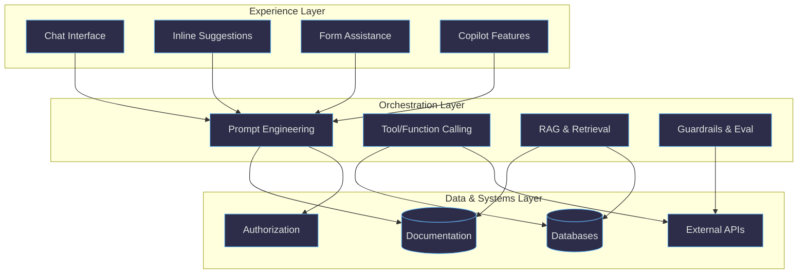

This page focuses on using GenAI in the real world: spotting where it already shows up, deciding what to build, and integrating it into products and developer workflows.

Related pages:

- [GenAI Basics](/ai/genai-basics.html)
- [GenAI Advanced](/ai/genai-advanced.html)

## Table of Contents

1. [Introduction](#introduction)
2. [Integrating AI into Your Applications](#integrating-ai-into-your-applications)
3. [Building Multi-Agent Systems](#building-multi-agent-systems)
4. [Monitoring and Evaluating AI Applications](#monitoring-and-evaluating-ai-applications)
5. [Want to Know More?](#want-to-know-more)
6. [Conclusion](#conclusion)

## Introduction

What can you actually build with AI? Beyond feature lists, this page collects practical patterns and project ideas that you can implement and iterate on.

### Where You Find AI Today

AI isn’t just in dedicated “AI apps.” It’s embedded everywhere you already work and live. Knowing where it shows up helps you spot opportunities to use it in your own projects.

#### In Your Development Workflow

Your code editor probably already has AI. GitHub Copilot suggests code as you type. Chat interfaces help debug problems. Pull requests get AI-generated summaries. Testing tools can create test cases automatically.

#### In Everyday Software

Your email client drafts responses. Your browser summarizes articles. Your phone transcribes voicemails. Your photo app organizes pictures by faces and locations. These started as separate research projects and became “normal” features.

#### In Business Applications

CRM systems score leads automatically. Accounting software categorizes expenses. Customer service platforms route inquiries. The AI runs in the background, making existing workflows smarter.

#### Behind the Scenes

Search engines understand natural language. Translation works in real time. Streaming services recommend content. Social platforms detect harmful content. The AI infrastructure is invisible but essential.

#### What This Means for Builders

AI success comes from integration, not replacement. The most useful AI features enhance existing workflows rather than creating entirely new ones.

#### Start Where You Are

Look at repetitive tasks in your current work. What takes time but doesn’t require creativity? What patterns could be automated? What decisions could be supported with better summaries or better data?

  
📚 More information

  <ul>
    <li><a href="https://youtu.be/TorMsn9bjLY">Chat in IDE</a></li>
    <li><a href="https://cooknwithcopilot.com/blog/copilot-vs-chat-sidekick-showdown.html">Copilot vs Chat: Sidekick Showdown - When to Use Each Coding Sidekick</a></li>
    <li><a href="https://www.youtube.com/watch?v=vgPl6sK6rQo">What's new with the GitHub Copilot coding agent: A look at the updates</a></li>
    <li><a href="https://www.youtube.com/watch?v=lGtTnFlI6yA">AI Challenger: Loft Orbital - Building Smarter Satellites with AI</a></li>
  </ul>

### Real Projects You Can Build Today

AI shows up across the stack even when you don’t open a chat app.

#### Build Your Own Satellite Ground Station

AI can help you process telemetry, predict orbital paths, and analyze satellite imagery and space weather. See [From Space to Subsurface: Predicting Gold Zones with Azure AI and Machine Learning](https://techcommunity.microsoft.com/t5/ai-machine-learning/from-space-to-subsurface-using-azure-ai-to-predict-gold-rich/m-p/4441134#M258).

#### Create Multi-Agent Systems That Actually Work

Move beyond single assistants to systems where multiple agents collaborate. See [Building a multi-agent system with Semantic Kernel](https://www.reddit.com/r/dotnet/comments/1ltr8tf/building_a_multiagent_system_with_semantic_kernel/).

#### Connect AI to Real-World Data with MCP

Stop limiting AI to training data. Build Model Context Protocol servers that give models access to live databases, APIs, and services. See [Model Context Protocol Development Best Practices](https://www.youtube.com/watch?v=W56H9W7x-ao).

#### Zero-Trust AI Agents for Enterprise

Build agentic systems that can operate in secure environments with proper identity and access controls. See [Zero Trust Agents: Adding Identity and Access to Multi-Agent Workflows](https://techcommunity.microsoft.com/t5/ai-azure-ai-services-blog/zero-trust-agents-adding-identity-and-access-to-multi-agent/ba-p/4427790).

### Beyond Chat: AI as Infrastructure

The most interesting AI applications aren’t chatbots. They’re systems that make everything else smarter.

#### AI-Powered Development Workflows

Go beyond code completion and build workflows that use AI to understand the system you are shipping. See [From Vibe Coding to Vibe Engineering: It's Time to Stop Riffing with AI](https://thenewstack.io/from-vibe-coding-to-vibe-engineering-its-time-to-stop-riffing-with-ai/).

#### Scientific Research Acceleration

AI can analyze papers, generate hypotheses, and even control lab workflows. See [Introducing Microsoft Discovery: An Agentic AI Platform for Scientific Research](https://www.youtube.com/watch?v=k3S4lPbUWng).

#### Visual Data Processing at Scale

Build systems that can analyze thousands of images, extract insights from video, or process satellite imagery. Computer vision capabilities are now accessible through APIs.

### Where to Start Building

#### Start Small, Think Big

Begin with a problem you face regularly. Can AI help you analyze data faster, draft better documentation, or triage incoming requests?

#### Use Existing Building Blocks

You usually don't need to train models from scratch. Start with pre-trained models through APIs, then build your differentiation in how you connect context, constraints, and workflows.

#### Learn by Doing

Build something small, test it with real examples, then iterate. When you change prompts or tool choices, you should see measurable changes in output quality.

#### Use an AI-native SDLC

If you're shipping AI features, treat prompts, evaluations, and guardrails as first-class artifacts and build them into your delivery process. See [AI Native SDLC](/ai/sdlc.html).

## Integrating AI into Your Applications

Most practical integrations come down to three layers:

- **Experience**: how users interact (chat, inline suggestions, forms, copilots)
- **Orchestration**: prompts, tool use, retrieval, evaluations, and guardrails
- **Data and systems**: your sources of truth (docs, DBs, APIs) and authorization

### Tools and IDEs

Modern development environments have integrated AI capabilities to enhance productivity and streamline workflows.

#### Visual Studio Code

- GitHub Copilot integration: code suggestions and chat in the editor
- AI-powered extensions for specific languages and frameworks
- Context-aware completions based on your repository

#### Visual Studio

- AI-assisted IntelliSense, suggestions, and review support
- Debugging help with explanations and next-step suggestions

#### JetBrains Rider

- AI assistant support for code generation and explanation
- Refactoring suggestions and test generation workflows

#### Benefits of AI-integrated development tools

- Faster coding with contextual suggestions
- Better code quality through review support
- Learning support through explanations
- Reduced context switching

### Copilot

Microsoft’s Copilot family represents AI assistance across different tools and workflows.

#### GitHub Copilot

- Code completion: suggests functions and code blocks based on context
- Chat interface: conversational help for reasoning about code and architecture
- Multi-language support

#### Interaction modes

*Ask* is best for explanations, options, and quick checks.

*Edit* is best for refining existing code, docs, and configs.

*Agent* is best for multi-step tasks where the AI plans and executes changes.

  
❓ Copilot FAQ

  
When should I refactor using my IDE versus using Copilot?

  

    <ul>
      <li>Use IDE refactoring tools for standard operations like renaming symbols or extracting methods.</li>
      <li>Use Copilot for refactors that require understanding intent, architecture, and cross-file reasoning.</li>
    </ul>
    Lots of examples and detailed information can be found in the <a href="/github-copilot/">GitHub Copilot Hub</a>.
  

  
📚 More information

  <ul>
    <li><a href="https://www.youtube.com/watch?v=vgPl6sK6rQo">What's new with the GitHub Copilot coding agent: A look at the updates</a></li>
    <li><a href="https://cooknwithcopilot.com/blog/copilot-vs-chat-sidekick-showdown.html">Copilot vs Chat: Sidekick Showdown - When to Use Each Coding Sidekick</a></li>
    <li><a href="https://www.youtube.com/watch?v=xWA0xYttWMo">Modernizing Legacy COBOL to Cloud with GitHub Copilot</a></li>
    <li><a href="https://www.youtube.com/watch?v=ol_un2Nam2E">GitHub Copilot Helps One Acre Fund Scale Farming Impact</a></li>
    <li><a href="https://devblogs.microsoft.com/visualstudio/introducing-automatic-documentation-comment-generation-in-visual-studio/">Introducing automatic documentation comment generation in Visual Studio</a></li>
    <li><a href="https://code.visualstudio.com/updates/v1_102">VS Code June 2025 (version 1.102)</a></li>
    <li><a href="https://github.blog/news-insights/product-news/github-copilot-in-2025-more-intelligent-more-accessible-more-productive/">GitHub Copilot in 2025: More Intelligent, More Accessible, More Productive</a></li>
    <li><a href="https://techcommunity.microsoft.com/blog/educatordeveloperblog/building-ai-agents-with-ease-function-calling-in-vs-code-ai-toolkit/4362419">Building AI Agents with Ease: Function Calling in VS Code AI Toolkit</a></li>
  </ul>

### Azure AI Services

Microsoft Azure provides AI services that range from end-to-end platforms to specialized APIs.

#### Azure AI Foundry

AI Foundry is a unified platform for building, evaluating, and deploying AI applications.

#### Azure OpenAI

Enterprise access to OpenAI models with Azure security and compliance features.

##### Do you need to use low-level services directly?

For many applications, you can start with Azure OpenAI or AI Foundry, then add specialized services when needed.

  
📚 More information

  <ul>
    <li><a href="https://www.youtube.com/watch?v=2L4cSig9Y4Y">Azure Update: 20th June 2025</a></li>
    <li><a href="https://www.youtube.com/watch?v=-8sH0QFhvkQ">Azure Updates: August 2025 Highlights</a></li>
    <li><a href="https://devblogs.microsoft.com/foundry/whats-new-in-azure-ai-foundry-july-2025/">What's New in Azure AI Foundry: July 2025 Releases and Updates</a></li>
    <li><a href="https://azure.microsoft.com/en-us/blog/introducing-deep-research-in-azure-ai-foundry-agent-service/">Introducing Deep Research in Azure AI Foundry Agent Service</a></li>
    <li><a href="https://techcommunity.microsoft.com/blog/azure-ai-services-blog/agent-factory-building-your-first-ai-agent-with-azure-ai-foundry/4295871">Agent Factory: Building Your First AI Agent with Azure AI Foundry</a></li>
  </ul>

### Languages and SDKs

Most languages have solid SDKs and libraries for integrating AI.

#### Python

- OpenAI SDK
- LangChain
- Hugging Face Transformers
- LlamaIndex

#### JavaScript/TypeScript

- OpenAI Node.js SDK
- LangChain.js
- Vercel AI SDK

#### C#/.NET

- Microsoft.Extensions.AI
- Agent Framework (successor to Semantic Kernel)
- Azure AI SDKs

  
📚 More information

  <ul>
    <li><a href="https://www.youtube.com/watch?v=pt4CJKm-2ZI">.NET AI Community Standup: AI in .NET - What's New, What's Next</a></li>
    <li><a href="https://www.youtube.com/watch?v=iYHh5n-6ez4">Connecting to a Local MCP Server Using Microsoft.Extensions.AI</a></li>
  </ul>

### Semantic Kernel

Semantic Kernel is an SDK for orchestrating prompts, tools, and workflows in application code. Microsoft also highlights Microsoft Agent Framework for higher-level agentic systems.

  
📚 More information

  <ul>
    <li><a href="https://learn.microsoft.com/en-us/semantic-kernel/">Semantic Kernel documentation</a></li>
    <li><a href="https://github.com/microsoft/semantic-kernel">Semantic Kernel GitHub repository</a></li>
    <li><a href="https://devblogs.microsoft.com/semantic-kernel/semantic-kernel-and-microsoft-extensions-ai-better-together-part-2/">Semantic Kernel and Microsoft.Extensions.AI: Better Together, Part 2</a></li>
    <li><a href="https://learn.microsoft.com/en-us/agent-framework/migration-guide/from-semantic-kernel">Migration guide from Semantic Kernel to Agent Framework</a></li>
  </ul>

### Microsoft Agent Framework

Microsoft Agent Framework is a framework for building, orchestrating, and deploying AI agents. It provides pre-built orchestration patterns and integrates with Microsoft Foundry for visual workflow design.

  
📚 More information

  <ul>
    <li><a href="https://learn.microsoft.com/en-us/agent-framework/">Microsoft Agent Framework documentation</a></li>
    <li><a href="https://github.com/microsoft/agent-framework">Agent Framework GitHub repository</a></li>
    <li><a href="https://devblogs.microsoft.com/semantic-kernel/semantic-kernel-and-microsoft-agent-framework/">Semantic Kernel and Microsoft Agent Framework announcement</a></li>
    <li><a href="https://devblogs.microsoft.com/foundry/introducing-microsoft-agent-framework-the-open-source-engine-for-agentic-ai-apps/">Introducing Microsoft Agent Framework blog post</a></li>
    <li><a href="https://www.youtube.com/watch?v=AAgdMhftj8w">Agent Framework introduction video (30 min)</a></li>
  </ul>

  
❓ Semantic Kernel FAQ

  
Adding Azure OpenAI vs OpenAI in C# - what are the differences?

  

    <ul>
      <li>Azure OpenAI offers enterprise security, data residency control, and Azure integration.</li>
      <li>Direct OpenAI can be simpler to start with but gives less control over data handling.</li>
    </ul>
  

## Building Multi-Agent Systems

Multi-agent systems move beyond single "do-everything" assistants to collaborative groups where each agent brings a specific skill. This section covers practical approaches to building these systems.

### When to use multi-agent architectures

Consider multi-agent designs when:

- **Large workloads** can be divided into smaller tasks for parallel processing
- **Complex tasks** require distinct competencies (retrieval vs. code generation vs. review)
- **Separation of duties** matters (policy checking, compliance review)
- **Different expertise** is needed for different aspects of a task
- **Stronger isolation** is required (running agents under least-privilege identities)

### Three-phase development workflow

Microsoft Foundry and Agent Framework support a design-develop-deploy workflow:

#### Phase 1: Design (Low-Code)

Use Microsoft Foundry Workflows to visually design agent orchestration. Drag agents onto a canvas, define data flows, and add control logic like conditional branching. This lets you prototype and test multi-agent interactions without writing orchestration code.

Foundry Workflows exports to YAML, making designs portable and version-controllable.

#### Phase 2: Develop (Local SDLC)

Use the Microsoft Foundry VS Code Extension to pull workflow definitions locally. This bridges the gap between cloud-based visual design and your local IDE, enabling debugging, testing, and integration with your existing development practices.

#### Phase 3: Deploy (Runtime)

Microsoft Agent Framework natively ingests the declarative workflow definitions (YAML) from Foundry. This "configuration as code" approach lets you promote artifacts from prototyping directly to production without rewriting logic.

### Practical orchestration patterns

Choose patterns based on your coordination needs:

| Pattern | Use when |
| ------- | -------- |
| **Sequential** | Tasks have dependencies and must run in order |
| **Concurrent** | Tasks are independent and can run in parallel |
| **Group Chat** | Multiple perspectives need to collaborate iteratively |
| **Handoff** | Context determines which specialist should handle the work |

Patterns can be combined. A sequential pipeline might include a group chat step for review, or a handoff pattern might delegate to concurrent sub-agents.

### Design principles for production systems

- **Make handoffs explicit**: Define schemas that capture goal, inputs, constraints, evidence, and success criteria
- **Pass artifacts by reference**: Use file IDs or links rather than copying full content to control context growth
- **Bound execution**: Set token/turn caps and clear exit conditions to prevent runaway loops
- **Log everything**: Capture every handoff and tool call, including sources, for traceability
- **Build evaluation harnesses**: Exercise end-to-end scenarios to quantify quality and prevent regressions

  
📚 More information

  <ul>
    <li><a href="https://learn.microsoft.com/en-us/agent-framework/user-guide/workflows/orchestrations/overview">Microsoft Agent Framework Orchestrations</a></li>
    <li><a href="https://techcommunity.microsoft.com/blog/azuredevcommunityblog/from-concept-to-code-building-production-ready-multi-agent-systems-with-microsof/4472752">From Concept to Code: Building Production-Ready Multi-Agent Systems</a></li>
    <li><a href="https://devblogs.microsoft.com/blog/designing-multi-agent-intelligence">Designing Multi-Agent Intelligence</a></li>
    <li><a href="https://microsoft.github.io/ai-agents-for-beginners/08-multi-agent/">Multi-Agent Design Patterns (AI Agents for Beginners)</a></li>
  </ul>

## Monitoring and Evaluating AI Applications

Building AI applications is only half the challenge. You also need to monitor performance, evaluate quality, and ensure safety in production.

### Why monitoring matters

Without rigorous assessment, AI systems can produce outputs that are fabricated, irrelevant, harmful, or vulnerable to exploits. Observability helps you detect these issues before they impact users.

### Evaluation throughout the lifecycle

#### Before deployment (preproduction)

- **Test with evaluation datasets** that simulate realistic user interactions
- **Identify edge cases** where output quality might degrade
- **Measure key metrics** like groundedness, relevance, coherence, and safety
- **Run AI red teaming** to simulate adversarial attacks and identify vulnerabilities
- **Generate synthetic data** if you lack real test data to cover your scenarios

#### After deployment (production)

- **Continuous evaluation**: Sample production traffic and assess quality/safety at a configured rate
- **Scheduled evaluation**: Run periodic tests with fixed datasets to detect drift
- **Operational metrics**: Track latency, throughput, token consumption, and error rates
- **Alerting**: Set up notifications when metrics drop below thresholds

### Types of evaluators to consider

| Category | What it measures |
| -------- | ---------------- |
| **General quality** | Coherence, fluency, overall response quality |
| **RAG quality** | Groundedness, relevance, how well responses use retrieved context |
| **Safety** | Harmful content, bias, protected material, security vulnerabilities |
| **Agent-specific** | Task adherence, task completion, tool call accuracy |

For agent applications, evaluators can assess whether the agent followed through on tasks, selected appropriate tools, and used tool outputs correctly.

### Setting up monitoring in Azure

Azure AI Foundry provides integrated observability through Application Insights:

1. **Connect Application Insights** to your Foundry project
2. **Instrument tracing** to capture detailed telemetry from your application
3. **Enable continuous evaluation** to automatically assess production traffic
4. **Use the dashboard** to visualize token consumption, latency, exceptions, and quality metrics
5. **Set up alerts** to get notified when issues arise

The Foundry observability dashboard brings key metrics into a single view that provides transparency for tracking operational health and quality.

  
📚 More information

  <ul>
    <li><a href="https://learn.microsoft.com/en-us/azure/ai-foundry/concepts/observability">Observability in generative AI (Microsoft Learn)</a></li>
    <li><a href="https://learn.microsoft.com/en-us/azure/ai-foundry/how-to/evaluate-generative-ai-app">Evaluate generative AI apps using Microsoft Foundry</a></li>
    <li><a href="https://learn.microsoft.com/en-us/training/modules/evaluate-models-azure-ai-studio/">Evaluate generative AI performance (Training Module)</a></li>
    <li><a href="https://learn.microsoft.com/en-us/azure/ai-foundry/how-to/develop/trace-application">Trace your AI application</a></li>
  </ul>

## Want to Know More?

Here are resources to continue your GenAI learning journey, from structured courses to hands-on experimentation.

### Learning resources

- [Microsoft Learn](https://learn.microsoft.com/en-us/training/paths/introduction-to-ai-on-azure/)
- [Hugging Face](https://huggingface.co/)
- [Rob Bos' LinkedIn Learning Course on AI development with GitHub models and Azure](https://www.linkedin.com/learning/enterprise-ai-development-with-github-models-and-azure)
- [GitHub Skills](https://skills.github.com/)
- [Let's build GPT: from scratch, in code, spelled out](https://www.youtube.com/watch?v=kCc8FmEb1nY)

### More content from this site

- [AI-focused videos and tutorials](/ai/videos.html)
- [Blog posts about AI implementation](/ai/posts.html)
- [Microsoft and Azure updates](/all/posts.html)

### Hands-on learning

- Start with a simple chat interface to understand AI interactions.
- Try GitHub Copilot or similar tools in your development environment.
- Experiment with prompt changes and measure output quality.
- Build a small application using Azure OpenAI or GitHub Models.
- Join AI communities and forums and learn from examples.

## Conclusion

GenAI becomes useful when it sits inside real workflows, uses trusted context, and has clear guardrails. Start small, measure quality, and expand as you gain confidence.

### Key takeaways

- Start simple and keep scope bounded.
- Treat evaluation and safety as part of the build, not as an afterthought.
- Prefer integrations that make existing workflows faster and more reliable.

### Next steps

1. Try existing tools (GitHub Copilot, Microsoft Copilot) to build intuition.
2. Pick one workflow you know well and improve one step with a prototype.
3. Add basic evaluation before you scale usage.

