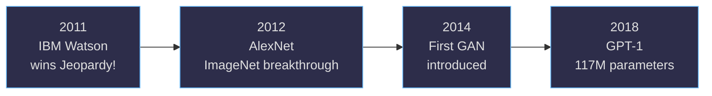
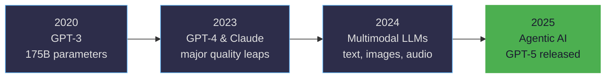
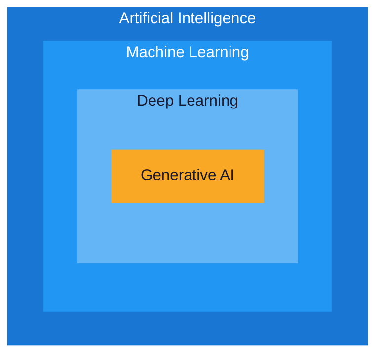
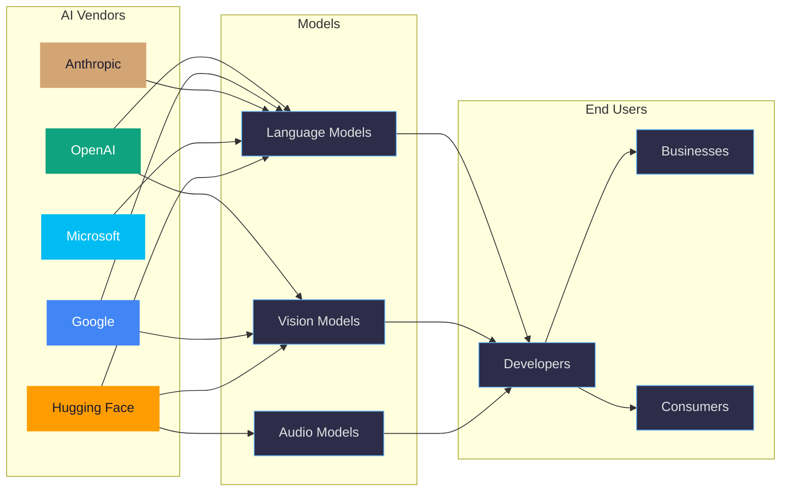
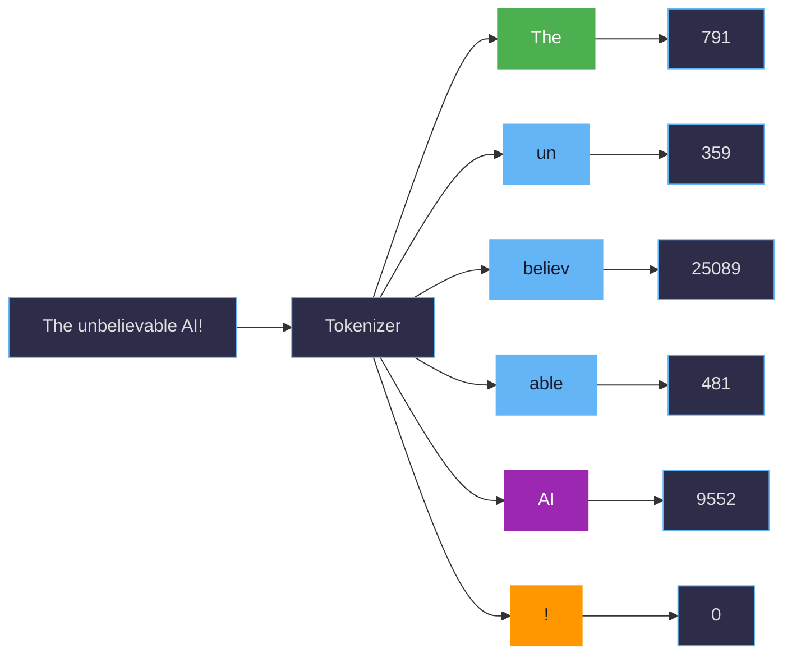
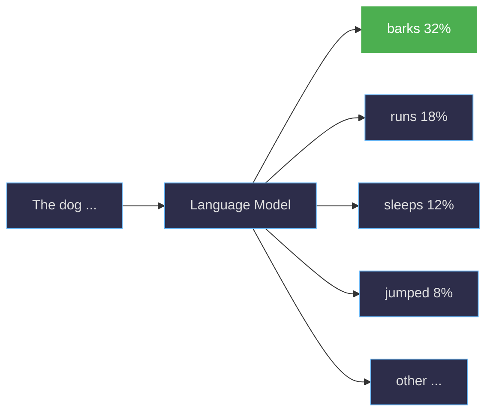
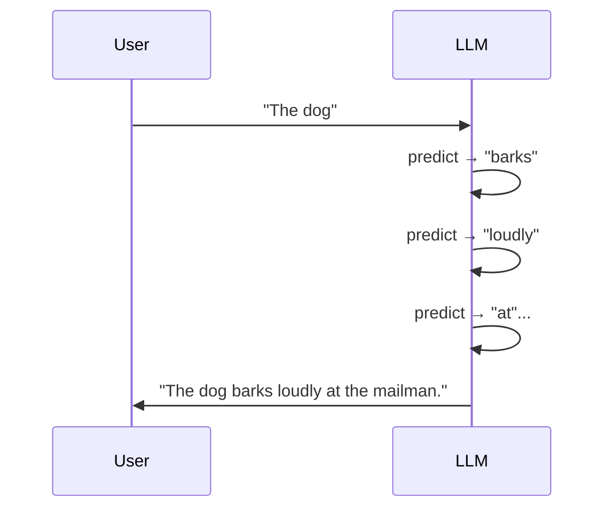
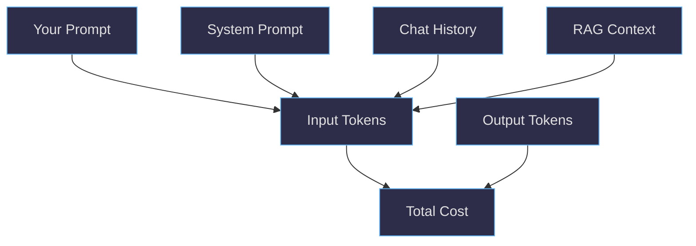
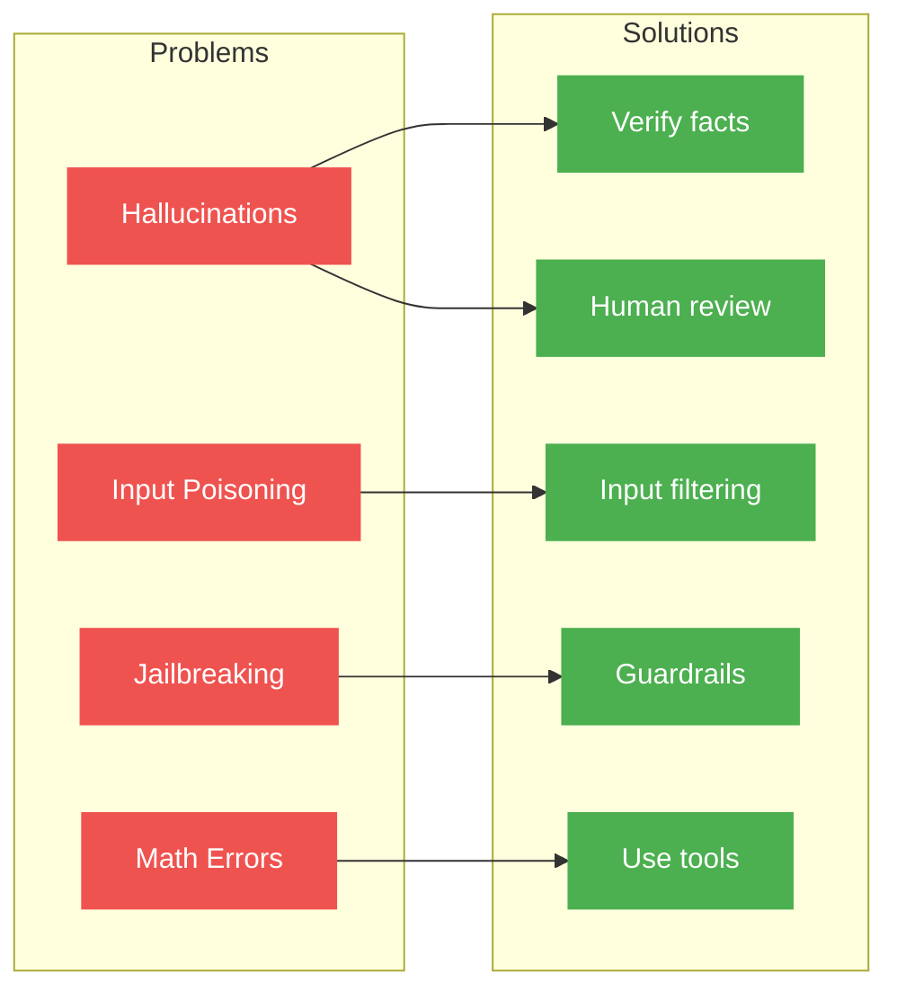

This page focuses on foundational GenAI concepts: understanding the history, learning key terminology, and seeing how GenAI fits into the broader AI and machine learning landscape.

Related pages:

- [GenAI Advanced](/ai/genai-advanced.html)
- [GenAI Applied](/ai/genai-applied.html)

## Table of Contents

1. [History](#history)
2. [ML vs AI vs GenAI](#ml-vs-ai-vs-genai)
3. [About Generative AI](#about-generative-ai)
4. [Vendors](#vendors)
5. [Models](#models)
6. [Providers](#providers)
7. [Prompts & messages](#prompts--messages)
8. [Tokens & Tokenization](#tokens--tokenization)
9. [Next-token prediction: How LLMs generate text](#next-token-prediction-how-llms-generate-text)
10. [Costs](#costs)
11. [Problems with models](#problems-with-models)
12. [When not to use AI](#when-not-to-use-ai)
13. [Societal impacts and risks](#societal-impacts-and-risks)

## History

Some fun history facts about AI, showing how long AI has been around and how it has evolved over time.

### Foundations (1950s-1990s)

### Deep Learning Era (2010s)

### GenAI Revolution (2020s)

## ML vs AI vs GenAI

Understanding the relationship between these three concepts is essential for anyone starting their AI journey.

**Machine Learning (ML)** is a method of data analysis where computers learn to identify patterns in data without being explicitly programmed for each task. Think of it as teaching a computer to recognize cats in photos by showing it thousands of cat pictures, rather than writing specific code that says "a cat has pointed ears, whiskers, and four legs."

**Artificial Intelligence (AI)** is a broader field that includes machine learning but also encompasses other approaches to creating intelligent systems. AI aims to create machines that can perform tasks that typically require human intelligence, such as reasoning, learning, planning, and understanding language.

Machine learning is one approach within the AI toolkit, but AI also includes:

- **Rule-based systems**: Follow pre-defined logical rules and conditions (like "if temperature > 80°F, then turn on air conditioning")
- **Expert systems**: Capture human expertise in specific domains through knowledge bases and inference engines (like medical diagnosis systems that apply doctor's knowledge)
- **Symbolic AI**: Uses symbols and logic to represent knowledge and reasoning (like early chess programs that evaluated board positions)
- **Evolutionary algorithms**: Solve problems by mimicking natural selection and evolution
- **Fuzzy logic**: Handles uncertainty and partial truths rather than strict true/false logic

These different approaches can be combined or used independently depending on the problem being solved.

**Generative AI (GenAI)** is a specific type of AI that can create new content - text, images, code, music, or other types of data. When you ask ChatGPT to write a story or use DALL-E to create an image, you're using generative AI. GenAI models learn patterns from existing content and use that knowledge to generate new, original content that follows similar patterns.

## About Generative AI

Understanding Generative AI begins with **Natural Language Processing (NLP)**, the foundational branch of AI that enables computers to understand, interpret, and generate human language. NLP represents a major breakthrough in human-computer interaction - instead of requiring users to learn programming languages or use specific commands, it allows people to interact with computers using natural human language, speaking or typing as they would to another person.

Within the broad field of NLP, modern AI systems primarily rely on language models - sophisticated AI systems that learn from vast amounts of text to understand and generate human-like responses. These language models come in different sizes and capabilities, each designed for specific use cases and computational requirements.

**Large Language Models (LLMs)** represent the current pinnacle of NLP technology. These AI systems are trained on enormous datasets containing billions of text examples from books, articles, websites, and other written sources. Through this training, they learn intricate patterns in how humans use language and develop the ability to generate remarkably human-like text responses. Popular examples include GPT-4, Claude, and Gemini. LLMs typically contain billions of parameters (the internal "settings" the AI adjusts during learning) and require significant computational resources to operate effectively.

**Small Language Models (SLMs)** serve the same fundamental purpose as their larger counterparts but prioritize efficiency and accessibility. These models are trained on more focused datasets and contain fewer parameters, making them suitable for running on local devices like smartphones, laptops, or edge computing environments. Examples include Microsoft's Phi models and various specialized versions optimized for specific tasks or industries.

Beyond text-focused language models, the NLP field has expanded to encompass various specialized model types that work with different forms of content:

- **Diffusion models** (such as DALL-E, Stable Diffusion, and Midjourney) generate images from text descriptions
- **Speech recognition models** (like Whisper) convert spoken words into written text
- **Music generation models** (such as Suno, Udio) create original musical compositions
- **Multimodal models** (like GPT-4o) can work seamlessly with multiple types of input and output - text, images, audio, and video

This diversity of model types reflects the broader evolution of AI from simple text processing to comprehensive understanding and generation across multiple forms of human communication and creative expression.

## Vendors

AI vendors are companies that develop, train, and provide access to AI models. Each vendor brings different strengths, approaches, and business models to the market.

**Major AI vendors include:**

- **OpenAI**: Creator of the GPT series and DALL-E, known for ChatGPT and pioneering conversational AI
- **Google**: Develops Gemini models and provides AI services through Google Cloud
- **Anthropic**: Focuses on AI safety and creates the Claude family of models
- **Microsoft**: Partners with OpenAI and develops its own models while integrating AI across its product suite
- **Hugging Face**: Acts as a platform for sharing and hosting AI models, both open-source and commercial

**What vendors do:**
Vendors serve as the bridge between the complex world of AI model development and practical applications. They handle the enormous costs and technical challenges of training models, then make these models available through user-friendly interfaces and APIs. This allows developers and businesses to use sophisticated AI without needing to understand the underlying mathematics or infrastructure.

**Key differences between vendors:**

- **Research focus**: Some prioritize cutting-edge capabilities, others emphasize safety and reliability
- **Business models**: Some offer free tiers with paid upgrades, others are enterprise-focused
- **Specializations**: Different vendors excel in text, images, code, or multimodal applications
- **Accessibility**: Some focus on easy-to-use consumer interfaces, others provide developer tools and APIs
- **Data policies**: Vendors differ in how they handle user data and model training

## Models

A **model** is the actual AI system that has been trained to perform specific tasks. Think of it as a specialized brain that has learned patterns from data and can apply that knowledge to new situations.

**Key characteristics that differentiate models:**

- **Training date**: When the model was trained affects what information it knows
- **Cut-off date**: The latest date of information the model was trained on
- **Size**: Larger models generally have more capabilities but require more computational resources
- **Vendor**: Different companies create models with different strengths and focuses
- **Specialization**: Some models excel at specific tasks like coding, creative writing, or analysis

**Current popular models include:**

**Large Language Models (LLMs):**

- **GPT series** (4, 4o, 4.1, 5): OpenAI's flagship models for text generation and reasoning
- **Claude** (3.5 Sonnet, 4 Sonnet, 4 Opus): Anthropic's models focused on helpful, harmless, and honest interactions
- **Gemini** (Flash, Pro): Google's multimodal models that can process text, images, and other data
- **Grok**: xAI's conversational AI model with real-time information access

**Small Language Models (SLMs):**

- **Phi-4**: Microsoft's efficient model designed to run on smaller devices with strong reasoning capabilities
- **Gemma 2/3**: Google's compact open models optimized for efficiency

**Specialized Models:**

- **DALL-E, Stable Diffusion, Midjourney, Flux**: Image generation models (diffusion models)
- **Whisper**: Speech-to-text conversion model
- **Suno, Udio**: Music generation models

**Multimodal Models:**

- **GPT-4o, GPT-4.1, GPT-5**: OpenAI models handling text, images, audio, and video
- **Gemini**: Google's multimodal models (also listed above under LLMs)
- **Claude 4 Opus**: Anthropic's multimodal model with vision capabilities

### Models FAQ

**What is a GPT and why are not all models GPT?**
GPT stands for "Generative Pre-trained Transformer." It's a specific architecture developed by OpenAI. Not all models use this architecture - companies develop different approaches to achieve similar goals. Think of it like cars: not all cars are Toyotas, even though they all serve the same basic purpose of transportation.

**What does multimodal mean and how can I use it?**
Multimodal models can understand and generate multiple types of content - not just text, but also images, audio, and video. For example, you can upload an image to GPT-4o and ask it to describe what it sees, or ask it to create an image based on your description. This makes interactions more natural and expands what you can accomplish with AI.

**Why not train a model every month or week to keep it up-to-date?**
Training large AI models requires enormous computational resources, costs millions of dollars, and takes weeks or months to complete. The process involves analyzing billions of text examples and adjusting trillions of parameters. Additionally, frequent retraining could make models less stable and reliable. Instead, vendors typically release new versions periodically with updated knowledge and improved capabilities.

## Providers

**Providers** are services that host AI models and make them accessible to users and developers. While vendors create the models, providers handle the infrastructure needed to run them at scale and make them available through APIs, web interfaces, or applications.

**Technical components of hosted AI services include:**

- **Proxy**: Routes requests to available model instances and manages traffic
- **Load balancer**: Distributes requests across multiple servers to ensure reliable performance
- **Content filter**: Screens inputs and outputs to prevent harmful or inappropriate content
- **Rate limiting**: Controls how many requests users can make to prevent abuse
- **Authentication**: Manages user access and API keys
- **Monitoring**: Tracks usage, performance, and costs

**Major hosted providers:**

- **OpenAI**: Direct access to GPT models through their API and ChatGPT interface
- **Google Cloud**: Hosts Gemini and other Google AI models
- **Microsoft Azure**:
  - **Azure OpenAI**: Enterprise-grade access to OpenAI models with enhanced security and compliance
  - **GitHub Models**: Developer-focused platform with model catalog and development tools
- **Hugging Face**: Platform for both open-source and commercial models
- **Anthropic**: Direct access to Claude models

**Self-hosting options:**

For organizations that need complete control over their AI infrastructure, self-hosting is possible:

- **Docker containers**: Run models in containerized environments
- **Ollama**: User-friendly tool for running models locally
- **Hugging Face Transformers**: Library for deploying models on your own hardware

### Providers FAQ

**Do all hosted solutions use my data?**
Data usage policies vary significantly between providers. Some use conversation data to improve their models (with user consent), while others, particularly enterprise-focused services, commit to not using customer data for training. Always check the specific terms of service and privacy policies.

**Where is my data stored?**
Data storage locations depend on the provider and service tier. Consumer services might store data globally, while enterprise services often allow you to specify geographic regions for compliance with local regulations like GDPR.

**Can I opt-out of data collection?**
Most providers offer ways to limit data collection, though the options vary. Some allow you to delete conversation history, others provide settings to prevent data from being used for model training.

**How does Azure OpenAI differ from using OpenAI directly?**
Azure OpenAI provides access to many OpenAI models through Azure, with Azure-native identity, networking, and governance features. Model availability and versions can differ by region and over time. Azure OpenAI states it doesn't use customer data to retrain foundation models; see the [Azure OpenAI data, privacy, and security guide](https://learn.microsoft.com/en-us/azure/ai-foundry/responsible-ai/openai/data-privacy).

**How does GitHub Models relate to GitHub Copilot?**
GitHub Models is a development platform that gives developers access to various AI models for building applications, while GitHub Copilot is a specific AI coding assistant. Think of GitHub Models as a toolbox for AI development, and Copilot as one specific tool that helps with coding. [GitHub Models](https://docs.github.com/en/github-models/about-github-models) provides model catalogs, prompt management, and evaluation tools for developers.

## Prompts & messages

**Prompts** are the instructions or questions you give to an AI model, while **messages** are the individual communications in a conversation between you and the AI. Understanding how to structure these effectively is key to getting good results from AI systems.

**Types of prompts and messages:**

- **User prompt**: Your question, instruction, or request to the AI
- **System prompt**: Background instructions that set the AI's behavior, role, or constraints (often hidden from users)
- **Assistant message**: The AI's response to your prompt
  - **Suggestions**: When the AI offers multiple options or approaches
  - **Completions**: When the AI finishes or continues text you've started

**Prompt engineering** is the practice of crafting effective prompts to get better results from AI models. Different techniques work better for different types of tasks:

**Prompt techniques:**

- **Zero-shot prompts**: Ask the AI to perform a task without providing examples
  - Example: "Summarize this article in three bullet points."
  
- **Few-shot prompts**: Provide a few examples of the desired input-output pattern
  - Example: "Translate these phrases. English: Hello → Spanish: Hola. English: Thank you → Spanish: Gracias. English: Good morning → Spanish: ?"
  
- **Chain of thought prompts**: Ask the AI to show its reasoning process
  - Example: "Solve this math problem step by step, showing your work."

**Reusable prompts** are templates or standardized instructions that you can use repeatedly for similar tasks. These save time and ensure consistency. For example, you might create a standard prompt for code reviews or document summaries that includes specific criteria and formatting instructions.

**More information:**

- [Craft Prompts That Get Copilot to Deliver What You Need](https://randypagels.com/blog/prompt-engineering-for-github-copilot-part-1-introduction-prompt-engineering-and-prompts-that-get-copilot-to-deliver-what-you-need/)
- [Best Prompt Engineering Tools (2025) for Building and Debugging LLM Agents](https://www.reddit.com/r/AI_Agents/comments/1mc4q9i/best_prompt_engineering_tools_2025_for_building/)
- [Go from Prompt to Playback: Sora Video Generation in Azure AI Foundry's Video Playground](https://devblogs.microsoft.com/azure-ai/go-from-prompt-to-playback-with-sora-from-azure-openai-in-the-video-playground-in-azure-ai-foundry/)

## Tokens & Tokenization

**Tokens** are the basic units that AI models use to process text. Think of them as the "words" that the AI actually understands, though they don't always match human words exactly.

**How tokenization works:**
When you send text to an AI model, it first breaks your message into tokens. This process, called tokenization, splits text into manageable pieces. A token might be:

- A whole word (like "hello")
- Part of a word (like "un" and "believable" for "unbelievable")
- A punctuation mark
- A space or special character

**How many tokens are in a message?**
As a rough guide, 1 token equals about 0.75 English words. So 100 words would be approximately 133 tokens. However, this varies based on:

- Language (non-English text often uses more tokens)
- Technical terms and proper nouns
- Punctuation and formatting

**Why is this important?**
Tokens directly affect:

- **Cost**: Most AI services charge per token processed
- **Speed**: More tokens mean longer processing time
- **Limits**: Models have maximum token limits for conversations

**Token limits and what happens when you exceed them:**
Every model has a maximum context window (total tokens it can process at once). When you exceed this limit:

- The model might truncate older parts of the conversation
- You might get an error message
- The quality of responses may decrease

**What to do when hitting token limits:**

- Summarize earlier parts of long conversations
- Break complex tasks into smaller pieces
- Use more concise language in your prompts
- Start a new conversation if context becomes too long

**Switching between tokenizers:**
Different models use different tokenization methods, so you can't directly transfer token counts between models. What takes 100 tokens in one model might take 90 or 110 in another.

**Tokenization differences between content types:**

- **Text**: Broken into word parts and punctuation
- **Images**: Converted into fixed-size "image tokens" representing visual information
- **Audio**: Processed into time-based segments representing sound patterns
- **Code**: Often tokenized similar to text but may handle syntax differently

**More information:**

- [GPT-5 Launches in Azure AI Foundry: New Era for AI Apps, Agents and Developers](https://devblogs.microsoft.com/azure-ai/gpt-5-launches-in-azure-ai-foundry-new-era-for-ai-apps-agents-and-developers/)
- [Maximize Your ROI for Azure OpenAI: Pricing, Deployment, and Cost Optimization Strategies](https://devblogs.microsoft.com/azure-ai/maximize-your-roi-for-azure-openai-pricing-deployment-and-cost-optimization-strategies/)
- [Introducing Deep Research in Azure AI Foundry Agent Service](https://devblogs.microsoft.com/azure-ai/introducing-deep-research-in-azure-ai-foundry-agent-service/)

## Next-token prediction: How LLMs generate text

The core mechanism behind all modern LLMs is remarkably simple in concept: **next-token prediction**. Given a sequence of tokens, the model predicts what token is most likely to come next.

For example, given the input **"The dog..."**, the model calculates probability scores for every token in its vocabulary:

- "barks" might get 32% probability
- "runs" might get 18%
- "sleeps" might get 12%
- And thousands of other possibilities with smaller probabilities

The model then samples from this distribution (or picks the highest probability, depending on settings) and appends that token to the sequence. This process repeats: now with "The dog barks", it predicts the next token, and so on until a complete response is generated.

This autoregressive generation is why models can produce coherent, contextually appropriate text—each new token is conditioned on everything that came before it.

## Costs

Understanding AI costs helps you make informed decisions about which models and approaches to use for different tasks.

**Cost factors:**

**Context**: The amount of information the model needs to consider affects cost. This includes your current message plus any conversation history or background information (system prompts).

**Chat history**: Longer conversations cost more because the model processes the entire conversation context with each new message. If you have a 50-message conversation, the model reviews all previous messages to understand context when responding to message 51.

**Prompts**: More detailed and longer prompts cost more to process, but they often produce better results. Finding the right balance between prompt detail and cost is important for regular use.

**Cost optimization strategies:**

- Keep conversations focused and avoid unnecessary context
- Use smaller, more efficient models for simple tasks
- Reserve powerful (expensive) models for complex problems
- Consider using summarization to reduce context length in long conversations
- Clear conversation history when starting new topics that don't require previous context

**Token math and practical examples:**

- Basic formula: total_cost ≈ (input_tokens × input_rate) + (output_tokens × output_rate). Rates differ per provider and model. Always check the provider's pricing page.
- Estimating tokens: a quick rule-of-thumb is 1 token ≈ 0.75 English words (see [Tokens & Tokenization](#tokens--tokenization)).
- Examples (estimates for planning only):
  - News article (800–1,200 words) → ~1,060–1,600 tokens. Summarizing such an article once costs 1–2k input tokens plus the summary output tokens.
  - Email thread (10 messages, ~150 words each) → ~2,000 tokens of history before your next prompt. Each reply re-sends this context unless you trim/summarize.
  - Image analysis: some multimodal models charge per "image token" in addition to text tokens. Budget for both when sending images plus captions.
  - Long chats: token usage grows with history. Without trimming, costs can rise linearly per turn and you risk context-window truncation.

**How token limits tie to failure modes:**

- Truncation: when the context window is exceeded, earlier messages may be dropped. The model can "forget" critical instructions or facts.
- Lost grounding: if retrieved citations or data are pushed out of context, the model may revert to guesses (hallucinations).
- Incomplete tools loop: long tool results + long chat history can crowd out system prompts or tool specs, degrading tool-use accuracy. Prefer structured summaries between steps.

## Problems with models

Understanding the limitations of AI models helps you use them more effectively and avoid common pitfalls.

**Hallucinations**
AI models sometimes generate information that sounds confident and plausible but is factually incorrect. This happens because models predict what text should come next based on patterns they learned, rather than accessing a database of facts. Always verify important information, especially dates, statistics, and specific claims.

**Input-poisoning**
Malicious users might try to manipulate AI responses by including hidden instructions or misleading information in their prompts. Well-designed systems include protections against this, but it's important to be aware that AI responses can be influenced by how questions are framed.

**Jailbreaking**
This refers to attempts to bypass an AI's safety guidelines or restrictions through clever prompting techniques. While providers work to prevent this, it highlights the importance of not relying solely on AI systems for content moderation or safety-critical decisions.

**Why AI struggles with calculations and counting**
Language models are designed to predict text patterns, not perform precise mathematical operations. They might correctly handle simple arithmetic they've seen many times in training data, but they're not calculators. For reliable mathematical results:

- Use dedicated calculation tools
- Ask the AI to write code that performs the calculation
- Verify mathematical results independently

When you need precise calculations or counting, consider using AI to generate code for a calculator or spreadsheet rather than asking for direct numerical results.

**Human-in-the-loop (HITL) approaches**
Given these limitations, many organizations implement Human-in-the-loop (HITL) systems where humans remain involved in AI decision-making processes. Instead of fully automated AI systems, HITL approaches include human oversight, validation, or intervention at key points. For example, an AI might flag potentially problematic content, but a human reviews and makes the final decision about whether to remove it. This approach helps mitigate risks while still benefiting from AI's efficiency and capabilities.

## When not to use AI

Use the right tool for the job. Prefer non-AI or AI-assisted approaches for:

- Exact arithmetic, counting, or unit conversions. Use a calculator, spreadsheet, or ask the model to generate code that computes the result and then run it.
- Deterministic workflows with strict rules (compliance checks, tax calculations, safety-critical steps). Encode rules in code or rules engines and optionally add AI for explanations.
- Long-lived, precise memory; summaries drift over time, so store source-of-truth data in databases and use RAG to re-ground when needed.
- Sensitive data handling beyond approved boundaries; keep PII/PHI within compliant systems and use redaction and data minimization.
- Legal, medical, or financial decisions without human review. Keep a human in the loop for final approval.

When in doubt, let AI help draft, explain, and prototype, but keep calculators, compilers, search, and databases as the "source of truth."

## Societal impacts and risks

AI's benefits come with human and environmental costs that show up across society. Key impacts and current risks include:

- Hidden human labor: low‑paid data annotation and content moderation—often outsourced to the Global South—with long hours, low wages, trauma exposure, and poor working conditions documented in reporting (see [The Conversation](https://theconversation.com/long-hours-and-low-wages-the-human-labour-powering-ais-development-217038) and [Guardian report](https://www.theguardian.com/technology/article/2024/jul/06/mercy-anita-african-workers-ai-artificial-intelligence-exploitation-feeding-machine)).
- Environmental footprint: high electricity demand tied to grid carbon intensity; significant water use for data‑center cooling; upstream mining for chips and batteries; e‑waste and localized environmental burdens near facilities.
- Bias and discrimination: training‑data and deployment‑context bias can lead to unequal outcomes in hiring, lending, healthcare, education, and policing—often affecting marginalized groups most.
- Information integrity: synthetic media and confident but wrong outputs accelerate misinformation, deepfakes, and election interference; provenance and content authenticity remain open challenges.
- Privacy and IP: mass data collection, scraping, and model training without consent raise privacy, surveillance, and creator‑rights concerns.
- Work and the economy: automation reshapes tasks and wages; some roles are displaced while new ones emerge; growing surveillance and metrics can increase precarity in workplaces.
- Concentration and access: a few firms control models, compute, and distribution; lock‑in and digital divides influence who benefits and who is excluded.
- Security and misuse: prompt injection, data poisoning, model extraction, and jailbreaks; voice‑clone fraud, large‑scale phishing, and code generation that lowers the bar for cyberattacks.

See also: [Is AI the Right Solution? Part 2: Applying the Framework and Navigating Ethical Risks](https://hiddedesmet.com/ai-project-validation-framework-part2).

