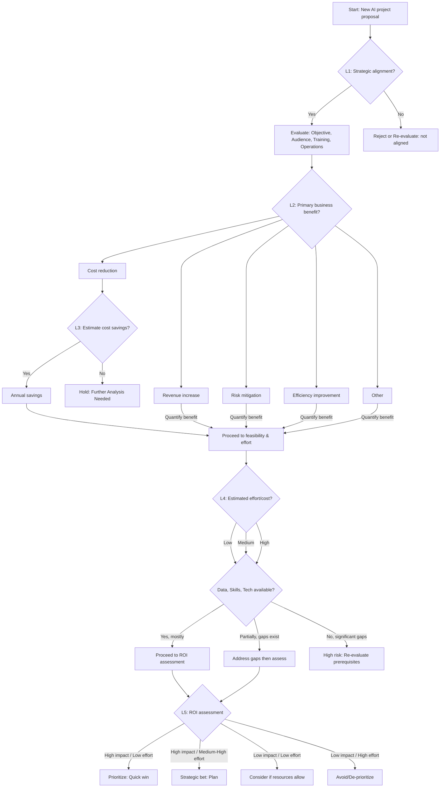

---
external_url: https://hiddedesmet.com/ai-project-validation-framework-part1
title: 'Is AI the Right Solution? Part 1: A Decision Framework for Validating AI Projects'
author: Hidde de Smet
feed_name: Hidde de Smet's Blog
date: 2025-05-26 07:00:00 +00:00
tags:
- AI Feasibility
- AI Operational Costs
- AI Project Validation
- Business Impact
- Data Readiness
- Decision Tree
- IASA
- Project Management
- Project Validation
- ROI Assessment
- Series
- Strategic Alignment
section_names:
- ai
primary_section: ai
---
Hidde de Smet shares Part 1 of a 3-part series on validating AI initiatives, focusing on a decision tree framework that helps organizations determine if AI is the best fit for solving their business problems.<!--excerpt_end-->

# Is AI the Right Solution? Part 1: The Decision Framework

**Author:** Hidde de Smet  
**Publication Date:** May 26, 2025

Part 1 in a three-part series exploring robust frameworks for assessing the suitability, feasibility, and value of implementing AI within organizations.

## Introduction

Inspired by insights from the IASA Global AI Architecture course, this article examines the crucial decision-making steps needed before adopting AI solutions. Too often, organizations jump to AI as a panacea without evaluating whether it’s the most effective approach. This guide provides a structured framework for validation.

## Why Validation Matters

Before investing resources in developing AI systems, decision-makers must ensure that AI truly addresses the underlying problem and aligns with strategic business goals. Misaligned or poorly scoped AI projects can result in wasted time, money, and missed opportunities.

## The AI Project ROI Decision Tree Framework

A clear, outcome-driven decision tree can help both technical and non-technical stakeholders jointly assess project proposals. The following framework is presented as a series of evaluation levels:

### Level 1: Strategic Alignment

- **Question 1:** Does the proposed AI project directly support the company’s strategic objectives? (Consider core operations, innovation, market positioning, and customer satisfaction.)
  - **Yes:** Continue to next evaluation.
  - **No:** Re-evaluate the idea or reject, documenting why it isn’t aligned.

### Core Evaluation Pillars: Objective, Audience, Training, Operations

When reviewing a potential AI project, assess these four pillars along with feasibility factors such as data readiness, available skills, and technological infrastructure.

1. **Objective:** Is the problem the AI project aims to solve clearly defined? Does it address measurable, strategic goals?
2. **Audience/Impact Scope:** Estimate who benefits — number of customers, users, or stakeholders. Quantify potential improvements (customer satisfaction, revenue, efficiency, etc.).
3. **Training & Data:** What resources are required for data acquisition and model training? Do you have sufficient, high-quality data?
4. **Operational Cost & Maintenance:** What are the ongoing costs (infrastructure, monitoring, retraining, support) once the system is live?

### Level 2: Potential Business Impact

- **Question 2:** What is the primary expected business benefit?
  - **A) Cost reduction:** Optimize processes, reduce waste, or automate tasks.
  - **B) Revenue increase:** Enhance experiences, offer new services/products, expand the market.
  - **C) Risk mitigation:** Predict disruptions, ensure quality, improve compliance.
  - **D) Efficiency improvement:** Automate repetitive work, speed up processes, maximize resources.
  - **E) Other:** E.g., better decision-making or innovation.
- Proceed to quantifying impact for the relevant category.

### Level 3: Impact Quantification

- **Question 3 (Example: Cost Reduction):**
  - Can you estimate potential cost savings with reasonable accuracy?
    - **Yes:** Specify the estimated annual savings and confidence level. Continue.
    - **No:** Pause until further analysis is done; inability to estimate value is a red flag.

(Similar quantification applies for revenue, risk, and efficiency metrics.)

### Level 4: Feasibility & Effort

This integrates the prior pillars into a practical assessment of complexity and resources needed.

- **Question 4:** What is the estimated implementation effort/cost?
  - **Low:** (<3 months, below certain budget)
  - **Medium:** (3-9 months, medium budget)
  - **High:** (>9 months, high budget)
- **Question 5:** Based on the pillars, do you have the required data, skills, and technology?
  - **Mostly yes:** Proceed.
  - **Gaps exist:** Plan to address, budget time and resources for closing gaps.
  - **Significant gaps:** Project is high risk; consider postponing until prerequisites are ready.

### Level 5: ROI Assessment & Go/No-Go Decision

Decision combines quantified benefits, estimated cost, and risk:

- **High impact / Low effort:** Prioritize as a quick win.
- **High impact / Medium-High effort:** Consider carefully; plan and mitigate risks.
- **Low impact / Low effort:** Pursue if resources allow.
- **Low impact / High effort:** De-prioritize or avoid.

### Visualizing the Process

A mermaid diagram is provided to clearly illustrate each decision point:

*Note: For full impact assessment, consider developing more detailed checklists tailored to each benefit type.*

---

## What’s Next?

In [Part 2](/ai-project-validation-framework-part2) (publishing June 2, 2025), the series will walk through real-world examples and discuss critical ethical risks in AI projects.

## About the Author

**Hidde de Smet** is a certified Azure Solution Architect specializing in cloud solutions, Scrum, and DevOps.

---

## Related Reading

- [Is AI the Right Solution? Part 2: Examples and Ethical Risks](/ai-project-validation-framework-part2)
- [Is AI the Right Solution? Part 3: Metrics, Piloting, and Key Takeaways](/ai-project-validation-framework-part3)
- [A Practical Guide to Machine Learning for Image Classification](/iasa-ai-course)

This post appeared first on "Hidde de Smet's Blog". [Read the entire article here](https://hiddedesmet.com/ai-project-validation-framework-part1)
