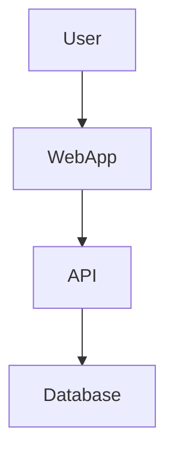
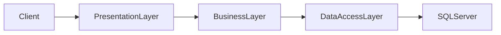
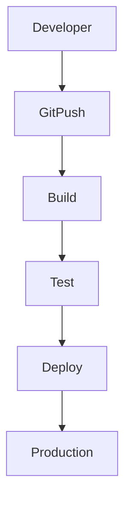
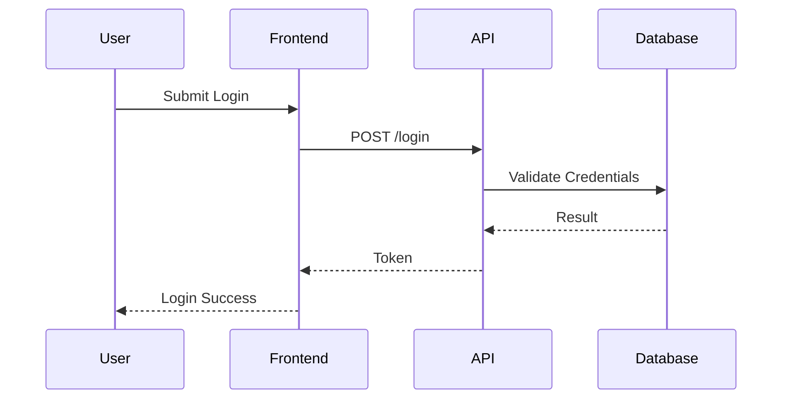

---
external_url: https://dellenny.com/visualize-workflows-and-architecture-with-mermaid-charts-in-visual-studio-2026/
title: Visualize Workflows and Architecture with Mermaid Charts in Visual Studio 2026
author: John Edward
primary_section: github-copilot
feed_name: Dellenny's Blog
date: 2026-02-15 10:58:23 +00:00
tags:
- AI
- AI Assisted Development
- Architecture
- Architecture Visualization
- Blogs
- CI/CD
- Copilot
- Developer Productivity
- Documentation as Code
- Flowcharts
- GitHub Copilot
- Markdown
- Mermaid
- Microservices
- Sequence Diagrams
- Solution Architecture
- System Design
- VS
- Workflow Diagrams
- .NET
section_names:
- ai
- dotnet
- github-copilot
---
John Edward details how native Mermaid diagram support in Visual Studio 2026, enhanced by GitHub Copilot, empowers developers to visualize, generate, and maintain documentation seamlessly within their coding workflow.<!--excerpt_end-->

# Visualize Workflows and Architecture with Mermaid Charts in Visual Studio 2026

**Author:** John Edward  
**Published:** February 15, 2026

## Overview

Modern software systems are increasingly complex, often involving microservices, APIs, authentication layers, and distributed components. Clear visualization of these systems is critical for effective development, maintenance, and onboarding. Visual Studio 2026 addresses this need by natively supporting [Mermaid](https://mermaid-js.github.io/mermaid/) diagrams directly in the editor, eliminating the need for external plugins or tools.

### Key Features

- **Direct Mermaid Rendering:** Write Mermaid syntax inside Markdown files or documentation blocks. Visual Studio 2026 renders flowcharts, sequence diagrams, and other visuals inline, keeping diagrams and source code together.
- **No Plugins Required:** Native support means no marketplace extensions or external diagramming tools are necessary. Diagrams update instantly alongside your code.
- **GitHub Copilot Integration:** Describe your desired diagram in plain English, and GitHub Copilot can generate the required Mermaid syntax for you. This lowers the barrier for teams to maintain updated documentation.

## Why Native Support Matters

Previously, developers needed to:

- Use external tools for diagrams
- Export and sync diagrams as images
- Install and manage plugins
- Maintain diagrams separately from source code

Now, documentation and visuals are part of the coding workflow:

- Diagrams live next to the code and update instantly
- Changes are tracked via version control (such as Git)
- All team members can easily contribute and update diagrams

## Mermaid Basics

Mermaid is a text-based language for creating diagrams. Instead of manipulating shapes, you define relationships with structured syntax.

**Example Workflow:**

This renders immediately in Visual Studio 2026, making it ideal for:

- Clean architecture
- N-tier systems
- Microservices
- Domain-driven design

## Writing Mermaid Diagrams in the Editor

You can:

- Create Markdown files (`.md`) containing Mermaid blocks
- Use documentation comments inside your solution
- See rendered diagrams inline as soon as the code block is written

**Layered architecture example:**

## AI Assistance: Copilot-Generated Diagrams

Not comfortable with Mermaid syntax? GitHub Copilot can help. Describe your system in natural language:
> "Generate a sequence diagram for a login process with user, frontend, API, and database."

Copilot returns the corresponding Mermaid code block, rendered instantly in the editor. This enables:

- Rapid documentation creation for developers of all skill levels
- On-the-fly visualization during feature planning or onboarding

## Practical Use Cases

Visual Studio 2026's native Mermaid support is useful for:

- Documenting workflows, CI/CD pipelines, database relationships
- Designing API flows and refactoring strategies
- Onboarding new team members quickly
- Keeping documentation current and close to the codebase

**CI/CD pipeline example:**

**Login sequence example:**

## Benefits for Teams

- **Immediate Feedback:** Diagrams update in real time as you type
- **Less Context Switching:** Stay within Visual Studio
- **Version Control:** Diagrams evolve with your code and architecture
- **Better Collaboration:** All stakeholders, including DevOps and architects, work from a single source of truth

## Documentation as Code

With Mermaid support and Copilot assistance, documentation becomes:

- Editable within the IDE
- Collaborative
- Version-controlled
- Easy to keep in sync with code

This helps teams maintain living documentation, aiding communication, troubleshooting, and future development.

---

For further reading on related architecture and AI documentation best practices, see more posts on Dellenny:

- [Documenting Architecture Using AI](https://dellenny.com/documenting-architecture-using-ai-from-painful-chore-to-strategic-advantage/)
- [Software Architecture Frameworks and Artificial Intelligence](https://dellenny.com/software-architecture-frameworks-and-artificial-intelligence-building-smarter-systems/)

---

## About the Author

John Edward writes about software architecture, development tools, and AI-enhanced workflows.

This post appeared first on "Dellenny's Blog". [Read the entire article here](https://dellenny.com/visualize-workflows-and-architecture-with-mermaid-charts-in-visual-studio-2026/)
