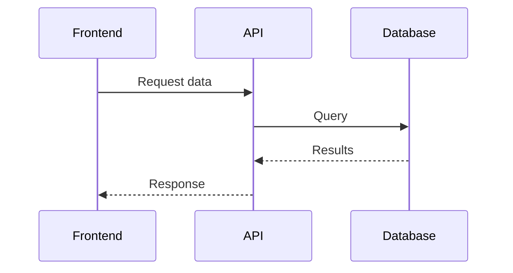

---
external_url: https://techcommunity.microsoft.com/t5/tools/visualize-workflows-and-architecture-with-mermaid-charts-in/m-p/4495253#M190
title: Visualizing Workflows and Architecture with Mermaid Charts in Visual Studio 2026
author: JohnNaguib
primary_section: github-copilot
feed_name: Microsoft Tech Community
date: 2026-02-16 16:02:52 +00:00
tags:
- AI
- Architecture Diagrams
- Community
- Developer Experience
- Development Tools
- Documentation
- Flowcharts
- GitHub Copilot
- Mermaid Charts
- Sequence Diagrams
- Software Architecture
- System Design
- VS
- Workflow Visualization
- .NET
section_names:
- ai
- dotnet
- github-copilot
---
JohnNaguib introduces how Visual Studio 2026 brings native Mermaid chart rendering to help developers visualize workflows and architecture, integrated with GitHub Copilot for seamless documentation.<!--excerpt_end-->

# Visualizing Workflows and Architecture with Mermaid Charts in Visual Studio 2026

Modern software projects are increasingly complex, often involving microservices, APIs, workers, and multi-layered frontends. One of the greatest ongoing challenges is maintaining clarity in documentation and system design.

Visual Studio 2026 addresses this need by supporting Mermaid chart rendering directly within the code editor—no plugins or extensions are required. Developers can write Mermaid syntax manually to create flowcharts, sequence diagrams, and more, or take advantage of GitHub Copilot to auto-generate documentation snippets and diagrams inline.

This direct integration streamlines how teams document, share, and discuss their architecture and workflows. Key points include:

- **Native Mermaid Support**: Visualize flowcharts, architecture diagrams, and process sequences within the IDE.
- **Integrated with GitHub Copilot**: Get suggested Mermaid syntax and diagrams as part of your coding workflow.
- **Improved Collaboration**: Keep documentation close to the code, lowering switching costs and improving communication across teams.
- **No Extensions Required**: Eliminates the need for third-party plugins, making adoption easier and documentation more accessible.

For more details, read the original post: [Visualize Workflows and Architecture with Mermaid Charts in Visual Studio 2026](https://dellenny.com/visualize-workflows-and-architecture-with-mermaid-charts-in-visual-studio-2026/)

## Example Mermaid Syntax in Visual Studio 2026

This new feature is part of a broader shift towards more integrated and developer-friendly documentation practices within the Microsoft development ecosystem.

This post appeared first on "Microsoft Tech Community". [Read the entire article here](https://techcommunity.microsoft.com/t5/tools/visualize-workflows-and-architecture-with-mermaid-charts-in/m-p/4495253#M190)
