# Network Security Hardening Plan

## Goal

Remove the expensive P2S VPN Gateway while **keeping all existing VNet, private endpoint, and peering infrastructure** intact. Replace VPN-based admin access with a split model:

- Use **Azure Network Security Perimeter (NSP)** with an admin IP allowlist for resources that support NSP
- Use the resource's own public access controls and IP firewall rules for resources that do not support NSP

At the same time, bring application traffic onto the VNet wherever possible via **AMPLS** (Azure Monitor Private Link Scope) and **Cognitive Services private endpoints**.

**What changes**: VPN Gateway removed; admin access shifts to IP-restricted public entry points; App Insights/Log Analytics routed privately from app workloads through AMPLS; AI Foundry routed privately from app workloads through PE per environment; PostgreSQL gets direct admin access from a single public IP.
**What stays**: Hub-spoke VNet topology, all existing private endpoints, DNS zones, peering, and app-to-data private routing.

## Current State

### Architecture

- **Hub-spoke VNet topology** with a Point-to-Site VPN Gateway (`VpnGw1AZ`) in the hub VNet
- Hub VNet (`10.100.0.0/16`) with GatewaySubnet and private endpoints subnet
- Staging spoke (`10.1.0.0/16`) and production spoke (`10.2.0.0/16`) peered to hub
- VPN clients (`172.16.0.0/24`) reach private resources via hub-to-spoke peering

### Resource Security Status

| Resource | Public Access | Private Endpoint | Notes |
|---|---|---|---|
| Key Vault (`kv-techhub-shared`) | Disabled | Yes (hub VNet) | Fully private, accessible via VPN only |
| PostgreSQL (per env) | Disabled | Yes (spoke VNet) | Fully private |
| Container Registry (`crtechhubms`) | **Enabled** | No | Standard SKU, public pull |
| Application Insights (per env) | **Enabled** | No | Ingestion + query both public |
| Log Analytics (per env) | **Enabled** | No | Ingestion + query both public |
| AI Foundry/OpenAI (per env) | **Enabled** | No | Public, accessed by API (Container Apps) |
| Container Apps | Public ingress | VNet-integrated | Web-facing apps, must remain public |

### Cost Problem

The P2S VPN Gateway (`VpnGw1AZ`) is the most expensive component in the shared infrastructure (~€140-180/month). Its sole purpose is admin access to Key Vault and PostgreSQL. This is over-engineered for the actual use case.

## Proposed Architecture

### What Changes

1. **Remove** the VPN Gateway, its public IP, and the GatewaySubnet from the hub VNet
2. **Remove** gateway transit flags from VNet peering (`useRemoteGateways`, `allowGatewayTransit`)
3. **Add** a Network Security Perimeter (NSP) with admin IP inbound rule
4. **Associate** NSP-compatible PaaS resources (Key Vault, App Insights, Log Analytics, AI Foundry)
5. **Add AMPLS** (Azure Monitor Private Link Scope) with private endpoint in hub VNet so app telemetry and queries can route through the VNet
6. **Add AI Foundry private endpoint** in spoke VNets so the API uses a private path
7. **Enable direct public admin access only where needed** and restrict it to the admin IP
8. **Keep Azure-managed availability tests working** by avoiding a monitoring end state that requires private-only ingestion

### What Stays Unchanged

- Hub VNet (`10.100.0.0/16`) with private endpoints subnet
- Spoke VNets with Container Apps subnet + private endpoints subnet
- Hub-spoke VNet peering (without gateway transit flags)
- Key Vault private endpoint in hub VNet + private DNS zones + DNS zone links
- PostgreSQL private endpoints in spoke VNets + private DNS zones
- Container Apps VNet integration
- Container Apps public ingress (web-facing)
- Container Registry Standard SKU
- ACME DNS zone for wildcard cert renewal

### Target End State

The end state is intentionally mixed:

- **Application traffic** prefers private connectivity through private endpoints, private DNS, AMPLS, and VNet peering
- **Admin traffic** uses a tightly controlled public entry point from a single IP address
- **Monitoring availability tests** keep using the standard Azure-managed public probe model

| Resource | App path | Admin path | Target public exposure |
|---|---|---|---|
| Key Vault | Private endpoint in hub VNet | NSP allowlist from admin IP | Public path restricted by NSP only |
| PostgreSQL | Private endpoint in spoke VNet | Direct connection from admin IP | Public access enabled, firewall rule only for admin IP |
| Application Insights | AMPLS private path from Container Apps | NSP allowlist from admin IP | Public access remains enabled so Azure-managed availability tests continue to ingest |
| Log Analytics | AMPLS private path from Container Apps | NSP allowlist from admin IP | Public access remains enabled unless later validation proves private-only query mode still supports the required admin workflows |
| AI Foundry | Private endpoint in spoke VNet | NSP allowlist from admin IP | Public path restricted by NSP only |

### Per-Resource Changes

#### Key Vault

**Current**: `publicNetworkAccess: Disabled` + private endpoint in hub VNet + VPN access.
**Change**: Keep the private endpoint as-is for application access, but move the resource from fully private to perimeter-controlled public access so the admin can reach it from a whitelisted IP. Associate it with NSP and allow only the admin IP on the public side. Container Apps continue to access KV through the private endpoint and VNet peering with no change to the data path.

The result is two access paths with different purposes:

- Private endpoint for application traffic
- NSP-protected public entry for admin portal operations, certificate management, and troubleshooting

#### Application Insights and Log Analytics

**Current**: `publicNetworkAccessForIngestion: Enabled`, `publicNetworkAccessForQuery: Enabled` — fully public.
**Change**: Associate with NSP for admin access and add AMPLS so Container Apps use a private path through the VNet. Do **not** move the default plan to private-only ingestion. Azure-managed availability tests still need to publish results to Application Insights, so monitoring remains in a mixed mode: private path for workloads, public capability preserved for Azure-managed monitoring and admin workflows.

#### AI Foundry / OpenAI

**Current**: `publicNetworkAccess: Enabled` — fully public, accessed by API (Container Apps) for content processing.
**Change**: Associate with NSP + add private endpoint in spoke VNets for Container Apps access. See [AI Foundry Private Endpoint section](#ai-foundry-private-endpoint) below. The API uses the private endpoint. The public side remains available only through NSP for admin access from the whitelisted IP.

#### PostgreSQL

**Change**: Keep the private endpoint for application traffic, but enable public access for the server and add a firewall rule that allows only the admin IP. This creates a direct admin path without reintroducing broad internet exposure.

The result is again split by purpose:

- Private endpoint for the application
- Public endpoint restricted to a single admin IP for direct DBA and troubleshooting access

#### Container Registry

**No change for now**. Standard SKU stays public. Not NSP-compatible unless upgraded to Premium. Could add IP-based `networkRuleSet` in a future iteration if desired.

#### Container Apps

**No change**. VNet-integrated outbound, public ingress for web traffic. Must remain publicly accessible.

### Azure Monitor Private Link Scope (AMPLS)

AMPLS lets you route Application Insights and Log Analytics traffic through a private endpoint — the same mechanism already used for Key Vault and PostgreSQL. This brings monitoring traffic onto the VNet backbone instead of traversing the public internet.

**How it works**:

1. Create an AMPLS resource (`Microsoft.Insights/privateLinkScopes`)
2. Add (scope) Log Analytics workspaces and Application Insights components to it
3. Create a private endpoint for the AMPLS in the hub VNet's `snet-private-endpoints` subnet
4. Create the required private DNS zones and link them to all VNets (hub + spokes)
5. Container Apps in spoke VNets resolve monitoring endpoints to the private IP via DNS zone links + VNet peering

**AMPLS resources** (added as scoped resources):

| Resource | Type |
|---|---|
| `law-techhub-shared` | Log Analytics Workspace |
| `appi-techhub-shared` | Application Insights |
| `law-techhub-staging` | Log Analytics Workspace |
| `appi-techhub-staging` | Application Insights |
| `law-techhub-prod` | Log Analytics Workspace |
| `appi-techhub-prod` | Application Insights |

**Access mode**: `Open` for both ingestion and query. This is intentional in the default plan. It allows VNet workloads to use the private path via DNS and private endpoint, while preserving Azure-managed availability tests, portal workflows, and a safe rollback path.

**DNS zones required** (5 zones — created automatically when using Azure-managed DNS):

- `privatelink.monitor.azure.com` — App Insights ingestion, API, live metrics
- `privatelink.oms.opinsights.azure.com` — Log Analytics agent endpoints
- `privatelink.ods.opinsights.azure.com` — Log Analytics ingestion (ODS)
- `privatelink.agentsvc.azure-automation.net` — agent service
- `privatelink.blob.core.windows.net` — agent solution packs storage

All DNS zones must be linked to the hub VNet AND both spoke VNets so Container Apps can resolve private IPs. This follows the same pattern already used for Key Vault and PostgreSQL DNS zones.

**Subnet requirements**: The private endpoint needs at least 11 IPs. The existing `snet-private-endpoints` (`10.100.1.0/24`) in the hub has 251 usable IPs — plenty of room alongside the Key Vault PE.

**Cost**: Free. Both AMPLS and private endpoints have no per-resource charges (Azure removed Private Endpoint fees in February 2025). Only standard data processing charges apply.

**Bicep resource types**:

```bicep
resource ampls 'Microsoft.Insights/privateLinkScopes@2021-07-01-preview' = {
  name: 'ampls-techhub'
  location: 'global'
  properties: {
    accessModeSettings: {
      ingestionAccessMode: 'Open'
      queryAccessMode: 'Open'
    }
  }
}

// Scope all Log Analytics workspaces and App Insights instances (cross-RG via full resource ID)
resource amplsScopedResources 'Microsoft.Insights/privateLinkScopes/scopedResources@2021-07-01-preview' = [
  for scope in scopedResources: {  // [{name, resourceId}] array passed as parameter
    parent: ampls
    name: scope.name
    properties: {
      linkedResourceId: scope.resourceId  // Full ARM resource ID, can be in any RG
    }
  }
]

// Private endpoint for the AMPLS (in hub VNet, same subnet as Key Vault PE)
resource amplsPrivateEndpoint 'Microsoft.Network/privateEndpoints@2025-01-01' = {
  name: 'pe-ampls-techhub'
  location: location
  properties: {
    subnet: { id: hubPrivateEndpointsSubnetId }
    privateLinkServiceConnections: [{
      name: 'ampls-connection'
      properties: {
        privateLinkServiceId: ampls.id
        groupIds: ['azuremonitor']
      }
    }]
  }
}
```

The `scopedResources` parameter would be constructed from the known naming convention:

```bicep
var amplsScopedResources = [
  { name: 'scope-law-shared',  resourceId: '/subscriptions/${subscriptionId}/resourceGroups/rg-techhub-shared/providers/Microsoft.OperationalInsights/workspaces/law-techhub-shared' }
  { name: 'scope-appi-shared', resourceId: '/subscriptions/${subscriptionId}/resourceGroups/rg-techhub-shared/providers/Microsoft.Insights/components/appi-techhub-shared' }
  { name: 'scope-law-staging', resourceId: '/subscriptions/${subscriptionId}/resourceGroups/rg-techhub-staging/providers/Microsoft.OperationalInsights/workspaces/law-techhub-staging' }
  { name: 'scope-appi-staging', resourceId: '/subscriptions/${subscriptionId}/resourceGroups/rg-techhub-staging/providers/Microsoft.Insights/components/appi-techhub-staging' }
  { name: 'scope-law-prod',   resourceId: '/subscriptions/${subscriptionId}/resourceGroups/rg-techhub-prod/providers/Microsoft.OperationalInsights/workspaces/law-techhub-prod' }
  { name: 'scope-appi-prod',  resourceId: '/subscriptions/${subscriptionId}/resourceGroups/rg-techhub-prod/providers/Microsoft.Insights/components/appi-techhub-prod' }
]
```

This works because scoped resources reference by full ARM resource ID — the AMPLS doesn't need to be in the same resource group as the monitored resources. All 6 resources share the single private endpoint in the hub VNet.

### AI Foundry Private Endpoint

AI Foundry (`Microsoft.CognitiveServices/accounts`, kind=AIServices) supports private endpoints. Adding a PE per spoke VNet lets Container Apps call OpenAI APIs through the VNet instead of over the public internet.

**Setup per environment**:

1. Create private endpoint for AI Foundry in the spoke VNet's `snet-private-endpoints` subnet using the `account` sub-resource group
2. Create the required private DNS zones (3 zones for the `account` group):
   - `privatelink.cognitiveservices.azure.com`
   - `privatelink.openai.azure.com` — routes `<name>.openai.azure.com` calls (used by Container Apps for chat completions)
   - `privatelink.services.ai.azure.com`
3. Link all three DNS zones to the spoke VNet (and hub for admin access via NSP)

**Cost**: Free. Private endpoints have no per-resource charges since February 2025.

**Bicep resource types**:

```bicep
resource openAiPrivateEndpoint 'Microsoft.Network/privateEndpoints@2025-01-01' = {
  name: 'pe-oai-techhub-${environmentName}'
  location: location
  properties: {
    subnet: { id: privateEndpointsSubnetId }
    privateLinkServiceConnections: [{
      name: 'oai-connection'
      properties: {
        privateLinkServiceId: openAiAccount.id
        groupIds: ['account']  // 'account' group covers all endpoints incl. openai.azure.com
      }
    }]
  }
}
```

> **DNS zones**: The `account` group requires three private DNS zones: `privatelink.cognitiveservices.azure.com`, `privatelink.openai.azure.com`, and `privatelink.services.ai.azure.com`. All three must be created and linked to the spoke VNet (and hub) for DNS resolution to work for the `<name>.openai.azure.com` endpoint used by Container Apps.

> **Note**: Content processing (RSS feeds, roundups) runs from the API, which is hosted on VNet-integrated Container Apps. All application AI Foundry calls originate from within the spoke VNet and route through the private endpoint. The public side exists only as an admin entry point controlled by NSP.

### Private Endpoint Summary (After All Changes)

| Resource | PE Location | DNS Zone | Linked VNets | Status |
|---|---|---|---|---|
| Key Vault | Hub VNet | `privatelink.vaultcore.azure.net` | Hub + spokes | **Existing** |
| PostgreSQL (staging) | Staging VNet | `privatelink.postgres.database.azure.com` | Staging + Hub | **Existing** |
| PostgreSQL (prod) | Prod VNet | `privatelink.postgres.database.azure.com` | Prod + Hub | **Existing** |
| AMPLS (monitoring) | Hub VNet | 5 zones (see above) | Hub + spokes | **New** |
| AI Foundry (staging) | Staging VNet | `privatelink.cognitiveservices.azure.com` + `privatelink.openai.azure.com` + `privatelink.services.ai.azure.com` | Staging + Hub | **New** |
| AI Foundry (prod) | Prod VNet | `privatelink.cognitiveservices.azure.com` + `privatelink.openai.azure.com` + `privatelink.services.ai.azure.com` | Prod + Hub | **New** |

### NSP-Compatible Resources

All GA — safe for production use:

| Resource | Resource Type | NSP Status |
|---|---|---|
| Key Vault | `Microsoft.KeyVault/vaults` | GA |
| Log Analytics Workspace | `Microsoft.OperationalInsights/workspaces` | GA |
| Application Insights | `Microsoft.Insights/components` (via `dataCollectionEndpoints`) | GA |
| AI Foundry (AIServices) | `Microsoft.CognitiveServices/accounts` (kind=AIServices) | GA |

## Network Security Perimeter Design

### Perimeter Structure

```text
NSP: nsp-techhub (in rg-techhub-shared)
│
├── Profile: profile-techhub
│   ├── Inbound Rule: allow-admin-ip (IP-based)
│   │   └── addressPrefixes: ["<ADMIN_IP>/32"]
│   ├── Inbound Rule: allow-subscription (subscription-based)
│   │   └── subscriptions: [{id: "<techhub-subscription-id>"}]
│   └── (Outbound rules: none needed — all outbound is intra-perimeter or to Azure)
│
├── Association: assoc-keyvault → kv-techhub-shared (Enforced)
├── Association: assoc-law-shared → law-techhub-shared (Enforced)
├── Association: assoc-appi-shared → appi-techhub-shared (Enforced)
├── Association: assoc-law-staging → law-techhub-staging (Enforced)
├── Association: assoc-appi-staging → appi-techhub-staging (Enforced)
├── Association: assoc-law-prod → law-techhub-prod (Enforced)
├── Association: assoc-appi-prod → appi-techhub-prod (Enforced)
├── Association: assoc-oai-staging → oai-techhub-staging (Enforced)
└── Association: assoc-oai-prod → oai-techhub-prod (Enforced)
```

The subscription-based inbound rule is meant for Azure-hosted callers that authenticate from within the TechHub Azure subscription. This covers:

- Container Apps managed identity calls (Key Vault certificate access, AI Foundry API, content processing)
- Azure Monitor telemetry ingestion from Container Apps

GitHub Actions should **not** be treated as depending on the NSP rule. In the current deployment workflows they talk to ACR and Container Apps, which are outside this NSP scope.

### Bicep Resource Types

```bicep
// API version: 2025-05-01 (latest stable for NSP)

resource nsp 'Microsoft.Network/networkSecurityPerimeters@2025-05-01'
resource profile 'Microsoft.Network/networkSecurityPerimeters/profiles@2025-05-01'
resource accessRule 'Microsoft.Network/networkSecurityPerimeters/profiles/accessRules@2025-05-01'
resource association 'Microsoft.Network/networkSecurityPerimeters/resourceAssociations@2025-05-01'
```

### Bicep Skeleton (New Module)

A new module `infra/modules/networkSecurityPerimeter.bicep`:

```bicep
param location string
param nspName string = 'nsp-techhub'
param profileName string = 'profile-techhub'
param adminIpAddress string       // e.g., '203.0.113.42/32'
param subscriptionId string       // TechHub subscription ID for subscription-based rule
param accessMode string = 'Learning'  // 'Learning' initially, then 'Enforced'
param resourceAssociations array  // [{name, resourceId}]

resource nsp 'Microsoft.Network/networkSecurityPerimeters@2025-05-01' = {
  name: nspName
  location: location
}

resource profile 'Microsoft.Network/networkSecurityPerimeters/profiles@2025-05-01' = {
  parent: nsp
  name: profileName
  location: location
}

resource adminInboundRule 'Microsoft.Network/networkSecurityPerimeters/profiles/accessRules@2025-05-01' = {
  parent: profile
  name: 'allow-admin-ip'
  location: location
  properties: {
    direction: 'Inbound'
    addressPrefixes: [adminIpAddress]
  }
}

resource subscriptionInboundRule 'Microsoft.Network/networkSecurityPerimeters/profiles/accessRules@2025-05-01' = {
  parent: profile
  name: 'allow-subscription'
  location: location
  properties: {
    direction: 'Inbound'
    subscriptions: [{ id: subscriptionId }]
  }
}

resource associations 'Microsoft.Network/networkSecurityPerimeters/resourceAssociations@2025-05-01' = [
  for assoc in resourceAssociations: {
    parent: nsp
    name: assoc.name
    location: location
    properties: {
      privateLinkResource: { id: assoc.resourceId }
      profile: { id: profile.id }
      accessMode: accessMode
    }
  }
]
```

### Cross-Resource-Group Associations

The NSP lives in `rg-techhub-shared` but must associate with resources in `rg-techhub-staging` and `rg-techhub-prod`. NSP associations are child resources of the NSP itself, so they deploy in the shared RG. The `privateLinkResource.id` property takes the full ARM resource ID of the target resource, which can be in any resource group.

This means:

- `infra/shared.bicep` deploys the NSP, profile, access rules, and the shared-RG associations (Key Vault, shared App Insights, shared Log Analytics)
- `infra/main.bicep` outputs the environment resource IDs (App Insights, Log Analytics, AI Foundry) so they can be passed to the NSP module, OR the environment-specific associations are added as separate module calls in `shared.bicep` using the known resource naming convention

**Simplest approach**: Deploy all NSP associations from `shared.bicep` using predictable resource IDs constructed from naming conventions (`appi-techhub-staging`, `law-techhub-staging`, etc.) since resource names are deterministic.

## GitHub Actions Considerations

GitHub Actions is used **only for CI/CD deployments** — it does not perform content processing. Content processing (RSS feeds, roundups, etc.) has been moved to the API, which runs on VNet-integrated Container Apps.

| Workflow | Resources Accessed | Auth Method |
|---|---|---|
| CI/CD (`ci-cd.yml`) | ACR (push images), Container Apps (deploy) | Azure OIDC |
| PR Preview | ACR, Container Apps, staging infra | Azure OIDC |

The **subscription-based NSP inbound rule** covers all GitHub Actions calls because they authenticate as a service principal in the TechHub subscription via OIDC.

Since GitHub Actions no longer calls AI Foundry or other PaaS resources directly, there are no API-key-based external calls to worry about. All AI Foundry access originates from the API (Container Apps), which routes through the private endpoint inside the VNet.

## Implementation Plan

### Phase 1: Deploy NSP + AMPLS + AI Foundry PEs in Learning/Open Mode (Non-Breaking)

**Goal**: Deploy all new networking resources alongside existing infrastructure. Nothing changes for existing access paths and the monitoring stack stays compatible with current availability tests.

**Changes**:

1. Create `infra/modules/networkSecurityPerimeter.bicep` with NSP + profile + admin IP rule + subscription rule
2. Create `infra/modules/monitorPrivateLink.bicep` with AMPLS + private endpoint + DNS zones
3. Create `infra/modules/openAiPrivateEndpoint.bicep` with AI Foundry PE + DNS zone
4. Add NSP module call to `infra/shared.bicep` with `accessMode: 'Learning'`
5. Add AMPLS module call to `infra/shared.bicep` — scope all Log Analytics + App Insights resources, PE in hub VNet, `Open` access mode
6. Add AI Foundry PE module call to `infra/main.bicep` — PE per spoke VNet
7. Add parameter `adminIpAddress` to `infra/shared.bicep`
8. Associate NSP resources: Key Vault, App Insights (all), Log Analytics (all), AI Foundry (all)
9. Deploy and monitor NSP access logs + verify private endpoint DNS resolution
10. Confirm Container Apps resolve Azure Monitor and AI Foundry endpoints to private IPs while standard availability tests continue to report successfully

**Files to create**:

- `infra/modules/networkSecurityPerimeter.bicep`
- `infra/modules/monitorPrivateLink.bicep`
- `infra/modules/openAiPrivateEndpoint.bicep`

**Files to modify**:

- `infra/shared.bicep` — add NSP module call, add AMPLS module call
- `infra/main.bicep` — add AI Foundry PE module call

**Verification**:

- All existing access continues to work (VPN, Container Apps, GitHub Actions)
- NSP access logs show all legitimate traffic patterns
- Private endpoints resolve correctly from Container Apps (`nslookup` from app logs)
- Telemetry still flows to App Insights
- Standard Application Insights availability tests still report data
- No denied traffic in NSP logs

### Phase 2+3: Switch to Enforced Mode and Open Admin Entry Points (Single Deployment)

**Goal**: Switch NSP to enforced mode **and** open the per-resource admin entry points in the same deployment. These two steps must be done together because enabling enforced mode before opening the KV public path would cause a temporary admin lockout — which is acceptable as the window is one deployment cycle.

**Changes**:

1. Change `accessMode` from `'Learning'` to `'Enforced'` in the NSP module call
2. **Key Vault**: move from fully private to perimeter-controlled public access so NSP can enforce the admin IP rule
3. **AI Foundry**: ensure the public side is reachable only through NSP from the admin IP
4. **PostgreSQL**: set `publicNetworkAccess` to `Enabled` and add firewall rules for the admin IP only
5. Keep all existing private endpoints and DNS links unchanged so application traffic remains private

**Files to modify**:

- `infra/modules/networkSecurityPerimeter.bicep` — change `accessMode` to `'Enforced'`
- `infra/modules/keyVault.bicep` — update resource-level public access mode to work with NSP-controlled admin access
- `infra/modules/openai.bicep` — keep public access available for the admin path while the app uses the private endpoint
- `infra/modules/postgres.bicep` — enable public access for admin entry
- `infra/main.bicep` — add PostgreSQL firewall rule configuration per environment
- `infra/shared.bicep` — add any admin IP parameters needed for shared resources

**Verification**:

- Container Apps can still read certificates from Key Vault (via private endpoint — unaffected by NSP)
- Container Apps can still send telemetry to Application Insights
- Container Apps can still call AI Foundry/OpenAI
- Admin can access Key Vault from whitelisted IP (may require a second deployment if KV lockout occurs)
- Admin can access App Insights, Log Analytics from whitelisted IP
- Admin can access AI Foundry from whitelisted IP
- Admin can connect directly to PostgreSQL from whitelisted IP
- Container Apps still use private endpoints for Key Vault, AI Foundry, and PostgreSQL
- Azure-managed availability tests still work

### Phase 4: Remove VPN Gateway

**Goal**: Remove the VPN Gateway and its associated resources to save ~€140-180/month.

**Changes**:

1. Remove VPN Gateway, public IP, and GatewaySubnet from `hubNetwork.bicep`
2. Remove gateway transit flags from peering: set `useRemoteGateways: false` and `allowGatewayTransit: false` (or remove the params since they default to `false`)
3. Remove VPN-related parameters from `shared.bicep` (`vpnGatewayName`, `vpnAadAudienceAppId`)
4. Remove VPN-related outputs from `hubNetwork.bicep` (`vpnGatewayId`, `vpnPublicIpAddress`)
5. Remove VPN-related outputs from `shared.bicep` (`vpnGatewayId`)
6. **Manually delete** the VPN Gateway and public IP from Azure before deploying (Bicep won't delete resources that are removed from templates)

**Files to modify**:

- `infra/modules/hubNetwork.bicep` — remove VPN Gateway resource, public IP resource, GatewaySubnet, VPN-related params/outputs
- `infra/shared.bicep` — remove VPN params, update `hubNetwork` module call
- `infra/main.bicep` — set `useRemoteGateways: false` in spoke-to-hub peering, `allowGatewayTransit: false` in hub-to-spoke peering
- `infra/modules/vnetPeering.bicep` — no structural change, just param values change

**No files deleted**. Hub VNet, peering, and private endpoints all remain.

**Verification**:

- Container Apps still resolve Key Vault private endpoint (DNS zone links and peering intact)
- Container Apps still reach PostgreSQL private endpoint (spoke VNet, unaffected)
- Admin can access Key Vault from whitelisted IP via NSP
- Admin can access PostgreSQL from whitelisted IP via firewall rule
- All GitHub Actions workflows pass
- VPN Gateway and public IP are deleted from Azure

### Phase 5: Finalize Monitoring and Documentation

**Goal**: Keep the mixed-access monitoring model explicit in code and documentation.

**Changes**:

1. **AMPLS**: Keep access mode at `Open` for ingestion and query in the default plan
2. **Application Insights**: Keep `publicNetworkAccessForIngestion` enabled so Azure-managed availability tests can continue to publish results
3. **Log Analytics**: Keep public query access enabled unless later validation proves the admin workflows still work in a stricter mode
4. Document that AMPLS is still valuable in `Open` mode because VNet workloads use the private path through DNS resolution
5. Document the stricter future option separately: if Azure-managed availability tests are replaced with custom private probes, revisit `PrivateOnly`
6. **Remove the `openAiApiKey` secure output** from `infra/modules/openai.bicep` and update any callers — Container Apps now use the private endpoint and can be migrated to managed identity; the API key is no longer needed

> **Note**: This plan does **not** move Application Insights ingestion to private-only. That stricter posture conflicts with the requirement to keep Azure-managed availability tests working unchanged.

**Files to modify**:

- `infra/modules/monitoring.bicep` - leave `publicNetworkAccess*` enabled and document why
- `infra/modules/monitorPrivateLink.bicep` - keep `accessModeSettings` at `Open`
- `infra/modules/openai.bicep` - remove `openAiApiKey` secure output; migrate callers to managed identity
- `docs/network-architecture.md` - remove the VPN Gateway section, add NSP and direct admin IP access, update the topology diagram

**Verification**:

- Container Apps still send telemetry through the private path
- Azure-managed availability tests still work
- Admin can still query monitoring data from the whitelisted IP
- Documentation matches the actual mixed-access design

## Updated Network Topology (After All Phases)

```text
Admin laptop (single whitelisted IP)
  │
  ├──► NSP-protected public entry: Key Vault, App Insights, Log Analytics, AI Foundry
  │
  └──► Direct public entry with IP firewall: PostgreSQL

Hub VNet — vnet-techhub-hub (10.100.0.0/16) [rg-techhub-shared]
  │   └── snet-private-endpoints (10.100.1.0/24)
  │         ├── Key Vault PE (existing)
  │         └── AMPLS PE (new) - App Insights + Log Analytics private app path
  │
  ├── Peering ──► Staging Spoke VNet (10.1.0.0/16)
  │                 ├── snet-container-apps (10.1.0.0/23) — Container Apps
  │                 └── snet-private-endpoints (10.1.2.0/24)
  │                       ├── PostgreSQL PE (existing)
  │                       └── AI Foundry PE (new) [3 DNS zones: cognitiveservices, openai, services.ai]
  │
  └── Peering ──► Prod Spoke VNet (10.2.0.0/16)
                  ├── snet-container-apps (10.2.0.0/23) — Container Apps
                  └── snet-private-endpoints (10.2.2.0/24)
                        ├── PostgreSQL PE (existing)
                        └── AI Foundry PE (new) [3 DNS zones: cognitiveservices, openai, services.ai]
```

Key differences from current state:

- No GatewaySubnet, no VPN Gateway, no public IP
- No gateway transit on peering (peering stays for VNet connectivity + DNS resolution)
- **New**: AMPLS PE in hub for App Insights + Log Analytics private app access
- **New**: AI Foundry PEs in spoke VNets for OpenAI API private app access
- NSP-supported PaaS resources use private app paths plus NSP-restricted admin entry
- PostgreSQL uses a private app path plus direct public admin access restricted to a single IP
- Admin access uses IP allowlisting instead of a VPN client

### Subscription and Resource Group Diagram

```mermaid
graph TB
    admin(("Admin<br/>(IP-whitelisted)"))
    gh(("GitHub Actions<br/>(OIDC)"))
    internet(("Internet"))

    admin -->|"NSP IP rule"| nsp
    admin -->|"firewall allowlist"| pg_stg
    admin -->|"firewall allowlist"| pg_prd
    gh -->|"deploy"| acr
    internet -->|"HTTPS ingress"| web_stg & web_prd

    subgraph sub["Azure Subscription"]
        nsp["NSP: nsp-techhub (new)"]

        subgraph shared["rg-techhub-shared"]
            kv["Key Vault<br/>kv-techhub-shared"]
            acr["Container Registry<br/>crtechhubms (Standard, public)"]
            law_shared["Log Analytics<br/>law-techhub-shared"]
            appi_shared["App Insights<br/>appi-techhub-shared"]
            ampls["AMPLS: ampls-techhub (new)"]
            acme["ACME DNS Zone<br/>acme.hub.ms"]
            pg_dns["Private DNS Zone<br/>privatelink.postgres..."]
            kv_dns["Private DNS Zone<br/>privatelink.vaultcore..."]

            subgraph hubvnet["vnet-techhub-hub — 10.100.0.0/16"]
                subgraph hubpe["snet-private-endpoints — 10.100.1.0/24"]
                    pe_kv["PE: Key Vault"]
                    pe_ampls["PE: AMPLS (new)"]
                end
            end
        end

        subgraph staging["rg-techhub-staging"]
            law_stg["Log Analytics<br/>law-techhub-staging"]
            appi_stg["App Insights<br/>appi-techhub-staging"]
            pg_stg["PostgreSQL<br/>psql-techhub-staging<br/>(public admin IP + PE)"]
            oai_stg["AI Foundry<br/>oai-techhub-staging"]
            id_stg["Managed Identity<br/>id-techhub-staging"]

            subgraph stgvnet["vnet-techhub-staging — 10.1.0.0/16"]
                subgraph stgca["snet-container-apps — 10.1.0.0/23"]
                    api_stg["API Container App"]
                    web_stg["Web Container App"]
                end
                subgraph stgpe["snet-private-endpoints — 10.1.2.0/24"]
                    pe_pg_stg["PE: PostgreSQL"]
                    pe_oai_stg["PE: AI Foundry (new)"]
                end
            end
        end

        subgraph prod["rg-techhub-prod"]
            law_prd["Log Analytics<br/>law-techhub-prod"]
            appi_prd["App Insights<br/>appi-techhub-prod"]
            pg_prd["PostgreSQL<br/>psql-techhub-prod<br/>(public admin IP + PE)"]
            oai_prd["AI Foundry<br/>oai-techhub-prod"]
            id_prd["Managed Identity<br/>id-techhub-prod"]

            subgraph prdvnet["vnet-techhub-prod — 10.2.0.0/16"]
                subgraph prdca["snet-container-apps — 10.2.0.0/23"]
                    api_prd["API Container App"]
                    web_prd["Web Container App"]
                end
                subgraph prdpe["snet-private-endpoints — 10.2.2.0/24"]
                    pe_pg_prd["PE: PostgreSQL"]
                    pe_oai_prd["PE: AI Foundry (new)"]
                end
            end
        end
    end

    %% VNet Peering
    hubvnet <--->|"VNet Peering"| stgvnet
    hubvnet <--->|"VNet Peering"| prdvnet

    %% Private endpoint connections
    pe_kv -..->|"private link"| kv
    pe_ampls -..->|"private link"| ampls
    pe_pg_stg -..->|"private link"| pg_stg
    pe_pg_prd -..->|"private link"| pg_prd
    pe_oai_stg -..->|"private link"| oai_stg
    pe_oai_prd -..->|"private link"| oai_prd

    %% AMPLS scoping (all monitoring resources)
    ampls -..->|"scoped"| law_shared & appi_shared
    ampls -..->|"scoped"| law_stg & appi_stg
    ampls -..->|"scoped"| law_prd & appi_prd

    %% NSP associations
    nsp -..->|"associated"| kv
    nsp -..->|"associated"| law_shared & appi_shared
    nsp -..->|"associated"| law_stg & appi_stg
    nsp -..->|"associated"| law_prd & appi_prd
    nsp -..->|"associated"| oai_stg & oai_prd
```



**Legend**: Items marked **(new)** are added by this plan. All other resources are existing. The VPN Gateway, its public IP, and the GatewaySubnet (previously in the hub VNet) are removed.

## Cost Impact

| Resource | Current Cost | After Change | Savings |
|---|---|---|---|
| VPN Gateway (VpnGw1AZ) | ~€140-180/month | Removed | ~€140-180/month |
| VPN Public IP (Standard) | ~€3/month | Removed | ~€3/month |
| Network Security Perimeter | N/A | Free | — |
| AMPLS | N/A | Free | — |
| Private Endpoints (3 new: AMPLS + 2x AI Foundry) | N/A | Free (since Feb 2025) | — |
| Hub VNet (kept) | ~€0 | ~€0 | — |
| VNet Peering (kept) | ~€0 (minimal data) | ~€0 | — |
| **Net savings** | | | **~€143-183/month** |

## Risks and Mitigations

| Risk | Likelihood | Impact | Mitigation |
|---|---|---|---|
| Key Vault admin path breaks because the resource stays fully private | Low | High | Accepted — Phase 2+3 are deployed together; brief admin lockout between deploy and validation is acceptable |
| AI Foundry PE DNS resolution fails from Container Apps | Low | High | Keep the public admin path via NSP while verifying the app resolves the private endpoint correctly |
| AMPLS DNS zones break Container Apps telemetry routing | Low | High | Deploy AMPLS in `Open` mode and verify the app resolves private monitor endpoints before removing the VPN |
| Azure-managed availability tests stop reporting | Medium | High | Keep Application Insights ingestion public in the default plan; only revisit private-only ingestion if you replace web tests with custom private probes |
| AMPLS requires 5 DNS zones linked to all VNets | Low | Medium | Follow existing DNS zone link pattern (same as KV and PostgreSQL) |
| Admin IP changes (dynamic ISP) | Medium | Low | Update NSP rule; use CIDR range instead of /32 |
| NSP Bicep API version still preview (`2023-07-01-preview`) | Low | Low | NSP itself is GA; API version is stable enough for production |
| PostgreSQL public admin path is broader than intended | Medium | Medium | Allow only a single admin IP, require TLS, and keep the private endpoint for application traffic |
| Monitoring remains partially public | Medium | Medium | Accept this tradeoff to preserve Azure-managed availability tests; revisit later only if you move to custom private probes |

## Rollback Strategy

Each phase can be rolled back independently:

- **Phase 1**: Delete NSP, AMPLS, and AI Foundry PEs — existing resource-level settings and public access are unaffected
- **Phase 2**: Switch NSP back to `Learning` mode — all traffic allowed again
- **Phase 3**: Revert Key Vault, AI Foundry, and PostgreSQL admin entry-point changes, then keep using the VPN
- **Phase 4**: Redeploy VPN Gateway (slow — ~30-45 min provision time). Add GatewaySubnet back to hub VNet and restore gateway transit flags on peering
- **Phase 5**: If needed, remove AMPLS and return monitoring to its original public-only routing

## Decision Points (Needs Input)

1. **Admin IP address**: What is the static IP or IP range to allow?
2. **Monitoring posture**: Is the team comfortable with the mixed model (private path for workloads, public ingestion retained for Azure-managed availability tests), or do you want a later phase that replaces web tests with private probes?

> **Resolved**: A single NSP profile (`profile-techhub`) covers all environments and resources. Separate profiles would only be warranted if staging needed broader access rules than production.

## References

- [Network Security Perimeter Concepts](https://learn.microsoft.com/en-us/azure/private-link/network-security-perimeter-concepts)
- [Create NSP with Bicep](https://learn.microsoft.com/en-us/azure/private-link/create-network-security-perimeter-bicep)
- [Transitioning to NSP](https://learn.microsoft.com/en-us/azure/private-link/network-security-perimeter-transition)
- [NSP Diagnostic Logs](https://learn.microsoft.com/en-us/azure/private-link/network-security-perimeter-diagnostic-logs)
- [NSP Supported Resources](https://learn.microsoft.com/en-us/azure/private-link/network-security-perimeter-concepts#onboarded-private-link-resources)
- [Azure Monitor Private Link (AMPLS) Overview](https://learn.microsoft.com/en-us/azure/azure-monitor/logs/private-link-security)
- [Configure AMPLS](https://learn.microsoft.com/en-us/azure/azure-monitor/logs/private-link-configure)
- [Design AMPLS Configuration](https://learn.microsoft.com/en-us/azure/azure-monitor/logs/private-link-design)
- [Cognitive Services Private Endpoints](https://learn.microsoft.com/en-us/azure/ai-services/cognitive-services-virtual-networks)
