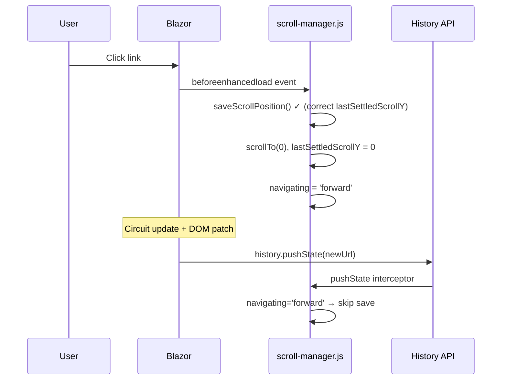
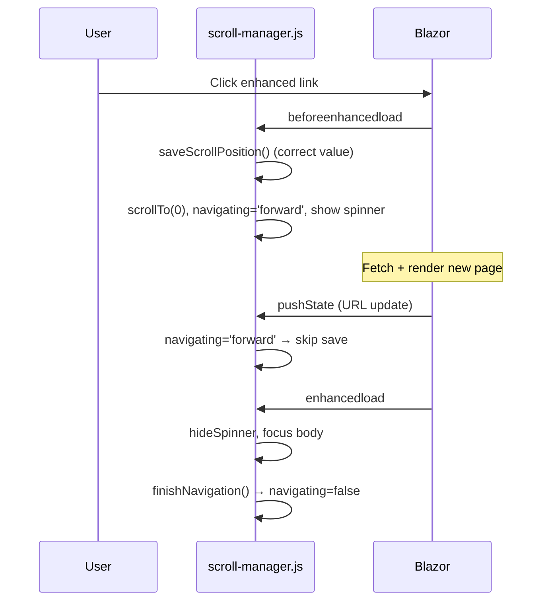
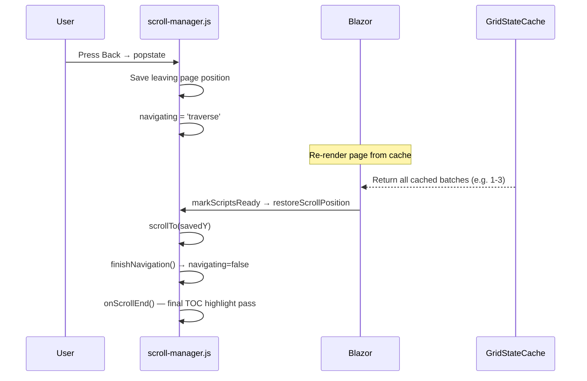
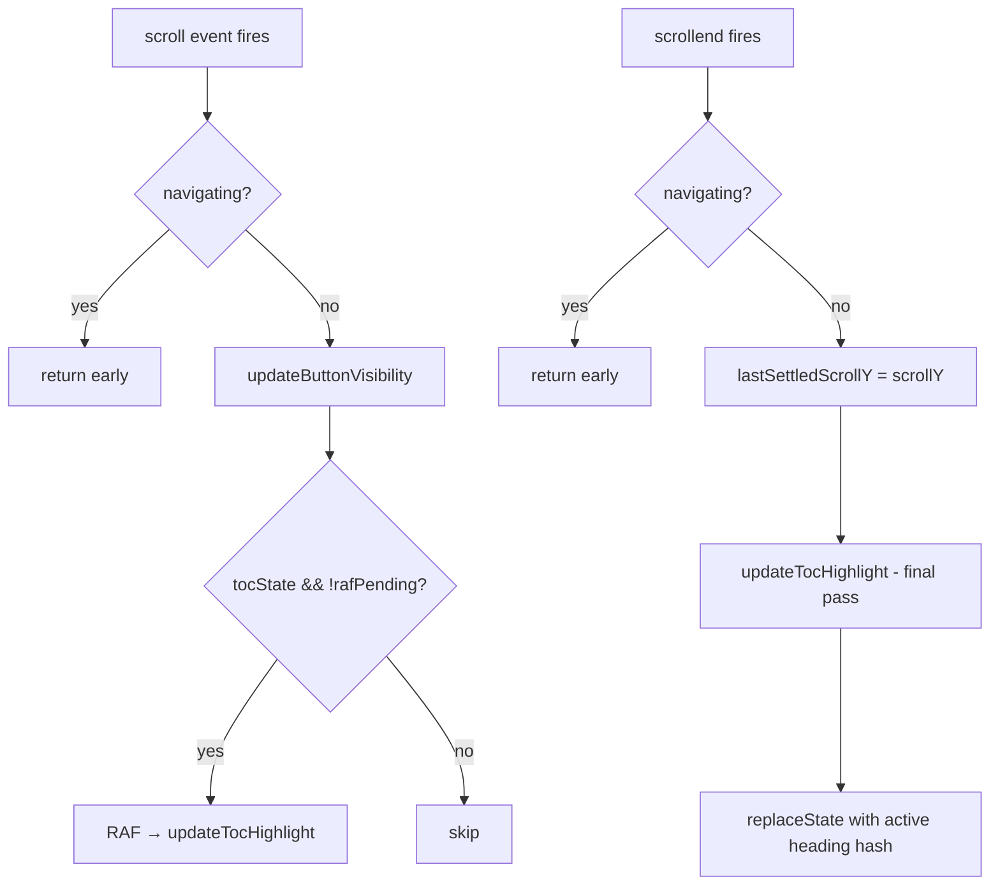

# Scroll System Architecture

This document explains the full scroll system: position save/restore, the
`navigating` lifecycle, how TOC scroll-spy ties into it,
and the known edge cases with their test coverage.

## Table of Contents

- [Components](#components)
- [The `navigating` Flag](#the-navigating-flag)
- [Scroll Position Save/Restore](#scroll-position-saverestore)
  - [Browser Native Restore Disabled](#browser-native-restore-disabled)
  - [Key Concepts](#key-concepts)
  - [Save Timing](#save-timing)
  - [The `markScriptsReady` Bridge](#the-markscriptsready-bridge)
  - [`allComponentsReady` Gate](#allcomponentsready-gate)
  - [Restore Retry Mechanism](#restore-retry-mechanism)
  - [Fixed Bug: `beforeenhancedload` Timing](#fixed-bug-beforeenhancedload-timing)
- [Forward Navigation Lifecycle](#forward-navigation-lifecycle)
- [Back/Forward Navigation Lifecycle](#backforward-navigation-lifecycle)
- [TOC Scroll-Spy: How It Ties In](#toc-scroll-spy-how-it-ties-in)
- [Why the Circuit Cache Matters](#why-the-circuit-cache-matters)
- [Known Edge Cases](#known-edge-cases)
- [Test Coverage](#test-coverage)
- [Related Documentation](#related-documentation)

## Components

| Layer | File | Responsibility |
|-------|------|----------------|
| JavaScript | `src/TechHub.Web/wwwroot/js/scroll-manager.js` | Scroll events, position save/restore, TOC spy, navigation lifecycle |
| Blazor component | `src/TechHub.Web/Components/ContentItemsGrid.razor` | Batch loading via Load More button, DOM rendering |
| Circuit cache | `src/TechHub.Web/Services/ContentGridStateCache.cs` | Preserves all loaded grid items across enhanced navigations |
| TOC component | `src/TechHub.Web/Components/SidebarToc.razor` | Renders heading links, emits `[data-toc-scroll-spy]` attribute |
| Page scripts | `src/TechHub.Web/wwwroot/js/page-scripts.js` | Calls `initTocScrollSpy()` when `[data-toc-scroll-spy]` exists |

## The `navigating` Flag

A single module-level variable gates all scroll work:

```text
navigating = false | 'forward' | 'traverse'
```

| Value | Set by | Cleared by | Meaning |
|-------|--------|------------|---------|
| `false` | `finishNavigation()` | — | Normal state: scroll events processed |
| `'forward'` | `beforeenhancedload` or `pushState` | `finishNavigation()` via `enhancedload` | User clicked a link, navigating to new page |
| `'traverse'` | `popstate` handler | `finishNavigation()` via `restoreScrollPosition` | Back/forward navigation |

While `navigating` is truthy:

- `onScroll()` → returns immediately (no button updates, no TOC — see [TOC Scroll-Spy](#toc-scroll-spy-how-it-ties-in))
- `onScrollEnd()` → returns immediately (no `lastSettledScrollY` update — prevents stale saves during programmatic scrollTo)

## Scroll Position Save/Restore

### Browser Native Restore Disabled

`history.scrollRestoration` is set to `'manual'` in the Blazor lib module
(`TechHub.Web.lib.module.js`). The browser's async restore races with our
synchronous `restoreScrollPosition()` and randomly clobbers the position with 0.
We own scroll restoration entirely.

### Key Concepts

- **`lastSettledScrollY`**: Updated only in `onScrollEnd` (scrollend event or 150ms
  debounce fallback). Represents the user's true resting position, immune to
  programmatic `scrollIntoView` shifts.
- **`savedPositions`**: Map of `pathname+search` → Y position. Hash is excluded so
  TOC `replaceState` doesn't create conflicting entries.
- **`__scrollSaveLock`**: Test mechanism that overrides `lastSettledScrollY` for one
  save cycle. Set by `ScrollToPositionAsync` in E2E tests because Playwright's
  `scrollIntoViewIfNeeded` fires scroll events before `.click()`, corrupting
  `lastSettledScrollY`.

### Save Timing

Positions are saved in exactly two places:

1. **`pushState` interceptor** (forward nav): `saveScrollPosition()` fires
   synchronously before `originalPushState.apply()` changes the URL.
2. **`popstate` handler** (back/forward): saves `lastSettledScrollY` under the
   page we're LEAVING (`lastPathname + lastSearch`).

### The `markScriptsReady` Bridge

Blazor pages call `markScriptsReady()` at the end of `OnAfterRenderAsync`. This
signals that the DOM is in its final state. `scroll-manager.js` patches this
function to also call `restoreScrollPosition()`. The lifecycle:

1. `enhancedload` fires → lib module sets `__scriptsReady = false`
2. Page renders → `OnAfterRenderAsync` → `markScriptsReady()`
3. Patched `markScriptsReady` → `hideNavSpinner()` + calls original
4. Original polls `allComponentsReady()` at 10ms intervals
5. Once ready: sets `__scriptsReady = true` + invokes `__restoreScrollPosition()`
6. `restoreScrollPosition()` fires → `scrollTo(savedY)` → `rAF(finishNavigation)`

Every page **must** call `markScriptsReady` — enforced by a convention test.

### `allComponentsReady` Gate

`markScriptsReady` doesn't restore immediately — it waits for all layout-affecting
components to finish rendering. This prevents scroll jumps caused by late DOM
changes adding height above the restored position.

`allComponentsReady()` checks three flags (only when the corresponding element exists):

| Flag | Set by | Checked when |
|------|--------|--------------|
| `window.__dateRangeSliderReady` | `date-range-slider.js` init | `#date-range-slider` exists |
| `window.__mermaidReady` | `initMermaid()` in page-scripts.js | Unprocessed `.mermaid` elements exist |

If the element isn't on the page, the flag is skipped — pages without a date-range
slider or mermaid diagrams restore immediately after `markScriptsReady` is called.

### Restore Retry Mechanism

When the page isn't tall enough for the saved Y position (content still loading or
lazy-rendering), `restoreScrollPosition` doesn't give up. It sets up:

- **ResizeObserver** on `<html>` — detects document height changes
- **MutationObserver** on `<body>` — detects DOM additions (childList + subtree)
- **150ms debounce** — coalesces rapid layout shifts into a single scroll attempt
- **30s deadline** — hard timeout to prevent infinite waiting

Once `document.scrollHeight - innerHeight >= savedY`, it scrolls and calls
`finishNavigation()`. If the deadline expires first, it scrolls anyway (best
effort). A `restoreKey` check ensures we abort if the user navigated away.

### Fixed Bug: `beforeenhancedload` Timing

Previously, `beforeenhancedload` would scroll to top (zeroing `lastSettledScrollY`)
before `pushState` saved the position — causing the save to record 0. This was
fixed by moving `saveScrollPosition()` into `beforeenhancedload` (before
`scrollTo(0)`) and having the `pushState` interceptor skip saving when
`navigating='forward'` (meaning `beforeenhancedload` already handled it).

Current (correct) event order:

```text
beforeenhancedload → saveScrollPosition() ✓ → scrollTo(0) → navigating='forward'
    ... circuit update ...
pushState → navigating='forward' → SKIP save (already done)
```



**`__scrollSaveLock`** remains as a test utility for E2E tests where Playwright's
`scrollIntoViewIfNeeded` fires scroll events that corrupt `lastSettledScrollY`
before the test's programmatic click triggers navigation.

## Forward Navigation Lifecycle



## Back/Forward Navigation Lifecycle



## TOC Scroll-Spy: How It Ties In

The TOC uses the same `navigating` flag and scroll events:



Key integration points:

- **During navigation**: TOC updates are suppressed (no stale highlights from
  intermediate scroll positions during restore).
- **`finishNavigation`** calls `onScrollEnd()` once → triggers a TOC highlight
  pass at the final restored position.
- **`pageKey` guard**: `setTocActive` only calls `replaceState` if we're still on
  the page where TOC was initialized — prevents hash from leaking to the next page
  if a late scrollend fires after navigation starts.
- **Click handling**: TOC clicks use `replaceState` (not `pushState`) so they don't
  pollute history. The `beforeenhancedload` handler has `if (navigating) return` to
  avoid resetting scroll on same-page hash navigation.

## Why the Circuit Cache Matters

Without `ContentGridStateCache`, back-navigation starts with batch 1 only. The page
is short and the user's saved scroll position may exceed the rendered page height.
The cache preserves ALL loaded items per filter-key, so the page restores to the
correct height and scroll position.

## Known Edge Cases

| Edge Case | Behavior | Covered By |
|-----------|------------|------------|
| Page not tall enough for restore | ResizeObserver + MutationObserver retry (150ms debounce, 30s deadline) | Unit: scroll retry tests |
| `beforeenhancedload` save timing | Save fires before scrollTo(0) — correct position captured | [Fixed Bug](#fixed-bug-beforeenhancedload-timing) |
| TOC replaceState during scroll | pageKey guard prevents hash leaking to new page | Unit: TOC page-key tests |
| Back-nav after Load More | Circuit cache restores all loaded items; scroll position saved and restored | E2E: `LoadMoreButtonTests.BackNavigation_AfterLoadMore_RestoresScrollPosition` |

## Test Coverage

### Unit Tests (`tests/javascript/scroll-manager.test.js`)

**Scroll position:**

- Scroll position save/restore on pushState and popstate
- `lastSettledScrollY` update only on scrollend
- Hash-only navigation does not trigger save/restore

**TOC:**

- Highlight updates on scroll (RAF-throttled)
- Final highlight pass on scrollend
- `pageKey` guard prevents cross-page replaceState
- replaceState (not pushState) for hash updates

### E2E Tests (`tests/TechHub.E2E.Tests/Web/`)

- `LoadMoreButtonTests.LoadMoreButton_WhenClicked_AppendsMoreItems` — clicking Load more appends items
- `LoadMoreButtonTests.LoadMoreButton_WhenAllContentLoaded_ShowsEndOfContent` — end-of-content appears after exhausting content
- `LoadMoreButtonTests.BackNavigation_AfterLoadMore_RestoresScrollPosition` — scroll position restored after back-nav
- `ScrollRestorationTests.BackNavigation_OnLongContentPage_RestoresScrollPosition` — isolates restore on a page without Load More

### E2E Test Helpers (`tests/TechHub.E2E.Tests/Helpers/BlazorHelpers.cs`)

- `ScrollToPositionAsync` — scroll to Y + set `__scrollSaveLock` (prevents Playwright race condition)

## Related Documentation

- [docs/javascript.md](javascript.md) — JavaScript architecture, scroll manager overview
- [src/TechHub.Web/AGENTS.md](../src/TechHub.Web/AGENTS.md) — Web project conventions
- [tests/TechHub.E2E.Tests/AGENTS.md](../tests/TechHub.E2E.Tests/AGENTS.md) — E2E patterns for Load More and scroll tests
