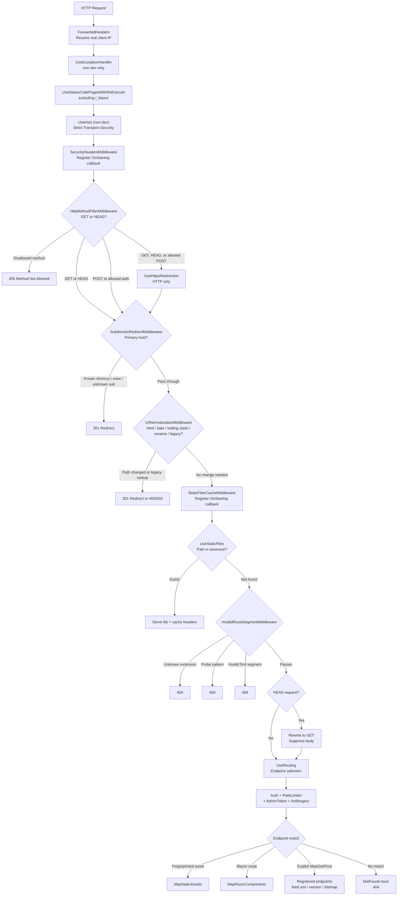

# Request Pipeline, Filtering, and Static Files

This document covers the complete HTTP request lifecycle for the Tech Hub web frontend: every middleware stage in pipeline order, how request filtering and probe suppression work, how static files are served and cached, how the telemetry filter connects to all of it, and why certain paths still appear in Application Insights.

For input validation beyond the middleware layer (API route parameters, query parameters, log sanitization), see [input-validation-and-sanitization.md](input-validation-and-sanitization.md).

## Table of Contents

- [Canonical URL Format](#canonical-url-format)
- [Components](#components)
- [Pipeline Overview](#pipeline-overview)
- [Phase 0 - Telemetry Filter](#phase-0---telemetry-filter)
- [Phase 1 - Infrastructure](#phase-1---infrastructure)
- [Phase 2 - Security and Protocol](#phase-2---security-and-protocol)
- [Phase 3 - URL Correction](#phase-3---url-correction)
  - [Subdomain Redirects](#subdomain-redirects)
  - [URL Normalization](#url-normalization)
- [Phase 4 - Static Files](#phase-4---static-files)
  - [Two-Tier Static File System](#two-tier-static-file-system)
  - [Cache Header Strategy](#cache-header-strategy)
- [Phase 5 - Request Filter](#phase-5---request-filter)
  - [File-Extension Check](#file-extension-check)
  - [Probe Detection](#probe-detection)
  - [Segment Validation](#segment-validation)
- [Phase 6 - Head to GET Rewrite](#phase-6---head-to-get-rewrite)
- [Phase 7 - Auth and Rate Limiting](#phase-7---auth-and-rate-limiting)
- [Phase 8 - Endpoint Routing](#phase-8---endpoint-routing)
- [ProbeDetector: Shared Logic](#probedetector-shared-logic)
- [How the Telemetry Filter and Middleware Relate](#how-the-telemetry-filter-and-middleware-relate)
- [Why Some Invalid Paths Appear in App Insights](#why-some-invalid-paths-appear-in-app-insights)
- [robots.txt](#robotstxt)
- [Implementation Reference](#implementation-reference)

## Canonical URL Format

The canonical URL structure for content is:

```text
/{section}/{collection}/{slug}
```

Examples:

- `/ai/videos/my-article`
- `/github-copilot/roundups/june-2026-digest`
- `/{section}/roundups/{slug}` — roundups use their owning section path

Special pages sit outside this structure: `/`, `/about`, `/admin`, `/not-found`.

## Components

| Layer | File | Responsibility |
|-------|------|----------------- |
| OTel trace filter | `src/TechHub.ServiceDefaults/Extensions.cs` | Suppresses spans before they are created |
| Web-specific trace filter | `src/TechHub.Web/Telemetry/WebTelemetryFilters.cs` | Suppresses Blazor disconnect, bot, /api probes |
| Security headers | `src/TechHub.Web/Middleware/SecurityHeadersMiddleware.cs` | Adds XSS/clickjacking headers to all responses |
| HTTP method filter | `src/TechHub.Web/Middleware/HttpMethodFilterMiddleware.cs` | Rejects disallowed HTTP methods (OPTIONS, PUT, DELETE, PATCH, etc.) with 405 |
| Subdomain redirects | `src/TechHub.Web/Middleware/SubdomainRedirectMiddleware.cs` | Normalizes hostnames, shortcuts |
| URL normalization | `src/TechHub.Web/Middleware/UrlNormalizationMiddleware.cs` | Strips .html, date prefixes, trailing slash, renames, legacy slugs |
| Static file cache | `src/TechHub.Web/Middleware/StaticFilesCacheMiddleware.cs` | Sets Cache-Control headers for all static responses |
| Request filter | `src/TechHub.Web/Middleware/InvalidRouteSegmentMiddleware.cs` | Rejects probes, unknown extensions, invalid first segments |
| Probe detector | `src/TechHub.Core/Security/ProbeDetector.cs` | Shared probe/asset logic used by both middleware and OTel filter |
| Admin token check | `src/TechHub.Web/Middleware/AdminTokenValidationMiddleware.cs` | Re-challenges authenticated users with empty MSAL cache |
| Pipeline registration | `src/TechHub.Web/Program.cs` | Registers all middleware in order |

## Pipeline Overview

Every HTTP request passes through these stages in order. A stage that produces a response (redirect, 404, static file) terminates the chain.

| # | Stage | Class / built-in | Outcome on match |
|---|-------|-----------------|-----------------|
| 0 | Telemetry filter | `ServiceDefaultsExtensions` + `WebTelemetryFilters` | No Activity span created (suppress before the fact) |
| 1a | Forwarded headers | `UseForwardedHeaders` | Sets real client IP from `X-Forwarded-For` |
| 1b | Exception handler | `UseExceptionHandler` (non-dev) | Catches unhandled exceptions, renders `/Error` |
| 1c | Status code pages | `UseStatusCodePagesWithReExecute` | Re-executes empty 4xx responses at `/not-found` so browsers get a full HTML page |
| 2a | HSTS | `UseHsts` (non-dev) | Adds `Strict-Transport-Security` header |
| 2b | Security headers | `SecurityHeadersMiddleware` | Adds CSP, X-Frame-Options, etc. via `OnStarting` |
| 2c | HTTP method filter | `HttpMethodFilterMiddleware` | **405** for OPTIONS/PUT/DELETE/PATCH/CONNECT/TRACE |
| 2d | HTTPS redirect | `UseHttpsRedirection` | **301** HTTP → HTTPS |
| 3a | Subdomain redirect | `SubdomainRedirectMiddleware` | **301** to canonical hostname |
| 3b | URL normalization | `UrlNormalizationMiddleware` | **301** (at most one), or **404/503** |
| 4a | Static file cache | `StaticFilesCacheMiddleware` | Registers `OnStarting` callback for Cache-Control |
| 4b | Static files | `UseStaticFiles` | Serves `wwwroot/` files, short-circuits |
| 5 | Request filter | `InvalidRouteSegmentMiddleware` | **404** for probes, unknown extensions, invalid segments |
| 6 | HEAD → GET rewrite | Inline lambda | Converts HEAD to GET, suppresses response body |
| 7a | Routing | `UseRouting` | Endpoint selection |
| 7b | Auth | `UseAuthentication` + `UseAuthorization` | Cookie/OIDC authentication |
| 7c | Rate limiter | `UseRateLimiter` | 429 if over limit |
| 7d | Admin token | `AdminTokenValidationMiddleware` | **OIDC challenge** when MSAL cache empty |
| 7e | Antiforgery | `UseAntiforgery` | Validates antiforgery tokens |
| 8a | Static assets | `MapStaticAssets` | Serves fingerprinted/optimized assets |
| 8b | Blazor routing | `MapRazorComponents<App>` | Renders matching Razor page |
| 8c | Explicit endpoints | `MapGet`, `MapPost`, `MapControllers` | RSS feeds, version probe, admin logout |



## Phase 0 - Telemetry Filter

The OpenTelemetry trace filter is not middleware - it runs as an `options.Filter` predicate inside `AddAspNetCoreInstrumentation`. It fires when ASP.NET Core's `DiagnosticListener` emits the `Microsoft.AspNetCore.Hosting.HttpRequestIn.Start` event, which happens at the very beginning of request processing - before any user middleware runs.

When the filter returns `false`, no `Activity` span is created for that request. Nothing is sent to Application Insights or the Aspire Dashboard. The request is processed normally by the middleware pipeline, but telemetry is silent.

The combined filter (defined in `ServiceDefaults`) checks all of:

```text
!IsHealthProbeRequest(path)                         -- /health and /alive (Container Apps probes)
&& !ProbeDetector.IsProbeRequest(path)              -- wp-admin, actuator, .env, etc.
&& ProbeDetector.IsKnownStaticAssetOrExtensionless  -- rejects unknown-extension paths
&& additionalTraceFilter(httpContext)               -- service-specific rules (Web only)
```

The Web service passes `WebTelemetryFilters.ShouldTrace` as the `additionalTraceFilter`, which additionally suppresses:

| Filter | What it catches |
|--------|----------------|
| `IsBlazorDisconnectRequest` | `/_blazor/disconnect` - expected 499/400s on page unload |
| `IsBlazorCircuitReconnectRequest` | `/_blazor?id=...` - clients reconnecting to dead circuits after container restart |
| `IsApiProbeRequest` | `/api/...` - scanners probing for a REST API on the web host |
| `IsBotRequest` | Any request with "bot" in the User-Agent |

Because `IsKnownStaticAssetOrExtensionless` returns `true` for any path with no file extension in its last segment, all extension-less paths (including legitimate section URLs like `/ai`) pass this check. Whether they are real pages or scanner garbage, a span is created and they appear in App Insights. See [Why Some Invalid Paths Appear in App Insights](#why-some-invalid-paths-appear-in-app-insights).

## Phase 1 - Infrastructure

### Forwarded Headers

`UseForwardedHeaders` trusts `X-Forwarded-For` and `X-Forwarded-Proto` from the Azure Container Apps reverse proxy. `KnownIPNetworks` and `KnownProxies` are both cleared because the proxy IPs are internal and dynamic. This must run first so that `RemoteIpAddress` reflects the real client IP before rate limiting partitions by it.

### Exception Handler

`UseExceptionHandler("/Error")` catches unhandled exceptions and renders the error page. Non-development only.

### Status Code Pages

`UseStatusCodePagesWithReExecute("/not-found")` intercepts any empty 4xx or 5xx response (no Content-Type set) and re-executes the pipeline at `/not-found`. The original status code is preserved — `NotFound.razor` explicitly sets `Response.StatusCode = 404` during SSR, so browsers receive a real 404 with an HTML body instead of the empty body that causes Chrome to display `ERR_HTTP_RESPONSE_CODE_FAILURE`.

The middleware is wrapped in `UseWhen` to exclude `/_blazor` paths:

```text
app.UseWhen(
    ctx => !ctx.Request.Path.StartsWithSegments("/_blazor"),
    branch => branch.UseStatusCodePagesWithReExecute("/not-found"))
```

Why exclude `/_blazor`: when a Blazor circuit is torn down and the browser sends `POST /_blazor/disconnect`, ASP.NET Core returns 404 (circuit gone). Re-executing that request at `/not-found` would corrupt the OTel span name (renaming it to `POST /not-found`) and make a normal circuit-teardown appear as an application error in Azure Monitor.

The 404 and 405 responses produced by this re-execution path are suppressed from the `requests/failed` metric via `WebTelemetryFilters.SuppressIfClientError` — see [telemetry.md § Suppressing Structural-Noise 4xx](telemetry.md#suppressing-structural-noise-4xx).

## Phase 2 - Security and Protocol

### HSTS

`UseHsts` adds `Strict-Transport-Security: max-age=31536000` to all HTTPS responses, telling browsers to connect only over HTTPS for the next year. Non-development only.

### Security Headers

`SecurityHeadersMiddleware` registers an `OnStarting` callback. The callback fires just before the response headers are sent, regardless of which downstream middleware generates the response. Headers added:

| Header | Value | Purpose |
|--------|-------|---------|
| `X-Content-Type-Options` | `nosniff` | Prevents MIME sniffing |
| `X-Frame-Options` | `DENY` | Prevents clickjacking |
| `Referrer-Policy` | `strict-origin-when-cross-origin` | Controls referrer |
| `Permissions-Policy` | `interest-cohort=()` | Opts out of FLoC/Topics |
| `Content-Security-Policy-Report-Only` | See below | Monitors CSP violations |

The CSP allows `'unsafe-inline'` for scripts and styles (required by Blazor Server's inline scripts and scoped CSS), Google Tag Manager/Analytics, Application Insights JS SDK, and YouTube privacy-enhanced embeds.

### HTTP Method Filter

`HttpMethodFilterMiddleware` runs immediately after `SecurityHeadersMiddleware`, before any URL processing or routing. It rejects HTTP methods that this application never needs to serve:

| Method | Allowed paths | Response |
|--------|--------------|----------|
| GET | Everywhere | Pass through |
| HEAD | Everywhere | Pass through (rewritten to GET later) |
| POST | `/_blazor/*`, `/MicrosoftIdentity/*`, `/signin-oidc`, `/admin/logout` | Pass through |
| OPTIONS, PUT, DELETE, PATCH, CONNECT, TRACE | Nowhere | **405 Method Not Allowed** |
| POST (any other path) | — | **405 Method Not Allowed** |

Why block OPTIONS: this site has no CORS policy and no cross-origin JavaScript consumers. OPTIONS is the browser's CORS preflight mechanism and is never sent by a real visitor to this site. Any OPTIONS request is a scanner or security probe.

Why POST is path-specific: every admin page uses `@rendermode InteractiveServer`. User actions (form submissions, button clicks) travel over Blazor's existing SignalR circuit as WebSocket messages — not as HTTP POSTs. The only real HTTP POST endpoints are the Blazor SignalR hub (`/_blazor/*`), Microsoft Identity OIDC flows (`/MicrosoftIdentity/*`, `/signin-oidc`), and the admin logout button (`/admin/logout`).

### HTTPS Redirect

`UseHttpsRedirection` runs immediately after the method filter, before any URL processing. A request that arrives over plain HTTP is redirected to the HTTPS equivalent before subdomain normalization or URL normalization runs.

This placement avoids doing URL work (including potential legacy slug API calls in `UrlNormalizationMiddleware`) on HTTP requests that will be redirected anyway. It also avoids the wasteful case of redirecting a request that would have been rejected by the method filter.

In production, Azure Container Apps terminates TLS at the edge and forwards requests with `X-Forwarded-Proto: https`. `UseForwardedHeaders` (which runs earlier) sets `IsHttps = true` from that header, so `UseHttpsRedirection` is a no-op in production. It only fires in development or when the app is accessed directly.

## Phase 3 - URL Correction

### Subdomain Redirects

`SubdomainRedirectMiddleware` resolves hostname variants before any content logic runs. Configured via `SubdomainShortcuts`, `PrimaryHosts`, and `PassthroughSubdomains` in `appsettings.json`.

| Hostname pattern | Outcome |
|---|---|
| Primary host (`tech.hub.ms`, `tech.xebia.ms`) | Pass through |
| No dots (`localhost`) | Pass through |
| Passthrough subdomain (`staging-tech.hub.ms`) | Pass through |
| `www.<primaryHost>` | **301 → `https://<primaryHost>/path`** (path preserved) |
| Known shortcut (`ghc.xebia.ms`) | **301 → `https://<primaryHost>/<section>/path`** |
| Unknown subdomain on known domain | **301 → `https://<primaryHost>/`** (path stripped) |
| Completely unknown domain | Pass through |

All host comparisons are case-insensitive. Redirect URLs always use lowercase. The path is preserved for `www` redirects and shortcut redirects; it is stripped for unknown subdomains because the path would produce another 404 on the primary host.

### URL Normalization

`UrlNormalizationMiddleware` handles all URL cleanup and legacy resolution in a single pass, issuing **at most one 301 per request**. The normalizations run in this order:

**1. Trailing slash** - stripped before all other logic so a combined normalization + trailing-slash produces one redirect, not two.

**2. Legacy RSS feed redirect** - `.xml` paths are matched before segment normalization. `/feed.xml` → `/all/feed.xml`; `/{sectionName}.xml` → `/{sectionName}/feed.xml` (known sections only). Unknown `.xml` paths fall through and are later rejected as probes.

**3. Segment normalization** - applied to every segment in the path:

- Strip `.html` suffix (case-insensitive)
- Strip `YYYY-MM-DD-` date prefix

**4. Section rename** - after normalization, the first segment is checked against `_renamedSections`. Current renames:

| Old name | New name |
|---|---|
| `coding` | `dotnet` |

This ensures `/coding/2025-01-01-slug.html` → `/dotnet/slug` in one redirect.

**5. Multi-segment validation** - validates the normalized path against `SectionCache`:

- Framework paths (`_blazor`, `_framework`, `_content`) always pass
- `MicrosoftIdentity` paths always pass
- Known non-section pages (`about`, `not-found`, `error`, `admin`, `health`, `alive`, `version`, `signin-oidc`) always pass
- Virtual sections (`all`) validate the second segment against known collections or dedicated sub-pages (`/all/authors`)
- Paths whose last segment has a file extension pass through (static assets, feed URLs)
- Real sections: the second segment must be a known collection or the virtual `all` keyword
- Anything else: **404**

A two-segment path that fails validation is given a second chance via a legacy slug lookup only when `hadHtmlExtension` is true (see step 6).

**6. Legacy slug lookup** - only triggered when the original request URL contained `.html` in at least one segment (`hadHtmlExtension = true`). This is the only format used by the old website: `/{slug}.html`, `/YYYY-MM-DD-{slug}.html`, `/{section}/{slug}.html`.

Bare slugs with no `.html` (e.g. `/my-article`, `/ai/bare-slug`) are hard-404'd immediately without any API call. They are not legacy URLs and never were — treating them as lookup candidates only adds API noise from scanner traffic.

For qualifying paths the middleware calls `GET /api/legacy-redirect?slug={slug}&section={hint}`. The optional `?section=` hint is remapped through the section rename dictionary before the API call: `?section=coding` becomes hint `dotnet`. If the API finds a match, a **301** is issued directly to the canonical URL. If there is no match, the middleware returns **404**. On a transient API failure it returns **503** with `Cache-Control: no-store` (or redirects to the normalized path first if the path was already cleaned, so the browser retries the canonical form once the API recovers).

| Original URL | Has `.html` | Action |
|---|---|---|
| `/slug.html` | ✓ | API lookup, optional `?section=` hint |
| `/slug.html?section=ai` | ✓ | API lookup with hint `ai` |
| `/slug.html?section=coding` | ✓ | API lookup with hint `dotnet` (remapped) |
| `/2024-01-15-slug.html` | ✓ | API lookup (date + .html both stripped before call) |
| `/ai/2024-01-15-slug.html` | ✓ | API lookup with section hint `ai` |
| `/bla` | ✗ | Hard 404, no API call |
| `/2024-01-15-bla` | ✗ | Hard 404, no API call |
| `/ai/bare-slug` | ✗ | Hard 404, no API call |

Case is not normalized in the middleware. The infrastructure layer lowercases before DB queries, so `/My-Article` and `/my-article` resolve identically without an extra redirect.

## Phase 4 - Static Files

### Two-Tier Static File System

Static files are served by two different mechanisms that complement each other:

**`UseStaticFiles`** serves files from `wwwroot/` as-is. No fingerprinting - files are served at their original names. A `.jxl` content type mapping is added manually (`image/jxl`) because it is not in the default provider. This middleware short-circuits the pipeline when it finds a matching file.

**`MapStaticAssets`** (registered later, after `InvalidRouteSegmentMiddleware`) serves optimized static assets with fingerprinting, compression (Brotli/gzip), and ETags. Fingerprinted filenames contain a content hash (e.g., `blazor.web.2i0r6wwb69.js`), so when the content changes the URL changes and the old file is never served from cache again.

The ordering matters: `UseStaticFiles` runs before the request filter, `MapStaticAssets` runs after it. Fingerprinted assets that are not in `wwwroot/` under their fingerprinted name pass through `UseStaticFiles`, then go through `InvalidRouteSegmentMiddleware` (where they pass because their extension is in the known-asset allowlist), and are finally served by `MapStaticAssets`.

### Cache Header Strategy

`StaticFilesCacheMiddleware` is placed before `UseStaticFiles` in the pipeline, but it does not serve files itself. Instead, it registers an `OnStarting` callback that fires just before any response's headers are sent. Because `OnStarting` callbacks run in LIFO order, a callback registered early runs after callbacks registered later - this gives `StaticFilesCacheMiddleware` the final word over both `UseStaticFiles` and `MapStaticAssets`.

The callback only runs for `200 OK` responses with a file extension in the path:

| Asset type | Detection | `Cache-Control` |
|------------|-----------|-----------------|
| Fingerprinted (any type) | Middle filename segment is 10+ lowercase alphanumeric chars | `public, max-age=31536000, immutable` |
| Images and fonts | `.jpg`, `.jpeg`, `.png`, `.gif`, `.webp`, `.jxl`, `.svg`, `.ico`, `.woff`, `.woff2`, etc. | `public, max-age=31536000, immutable` |
| CSS, JS, HTML, JSON, XML | Non-fingerprinted | `public, max-age=3600, must-revalidate` |
| All other types | - | No change (MapStaticAssets defaults) |

The `Vary` header is removed for immutable assets to prevent CDN and proxy variability from limiting cache effectiveness.

## Phase 5 - Request Filter

`InvalidRouteSegmentMiddleware` runs immediately after static files, before auth, routing, or endpoint selection. It short-circuits two categories of bad requests.

The middleware runs after `UseStaticFiles`, so any path that `UseStaticFiles` served has already been short-circuited. The middleware handles paths that reached it despite having a file extension (e.g., requests for files that don't exist in `wwwroot/`).

### File-Extension Check

Every path whose last segment contains a dot is checked against `ProbeDetector.IsKnownStaticAssetPath`. This is an allowlist, not a blocklist.

```text
/js/app.abc123.js        → starts with /js/, extension .js       → PASS
/css/main.r2lq.css       → starts with /css/, extension .css     → PASS
/images/banner.webp      → starts with /images/, extension .webp → PASS
/_framework/blazor.js    → starts with /_framework/, extension .js → PASS
/favicon.ico             → exact root file match                  → PASS
/all/feed.xml            → ends with /feed.xml                    → PASS
/sitemap.xml             → exact root file match                  → PASS

/devops/js/nav.abc.js    → no matching prefix                     → 404
/wp-config.php           → no matching prefix                     → 404
/.env.backup             → no matching prefix                     → 404
/xmlrpc.php              → no matching prefix                     → 404
```

Known static directories and their allowed extensions:

| Directory prefix | Allowed extensions |
|------------------|--------------------|
| `/js/` | `.js` |
| `/css/` | `.css` |
| `/_framework/` | `.js`, `.wasm`, `.gz`, `.br` |
| `/TechHub.Web.` | `.css`, `.js` |
| `/Components/` | `.js` |
| `/_content/` | `.js`, `.css`, `.png`, `.jpg`, `.svg`, `.webp`, `.woff`, `.woff2` |
| `/images/` | `.jpg`, `.jxl`, `.png`, `.svg`, `.webp` |

Root-level exact matches: `/favicon.ico`, `/robots.txt`, `/sitemap.xml`.

Any path ending in `/feed.xml` is allowed (covers `/all/feed.xml` and `/{section}/feed.xml`).

### Probe Detection

Extension-less paths are checked against `ProbeDetector.IsProbeRequest` (the same function used by the telemetry filter). It applies a single compiled regex pass over the path:

```text
/(wp-admin|wp-content|wp-includes|wp-login|xmlrpc|phpmyadmin|cgi-bin|\.well-known
  |actuator|app|login|ip|assets|static|media|dist|vendor|backend|config)(/|$)
```

Legitimate paths that happen to match (`/admin/login`) are pre-approved via an allowlist checked before the regex. All other matches → **404**.

Additionally: any path ending in `/robots.txt` that is not exactly `/robots.txt` is treated as a probe (real crawlers never request `/all/robots.txt`).

### Segment Validation

For extension-less paths that pass probe detection, the middleware extracts the first path segment (everything between the first and second slash). Framework and OIDC paths bypass validation:

- Segment starts with `_` (e.g., `/_blazor`, `/_framework`, `/_content`) → pass through
- Segment is `MicrosoftIdentity` → pass through

All remaining segments are validated against `^[a-zA-Z][a-zA-Z-]*$`: letters and hyphens only, must start with a letter. This matches every real section name, every known page (`about`, `not-found`, `admin`), and the virtual `all` section.

Anything that fails - a segment starting with a digit, containing a dot, percent-encoded, or with underscores - receives an immediate **404**.

## Phase 6 - Head to GET Rewrite

`MapRazorComponents` and `MapGet` only register GET endpoints. ASP.NET Core's routing would return 405 for HEAD requests because the HTTP method does not match. The fix: an inline middleware rewrites `HEAD` to `GET`, then calls `_next`. The response body is suppressed by replacing `context.Response.Body` with `Stream.Null`. An explicit `UseRouting()` call is placed after this rewrite so endpoint selection sees `GET` rather than `HEAD`.

Without the explicit `UseRouting()`, WebApplication auto-inserts it before all user middleware, causing it to see the original HEAD method and return 405.

## Phase 7 - Auth and Rate Limiting

These run in order after `UseRouting` (so endpoint metadata is available for authorization policies):

**`UseAuthentication`** validates the cookie or bearer token.

**`UseAuthorization`** enforces `[Authorize]` attributes and policies.

**`UseRateLimiter`** applies rate limiting. The `web-general` policy applies to all Blazor routes via `MapRazorComponents(...).RequireRateLimiting("web-general")`. RSS endpoints use `web-rss`. Rate limiting is disabled in `IntegrationTest` to avoid throttling test suites.

**`AdminTokenValidationMiddleware`** targets `/admin/*` paths (excluding `/admin/login` and `/admin/logout`) for authenticated users. It attempts to acquire a token from the MSAL cache via `ITokenAcquisition`. If the cache is empty (server restart since login), it issues an OIDC challenge to re-authenticate before Blazor starts rendering - preventing circuit crashes.

**`UseAntiforgery`** validates antiforgery tokens for state-changing operations.

## Phase 8 - Endpoint Routing

After the auth and rate-limiting phase, requests reach the registered endpoints:

**`MapStaticAssets`** - serves fingerprinted assets from the optimized asset manifest.

**`MapRazorComponents<App>()`** - Blazor routing. The Blazor router matches against registered `@page` directives:

| Path pattern | Component |
|---|---|
| `/` | `Home.razor` |
| `/{section}` or `/{section}/{collection}` | `SectionCollection.razor` |
| `/{section}/{collection}/{slug}` | `ContentItem.razor` |
| `/about` | `About.razor` |
| `/not-found` | `NotFound.razor` |
| `/admin` | Admin pages |
| `/github-copilot/vscode-updates` | `GitHubCopilotVSCodeUpdates.razor` |
| No match | Fallback → `NotFound.razor` (HTTP 404) |

When `SectionCollection.razor` or `ContentItem.razor` render, they also validate section/collection existence via `SectionCache` in `OnInitializedAsync` and redirect to `/not-found` for invalid combinations.

**Explicit `MapGet` endpoints**: `/all/feed.xml`, `/{section}/feed.xml`, `/{section}/roundups/feed.xml` (RSS proxy to API), `/sitemap.xml` (sitemap proxy), `/version` (deployment probe), `/admin/logout` (`MapPost`).

**`MapControllers`** - the MicrosoftIdentity OIDC controller (`/MicrosoftIdentity/Account/SignIn`, `/SignOut`) registered via `AddMicrosoftIdentityUI`.

## ProbeDetector: Shared Logic

`ProbeDetector` (in `TechHub.Core`) is the single source of truth for probe and asset path detection. It is used by both the OTel trace filter and `InvalidRouteSegmentMiddleware`, ensuring that any path suppressed from telemetry is also rejected by the middleware and vice versa.

```text
ProbeDetector
├── IsProbeRequest(path)              -- used by: OTel filter + InvalidRouteSegmentMiddleware
│     ├── check _allowedPaths (e.g. /admin/login)
│     ├── ProbeSegmentPattern regex (wp-admin, actuator, etc.)
│     └── non-root /robots.txt check
├── IsKnownStaticAssetPath(path)      -- used by: InvalidRouteSegmentMiddleware
│     ├── _knownStaticDirectories (prefix + extension lookup, span-based, zero allocation)
│     ├── _knownRootFiles (exact match)
│     └── /feed.xml suffix check
└── IsKnownStaticAssetOrExtensionless -- used by: OTel filter
      ├── no dot in last segment → true (extension-less path, could be Blazor route)
      └── else → IsKnownStaticAssetPath
```

The span-based alternate lookup for extensions (`HashSet<string>.AlternateLookup<ReadOnlySpan<char>>`) avoids string allocation for each request on the hot path.

## How the Telemetry Filter and Middleware Relate

The telemetry filter and `InvalidRouteSegmentMiddleware` share `ProbeDetector` but have different scopes:

| Concern | Telemetry filter | InvalidRouteSegmentMiddleware |
|---------|-----------------|-------------------------------|
| When it runs | Activity creation (before all middleware) | After static files, before auth |
| What it does | Suppresses span creation | Returns 404 |
| Health probes | Suppressed | Not filtered (pass through to Aspire endpoints) |
| Probe paths | Suppressed via `IsProbeRequest` | 404 via `IsProbeRequest` |
| Unknown file extensions | Suppressed via `IsKnownStaticAssetOrExtensionless` | 404 via `IsKnownStaticAssetPath` |
| Extension-less paths | Always traced (could be valid Blazor route) | Validated by segment regex |
| Bot requests | Suppressed (`IsBotRequest` in `WebTelemetryFilters`) | Not filtered (pass to Blazor) |
| `/api/...` on web host | Suppressed (`IsApiProbeRequest`) | Not filtered |

The telemetry filter is intentionally more permissive for extension-less paths than the middleware is for segments. The filter cannot know the full route table, so it traces all extension-less paths. The middleware validates the first segment structurally, but a first segment that matches `[a-zA-Z][a-zA-Z-]*` passes even if no such section exists.

## Why Some Invalid Paths Appear in App Insights

A request to `/bla` (or any other short alphabetic word that is not a real section) goes through the entire pipeline:

1. Not a health probe, not a probe pattern, no file extension → telemetry filter passes it. A span is created.
2. `HttpMethodFilterMiddleware`: GET or HEAD → passes.
3. Subdomain, normalization: `bla` has no `.html` → `hadHtmlExtension = false` → no legacy API call, continues.
4. `UseStaticFiles`: no file found, passes.
5. `InvalidRouteSegmentMiddleware`: `bla` matches `^[a-zA-Z][a-zA-Z-]*$` → passes.
6. Blazor routing: no `@page "/bla"` component exists → fallback to `NotFound.razor` → HTTP 404.
7. The span is closed with a 404 status and sent to App Insights.

The filter cannot distinguish `/bla` from `/ai` or `/dotnet` at Activity-start time — all three are extension-less alphabetic first segments. The filter's job is to suppress obvious probe traffic; unknown-section paths look structurally identical to valid section URLs.

Compared to before the `hadHtmlExtension` gate was introduced: the pipeline now returns 404 for `/bla` without any external API call. The App Insights span is still created (the telemetry filter runs before middleware and cannot know whether `bla` is a real section), but the request is cheap — a single in-memory check, no network hop.

The practical consequence: any extension-less path whose first segment matches `^[a-zA-Z][a-zA-Z-]*$` and does not hit the probe regex will be traced, pass the middleware, reach Blazor, and appear in App Insights as a 404 if no route matches. To reduce noise in App Insights, filter on `resultCode = 404` and exclude known non-section paths in your queries.

## robots.txt

`src/TechHub.Web/wwwroot/robots.txt` disallows crawlers from paths with no indexable content:

| Disallowed path | Reason |
|---|---|
| `/_blazor` | SignalR negotiation traffic |
| `/_framework` | .NET framework assets |
| `/api/` | Not served by the web host |
| `/swagger/` | API documentation UI |
| `/health`, `/alive` | Health check endpoints |
| `/not-found` | 404 error page |
| `/Error` | ASP.NET error handler page |
| `/admin` | Admin section |

The file also points crawlers to `https://tech.hub.ms/sitemap.xml`.

## Implementation Reference

| Component | File |
|---|---|
| Pipeline registration | [src/TechHub.Web/Program.cs](../src/TechHub.Web/Program.cs) |
| HTTP method filter middleware | [src/TechHub.Web/Middleware/HttpMethodFilterMiddleware.cs](../src/TechHub.Web/Middleware/HttpMethodFilterMiddleware.cs) |
| Subdomain redirect middleware | [src/TechHub.Web/Middleware/SubdomainRedirectMiddleware.cs](../src/TechHub.Web/Middleware/SubdomainRedirectMiddleware.cs) |
| URL normalization middleware | [src/TechHub.Web/Middleware/UrlNormalizationMiddleware.cs](../src/TechHub.Web/Middleware/UrlNormalizationMiddleware.cs) |
| Invalid segment filter | [src/TechHub.Web/Middleware/InvalidRouteSegmentMiddleware.cs](../src/TechHub.Web/Middleware/InvalidRouteSegmentMiddleware.cs) |
| Static file cache middleware | [src/TechHub.Web/Middleware/StaticFilesCacheMiddleware.cs](../src/TechHub.Web/Middleware/StaticFilesCacheMiddleware.cs) |
| Security headers middleware | [src/TechHub.Web/Middleware/SecurityHeadersMiddleware.cs](../src/TechHub.Web/Middleware/SecurityHeadersMiddleware.cs) |
| Admin token validation | [src/TechHub.Web/Middleware/AdminTokenValidationMiddleware.cs](../src/TechHub.Web/Middleware/AdminTokenValidationMiddleware.cs) |
| Probe detector (shared) | [src/TechHub.Core/Security/ProbeDetector.cs](../src/TechHub.Core/Security/ProbeDetector.cs) |
| Route parameter validator | [src/TechHub.Core/Validation/RouteParameterValidator.cs](../src/TechHub.Core/Validation/RouteParameterValidator.cs) |
| OTel trace filter | [src/TechHub.ServiceDefaults/Extensions.cs](../src/TechHub.ServiceDefaults/Extensions.cs) |
| Web-specific telemetry filters | [src/TechHub.Web/Telemetry/WebTelemetryFilters.cs](../src/TechHub.Web/Telemetry/WebTelemetryFilters.cs) |
| Legacy redirect API endpoint | [src/TechHub.Api/Endpoints/ContentEndpoints.cs](../src/TechHub.Api/Endpoints/ContentEndpoints.cs) |
| `robots.txt` | [src/TechHub.Web/wwwroot/robots.txt](../src/TechHub.Web/wwwroot/robots.txt) |
| Input validation (API + Blazor layers) | [input-validation-and-sanitization.md](input-validation-and-sanitization.md) |
| Browser caching details | [caching.md](caching.md) |
