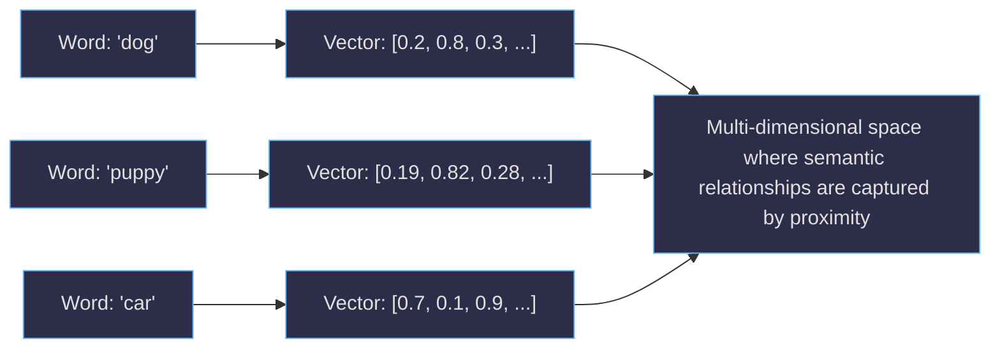
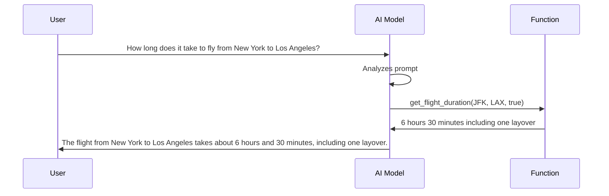
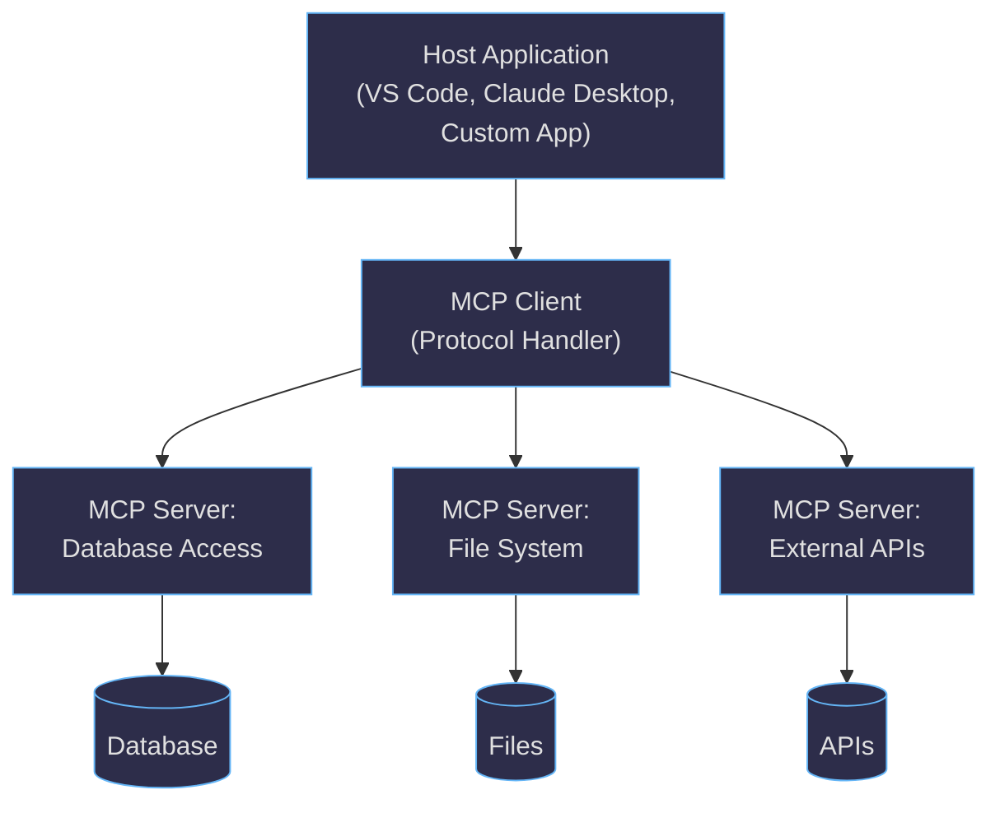
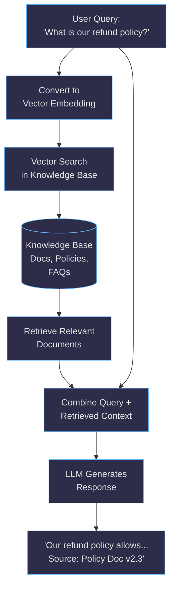
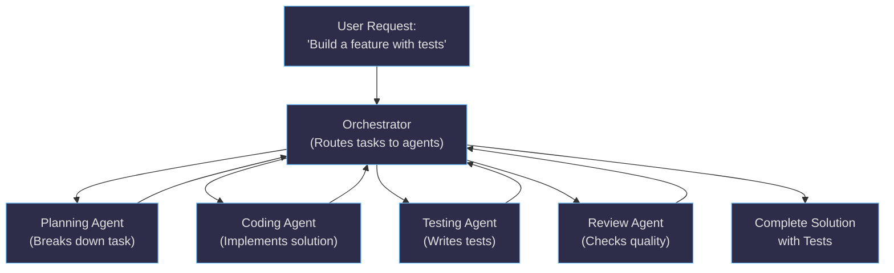
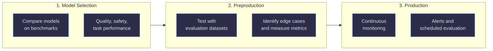

This page focuses on how GenAI models work internally: understanding embeddings and vectors, exploring advanced techniques like RAG and function calling, and building agentic systems that go beyond simple prompts.

Related pages:

- [GenAI Basics](/ai/genai-basics.html)
- [GenAI Applied](/ai/genai-applied.html)

## Table of Contents

1. [Vectors and embeddings: How AI understands meaning](#vectors-and-embeddings-how-ai-understands-meaning)
2. [From embeddings to responses: The inference process](#from-embeddings-to-responses-the-inference-process)
3. [Neural networks and transformers](#neural-networks-and-transformers)
4. [Attention mechanism](#attention-mechanism)
5. [Context windows and model parameters](#context-windows-and-model-parameters)
6. [Fine-tuning a model](#fine-tuning-a-model)
7. [Function calling](#function-calling)
8. [Model Context Protocol (MCP)](#model-context-protocol-mcp)
9. [Retrieval Augmented Generation (RAG)](#retrieval-augmented-generation-rag)
10. [Agents and agentic AI](#agents-and-agentic-ai)
11. [Multi-agent solutions](#multi-agent-solutions)
12. [Observability: Monitoring and evaluating AI applications](#observability-monitoring-and-evaluating-ai-applications)
13. [Scaling AI implementations](#scaling-ai-implementations)

## Vectors and embeddings: How AI understands meaning

Everything an AI processes—words, images, concepts—gets converted into **vectors**, which are simply lists of numbers. Think of a vector as a precise coordinate in multi-dimensional space that captures the essence of what something means.

**Embeddings** are sophisticated vectors that capture semantic meaning. When an AI learns that "dog" and "puppy" are related, it places their embeddings close together in this mathematical space. Similarly, "king" minus "man" plus "woman" might land near "queen"—the model has learned relationships between concepts through the geometric arrangement of their embeddings.

This mathematical representation allows AI models to understand that "vehicle" relates to both "car" and "bicycle," even if those specific connections weren't explicitly taught. The model discovers these relationships by observing patterns in how words appear together across millions of examples.



## From embeddings to responses: The inference process

Inference is what happens when you send a prompt to an AI model and receive a response. The model converts your words into embeddings, processes those mathematical representations through its neural network, and converts the results back into human-readable text.

During inference, the model doesn't "think" the way humans do. Instead, it performs billions of mathematical calculations to predict the most likely next word, then the word after that, building responses token by token based on the patterns it learned during training.

## Neural networks and transformers

Now that we understand how AI models represent and process information, we can explore the sophisticated mechanisms that make modern AI so powerful.

### The foundation of learning

A neural network mimics how biological brains process information through interconnected nodes. Each connection has a *weight*—a number that determines how much influence one piece of information has on another. During training, the model adjusts billions of these weights to improve its predictions.

### Transformers: A revolutionary architecture

Modern language models use transformers, a revolutionary architecture that changed how AI understands language. Unlike earlier approaches that processed text sequentially (word by word), transformers can examine entire passages simultaneously and understand relationships between any words, regardless of how far apart they appear.

## Attention mechanism

The breakthrough innovation in transformers is the attention mechanism. When generating each word, the model can "attend to" or focus on the most relevant parts of the input, just as you might reread key phrases when writing a response to a complex question.

For example, when translating "The cat that was sleeping on the mat was orange," the attention mechanism helps the model understand that "orange" describes "cat," not "mat," even though other words appear between them.

## Context windows and model parameters

These core concepts determine what a model can do and how it behaves. Understanding them helps you choose the right model and configuration for your needs.

### Parameters and model capability

The parameters in a model (the adjustable weights we mentioned) directly impact capability. GPT-3 has 175 billion parameters, while some newer models have over a trillion. More parameters generally mean better understanding of nuanced language patterns, though they also require more computational resources.

### Context windows

Context windows determine how much information a model can consider at once. Larger context windows allow models to maintain coherence across longer conversations and documents, but they also increase computational costs and processing time.

### Training data and knowledge cutoff

The training data (billions of web pages, books, and articles) shapes what the model knows. The *cut-off date* represents the latest information in this training data, which is why models can't discuss events that happened after their training completed.

### Practical implications: Balancing trade-offs

Every advanced feature involves trade-offs. Larger context windows enable more sophisticated reasoning but increase latency and costs. Higher-parameter models provide better quality but require more computational resources. Understanding these trade-offs helps you choose the right model configuration for your specific needs.

When designing applications, consider how *vocabulary size* (the tokens a model understands), *temperature settings* (creativity vs. consistency), and *seed values* (reproducibility) align with your goals for latency, accuracy, cost, and reliability.

For a comprehensive deep dive into how these concepts work together, [Andrej Karpathy's tutorial on building ChatGPT from scratch](https://www.youtube.com/watch?v=kCc8FmEb1nY) provides an excellent technical foundation.

<div class="more-info">
  <div class="more-info__header">📚 More information</div>
  <ul>
    <li><a href="https://techcommunity.microsoft.com/blog/educator-developer-blog/microsoft-releases-dion-a-new-scalable-optimizer-for-training-ai-models/4500124">Microsoft Releases Dion: A New Scalable Optimizer for Training AI Models</a></li>
    <li><a href="https://techcommunity.microsoft.com/t5/azure-high-performance-computing/optimizing-large-scale-ai-performance-with-pretraining/ba-p/4445273">Optimizing Large-Scale AI Performance with Pretraining Validation on a Single Azure ND GB200 v6</a></li>
    <li><a href="https://techcommunity.microsoft.com/blog/educator-developer-blog/benchmarking-llama-3-1-8b-ai-inference-on-azure-nd-h100-v5-with-vllm/4440725">Benchmarking Llama 3.1 8B AI Inference on Azure ND-H100-v5 with vLLM</a></li>
  </ul>
</div>

## Fine-tuning a model

Fine-tuning involves adjusting model behavior and output to better match your specific needs. While full model retraining requires significant resources, you can influence model behavior through several techniques:

### Grounding

Grounding provides the AI with specific, factual information to base its responses on. Instead of relying on the model's training data, you supply current, accurate information within your prompt. For example, when asking about company policies, include the actual policy text in your prompt rather than assuming the model knows current details.

### Temperature

Temperature controls how creative or predictable the AI's responses are:

- **Low temperature (0.0-0.3)**: More focused and consistent responses, good for factual tasks
- **Medium temperature (0.4-0.7)**: Balanced creativity and consistency, suitable for most general tasks
- **High temperature (0.8-1.0)**: More creative and varied responses, useful for brainstorming or creative writing

### Top P (nucleus sampling)

Top P determines how many alternative words the model considers when generating each token:

- **Low Top P (0.1-0.5)**: More focused responses using only the most likely word choices
- **High Top P (0.8-1.0)**: More diverse responses considering a wider range of possible words

These settings work together - you might use low temperature and low Top P for consistent, factual responses, or high temperature and high Top P for creative brainstorming sessions.

<div class="more-info">
  <div class="more-info__header">📚 More information</div>
  <ul>
    <li><a href="https://devblogs.microsoft.com/azure-ai/enhancing-conversational-agents-with-azure-ai-language-clu-and-custom-question-answering/">Enhancing Conversational Agents with Azure AI Language: CLU and Custom Question Answering</a></li>
    <li><a href="https://techcommunity.microsoft.com/blog/azure-ai-services-blog/what%E2%80%99s-new-in-azure-ai-foundry-finetuning-july-2025/4438850">What's New in Microsoft Foundry Fine-tuning - July 2025</a></li>
    <li><a href="https://www.microsoft.com/en-us/ai/open-source-ai-models">OpenAI's Open-Source Model: gpt-oss on Microsoft Foundry and Windows AI Foundry</a></li>
  </ul>
</div>

## Function calling

Function calling allows AI models to use external tools and services during their responses. Instead of only generating text, the model can call predefined functions to perform specific actions like checking the weather, calculating mathematical expressions, or retrieving current information from databases.

### How it works

1. You define functions with clear descriptions of what they do and what parameters they need
2. The AI model analyzes your prompt and determines if any functions would help answer your question
3. The model calls the appropriate function with the right parameters
4. The function returns results, which the model incorporates into its response



Example function definition:

```text
Function: get_flight_duration
Description: Calculate flight duration between two airports
Parameters:
  - departure_airport: IATA airport code (e.g., "JFK", "LAX")
  - arrival_airport: IATA airport code (e.g., "JFK", "LAX")
  - include_layovers: Boolean, whether to include connection time

Example usage:
User: "How long does it take to fly from New York to Los Angeles?"
Model: Calls get_flight_duration("JFK", "LAX", true)
Function returns: "6 hours 30 minutes including one layover"
```

### How the model matches functions to prompts

Models use the function descriptions and parameter details to understand when a function is relevant. They look for keywords, context clues, and the type of information being requested. The better your function descriptions, the more accurately the model will know when and how to use them.

### Benefits

- Access to real-time information
- Ability to perform precise calculations
- Integration with external systems and databases
- More accurate and up-to-date responses

<div class="more-info">
  <div class="more-info__header">📚 More information</div>
  <ul>
    <li><a href="https://www.youtube.com/watch?v=iYHh5n-6ez4">Connecting to a Local MCP Server Using Microsoft.Extensions.AI</a></li>
    <li><a href="https://www.youtube.com/watch?v=W56H9W7x-ao">Model Context Protocol Development Best Practices</a></li>
    <li><a href="https://techcommunity.microsoft.com/t5/educator-developer-blog/building-ai-agents-with-ease-function-calling-in-vs-code-ai/ba-p/4442637">Building AI Agents with Ease: Function Calling in VS Code AI Toolkit</a></li>
    <li><a href="https://devblogs.microsoft.com/foundry/unlocking-gpt-5s-freeform-tool-calling-a-new-era-of-seamless-integration/">Unlocking GPT-5's Freeform Tool Calling in Microsoft Foundry</a></li>
    <li><a href="https://techcommunity.microsoft.com/t5/ai-azure-ai-services-blog/general-availability-of-the-responses-api-in-azure-ai-foundry/ba-p/4234701">General Availability of the Responses API in Microsoft Foundry</a></li>
    <li><a href="https://www.youtube.com/watch?v=AKjW94vQZkc">Let's Learn Model Context Protocol with JavaScript and TypeScript</a></li>
  </ul>
</div>

## Model Context Protocol (MCP)

Model Context Protocol is an open standard that enables AI models to securely connect to external data sources and tools. It creates a standardized way for AI models to access external resources, making it easier to build AI applications that can interact with real-world systems.

### What problem does it solve?

MCP addresses two key challenges:

**Integration fragmentation**: Before MCP, each AI application had to build custom integrations for every service they wanted to connect to. MCP provides a common protocol, so a single MCP server can work with any compatible AI host.

**Knowledge cut-off limitations**: AI models are trained on data up to a specific date and can't access information beyond that point. MCP servers can provide real-time access to current data—stock prices, weather, documentation, database records—allowing models to give accurate, up-to-date responses without retraining. This complements RAG approaches by standardizing how models connect to live data sources.

### Key components

- **Host**: The application that contains the AI model (like your IDE, chat application, or development environment)
- **Client**: The component that communicates with MCP servers on behalf of the AI model
- **Server**: The service that provides access to external resources like databases, APIs, or file systems



### How does it relate to OpenAI function calling?

MCP and OpenAI function calling serve similar purposes but work at different levels:

- **Function calling** is a feature within specific AI models that allows them to call predefined functions
- **MCP** is a protocol that standardizes how AI applications connect to external services, which can then expose functions to the AI

Think of function calling as the language AI models use to request external actions, while MCP is the standardized postal service that delivers those requests to the right destinations.

### Security considerations

MCP is a protocol, not a deployment model. The security properties you get depend on the transport you use (for example, local stdio vs HTTP) and how you deploy the server.

- Authorization is optional in MCP. Some servers expose tools without any built-in auth, while others can be deployed behind an identity-aware gateway.
- For HTTP-based transports, the MCP specification describes an OAuth 2.1-based authorization approach (see the [authorization specification](https://modelcontextprotocol.io/specification/draft/basic/authorization)). Support varies by server and client.
- For local stdio servers, the HTTP authorization spec does not apply; credentials typically come from the local environment or configuration rather than interactive OAuth flows.

If you want to use MCP in production, focus on controls that are independent of any single server implementation:

- Put MCP servers behind authentication and authorization you control (gateway, reverse proxy, or platform-native identity)
- Apply least privilege to tool scopes and downstream API permissions
- Isolate servers (and their credentials) per environment and, when needed, per tenant/user
- Log and audit tool invocations, and treat tool outputs as untrusted input

Regardless of these controls, there are always risks to consider

- MCP servers can access external systems, so proper security and access controls are essential
- Always validate and sanitize data from external sources
- Consider the privacy implications of connecting AI models to sensitive data sources

### Learning resources

- [MCP course on Hugging Face](https://huggingface.co/learn/mcp-course/unit0/introduction) provides comprehensive training
- Microsoft is working on enhanced MCP support with better security features

<div class="more-info">
  <div class="more-info__header">📚 More information</div>
  <ul>
    <li><a href="https://www.youtube.com/watch?v=iYHh5n-6ez4">Connecting to a Local MCP Server Using Microsoft.Extensions.AI</a></li>
    <li><a href="https://www.youtube.com/watch?v=W56H9W7x-ao">Model Context Protocol Development Best Practices</a></li>
    <li><a href="https://www.youtube.com/watch?v=AKjW94vQZkc">Let's Learn Model Context Protocol with JavaScript and TypeScript</a></li>
    <li><a href="https://www.youtube.com/watch?v=vfIwpctNbv4">Building AI Agents with Semantic Kernel, MCP Servers, and Python</a></li>
    <li><a href="https://techcommunity.microsoft.com/blog/azure-ai-services-blog/agent-factory-building-your-first-ai-agent-with-azure-ai-foundry/4295871">Agent Factory: Building Your First AI Agent with Microsoft Foundry</a></li>
    <li><a href="https://techcommunity.microsoft.com/blog/azure-ai-services-blog/zero-trust-agents-adding-identity-and-access-to-multi-agent-workflows/4273932">Zero Trust Agents: Adding Identity and Access to Multi-Agent Workflows</a></li>
  </ul>
</div>

## Retrieval Augmented Generation (RAG)

Retrieval Augmented Generation combines the power of AI language models with access to specific, up-to-date information from external sources. Instead of relying solely on the AI's training data (which has a cut-off date), RAG allows the model to retrieve relevant information from documents, databases, or knowledge bases in real-time and use that information to generate more accurate responses.

### Why is it important?

- Provides access to current information beyond the model's training cut-off
- Allows AI to work with your specific company data and documents
- Reduces hallucinations by grounding responses in factual sources
- Enables AI to cite sources and provide verifiable information

### How RAG works

1. Your question is processed to understand what information is needed
2. A search system finds relevant documents or data from your knowledge base
3. The retrieved information is combined with your original question
4. The AI model generates a response based on both your question and the retrieved information



### How does RAG differ from MCP and function calling?

RAG is primarily about retrieving and using information from documents and knowledge bases. It's focused on finding relevant text or data to inform the AI's response.

MCP provides a standardized protocol for AI models to connect to various external services and tools, which could include RAG systems but also databases, APIs, and other services.

Function calling is the mechanism AI models use to invoke specific operations, which could include RAG searches, MCP server interactions, or direct API calls.

### When to use each approach

#### Use RAG when

- You need AI to answer questions about specific documents or knowledge bases
- You want responses grounded in verifiable sources
- You're dealing with information that changes frequently
- You need to work with proprietary or domain-specific content

#### Use MCP when

- You need standardized connections to multiple external services
- You want to build reusable integrations across different AI applications
- You need secure, protocol-based access to external resources

#### Use function calling when

- You need the AI to perform specific actions (calculations, API calls, data operations)
- You want direct control over what external services the AI can access
- You're building custom integrations for specific use cases

<div class="more-info">
  <div class="more-info__header">📚 More information</div>
  <ul>
    <li><a href="https://dellenny.com/retrieval-augmented-generation-rag-in-azure-ai-a-step-by-step-guide/">Retrieval-Augmented Generation (RAG) in Azure AI: A Step-by-Step Guide</a></li>
    <li><a href="https://techcommunity.microsoft.com/blog/educator-developer-blog/evaluating-gpt-5-models-for-rag-on-azure-ai-foundry/4392693">Evaluating GPT-5 Models for RAG on Microsoft Foundry</a></li>
  </ul>
</div>

## Agents and agentic AI

An AI agent is a system that can autonomously perform tasks, make decisions, and interact with external environments to achieve specific goals. Unlike simple AI models that respond to individual prompts, agents can plan multi-step tasks, use tools and external services, learn from feedback, operate with some degree of independence, and maintain context across multiple interactions.

### What makes something an agent?

Agents exhibit these key capabilities:

- Plan multi-step tasks
- Use tools and external services
- Learn from feedback and adapt their approach
- Operate with some degree of independence
- Maintain context across multiple interactions

### Is there a formal definition or interface?

While there's no single universal definition, most AI agents share common characteristics:

- **Autonomy**: Can operate without constant human intervention
- **Goal-oriented**: Work toward specific objectives
- **Environment interaction**: Can perceive and act upon their environment
- **Tool use**: Can access and utilize external resources
- **Planning**: Can break down complex tasks into manageable steps

### What's the difference compared to MCP servers?

MCP servers provide specific services and tools that AI models can access through a standardized protocol. They're typically focused on particular functions (like database access or file management).

AI agents use tools and services (potentially including MCP servers) to accomplish broader goals. An agent might use multiple MCP servers, APIs, and other resources to complete complex, multi-step tasks.

Think of MCP servers as specialized tools in a workshop, while AI agents are the skilled craftspeople who use those tools to complete projects.

### What does "agentic" mean?

"Agentic" describes AI systems that exhibit agent-like behaviors - the ability to act independently, make decisions, and pursue goals with minimal human oversight. Agentic AI can:

- Take initiative to solve problems
- Adapt strategies based on results
- Handle unexpected situations
- Work toward long-term objectives
- Coordinate with other systems or agents

### Examples of agentic AI

- **Personal assistants** that can book appointments, send emails, and manage schedules
- **Code assistants** that can analyze codebases, identify issues, and implement fixes
- **Research agents** that can gather information from multiple sources and synthesize findings
- **Customer service agents** that can resolve issues across multiple systems and departments

<div class="more-info">
  <div class="more-info__header">📚 More information</div>
  <ul>
    <li><a href="https://www.youtube.com/watch?v=k3S4lPbUWng">Introducing Microsoft Discovery: An Agentic AI Platform for Scientific Research</a></li>
    <li><a href="https://www.techug.com/designing-and-creating-agentic-ai-in-azure/">Designing and Creating Agentic AI Systems on Azure</a></li>
    <li><a href="https://techcommunity.microsoft.com/blog/azure-ai-services-blog/agent-factory-the-new-era-of-agentic-ai-common-use-cases-and-design-patterns/4296074">Agent Factory: Enterprise Patterns and Best Practices for Agentic AI with Microsoft Foundry Agent Service</a></li>
    <li><a href="https://geekodon.com/building-a-multi-agent-system-with-semantic-kernel/">Building a multi-agent system with Semantic Kernel</a></li>
    <li><a href="https://azure.microsoft.com/en-us/blog/build-biosensing-ai-native-apps-on-azure-with-bci-ai-foundry-and-agents-service/">Build Biosensing AI-Native Apps on Azure with BCI, AI Foundry, and Agents Service</a></li>
    <li><a href="https://johnnaguib.substack.com/p/unlocking-innovation-with-azure-ai">Unlocking Innovation with Microsoft Foundry Agent Service</a></li>
  </ul>
</div>

## Multi-agent solutions

Multi-agent intelligence views your application as a team: each agent brings a specific skill, and together they pursue a shared goal. This shift from a single “do-everything” assistant to a collaborating group pays off when you want clearer responsibilities, predictable behavior, and outputs you can verify. As systems grow, that separation of concerns is what keeps them understandable and operable.

### Core principles

Effective multi-agent systems start by breaking work into bounded subtasks with crisp objectives. Those subtasks are then assigned to specialized agents: one excels at retrieval, another at planning, a third at coding, and a fourth at review. An orchestrator (or router) selects which agent should act next and, where possible, makes that choice deterministically so runs are reproducible.



- Information flows as compact artifacts (file identifiers, summaries, and links), so context stays short and handoffs remain explicit.
- Guardrails (least-privilege identities, policy checks, and explicit stop conditions) keep loops in check and scope contained.
- Evaluation closes the feedback loop: define success criteria, measure outcomes, and feed results back into the process.
- Across the system, observability and provenance matter: log handoffs, tool calls, and sources. Keep cost and latency in check by parallelizing independent work and capping tokens and turns.

### Orchestration patterns

Multi-agent coordination combines three design choices: **control** (who decides), **topology** (how work is scheduled), and **state sharing** (how agents exchange context). Microsoft Agent Framework provides pre-built patterns that encode these choices:

| Pattern | Control | Topology | Best for |
| ------- | ------- | -------- | -------- |
| **Concurrent** | Orchestrator broadcasts to all | Parallel fan-out/fan-in | Parallel analysis, ensemble decisions, independent subtasks |
| **Sequential** | Orchestrator chains agents | Serial pipeline | Step-by-step workflows, multi-stage processing |
| **Group Chat** | Manager selects speakers | Collaborative rounds | Iterative refinement, content review, collaborative problem-solving |
| **Handoff** | Dynamic peer delegation | Context-driven routing | Escalation, fallback, expert handoff scenarios |
| **Magentic** | Adaptive coordination | Complex collaboration | Generalist multi-agent tasks inspired by MagenticOne |

These patterns compose: a sequential pipeline might include a group chat step for review, or a handoff pattern might delegate to concurrent sub-agents. State flows as compact artifacts (IDs, summaries, links) via shared memory or direct messages—choose based on whether agents need a common workspace or point-to-point handoffs.

### MCP and A2A in the architecture

Two protocols help anchor the architecture.

MCP (Model Context Protocol) standardizes how agents access tools and data: servers expose capabilities, and hosts route requests with consistent security and observability. It avoids one-off integrations and keeps tool use uniform across agents.

A2A (agent-to-agent) covers how agents talk to each other: structured messages and artifacts for planning, handoffs, and reconciliation. When multiple agents must coordinate, A2A turns ad-hoc prompt passing into a predictable contract.

ACP is an emerging specification that aims to standardize A2A message formats and interaction patterns.

Together: MCP connects agents to the outside world. A2A connects agents to each other. MCP keeps tool access consistent, and ACP keeps collaboration predictable.

### When to adopt multi-agent designs

Choose multi-agent designs when distinct competencies are clearer and safer than one large prompt, such as retrieval versus code generation, or when you need separation of duties like a policy checker or reviewer. They also shine when you can exploit fan-out/fan-in across independent subtasks to shorten wall-clock time, or when stronger assurance and isolation matter, for example by running different agents under least-privilege identities.

### Design guidance

Make handoffs explicit: define schemas that capture the goal, inputs, constraints, evidence, and success criteria. Pass artifacts by reference (file IDs or links) and keep messages minimal to control context growth.

Bound execution with token/turn caps and clear exit conditions.

Capture the trail: log every handoff and tool call, including sources, for traceability. Finally, build an evaluation harness that exercises end-to-end scenarios so you can quantify quality, prevent regressions, and iterate safely.

<div class="more-info">
  <div class="more-info__header">📚 More information</div>
  <ul>
    <li><a href="https://devblogs.microsoft.com/blog/designing-multi-agent-intelligence">Designing Multi-Agent Intelligence (Microsoft DevBlogs)</a></li>
    <li><a href="https://techcommunity.microsoft.com/blog/azure-ai-services-blog/agent-factory-the-new-era-of-agentic-ai-common-use-cases-and-design-patterns/4296074">Agent Factory: Enterprise Patterns and Best Practices for Agentic AI with Microsoft Foundry</a></li>
    <li><a href="https://techcommunity.microsoft.com/blog/azure-ai-services-blog/zero-trust-agents-adding-identity-and-access-to-multi-agent-workflows/4273932">Zero Trust Agents: Adding Identity and Access to Multi-Agent Workflows</a></li>
    <li><a href="https://geekodon.com/building-a-multi-agent-system-with-semantic-kernel/">Building a multi-agent system with Semantic Kernel</a></li>
    <li><a href="https://www.youtube.com/watch?v=IMcDEvXRBkY">Choosing Between MCP and A2A for AI Applications</a></li>
    <li><a href="https://www.youtube.com/watch?v=s8xJTAu5icM">Ctrl Shift — MCP & A2A: Why Business Leaders Should Care</a></li>
    <li><a href="https://www.youtube.com/watch?v=X-Dh9R3Opn8">Using Agentic Protocols (MCP, A2A, and NLWeb)</a></li>
    <li><a href="https://learn.microsoft.com/en-us/agent-framework/user-guide/workflows/orchestrations/overview">Microsoft Agent Framework Orchestrations</a></li>
  </ul>
</div>

## Observability: Monitoring and evaluating AI applications

AI observability refers to the ability to monitor, understand, and troubleshoot AI systems throughout their lifecycle. It involves collecting and analyzing signals such as evaluation metrics, logs, traces, and model outputs to gain visibility into performance, quality, safety, and operational health.

Without rigorous assessment and monitoring, AI systems can produce content that's fabricated, irrelevant, harmful, or vulnerable to security exploits. Observability capabilities measure both the frequency and severity of risks in AI outputs.

### The three stages of GenAIOps evaluation

Evaluation isn't just a checkpoint—it's the foundation of quality and trust in AI applications. GenAIOps uses three evaluation stages:



#### Stage 1: Base model selection

Before building your application, compare different models based on quality/accuracy, task performance, ethical considerations, and safety profile. Use benchmarks to compare models on public datasets or your own data.

#### Stage 2: Preproduction evaluation

Before deploying to production, thoroughly test with evaluation datasets that simulate realistic user interactions. This stage involves identifying edge cases, assessing robustness, and measuring key metrics like task adherence, groundedness, relevance, and safety.

Tools for preproduction include bringing your own test data, using simulators to generate test queries, and running AI red teaming to simulate adversarial attacks.

#### Stage 3: Post-production monitoring

After deployment, continuous monitoring ensures your AI application maintains quality in real-world conditions:

- **Operational metrics**: Regular measurement of latency, throughput, and error rates
- **Continuous evaluation**: Quality and safety evaluation of production traffic at a sampled rate
- **Scheduled evaluation**: Periodic testing with fixed datasets to detect drift
- **Alerts**: Notifications when evaluation results drop below thresholds

### Types of evaluators

Evaluators are specialized tools that measure quality, safety, and reliability of AI responses:

| Category | Evaluators | Purpose |
| -------- | ---------- | ------- |
| **General quality** | Coherence, Fluency, QA | Measure logical consistency, readability, and overall quality |
| **RAG quality** | Groundedness, Relevance, Retrieval | Measure how well responses use retrieved context |
| **Textual similarity** | F1 Score, BLEU, ROUGE, METEOR | Compare outputs against ground truth |
| **Safety and security** | Hate/Unfairness, Sexual, Violence, Self-Harm, Protected Materials | Identify harmful or inappropriate content |
| **Agent-specific** | Task Adherence, Task Completion, Tool Call Accuracy | Measure agent behavior and tool use quality |

### Building observability into your system

Effective observability requires:

- **Tracing**: Capture detailed telemetry from your application including prompts, responses, tool calls, and timing
- **Dashboards**: Visualize key metrics like token consumption, latency, exceptions, and quality scores
- **Alerting**: Set up proactive notifications when metrics degrade or harmful outputs occur
- **Logging**: Record interactions for debugging, auditing, and compliance

<div class="more-info">
  <div class="more-info__header">📚 More information</div>
  <ul>
    <li><a href="https://learn.microsoft.com/en-us/azure/ai-foundry/concepts/observability">Observability in generative AI (Microsoft Learn)</a></li>
    <li><a href="https://learn.microsoft.com/en-us/azure/ai-foundry/how-to/evaluate-generative-ai-app">Evaluate generative AI apps using Microsoft Foundry</a></li>
    <li><a href="https://learn.microsoft.com/en-us/training/modules/evaluate-models-azure-ai-studio/">Evaluate generative AI performance in Microsoft Foundry portal (Training)</a></li>
    <li><a href="https://learn.microsoft.com/en-us/azure/ai-foundry/concepts/evaluation-evaluators/agent-evaluators">Agent evaluators documentation</a></li>
  </ul>
</div>

## Scaling AI implementations

Scaled GenAI refers to deploying generative AI solutions across entire organizations or large user bases. This requires considerations around infrastructure, cost management, quality control, security, and governance. Companies implementing scaled GenAI need to think about how to maintain consistency, manage costs, and ensure responsible use across thousands of users and use cases.

### Key considerations for scaling AI

- **Infrastructure planning**: Ensuring adequate computational resources and network capacity
- **Cost management**: Monitoring and optimizing AI usage costs across the organization
- **Quality control**: Maintaining consistent AI outputs and performance standards
- **Security and compliance**: Protecting sensitive data and meeting regulatory requirements
- **Governance frameworks**: Establishing policies for appropriate AI use and oversight
- **Change management**: Training users and managing the transition to AI-enhanced workflows

### AI Center of Excellence (CCoE)

An AI CCoE is a cross-functional hub that accelerates safe, consistent, and cost-effective AI adoption at scale by centralizing strategy, governance, platforms, and skills.

#### What it does

- Strategic guidance: enterprise AI vision, roadmaps, business case/ROI models
- Governance and standards: responsible AI policy, risk and compliance controls, audit processes
- Technical enablement: shared AI platforms, reference architectures, MLOps, tooling
- Knowledge sharing: best practices, communities of practice, reuse catalogs
- Talent development: training paths, certification, mentorship

#### Lean structure (typical core roles)

- Director (strategy and executive alignment)
- Technical lead (architecture and platform)
- Business liaison (intake, value, adoption)
- Ethics/compliance officer (responsible AI, legal)
- Program manager (portfolio and delivery)

#### Operating model (lightweight but enforced)

- Intake and prioritization: clear request template and value/risk scoring
- Standard lifecycle: quality gates for data, evals, security, and responsible-AI checks
- Support and operations: monitoring, incident handling, cost/perf optimization

#### Phased rollout (fastest path to impact)

- Phase 1: Foundation (3 months) — team, inventory, initial policy, comms
- Phase 2: Pilots (3–6 months) — 2–3 business-value pilots on the shared platform
- Phase 3: Scale (6–9 months) — replicate patterns, expand governance and literacy

#### Measure what matters (sample KPIs)

- Time to production (target 3–6 months), component reuse rate (≥60%)
- Model quality/compliance (≥90% production-ready, incident reduction)
- Business impact (ROI uplift, adoption rates), reliability (uptime)

Tip: Pair the CCoE with centralized platforms (for consistency and cost control) plus sandbox spaces (to keep innovation fast), and apply least-privilege access throughout.

See: [Building a Center of Excellence for AI: A Strategic Roadmap for Enterprise Adoption](https://hiddedesmet.com/creating-ccoe-for-ai).

---

<div class="page-nav-box page-nav-box--blue">
  <h3>💡 Ready to Build Real Applications?</h3>
  <p>Put your advanced knowledge into practice! Learn how to integrate GenAI into real-world applications and workflows.</p>
  <a href="/ai/genai-applied.html">Continue to GenAI Applied →</a>
</div>

<script src="{{ '/assets/js/mermaid-page.js' | relative_url }}"></script>
