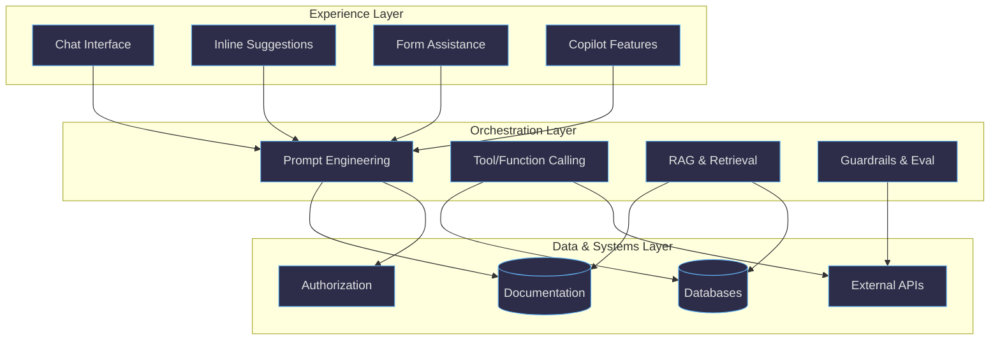

This page focuses on using GenAI in the real world: spotting where it already shows up, deciding what to build, and integrating it into products and developer workflows.

Related pages:

- [GenAI Basics](/ai/genai-basics.html)
- [GenAI Advanced](/ai/genai-advanced.html)

## Table of Contents

1. [What You Can Build Today](#what-you-can-build-today)
2. [Integrating AI into Your Applications](#integrating-ai-into-your-applications)
3. [Building Multi-Agent Systems](#building-multi-agent-systems)
4. [Monitoring and Evaluating AI Applications](#monitoring-and-evaluating-ai-applications)
5. [The AI-Native Web](#the-ai-native-web-nlweb-llmstxt-and-semantic-search)
6. [Learning Resources](#learning-resources)

## What You Can Build Today

The best way to learn AI development is to build something real:

1. Start with a simple chat interface to understand AI interactions
2. Try GitHub Copilot or similar tools in your development environment
3. Experiment with prompt changes and measure output quality
4. Build a small application using Azure OpenAI or GitHub Models
5. Join AI communities and forums and learn from examples

Here are concrete projects you can start this week:

### Build an MCP server

Connect AI to your own data. Create a Model Context Protocol server that gives Claude or Copilot access to your company's documentation, your personal notes, or a live database. Start with the [MCP quickstart](https://modelcontextprotocol.io/quickstart) and have something running in an afternoon.

### Create a coding agent

Handle routine tasks automatically. Use GitHub Copilot's agent mode or build your own with Microsoft Agent Framework. Have it review PRs, generate tests, or refactor legacy code. See [Building AI Agents with Ease](https://techcommunity.microsoft.com/blog/educatordeveloperblog/building-ai-agents-with-ease-function-calling-in-vs-code-ai-toolkit/4362419).

### Deploy a RAG chatbot

Build a knowledge base for your team. Connect Azure OpenAI to your internal docs and let people ask questions in natural language instead of searching. The [Microsoft Foundry quickstart](https://learn.microsoft.com/en-us/azure/ai-foundry/quickstarts/get-started-playground) gets you there fast.

### Automate document processing

Use vision models to extract data from receipts, contracts, or forms. Classify images. Generate alt text. GPT-4o and similar models handle these tasks through simple API calls.

### Build a multi-agent system

Let specialized agents collaborate. One agent retrieves context, another generates code, a third reviews quality. See [Building a multi-agent system with Semantic Kernel](https://www.reddit.com/r/dotnet/comments/1ltr8tf/building_a_multiagent_system_with_semantic_kernel/).

Pick one. Ship it. Then iterate.

## Integrating AI into Your Applications

Most practical integrations come down to three layers:

- **Experience**: how users interact (chat, inline suggestions, forms, copilots)
- **Orchestration**: prompts, tool use, retrieval, evaluations, and guardrails
- **Data and systems**: your sources of truth (docs, DBs, APIs) and authorization

### Tools and IDEs

Modern development environments have integrated AI capabilities to enhance productivity and streamline workflows.

#### Visual Studio Code

- GitHub Copilot integration: code suggestions and chat in the editor
- AI-powered extensions for specific languages and frameworks
- Context-aware completions based on your repository

#### Visual Studio

- AI-assisted IntelliSense, suggestions, and review support
- Debugging help with explanations and next-step suggestions

#### JetBrains Rider

- AI assistant support for code generation and explanation
- Refactoring suggestions and test generation workflows

#### Benefits of AI-integrated development tools

- Faster coding with contextual suggestions
- Better code quality through review support
- Learning support through explanations
- Reduced context switching

### GitHub Copilot

GitHub Copilot is an AI pair programmer that provides real-time code suggestions, chat capabilities, and agent-based assistance directly in your development environment.

#### Core capabilities

- **Code completion**: Suggests functions, code blocks, and entire implementations based on context
- **Chat interface**: Conversational help for reasoning about code, architecture, and debugging
- **Multi-language support**: Works across dozens of programming languages
- **Context awareness**: Understands your repository structure, open files, and coding patterns

#### Interaction modes

GitHub Copilot offers three distinct modes for different workflows:

**Ask mode** is best for explanations, exploring options, and quick checks. Use it when you want to understand code, get suggestions, or reason through a problem without making changes.

**Edit mode** is best for refining existing code, documentation, and configuration files. Copilot proposes inline changes that you can review and accept.

**Agent mode** is best for multi-step tasks where the AI plans and executes changes autonomously. The agent can create files, run terminal commands, and iterate on its own work. Use it for complex refactoring, implementing features across multiple files, or setting up new projects.

#### Customization

You can customize Copilot's behavior through instruction files:

- **`.github/copilot-instructions.md`**: Repository-wide instructions that apply to all Copilot interactions
- **`AGENTS.md`**: Agent-specific instructions for the coding agent (also supports `CLAUDE.md` and `GEMINI.md` for different models)
- **Custom agents**: Define specialized agents with specific tools, handoffs, and behaviors using YAML frontmatter and Markdown

#### Coding agent

The GitHub Copilot coding agent can work asynchronously on issues and pull requests. Assign an issue to `copilot-swe-agent` and it will:

1. Analyze the issue and create a plan
2. Create a new branch and implement changes
3. Open a pull request for review
4. Iterate based on feedback

This enables background work on routine tasks while you focus on higher-value activities.

  
❓ GitHub Copilot FAQ

  
When should I refactor using my IDE versus using Copilot?

  

    <ul>
      <li>Use IDE refactoring tools for standard operations like renaming symbols or extracting methods.</li>
      <li>Use Copilot for refactors that require understanding intent, architecture, and cross-file reasoning.</li>
    </ul>
    Lots of examples and detailed information can be found in the <a href="/github-copilot/">GitHub Copilot Hub</a>.
  

  
Which mode should I use for a complex feature implementation?

  

    <ul>
      <li>Start with <strong>Ask mode</strong> to discuss the approach and break down the requirements.</li>
      <li>Switch to <strong>Agent mode</strong> to implement the feature across multiple files.</li>
      <li>Use <strong>Edit mode</strong> for targeted refinements after the initial implementation.</li>
    </ul>
  

  
📚 More information

  <ul>
    <li><a href="https://docs.github.com/en/copilot">GitHub Copilot documentation</a></li>
    <li><a href="https://www.cooknwithcopilot.com/blog/context-engineering-recipes-recap.html">Cook'n with Copilot: Context Engineering Recipes Recap</a></li>
    <li><a href="https://www.youtube.com/watch?v=vgPl6sK6rQo">What's new with the GitHub Copilot coding agent: A look at the updates</a></li>
    <li><a href="https://cooknwithcopilot.com/blog/copilot-vs-chat-sidekick-showdown.html">Copilot vs Chat: Sidekick Showdown - When to Use Each Coding Sidekick</a></li>
    <li><a href="https://www.youtube.com/watch?v=xWA0xYttWMo">Modernizing Legacy COBOL to Cloud with GitHub Copilot</a></li>
    <li><a href="https://www.youtube.com/watch?v=ol_un2Nam2E">GitHub Copilot Helps One Acre Fund Scale Farming Impact</a></li>
    <li><a href="https://devblogs.microsoft.com/visualstudio/introducing-automatic-documentation-comment-generation-in-visual-studio/">Introducing automatic documentation comment generation in Visual Studio</a></li>
    <li><a href="https://code.visualstudio.com/updates/v1_102">VS Code June 2025 (version 1.102)</a></li>
    <li><a href="https://github.blog/news-insights/product-news/github-copilot-in-2025-more-intelligent-more-accessible-more-productive/">GitHub Copilot in 2025: More Intelligent, More Accessible, More Productive</a></li>
  </ul>

### Azure AI Services

Microsoft provides a unified platform for building, evaluating, and deploying AI applications, recently rebranded from Azure AI Foundry to Microsoft Foundry.

#### Microsoft Foundry

Microsoft Foundry (formerly Azure AI Foundry) is a unified platform-as-a-service for enterprise AI operations, model builders, and application development. It unifies agents, models, and tools under a single management grouping with built-in enterprise-readiness capabilities.

**Two portal experiences**:

- **Microsoft Foundry (new)**: Streamlined experience for building multi-agent applications. Choose this when working primarily with Foundry projects.
- **Microsoft Foundry (classic)**: Full-featured portal for working with multiple resource types including Azure OpenAI, Foundry resources, and hub-based projects.

**Key capabilities in the new portal**:

- **Multi-Agent Orchestration**: Build workflows using SDKs for C# and Python that enable collaborative agent behavior
- **Foundry Tools**: Access 1,400+ tools through the tool catalog, including remote MCP servers, Azure Logic App connectors, and custom tools
- **Memory (preview)**: Long-term memory that persists user preferences and conversation history across sessions
- **Knowledge Integration**: Connect agents to Foundry IQ (powered by Azure AI Search) for grounded, citation-backed answers
- **Visual Workflow Designer**: Design agent orchestrations visually, then export to YAML for code-based deployment

**Built-in tools include**: Azure AI Search, Browser Automation, Code Interpreter, Computer Use, File Search, Grounding with Bing, Image Generation, Microsoft Fabric integration, SharePoint, and Web Search.

#### Azure OpenAI

Enterprise access to OpenAI models with Azure security and compliance features.

##### Do you need to use low-level services directly?

For many applications, you can start with Azure OpenAI or Microsoft Foundry, then add specialized services when needed.

  
📚 More information

  <ul>
    <li><a href="https://learn.microsoft.com/en-us/azure/ai-foundry/what-is-azure-ai-foundry">What is Microsoft Foundry?</a></li>
    <li><a href="https://learn.microsoft.com/en-us/training/modules/prepare-azure-ai-development/">Plan and prepare to develop AI solutions on Azure</a></li>
    <li><a href="https://www.youtube.com/watch?v=2L4cSig9Y4Y">Azure Update: 20th June 2025</a></li>
    <li><a href="https://www.youtube.com/watch?v=-8sH0QFhvkQ">Azure Updates: August 2025 Highlights</a></li>
    <li><a href="https://devblogs.microsoft.com/foundry/whats-new-in-azure-ai-foundry-july-2025/">What's New in Microsoft Foundry: July 2025 Releases and Updates</a></li>
    <li><a href="https://azure.microsoft.com/en-us/blog/introducing-deep-research-in-azure-ai-foundry-agent-service/">Introducing Deep Research in Microsoft Foundry Agent Service</a></li>
    <li><a href="https://techcommunity.microsoft.com/blog/azure-ai-services-blog/agent-factory-building-your-first-ai-agent-with-azure-ai-foundry/4295871">Agent Factory: Building Your First AI Agent with Microsoft Foundry</a></li>
  </ul>

### Languages and SDKs

Most languages have solid SDKs and libraries for integrating AI.

#### Python

- **Azure AI Projects SDK** (`azure-ai-projects`): Unified library for connecting to Microsoft Foundry projects, accessing models, and using Foundry Tools
- OpenAI SDK
- LangChain
- Hugging Face Transformers
- LlamaIndex

#### JavaScript/TypeScript

- OpenAI Node.js SDK
- LangChain.js
- Vercel AI SDK
- Azure AI Projects SDK (preview)

#### C#/.NET

.NET provides a layered approach to AI development:

- **Microsoft.Extensions.AI**: A namespace that provides unified abstractions for working with AI services. It defines common interfaces like `IChatClient` and `IEmbeddingGenerator` that work across different AI providers (Azure OpenAI, OpenAI, Ollama, etc.). Think of it as the "plumbing" that lets you swap providers without rewriting code.

- **Microsoft Agent Framework**: The recommended framework for building AI agents and agentic applications. It builds on top of Microsoft.Extensions.AI and provides pre-built orchestration patterns, multi-agent coordination, and integration with Microsoft Foundry for visual workflow design. If you're building agents, start here.

- **Semantic Kernel**: An SDK for orchestrating prompts, plugins, and AI workflows. Microsoft Agent Framework is its successor for agentic scenarios, but Semantic Kernel remains useful for prompt orchestration and plugin development. Existing Semantic Kernel projects can migrate to Agent Framework when ready.

- **Azure AI SDKs**: Direct access to Azure AI services for specialized needs.

  
📚 More information

  <ul>
    <li><a href="https://learn.microsoft.com/en-us/dotnet/ai/">AI for .NET developers documentation</a></li>
    <li><a href="https://learn.microsoft.com/en-us/agent-framework/">Microsoft Agent Framework documentation</a></li>
    <li><a href="https://devblogs.microsoft.com/dotnet/introducing-microsoft-extensions-ai-preview/">Introducing Microsoft.Extensions.AI</a></li>
    <li><a href="https://www.youtube.com/watch?v=pt4CJKm-2ZI">.NET AI Community Standup: AI in .NET - What's New, What's Next</a></li>
    <li><a href="https://www.youtube.com/watch?v=iYHh5n-6ez4">Connecting to a Local MCP Server Using Microsoft.Extensions.AI</a></li>
    <li><a href="https://devblogs.microsoft.com/foundry/introducing-microsoft-agent-framework-the-open-source-engine-for-agentic-ai-apps/">Introducing Microsoft Agent Framework</a></li>
    <li><a href="https://www.youtube.com/watch?v=AAgdMhftj8w">Agent Framework introduction video (30 min)</a></li>
    <li><a href="https://learn.microsoft.com/en-us/agent-framework/migration-guide/from-semantic-kernel">Migration guide from Semantic Kernel to Agent Framework</a></li>
  </ul>

  
❓ .NET AI FAQ

  
Should I use Semantic Kernel or Agent Framework?

  

    <ul>
      <li>For new agentic projects, start with Microsoft Agent Framework.</li>
      <li>Semantic Kernel remains useful for prompt orchestration and plugin development.</li>
      <li>Existing Semantic Kernel projects can migrate incrementally.</li>
    </ul>
  

  
Adding Azure OpenAI vs OpenAI in C# - what are the differences?

  

    <ul>
      <li>Azure OpenAI offers enterprise security, data residency control, and Azure integration.</li>
      <li>Direct OpenAI can be simpler to start with but gives less control over data handling.</li>
      <li>Microsoft.Extensions.AI abstractions let you switch between them without code changes.</li>
    </ul>
  

## Building Multi-Agent Systems

Multi-agent systems move beyond single "do-everything" assistants to collaborative groups where each agent brings a specific skill. This section covers practical approaches to building these systems.

### When to use multi-agent architectures

Consider multi-agent designs when:

- **Large workloads** can be divided into smaller tasks for parallel processing
- **Complex tasks** require distinct competencies (retrieval vs. code generation vs. review)
- **Separation of duties** matters (policy checking, compliance review)
- **Different expertise** is needed for different aspects of a task
- **Stronger isolation** is required (running agents under least-privilege identities)

### Three-phase development workflow

Microsoft Foundry and Agent Framework support a design-develop-deploy workflow:

#### Phase 1: Design (Low-Code)

Use Microsoft Foundry Workflows to visually design agent orchestration. The workflow builder provides:

- **Pre-built templates**: Human-in-the-loop, Sequential, and Group Chat orchestration patterns
- **Node types**: Agent invocation, logic (if/else, loops), data transformation, and basic chat
- **Power Fx expressions**: Excel-like formulas for complex logic and data manipulation
- **YAML export**: Version-controllable workflow definitions that can be edited visually or as code

This lets you prototype and test multi-agent interactions without writing orchestration code.

#### Phase 2: Develop (Local SDLC)

Use the Microsoft Foundry VS Code Extension to pull workflow definitions locally. This bridges the gap between cloud-based visual design and your local IDE, enabling debugging, testing, and integration with your existing development practices.

#### Phase 3: Deploy (Runtime)

Microsoft Agent Framework natively ingests the declarative workflow definitions (YAML) from Foundry. This "configuration as code" approach lets you promote artifacts from prototyping directly to production without rewriting logic.

### Practical orchestration patterns

Choose patterns based on your coordination needs:

| Pattern | Use when |
| ------- | -------- |
| **Sequential** | Tasks have dependencies and must run in order |
| **Concurrent** | Tasks are independent and can run in parallel |
| **Group Chat** | Multiple perspectives need to collaborate iteratively |
| **Handoff** | Context determines which specialist should handle the work |

Patterns can be combined. A sequential pipeline might include a group chat step for review, or a handoff pattern might delegate to concurrent sub-agents.

### Design principles for production systems

- **Make handoffs explicit**: Define schemas that capture goal, inputs, constraints, evidence, and success criteria
- **Pass artifacts by reference**: Use file IDs or links rather than copying full content to control context growth
- **Bound execution**: Set token/turn caps and clear exit conditions to prevent runaway loops
- **Log everything**: Capture every handoff and tool call, including sources, for traceability
- **Build evaluation harnesses**: Exercise end-to-end scenarios to quantify quality and prevent regressions

### Agent Memory

Microsoft Foundry provides managed long-term memory that enables agents to retain and recall information across sessions. This is distinct from short-term memory (conversation context within a session).

**Memory types**:

- **User profile memory**: Persistent information about users (name, preferences, dietary restrictions) that remains stable across conversations
- **Chat summary memory**: Distilled summaries of conversation topics that allow users to continue discussions without repeating context

**How it works**:

1. **Extraction**: The system identifies key information from conversations (preferences, facts, context)
2. **Consolidation**: Similar memories are merged to avoid redundancy; conflicts are resolved
3. **Retrieval**: Hybrid search surfaces relevant memories when the agent needs them

**Use cases**: Customer support agents that remember previous issues and preferred contact methods, shopping assistants that recall sizes and past purchases, or any scenario where personalization improves the experience.

**Integration options**:

- **Memory search tool**: Attach to a prompt agent for automatic memory management
- **Memory store APIs**: Direct API access for advanced control

  
📚 More information

  <ul>
    <li><a href="https://learn.microsoft.com/en-us/azure/ai-foundry/agents/concepts/workflow">Build a workflow in Microsoft Foundry</a></li>
    <li><a href="https://learn.microsoft.com/en-us/azure/ai-foundry/agents/concepts/what-is-memory">Memory in Foundry Agent Service</a></li>
    <li><a href="https://learn.microsoft.com/en-us/azure/ai-foundry/agents/concepts/tool-catalog">Foundry Tools catalog</a></li>
    <li><a href="https://learn.microsoft.com/en-us/agent-framework/user-guide/workflows/orchestrations/overview">Microsoft Agent Framework Orchestrations</a></li>
    <li><a href="https://techcommunity.microsoft.com/blog/azuredevcommunityblog/from-concept-to-code-building-production-ready-multi-agent-systems-with-microsof/4472752">From Concept to Code: Building Production-Ready Multi-Agent Systems</a></li>
    <li><a href="https://techcommunity.microsoft.com/t5/microsoft-developer-community/learn-mcp-from-our-free-livestream-series-in-december/ba-p/4474729">Learn MCP from our Free Livestream Series in December</a></li>
    <li><a href="https://devblogs.microsoft.com/blog/designing-multi-agent-intelligence">Designing Multi-Agent Intelligence</a></li>
    <li><a href="https://microsoft.github.io/ai-agents-for-beginners/08-multi-agent/">Multi-Agent Design Patterns (AI Agents for Beginners)</a></li>
  </ul>

## Monitoring and Evaluating AI Applications

Building AI applications is only half the challenge. You also need to monitor performance, evaluate quality, and ensure safety in production.

### Why monitoring matters

Without rigorous assessment, AI systems can produce outputs that are fabricated, irrelevant, harmful, or vulnerable to exploits. Observability helps you detect these issues before they impact users.

### Evaluation throughout the lifecycle

#### Before deployment (preproduction)

- **Test with evaluation datasets** that simulate realistic user interactions
- **Identify edge cases** where output quality might degrade
- **Measure key metrics** like groundedness, relevance, coherence, and safety
- **Run AI red teaming** to simulate adversarial attacks and identify vulnerabilities
- **Generate synthetic data** if you lack real test data to cover your scenarios

#### After deployment (production)

- **Continuous evaluation**: Sample production traffic and assess quality/safety at a configured rate
- **Scheduled evaluation**: Run periodic tests with fixed datasets to detect drift
- **Operational metrics**: Track latency, throughput, token consumption, and error rates
- **Alerting**: Set up notifications when metrics drop below thresholds

### Types of evaluators to consider

| Category | What it measures |
| -------- | ---------------- |
| **General quality** | Coherence, fluency, overall response quality |
| **RAG quality** | Groundedness, relevance, how well responses use retrieved context |
| **Safety** | Harmful content, bias, protected material, security vulnerabilities |
| **Agent-specific** | Task adherence, task completion, tool call accuracy |

For agent applications, evaluators can assess whether the agent followed through on tasks, selected appropriate tools, and used tool outputs correctly.

### Setting up monitoring in Azure

Microsoft Foundry provides integrated observability through Application Insights:

1. **Connect Application Insights** to your Foundry project
2. **Instrument tracing** to capture detailed telemetry from your application
3. **Enable continuous evaluation** to automatically assess production traffic
4. **Use the dashboard** to visualize token consumption, latency, exceptions, and quality metrics
5. **Set up alerts** to get notified when issues arise

The Foundry observability dashboard brings key metrics into a single view that provides transparency for tracking operational health and quality.

  
📚 More information

  <ul>
    <li><a href="https://learn.microsoft.com/en-us/azure/ai-foundry/concepts/observability">Observability in generative AI (Microsoft Learn)</a></li>
    <li><a href="https://learn.microsoft.com/en-us/azure/ai-foundry/how-to/evaluate-generative-ai-app">Evaluate generative AI apps using Microsoft Foundry</a></li>
    <li><a href="https://learn.microsoft.com/en-us/training/modules/evaluate-models-azure-ai-studio/">Evaluate generative AI performance (Training Module)</a></li>
    <li><a href="https://learn.microsoft.com/en-us/azure/ai-foundry/how-to/develop/trace-application">Trace your AI application</a></li>
    <li><a href="https://learn.microsoft.com/en-us/azure/ai-foundry/how-to/continuous-evaluation-agents">Real-time observability for agents</a></li>
  </ul>

## The AI-native web: NLWeb, llms.txt, and semantic search

AI is changing how we navigate websites and data. Instead of clicking through menus and forms, we'll increasingly describe what we want in natural language. Sites and apps will respond by resolving intent, pulling the right data, and assembling answers with sources. Three related ideas are emerging that make this possible:

### Semantic search (and why it matters)

Traditional search matches exact words. Semantic search matches meaning using embeddings (numeric representations of text, images, or other data). This lets users ask questions in their own words and still find the right content. In practice, semantic search powers Retrieval-Augmented Generation (RAG), site search that understands synonyms and context, and cross-type discovery (e.g., "the video that explains streaming tokens").

### NLWeb (natural-language web)

NLWeb refers to patterns that make the web conversational by default. Pages expose capabilities (search, lookup, actions) as structured affordances that AI agents can call. Content is organized as artifacts with clear identifiers and metadata. Users ask for outcomes ("Find the latest pricing and compare to last quarter"), and the site resolves the request through tools and data rather than forcing step-by-step navigation.

#### What changes

- Interfaces become intent-first rather than page-first
- Sites describe actions and data in machine-readable ways so agents can help
- Results include sources, links, and artifacts you can reuse

Some projects describe this as an "agent-native" layer for the web, similar to how HTML+HTTP enabled browsers. If you want a concrete example, the NLWeb project itself frames the idea in relation to MCP (and mentions A2A as an emerging direction).

#### Implementation details

[NLWeb](https://github.com/nlweb-ai/NLWeb) is an open-source project that aims to simplify building conversational interfaces for websites. It describes using semi-structured formats (like Schema.org and RSS) as inputs, indexing content into a vector store for semantic retrieval, and exposing capabilities via MCP so AI clients can call tools against the site.

### llms.txt

Like robots.txt for crawlers, `llms.txt` is a proposed convention for publishing an LLM-friendly index of a site. The idea is to put a markdown file at a predictable path (typically `/llms.txt`) that points to the most useful pages and documents, with a short summary and an optional section for "nice to have" links.

  
📚 More information

  <ul>
    <li><a href="https://llmstxt.org/">llms.txt specification and guidance</a></li>
    <li><a href="https://gofastmcp.com/llms-full.txt">Example: GoFastMCP llms.txt</a></li>
    <li><a href="https://github.com/nlweb-ai/NLWeb">NLWeb GitHub repository</a></li>
  </ul>

The bottom line: AI turns websites and data stores into conversational surfaces. By adding `llms.txt` and shipping semantic search (or at least clean, machine-readable structure plus stable URLs), you make your content easier for both people and agents to discover, cite, and reuse.

## Learning Resources

Resources to continue your GenAI learning journey, from structured courses to hands-on experimentation.

  
📚 Courses and tutorials

  <ul>
    <li><a href="https://learn.microsoft.com/en-us/training/paths/introduction-to-ai-on-azure/">Microsoft Learn: Introduction to AI on Azure</a></li>
    <li><a href="https://huggingface.co/learn">Hugging Face courses</a></li>
    <li><a href="https://www.linkedin.com/learning/enterprise-ai-development-with-github-models-and-azure">LinkedIn Learning: AI development with GitHub Models and Azure</a></li>
    <li><a href="https://skills.github.com/">GitHub Skills</a></li>
    <li><a href="https://www.youtube.com/watch?v=kCc8FmEb1nY">Let's build GPT: from scratch, in code, spelled out</a></li>
  </ul>

  
📚 More from this site

  <ul>
    <li><a href="/ai/videos.html">AI-focused videos and tutorials</a></li>
    <li><a href="/ai/posts.html">Blog posts about AI implementation</a></li>
    <li><a href="/all/posts.html">Microsoft and Azure updates</a></li>
  </ul>

