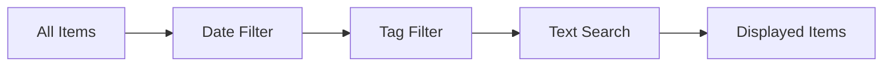

# Filtering System Specification

> **Feature**: Client-side content filtering by date, tags, and text search

## Overview

The filtering system provides real-time content discovery through date range filters, tag selection, and text search. Initial content is server-side rendered (Blazor SSR), with client-side interactive filtering and infinite scroll pagination (Blazor WASM) for optimal performance and UX.

## Requirements

### Functional Requirements

**FR-1**: The system MUST filter content by date range (Last 7/30/90 days, All Time)  
**FR-2**: The system MUST filter content by tags (multi-select)  
**FR-3**: The system MUST filter content by text search (title, description, tags)  
**FR-4**: The system MUST preserve filter state in URL parameters  
**FR-5**: The system MUST support browser back/forward navigation  
**FR-6**: The system MUST display active filter indicators  
**FR-7**: The system MUST provide "Clear All Filters" functionality  
**FR-8**: The system MUST show result count after filtering  
**FR-9**: The system MUST implement infinite scroll pagination (20 items per batch)  
**FR-10**: The system MUST prefetch next batch at 80% scroll position  
**FR-11**: The system MUST preserve filter + pagination state in URL  

### Non-Functional Requirements

**NFR-1**: Client-side filtering MUST complete in < 50ms for current page  
**NFR-2**: Text search MUST be debounced (300ms delay)  
**NFR-3**: URL updates MUST not trigger page reload  
**NFR-4**: Filter controls MUST be keyboard accessible  
**NFR-5**: Filter state MUST be shareable via URL  
**NFR-6**: Pagination API MUST respond in < 200ms (p95)  
**NFR-7**: Cache hit rate MUST exceed 90% for paginated results  
**NFR-8**: Use Intersection Observer for scroll detection (battery-friendly)  

## Architecture

### Hybrid Rendering with Infinite Scroll

**Server-Side Rendering (Initial Load)**:

1. Blazor SSR renders first 20 items (sorted by date, newest first)
2. Pre-render filter controls with available tags
3. Output full HTML for SEO and fast initial load
4. Inject state for Blazor WASM hydration

**Client-Side Interactivity (After Hydration)**:

1. Blazor WASM takes over for filtering and pagination
2. Apply date range filter on current dataset
3. Apply tag filters (OR logic - show if ANY tag matches)
4. Apply text search filter
5. Update result count and URL parameters
6. Trigger infinite scroll when user reaches 80% of content

**Pagination API** (Blazor Minimal API):

1. Receives filter parameters (date range, tags, search query, page number)
2. Queries repository with filters applied
3. Returns next 20 items as JSON
4. Uses Output Caching (5 min TTL) + Redis for performance
5. Includes total count and "has more" indicator

### Filter Types



## Use Cases

### UC-1: Filter by Date Range

**Actor**: User  
**Precondition**: User is on section index or collection page  
**Trigger**: User selects "Last 30 days" from date filter dropdown  

**Flow**:

1. User clicks date filter dropdown
2. User selects "Last 30 days"
3. System calculates cutoff date (now - 30 days)
4. System filters items where `item.date >= cutoff`
5. System updates URL: `?date=30days`
6. System displays filtered items
7. System updates result count: "Showing 15 items"

**Postcondition**: Only items from last 30 days are visible

### UC-2: Filter by Tags

**Actor**: User  
**Precondition**: User is on filtered page  
**Trigger**: User clicks tag checkbox  

**Flow**:

1. User clicks "Azure" tag checkbox
2. System adds "azure" to active tags list
3. System filters items where `item.tags.includes("azure")`
4. System updates URL: `?date=30days&tag=azure`
5. System displays tag chip with remove button
6. System shows filtered items
7. User clicks "AI" tag checkbox
8. System adds "ai" to active tags (OR logic: azure OR ai)
9. System updates URL: `?date=30days&tag=azure&tag=ai`
10. System shows items matching ANY selected tag

**Postcondition**: Items with "azure" OR "ai" tags are visible

### UC-3: Text Search

**Actor**: User  
**Precondition**: User is on filtered page  
**Trigger**: User types in search input  

**Flow**:

1. User types "copilot" in search box
2. System waits 300ms (debounce)
3. System searches title, description, tags for "copilot" (case-insensitive)
4. System updates URL: `?date=30days&tag=azure&search=copilot`
5. System displays matching items
6. System highlights search term in results (optional)
7. System shows "Showing 8 items matching 'copilot'"

**Postcondition**: Only items matching search term are visible

### UC-4: Clear All Filters

**Actor**: User  
**Precondition**: Multiple filters are active  
**Trigger**: User clicks "Clear All Filters" button  

**Flow**:

1. User clicks "Clear All Filters"
2. System resets all filter state:
   - Date filter: Last 7 days (default)
   - Tags: None selected
   - Search: Empty
3. System updates URL: `?date=7days` (or removes params)
4. System displays all items (within server-side pre-filter)
5. System removes all active filter indicators

**Postcondition**: All filters are cleared, default view shown

### UC-5: Share Filtered View

**Actor**: User  
**Precondition**: Filters are applied  
**Trigger**: User copies URL from address bar  

**Flow**:

1. User applies filters (date, tags, search)
2. User copies URL: `/github-copilot?date=30days&tag=azure&search=ai`
3. User shares URL with colleague
4. Colleague opens URL in browser
5. System reads URL parameters
6. System applies filters from URL
7. System shows identical filtered view

**Postcondition**: Filtered state is preserved and shareable

## Filter Implementation

### Date Filter

**Configuration**:

```csharp
public enum DateRange
{
    Last7Days,
    Last30Days,
    Last90Days,
    AllTime
}

public record DateFilter(DateRange Range, DateTimeOffset Cutoff);
```

**Logic**:

```csharp
public static IEnumerable<ContentItem> FilterByDate(
    IEnumerable<ContentItem> items,
    DateFilter filter)
{
    if (filter.Range == DateRange.AllTime)
        return items;
    
    return items.Where(item => item.Date >= filter.Cutoff);
}
```

**Cutoff Calculation** (Europe/Brussels timezone):

```csharp
private static DateTimeOffset CalculateCutoff(DateRange range)
{
    var now = TimeZoneInfo.ConvertTime(
        DateTimeOffset.UtcNow,
        TimeZoneInfo.FindSystemTimeZoneById("Europe/Brussels"));
    
    return range switch
    {
        DateRange.Last7Days => now.AddDays(-7),
        DateRange.Last30Days => now.AddDays(-30),
        DateRange.Last90Days => now.AddDays(-90),
        DateRange.AllTime => DateTimeOffset.MinValue,
        _ => throw new ArgumentException(nameof(range))
    };
}
```

### Tag Filter

**Configuration**:

```csharp
public record TagFilter(IEnumerable<string> Tags);
```

**Logic** (OR operation):

```csharp
public static IEnumerable<ContentItem> FilterByTags(
    IEnumerable<ContentItem> items,
    TagFilter filter)
{
    if (!filter.Tags.Any())
        return items;
    
    return items.Where(item =>
        item.Tags.Any(tag =>
            filter.Tags.Contains(tag, StringComparer.OrdinalIgnoreCase)));
}
```

### Text Search

**Configuration**:

```csharp
public record TextFilter(string Query);
```

**Logic** (search title, description, tags):

```csharp
public static IEnumerable<ContentItem> FilterByText(
    IEnumerable<ContentItem> items,
    TextFilter filter)
{
    if (string.IsNullOrWhiteSpace(filter.Query))
        return items;
    
    var query = filter.Query.Trim().ToLowerInvariant();
    
    return items.Where(item =>
        item.Title.Contains(query, StringComparison.OrdinalIgnoreCase) ||
        item.Description.Contains(query, StringComparison.OrdinalIgnoreCase) ||
        item.Tags.Any(tag => tag.Contains(query, StringComparison.OrdinalIgnoreCase)));
}
```

### Combined Filtering

```csharp
public static IEnumerable<ContentItem> ApplyFilters(
    IEnumerable<ContentItem> items,
    DateFilter dateFilter,
    TagFilter tagFilter,
    TextFilter textFilter)
{
    return items
        .Where(item => item.Date >= dateFilter.Cutoff)
        .Where(item => !tagFilter.Tags.Any() ||
            item.Tags.Any(tag => tagFilter.Tags.Contains(tag, StringComparer.OrdinalIgnoreCase)))
        .Where(item => string.IsNullOrWhiteSpace(textFilter.Query) ||
            item.Title.Contains(textFilter.Query, StringComparison.OrdinalIgnoreCase) ||
            item.Description.Contains(textFilter.Query, StringComparison.OrdinalIgnoreCase) ||
            item.Tags.Any(tag => tag.Contains(textFilter.Query, StringComparison.OrdinalIgnoreCase)));
}
```

## URL State Management

### URL Parameters

| Parameter | Values | Example |
| ----------- | -------- | --------- |
| `date` | `7days`, `30days`, `90days`, `all` | `?date=30days` |
| `tag` | Tag name (normalized) | `?tag=azure` |
| `search` | Search query | `?search=copilot` |

**Multi-Tag Example**: `?date=30days&tag=azure&tag=ai&search=copilot`

### URL Encoding

```csharp
public static string BuildFilterUrl(DateRange range, IEnumerable<string> tags, string search)
{
    var query = new StringBuilder();
    
    if (range != DateRange.Last7Days) // Default
        query.Append($"?date={range switch {
            DateRange.Last30Days => "30days",
            DateRange.Last90Days => "90days",
            DateRange.AllTime => "all",
            _ => "7days"
        }}");
    
    foreach (var tag in tags)
        query.Append($"&tag={Uri.EscapeDataString(tag)}");
    
    if (!string.IsNullOrWhiteSpace(search))
        query.Append($"&search={Uri.EscapeDataString(search)}");
    
    return query.ToString().TrimStart('&');
}
```

### URL Parsing

```csharp
public static (DateRange, IEnumerable<string>, string) ParseFilterUrl(string queryString)
{
    var query = HttpUtility.ParseQueryString(queryString);
    
    var dateRange = query["date"] switch
    {
        "30days" => DateRange.Last30Days,
        "90days" => DateRange.Last90Days,
        "all" => DateRange.AllTime,
        _ => DateRange.Last7Days
    };
    
    var tags = query.GetValues("tag") ?? Array.Empty<string>();
    var search = query["search"] ?? string.Empty;
    
    return (dateRange, tags, search);
}
```

## UI Components

### Blazor Filter Components

**DateFilterDropdown.razor**:

```razor
<div class="filter-group">
    <label for="date-filter">Date Range:</label>
    <select id="date-filter" @onchange="OnDateChanged">
        <option value="7days" selected="@(Range == DateRange.Last7Days)">Last 7 days</option>
        <option value="30days" selected="@(Range == DateRange.Last30Days)">Last 30 days</option>
        <option value="90days" selected="@(Range == DateRange.Last90Days)">Last 90 days</option>
        <option value="all" selected="@(Range == DateRange.AllTime)">All Time</option>
    </select>
</div>

@code {
    [Parameter, EditorRequired]
    public DateRange Range { get; set; }
    
    [Parameter]
    public EventCallback<DateRange> OnFilterChanged { get; set; }
    
    private async Task OnDateChanged(ChangeEventArgs e)
    {
        var range = e.Value?.ToString() switch
        {
            "30days" => DateRange.Last30Days,
            "90days" => DateRange.Last90Days,
            "all" => DateRange.AllTime,
            _ => DateRange.Last7Days
        };
        
        await OnFilterChanged.InvokeAsync(range);
    }
}
```

**TagFilterList.razor**:

```razor
<div class="filter-group">
    <label>Tags:</label>
    <div class="tag-list">
        @foreach (var tag in AvailableTags)
        {
            <label class="tag-checkbox">
                <input type="checkbox"
                       value="@tag"
                       checked="@SelectedTags.Contains(tag)"
                       @onchange="@(e => OnTagChanged(tag, e))" />
                <span>@tag</span>
            </label>
        }
    </div>
</div>

@code {
    [Parameter, EditorRequired]
    public IEnumerable<string> AvailableTags { get; set; } = [];
    
    [Parameter, EditorRequired]
    public IEnumerable<string> SelectedTags { get; set; } = [];
    
    [Parameter]
    public EventCallback<(string Tag, bool Selected)> OnFilterChanged { get; set; }
    
    private async Task OnTagChanged(string tag, ChangeEventArgs e)
    {
        var selected = e.Value as bool? ?? false;
        await OnFilterChanged.InvokeAsync((tag, selected));
    }
}
```

**TextSearchInput.razor**:

```razor
<div class="filter-group">
    <label for="search">Search:</label>
    <input type="text"
           id="search"
           placeholder="Search titles, descriptions, tags..."
           value="@Query"
           @oninput="OnSearchInput"
           @oninput:stopPropagation="true" />
</div>

@code {
    [Parameter]
    public string Query { get; set; } = string.Empty;
    
    [Parameter]
    public EventCallback<string> OnSearchChanged { get; set; }
    
    private System.Timers.Timer? _debounceTimer;
    
    private void OnSearchInput(ChangeEventArgs e)
    {
        _debounceTimer?.Stop();
        _debounceTimer = new System.Timers.Timer(300); // 300ms debounce
        _debounceTimer.Elapsed += async (sender, args) =>
        {
            _debounceTimer.Stop();
            await OnSearchChanged.InvokeAsync(e.Value?.ToString() ?? string.Empty);
        };
        _debounceTimer.Start();
    }
    
    public void Dispose() => _debounceTimer?.Dispose();
}
```

## Acceptance Criteria

**AC-1**: Given items from last 45 days, when "Last 30 days" selected, then only items from last 30 days shown  
**AC-2**: Given items with tags ["azure", "ai"], when "azure" tag selected, then items with "azure" tag shown  
**AC-3**: Given multiple tags selected, when filtering, then items matching ANY tag shown (OR logic)  
**AC-4**: Given search query "copilot", when applied, then items with "copilot" in title/description/tags shown  
**AC-5**: Given filters applied, when URL copied and opened, then same filtered view displayed  
**AC-6**: Given active filters, when "Clear All" clicked, then all filters reset to defaults  
**AC-7**: Given 500 items, when filtering, then results appear in < 50ms  
**AC-8**: Given search input, when typing, then search is debounced by 300ms  

## Performance Optimization

### Client-Side Caching

- Cache filtered results for current filter state
- Invalidate cache only when filters change
- Use memoization for expensive calculations

### Lazy Rendering

- Render only visible items (virtualization)
- Load more items on scroll (infinite scroll)
- Defer rendering of off-screen content

### Debouncing

- Text search: 300ms debounce
- Tag selection: Immediate (no debounce)
- Date filter: Immediate (no debounce)

## Testing Strategy

### Unit Tests

- Test date filter calculation
- Test tag filter logic (OR operation)
- Test text search matching
- Test URL encoding/decoding
- Test timezone handling (Europe/Brussels)

### Component Tests (bUnit)

- Test filter components render correctly
- Test filter state changes
- Test URL parameter updates
- Test "Clear All" functionality

### Integration Tests

- Test full filtering pipeline
- Test filter combinations
- Test URL state preservation
- Test browser navigation (back/forward)

### E2E Tests (Playwright)

- Test selecting date filter
- Test checking/unchecking tags
- Test typing in search box
- Test filter combinations
- Test URL sharing
- Test clearing all filters
- Test mobile filter UI

## Edge Cases

**EC-1**: No items match filters → Display "No results found" message  
**EC-2**: Invalid date range in URL → Default to Last 7 days  
**EC-3**: Invalid tag in URL → Ignore invalid tag  
**EC-4**: Empty search query → Show all items (other filters applied)  
**EC-5**: Search query with special characters → Escape properly  
**EC-6**: All tags unselected → Show all items (other filters applied)  

## Migration Notes

**From Jekyll**:

- URLs can be modernized (set up redirects from old paths if needed)
- URL parameter names SHOULD be preserved where practical (e.g., `?date=last30days&tags=ai`) for user bookmarks
- **REMOVED**: Jekyll "20 + same-day" server-side limiting rule
- **ADDED**: Infinite scroll pagination with prefetching
- **ADDED**: Blazor SSR for initial load + WASM for interactivity
- **ADDED**: Output Caching + Redis distributed cache
- Ensure same timezone handling (Europe/Brussels)
- Replace JavaScript filtering with Blazor components
- Test filter state preservation across page loads

## Open Questions

1. Should we add AND logic option for tag filtering?
2. Should we support advanced search (regex, operators)?
3. Should we persist filter preferences in local storage?
4. Should we add filter presets (e.g., "Recent Azure News")?

## References

- [Current Site Analysis](../current-site-analysis.md)
- [Filtering System Documentation](../../docs/filtering-system.md)
- [Section System Spec](/specs/010-section-system/spec.md)

