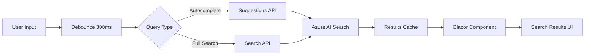

# Search System Specification

> **Feature**: Modern full-text search with autocomplete, facets, and instant results

## Overview

The search system provides real-time full-text search across all content using Azure AI Search or Elasticsearch. Search functionality includes autocomplete suggestions, faceted filtering, highlighted snippets, and instant-as-you-type results. Initial search results are server-side rendered (Blazor SSR) for SEO, with client-side interactivity (Blazor WASM) for real-time search and autocomplete.

## Requirements

### Functional Requirements

**FR-1**: The system MUST provide full-text search across all content (title, description, body, tags)  
**FR-2**: The system MUST support search-as-you-type with autocomplete suggestions  
**FR-3**: The system MUST highlight matching text in search results  
**FR-4**: The system MUST support faceted search (filter by category, collection, date range)  
**FR-5**: The system MUST rank results by relevance score  
**FR-6**: The system MUST provide search suggestions based on popular queries  
**FR-7**: The system MUST preserve search query and filters in URL  
**FR-8**: The system MUST implement infinite scroll for search results (20 items per batch)  
**FR-9**: The system MUST index content updates within 5 minutes  
**FR-10**: The system MUST handle typos and fuzzy matching  

### Non-Functional Requirements

**NFR-1**: Search queries MUST complete in < 200ms (p95)  
**NFR-2**: Autocomplete suggestions MUST appear within 100ms  
**NFR-3**: Search input MUST be debounced (300ms)  
**NFR-4**: System MUST support 1000+ concurrent search queries  
**NFR-5**: Search index MUST be updated incrementally (not full reindex)  
**NFR-6**: Search results MUST be cached (Redis, 5 min TTL)  
**NFR-7**: Failed searches MUST fallback to basic text matching  

## Use Cases

### UC-1: Perform Search Query

**Actor**: User  
**Precondition**: User is on any page  
**Trigger**: User types in search box  

**Flow**:

1. User clicks search icon in header
2. System displays search overlay with empty search box
3. User types query (e.g., "copilot features")
4. System debounces input (300ms)
5. System sends search query to API
6. System highlights matching terms
7. System displays first 20 results with snippets
8. System shows facet filters (category, collection, date)
9. User scrolls to bottom
10. System loads next 20 results via infinite scroll

**Postcondition**: User sees relevant search results

### UC-2: Use Autocomplete Suggestions

**Actor**: User  
**Precondition**: Search overlay is open  
**Trigger**: User types partial query  

**Flow**:

1. User types "cop" in search box
2. System sends autocomplete request to API
3. System shows dropdown with suggestions:
   - "**cop**ilot"
   - "**cop**ilot features"
   - "**cop**ilot workspace"
4. User clicks suggestion
5. System executes search with selected query
6. System displays results

**Postcondition**: User finds content faster

### UC-3: Filter Search Results

**Actor**: User  
**Precondition**: Search results are displayed  
**Trigger**: User clicks facet filter  

**Flow**:

1. User searches for "azure"
2. System shows 150 results with facets:
   - **Category**: Azure (120), AI (30)
   - **Collection**: News (50), Blogs (40), Videos (60)
   - **Date**: Last 7 days (20), Last 30 days (80), All time (150)
3. User clicks "Videos" facet
4. System filters results to show only videos
5. System updates URL: `?q=azure&collection=videos`
6. System shows 60 video results

**Postcondition**: Results refined by facet selection

### UC-4: Share Search Results

**Actor**: User  
**Precondition**: User has performed search with filters  
**Trigger**: User copies URL  

**Flow**:

1. User searches for "copilot" and filters to "Last 7 days"
2. URL updates to: `?q=copilot&date=last-7-days`
3. User copies URL and shares via email
4. Recipient opens URL
5. System restores same search query and filters
6. Recipient sees identical results

**Postcondition**: Search state successfully shared

## Search Architecture

### Components



### Azure AI Search Index

**Index Schema**:

```json
{
  "name": "techhub-content",
  "fields": [
    { "name": "id", "type": "Edm.String", "key": true },
    { "name": "title", "type": "Edm.String", "searchable": true, "boost": 3.0 },
    { "name": "description", "type": "Edm.String", "searchable": true, "boost": 2.0 },
    { "name": "content", "type": "Edm.String", "searchable": true },
    { "name": "tags", "type": "Collection(Edm.String)", "searchable": true, "boost": 1.5 },
    { "name": "category", "type": "Edm.String", "filterable": true, "facetable": true },
    { "name": "collection", "type": "Edm.String", "filterable": true, "facetable": true },
    { "name": "publishDate", "type": "Edm.DateTimeOffset", "filterable": true, "sortable": true },
    { "name": "url", "type": "Edm.String" },
    { "name": "author", "type": "Edm.String", "filterable": true }
  ],
  "suggesters": [
    {
      "name": "title-suggester",
      "searchMode": "analyzingInfixMatching",
      "sourceFields": ["title", "tags"]
    }
  ]
}
```

### Indexing Strategy

**Content Indexing Process**:

1. **Trigger**: Content file added/updated in repository
2. **Parse**: Extract frontmatter and Markdown content
3. **Transform**: Convert Markdown to plain text for indexing
4. **Index**: Push document to Azure AI Search
5. **Cache Invalidation**: Clear search cache for affected queries

**Incremental Updates**:

- Index only changed documents (not full reindex)
- Use `mergeOrUpload` action for upserts
- Delete documents when content is removed
- Batch operations (100 documents per request)

## Search Ranking

**Relevance Scoring**:

1. **Field Boosting**: Title (3x), Description (2x), Tags (1.5x), Content (1x)
2. **Freshness**: Boost recent content (publish date weight)
3. **Fuzzy Matching**: Allow 1-2 character edits for typos
4. **Phrase Matching**: Exact phrase matches rank higher
5. **Tag Matching**: Exact tag matches get bonus score

## API Design

### Search API Endpoint

**GET /api/search**

**Query Parameters**:

| Parameter | Type | Required | Description |
| ----------- | ------ | ---------- | ------------- |
| `q` | string | Yes | Search query |
| `category` | string | No | Filter by category |
| `collection` | string | No | Filter by collection |
| `dateRange` | string | No | Filter by date (last-7-days, last-30-days, last-90-days, all-time) |
| `page` | int | No | Page number (default: 1) |
| `pageSize` | int | No | Items per page (default: 20, max: 50) |

**Response**:

```json
{
  "query": "copilot features",
  "totalResults": 150,
  "page": 1,
  "pageSize": 20,
  "results": [
    {
      "id": "2025-01-02-chat-in-ide",
      "title": "Chat in IDE",
      "description": "Use GitHub Copilot chat directly in your IDE...",
      "snippet": "...GitHub <em>Copilot</em> chat provides AI assistance for <em>features</em>...",
      "url": "/2025-01-02-chat-in-ide.html",
      "category": "GitHub Copilot",
      "collection": "videos",
      "publishDate": "2025-01-02T10:00:00Z",
      "score": 8.5
    }
  ],
  "facets": {
    "category": [
      { "value": "GitHub Copilot", "count": 120 },
      { "value": "AI", "count": 30 }
    ],
    "collection": [
      { "value": "videos", "count": 60 },
      { "value": "news", "count": 50 },
      { "value": "blogs", "count": 40 }
    ]
  }
}
```

### Autocomplete API Endpoint

**GET /api/search/autocomplete**

**Query Parameters**:

| Parameter | Type | Required | Description |
| ----------- | ------ | ---------- | ------------- |
| `q` | string | Yes | Partial query |
| `size` | int | No | Max suggestions (default: 5, max: 10) |

**Response**:

```json
{
  "query": "cop",
  "suggestions": [
    "copilot",
    "copilot features",
    "copilot workspace",
    "copilot chat",
    "copilot enterprise"
  ]
}
```

## Blazor Components

### SearchOverlay.razor

```razor
@page "/search"
@inject ISearchService SearchService

<div class="search-overlay @(IsOpen ? "open" : "")">
    <div class="search-box">
        <input type="search"
               placeholder="Search Tech Hub..."
               @bind="SearchQuery"
               @bind:event="oninput"
               @onkeyup="HandleSearchInput"
               autocomplete="off"
               aria-label="Search" />
        <button @onclick="ClearSearch" aria-label="Clear search">×</button>
    </div>
    
    @if (ShowAutocomplete && Suggestions.Any())
    {
        <ul class="autocomplete-list">
            @foreach (var suggestion in Suggestions)
            {
                <li @onclick="() => SelectSuggestion(suggestion)">
                    @((MarkupString)HighlightMatch(suggestion, SearchQuery))
                </li>
            }
        </ul>
    }
    
    @if (Results.Any())
    {
        <div class="search-results">
            <p>@TotalResults results for "@SearchQuery"</p>
            
            <aside class="facets">
                <FacetFilter Title="Category" Items="@CategoryFacets" OnSelect="FilterByCategory" />
                <FacetFilter Title="Collection" Items="@CollectionFacets" OnSelect="FilterByCollection" />
                <FacetFilter Title="Date" Items="@DateFacets" OnSelect="FilterByDate" />
            </aside>
            
            <main class="results-list">
                @foreach (var result in Results)
                {
                    <SearchResultCard Result="@result" />
                }
                
                @if (HasMore)
                {
                    <div @ref="loadMoreTrigger" class="load-more-trigger"></div>
                }
            </main>
        </div>
    }
</div>

@code {
    private string SearchQuery { get; set; } = string.Empty;
    private List<SearchResult> Results { get; set; } = new();
    private List<string> Suggestions { get; set; } = new();
    private bool ShowAutocomplete { get; set; }
    private int TotalResults { get; set; }
    private bool HasMore { get; set; }
    private ElementReference loadMoreTrigger;
    
    // Debounced search logic...
    // Infinite scroll with Intersection Observer...
    // URL state management...
}
```

## Testing Strategy

### Unit Tests

- Test search query parsing
- Test facet filter logic
- Test ranking algorithm
- Test autocomplete matching
- Test fuzzy matching (typo tolerance)

### Integration Tests

- Test Azure AI Search indexing
- Test search API responses
- Test cache invalidation
- Test incremental index updates
- Test pagination

### E2E Tests (Playwright)

- Test typing in search box
- Test selecting autocomplete suggestion
- Test applying facet filters
- Test infinite scroll loading
- Test sharing search URL
- Test mobile search experience

## Performance Optimization

**Caching Strategy**:

- Cache search results in Redis (5 min TTL, keyed by query + filters)
- Cache autocomplete suggestions (10 min TTL)
- Use Azure AI Search query caching
- Prefetch popular queries during off-peak hours

**Query Optimization**:

- Limit fields returned (only needed fields, not full content)
- Use search score threshold to exclude low-relevance results
- Implement query rewriting for common misspellings
- Use stop words list to improve query performance

## Accessibility

- Search input MUST be keyboard accessible (Tab, Enter, Escape)
- Autocomplete MUST support arrow key navigation
- Search results MUST be screen reader friendly
- Focus management when opening/closing search overlay
- ARIA labels for all interactive elements

## Migration Notes

**From Jekyll**:

- **ADDED**: Full-text search with Azure AI Search (new capability)
- **ADDED**: Autocomplete suggestions (new capability)
- **ADDED**: Faceted search filtering (new capability)
- **ADDED**: Infinite scroll for search results
- **ADDED**: Search result highlighting
- Jekyll had basic text search in filtering system only
- New search is global across all content

**Implementation Priority**:

1. Basic full-text search (MVP)
2. Result pagination
3. Faceted filtering
4. Autocomplete suggestions
5. Advanced features (fuzzy matching, spell correction)

## Open Questions

1. Should we support boolean operators (AND, OR, NOT)?
2. Should we provide saved searches / search history?
3. Should we track popular searches for analytics?
4. Should we implement personalized search results?

## References

- [Filtering System Spec](/specs/019-filtering-system/spec.md) (for filter compatibility)
- [Section System Spec](/specs/010-section-system/spec.md) (for category/collection structure)
- [Azure AI Search Documentation](https://docs.microsoft.com/azure/search/)
