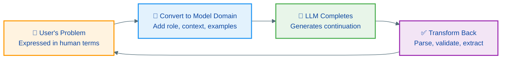
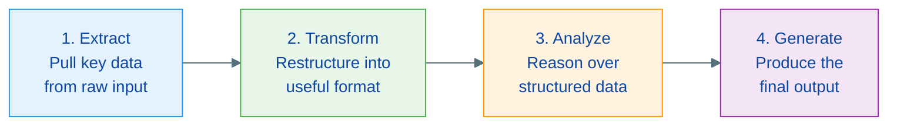
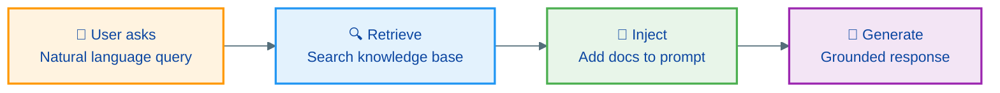
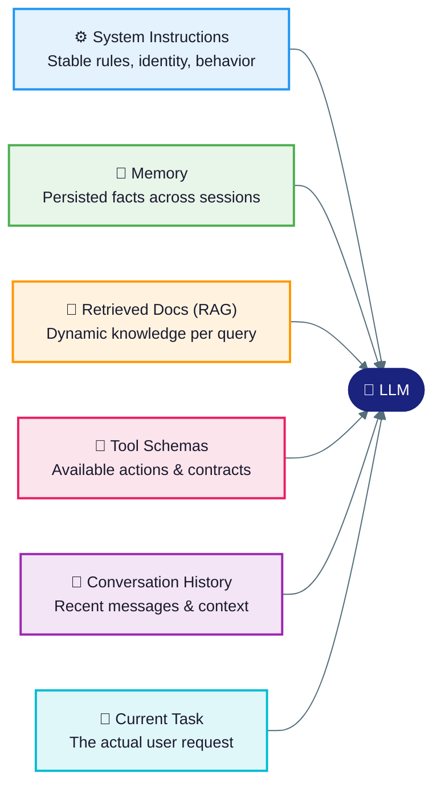
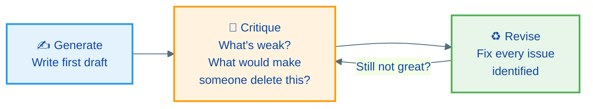

## Table of Contents

- [The problem everyone recognizes](#the-problem-everyone-recognizes)
- [“Prompt engineering is dead”](#prompt-engineering-is-dead)
- [The 80/20 of prompt engineering](#the-8020-of-prompt-engineering)
[1. Be specific](#1-be-specific)
- [2. Show, don’t tell (few-shot)](#2-show-dont-tell-few-shot)
- [3. Iterate, don’t restart](#3-iterate-dont-restart)

- [How LLMs actually work](#how-llms-actually-work)
[LLMs are document completers](#llms-are-document-completers)
- [How LLMs see the world differently](#how-llms-see-the-world-differently)
- [The context window](#the-context-window)
- [Bigger isn’t always better](#bigger-isnt-always-better)
- [Practical rules](#practical-rules)
- [The Loop Framework](#the-loop-framework)

- [Core techniques](#core-techniques)
[The 5 Principles](#the-5-principles)
- [The Playwriting metaphor](#the-playwriting-metaphor)
- [Anatomy of a great prompt](#anatomy-of-a-great-prompt)
- [How prompt elements interact](#how-prompt-elements-interact)
- [Choose your document type](#choose-your-document-type)
- [Few-shot: the technique that always works](#few-shot-the-technique-that-always-works)

- [Advanced patterns](#advanced-patterns)
[Chain of Thought (CoT) reasoning](#chain-of-thought-cot-reasoning)
- [Prewarming](#prewarming)
- [ReAct Pattern](#react-pattern)
- [Prompt Chaining](#prompt-chaining)
- [RAG: Retrieval-Augmented Generation](#rag-retrieval-augmented-generation)
- [Context Engineering](#context-engineering)
- [Anatomy of a system prompt](#anatomy-of-a-system-prompt)
- [From chat to agents](#from-chat-to-agents)
- [Instructing agents](#instructing-agents)
- [Meta Prompting](#meta-prompting)
- [Self-Critique Prompting](#self-critique-prompting)
- [Text Style Unbundling](#text-style-unbundling)

- [Model settings and behavior](#model-settings-and-behavior)
[Temperature](#temperature)
- [The alignment tax](#the-alignment-tax)

- [Practice and evaluation](#practice-and-evaluation)
[Common pitfalls](#common-pitfalls)
- [Real rewrites](#real-rewrites)
- [Iteration in practice](#iteration-in-practice)
- [The SOMA framework for evaluation](#the-soma-framework-for-evaluation)
- [Which technique when?](#which-technique-when)
- [Prompt engineering at work](#prompt-engineering-at-work)

- [Your prompt toolkit](#your-prompt-toolkit)
[Templates](#templates)
- [Rules](#rules)

- [Key takeaways](#key-takeaways)
- [Resources](#resources)

This week I gave a talk at the Xebia Azure AI Winter Jam: *Prompt Engineering That Actually Works*. The session drew from two O’Reilly books, [*Prompt Engineering for LLMs*](https://www.oreilly.com/library/view/prompt-engineering-for/9781098156145/) by Berryman & Ziegler and [*Prompt Engineering for Generative AI*](https://www.oreilly.com/library/view/prompt-engineering-for/9781098153427/) by Phoenix & Taylor, along with the latest 2025-2026 research.

This is an expanded writeup of that talk. The goal: get more predictable results out of LLMs, for quick daily tasks and for building AI features into products.

## The problem everyone recognizes

You type a prompt. The result is… fine. Kind of useful. But not exactly what you needed.

So you try again with slightly different wording. Still not quite right. After the fourth attempt, you either settle for “good enough” or give up.

Sound familiar?

Here’s the same scenario with and without intentional prompting:

 

 

 
The vague prompt

 
The engineered prompt

 

 

 

 

 
“Tell me about AI”

 
“You are a tech analyst writing for a CTO audience. Compare the top 3 AI approaches for enterprise use in 2026, in a table with pros and cons.”

 

 

 
500 words of generic overview

 
Focused comparison table with CTO-appropriate depth

 

 

 
Probably hallucinated dates

 
Actionable insights in the format you asked for

 

 

Same model. Same topic. Completely different result.

## “Prompt engineering is dead”

You’ve seen the headlines. Let’s be honest about what actually changed.

Models got smarter. You don’t need magic spells anymore. In 2024, phrasing mattered enormously. In 2026, Claude and GPT understand vague intent much better. The “prompt wizard” era is over.

 

 

 
What died

 
What evolved

 

 

 

 

 
Memorizing magic phrases

 
Clear communication with AI

 

 

 
“Act as a…” formulas

 
System prompts for agents

 

 

 
Prompt libraries of 500 templates

 
CLAUDE.md & copilot-instructions.md

 

 

 
Prompt engineer as a job title

 
Context architecture at scale

 

 

**What matters in 2026:**

 
- Instructing agents, not just chatbots
 
- Designing workflows, not sentences
 
- Evaluation and reliability
 
- The skill inside every role

This talk teaches the skill that survived: communicating effectively with AI systems, from chat to agents.

## The 80/20 of prompt engineering

Dozens of techniques exist. Three of them deliver 80% of the value. Start here.

### 1. Be specific

Say who it’s for, what format you want, how long, and what good looks like. Vagueness is the number one cause of bad output.

```
❌ "Summarize this"
✓ "Summarize this for a CTO in 3 bullets, max 50 words each"

```

### 2. Show, don’t tell (few-shot)

Give 2-3 examples of what you want. Models learn patterns faster from examples than from instructions.

```
❌ "Write a professional reply"
✓ [paste example reply] → "Write one like this for [new situation]"

```

### 3. Iterate, don’t restart

Your first prompt is a rough draft. Read the output, tell the model what to fix. Three rounds of iteration beats one “perfect” prompt.

```
"Good, but make it shorter and remove the jargon. Keep the data points."

```

Everything else in this post is for the remaining 20%. Get these three right first.

## How LLMs actually work

Knowing how the model actually works changes how you write prompts. Two mental models help.

### LLMs are document completers

LLMs don’t “understand” or “think.” They predict the most likely next token based on patterns in their training data. Your prompt is the beginning of a document. The model writes what should come next.

> 
 

“The beginning of your prompt is the start of a document. The model will try to write the most plausible continuation of that document.”
— Berryman & Ziegler, *Prompt Engineering for LLMs*

This is why framing matters so much. If you start with “Here’s why AI is overhyped…”, you’ll get a very different continuation than “Here’s what enterprises are getting right with AI…”.

### How LLMs see the world differently

Three differences that affect how you write prompts:

 

 

 
Difference

 
Implication

 

 

 

 

 
**One token at a time** (sequential, can’t skip ahead)

 
Order matters. Put critical constraints early

 

 

 
**Tokens, not words** (‘ChatGPT’ = [‘Chat’, ‘G’, ‘PT’])

 
Spelling, counting, and character-level tasks trip them up

 

 

 
**Pattern matching, not reasoning**

 
Few-shot examples speak their native language

 

 

### The context window

The model’s working memory: everything it can see at once. 1 token ≈ ¾ of a word.

Context windows have grown dramatically. As of early 2026:

 

 

 
Model

 
Context window

 
Max output

 

 

 

 

 
**OpenAI**

 
 

 
 

 

 

 
GPT-4o / GPT-4o mini

 
128K

 
16K

 

 

 
o3 / o4-mini

 
200K

 
100K

 

 

 
GPT-4.1 / 4.1 mini / 4.1 nano

 
1M

 
32K

 

 

 
**Anthropic**

 
 

 
 

 

 

 
Claude 3 Opus

 
200K

 
4K

 

 

 
Claude 3.5 Sonnet

 
200K

 
8K

 

 

 
Claude 3.5 Haiku

 
200K

 
8K

 

 

 
Claude Haiku 4.5

 
200K

 
64K

 

 

 
Claude Sonnet 4 / 4.5 / 4.6

 
200K (1M beta, API only)

 
64K

 

 

 
Claude Opus 4.6

 
200K (1M beta, API only)

 
128K

 

 

 
**Google**

 
 

 
 

 

 

 
Gemini 2.0 Flash / 2.5 Flash

 
1M

 
—

 

 

 
Gemini 2.5 Pro

 
1M (2M in testing)

 
—

 

 

 
**Meta**

 
 

 
 

 

 

 
Llama 3.1 / 3.2 / 3.3

 
128K

 
—

 

 

 
Llama 4 Maverick

 
1M

 
—

 

 

 
Llama 4 Scout

 
10M

 
—

 

 

 
**Mistral**

 
 

 
 

 

 

 
Mistral Small 3.1 / Medium 3

 
128K

 
—

 

 

 
Mistral Large 3 / Codestral

 
256K

 
—

 

 

 
**Other**

 
 

 
 

 

 

 
DeepSeek V3

 
128K

 
—

 

 

> 
 

Note: Claude 3.5 Haiku has been retired by Anthropic. API calls will error. Use Haiku 4.5 instead. The 1M beta for Claude 4-series requires a `context-1m-2025-08-07` header and is restricted to API tier 4.

**1M tokens is becoming the new baseline** for frontier models. Llama 4 Scout holds the current record at 10M (roughly 7.5 million words).

### Bigger isn’t always better

Two research findings are worth knowing before you start stuffing context.

**Lost in the middle** ([Liu et al., 2024](https://aclanthology.org/2024.tacl-1.9/)): performance degrades significantly when relevant information is placed in the middle of a long context. Models recall information at the start (primacy) and end (recency) much more reliably. In tested models, accuracy dropped over 30% when relevant content shifted from the edges to the middle.

**Context rot** ([Chroma Research, 2025](https://research.trychroma.com/context-rot)): performance becomes increasingly unreliable as input length grows, even within the advertised window. The common benchmark (“needle in a haystack”) (find a specific phrase buried in text) — is a weak proxy for real tasks. Summarization, reasoning, and agentic tasks degrade faster. At ~133K tokens, response latency can jump 50x.

### Practical rules

 
- **Put critical information at the edges** of your prompt, not in the middle
 
- **Long context ≠ better RAG**: use RAG when the knowledge base is large or dynamic; use full-context stuffing when you need holistic reasoning over a fixed document
 
- **Compress before you stuff**: summarize and trim irrelevant context rather than dumping everything in
 
- **Be skeptical of window sizes for complex tasks**: a model passing needle-in-a-haystack at 1M tokens doesn’t guarantee reliable reasoning across that full context in production

### The Loop Framework

The best mental model for debugging when things go wrong:



**You’re the translator** between human intent and AI patterns. When output goes wrong, check which step failed: bad conversion? Wrong completion? Poor transformation?

## Core techniques

### The 5 Principles

Five principles that work together:

 

 

 
#

 
Principle

 
What it means

 

 

 

 

 
1

 
**Give Direction**

 
Assign a role, set the tone and persona

 

 

 
2

 
**Specify Format**

 
Define output structure: bullets, JSON, table, length

 

 

 
3

 
**Provide Examples**

 
Few-shot learning: show what you want

 

 

 
4

 
**Evaluate Quality**

 
Set criteria: “Rate confidence 1-5” or require sources

 

 

 
5

 
**Divide Labor**

 
Break complex tasks into sequential, focused prompts

 

 

### The Playwriting metaphor

Berryman’s key insight: you’re not asking a question. You’re writing a script for a brilliant actor.

 

 

 
Script element

 
Prompting equivalent

 

 

 

 

 
**Set the Stage**

 
Context & background: what’s the situation?

 

 

 
**Cast the Role**

 
Persona & expertise: who should the AI be?

 

 

 
**Write the Lines**

 
Examples & patterns: show the style you want

 

 

 
**Direct the Scene**

 
Constraints & format: set the boundaries

 

 

### Anatomy of a great prompt

Each layer adds precision:

```
Role: "You are a senior Python developer"
Context: "reviewing code for a REST API"
Task: "Review for: security, bugs, performance"
Format: "For each issue: describe, rate severity, give fix"
Examples: [Include 1-2 examples of ideal output]
CoT: "Think through each concern systematically"

```

### How prompt elements interact

Your prompt is a system of interacting parts, not a flat list. Three things to keep in mind:

 

 

 
Property

 
What it means

 
Practical rule

 

 

 

 

 
**Position**

 
Elements at the start and end get the most attention

 
Put critical constraints early — don’t bury them in the middle

 

 

 
**Importance**

 
Role and format dominate output. Examples outweigh descriptions. Constraints beat suggestions

 
Invest effort in role and examples before tweaking wording

 

 

 
**Dependency**

 
Elements affect each other. Role shapes how examples are interpreted. Format can conflict with task complexity

 
Design prompts as a system — changing one element changes how others are read

 

 

### Choose your document type

Most people default to casual conversation. But different task types have different optimal frames:

 

 

 
Type

 
Best for

 
Example use

 

 

 

 

 
**Advice/Conversation**

 
Questions, brainstorming, exploration

 
Ideation, Q&A

 

 

 
**Analytic/Report**

 
Formal analysis, code review, data analysis

 
Evaluation, comparison

 

 

 
**Structured/Document**

 
Fixed format output, JSON, tables, templates

 
Data extraction, forms

 

 

### Few-shot: the technique that always works

Without examples, results are inconsistent. With 3 examples, results are predictable:

```
Without examples:
"Convert casual text to formal tone"
→ Inconsistent results, different styles each time

With 3 examples:
"Hey, can u help?" → "Could you please assist?"
"This is broken lol" → "This is not functioning."
"Thx so much!!!" → "Thank you."
→ Consistent, predictable, matches your style

```

**Why it works**: LLMs are pattern matchers. Examples speak their language better than any description. Use 2-3 diverse ones, include edge cases, mark them clearly.

## Advanced patterns

### Chain of Thought (CoT) reasoning

Asking the model to show its work dramatically improves accuracy on complex tasks.

```
Without reasoning:
"Solve this problem"
→ Answer: 42 (can't verify, can't debug)

With reasoning:
"Let's think step by step"
→ First... Then... Therefore: 42 (verifiable, debuggable)

```

> 
 

**2026 update**: Modern reasoning models (o3, Claude with extended thinking, Gemini 2.5 Pro) now do this automatically. But the concept still matters for debugging and for smaller/faster models where you want explicit reasoning.

### Prewarming

Prime the model before asking your real question. Ask it to gather relevant knowledge first, then use that as context.

```
Without prewarming:
"Give me 5 product names for shoes that fit any size."
→ UniFit, FlexShoe, AnySize... (generic)

With prewarming:
Step 1: "List 10 expert tips for naming consumer products."
Step 2: "Now using those tips, give me 5 product names
 for shoes that fit any size."
→ iMorph, SoleFlex, TrueForm... (expert-informed, creative)

```

Also called **Internal Retrieval** or **Generate Knowledge Prompting**: the model retrieves from its own training data before answering.

### ReAct Pattern

Reasoning + Action for complex tasks. Instead of letting the model jump straight to an answer, force it to show its thinking before each action.

```
Thought: Reason about what to do next
Action: Use a tool or execute a step
Observation: See the result and analyze it
Repeat: Until the task is complete

```

This is the backbone of most modern agent frameworks. In practice: ask the model to explain what it’s doing before it does it. This makes errors visible and debuggable, rather than silently baked into the final output.

### Prompt Chaining

Don’t ask the model to do everything at once. Break complex tasks into a pipeline of focused prompts:



Each step is independently testable. When something breaks, you know exactly where.

**Example: analyzing a contract**

 
- “Extract all dates, names, and amounts from this contract”
 
- “Given this data, create a JSON summary with…”
 
- “Compare these values and flag anomalies over 10%”
 
- “Write a 3-paragraph executive summary from this analysis”

### RAG: Retrieval-Augmented Generation

LLMs don’t know your internal data. RAG fetches relevant documents at query time and injects them as context. No retraining needed.



**Use cases**: documentation bots, code search, customer support, enterprise knowledge bases.

### Context Engineering

The prompt is only part of what the model reads. Context engineering means designing the *full information architecture*:



> 
 

“Prompt engineering is now being rebranded as context engineering” — promptingguide.ai

Each layer can be tuned independently.

### Anatomy of a system prompt

When you build an AI feature, the system prompt is where you do most of the work. It has four distinct components:

 

 

 
Component

 
Purpose

 
Example

 

 

 

 

 
**Identity**

 
Who the model is and what it knows

 
“You are a senior software engineer specializing in Python and API design.”

 

 

 
**Rules**

 
What the model must or must not do

 
“Always explain your reasoning. Never output code without a brief explanation.”

 

 

 
**Format**

 
How output should be structured

 
“Respond in markdown. Use bullet points for lists, code blocks for code.”

 

 

 
**Guardrails**

 
What to do when things go out of scope

 
“If asked about topics outside software engineering, politely redirect.”

 

 

A minimal but effective system prompt covers all four. You can leave Identity implicit (the model will infer from rules and context), but skipping Rules or Format usually leads to inconsistent output.

```
You are a technical writing assistant helping developers write clear API documentation.

Rules:
- Use plain language. Avoid jargon unless the term is defined first.
- Always include a request example and response example.
- Flag any ambiguous parameter descriptions for human review.

Format:
- Use markdown with H3 headings for each endpoint.
- Code blocks use the language tag (json, bash, etc.)

If asked to document something outside the API, ask for clarification.

```

The guardrail at the end is short on purpose. Over-specifying edge cases in the system prompt leads to brittle behavior. Define the center, not all the edges.

### From chat to agents

In 2026, the mode has shifted:

 

 

 
Chat mode

 
Agent mode

 

 

 

 

 
You type, AI responds

 
You instruct, AI executes

 

 

 
You write the prompt each time

 
Instructions run autonomously

 

 

 
You iterate manually

 
Agent self-corrects in a loop

 

 

 
You manage context yourself

 
Context managed by the system

 

 

 
One task at a time

 
Multi-step, multi-file workflows

 

 

> 
 

“GPT-3.5 in an agentic workflow outperforms GPT-4 with a single prompt.”
— Andrew Ng, Sequoia AI Ascent

Your “prompt” is now a configuration file. With Claude Code, GitHub Copilot, or Cursor, you write instructions once and they execute thousands of times. The surface has changed but the skill hasn’t: be specific, give examples, set constraints.

### Instructing agents

Each tool has its own instruction file. Here’s where your prompting skills live in 2026:

 

 

 
File

 
Tool

 
Purpose

 

 

 

 

 
`CLAUDE.md`

 
Claude Code

 
Global rules for the agent: conventions, workflow, preferences

 

 

 
`agent.md`

 
Claude Code sub-agents

 
Role and scope for a specialized sub-agent

 

 

 
`.github/copilot-instructions.md`

 
GitHub Copilot

 
Workspace-level coding conventions

 

 

 
`SKILL.md`

 
Claude Code skills

 
Reusable task definitions the agent can invoke

 

 

 
System prompt

 
Custom agents / APIs

 
Core identity, rules, and guardrails for production agents

 

 

```
# CLAUDE.md
Use TypeScript strict mode.
Run tests before committing.
Prefer async/await patterns.

```

```
# agent.md (security review sub-agent)
You are a security reviewer.
Focus: authentication, injection vulnerabilities, secrets in code.
Flag severity as: critical / warning / info.

```

```
# skills/deploy/SKILL.md
Use Bicep for all infrastructure. Target: Azure.
Naming convention: rg-{app}-{env}.
Always output a plan before applying changes.

```

Skills are particularly useful for repeated workflows: deploy, test, review, document. You define the skill once and the agent can invoke it by name.

**MCP (Model Context Protocol)** extends this further. It’s a standard for connecting agents to external tools: databases, APIs, file systems, internal services. When you define what tools an agent can use and how, you’re doing context engineering at the infrastructure level.

The same 80/20 principles apply. But with agents, vague instructions run at scale: across every file, every commit, every customer request.

### Meta Prompting

Stop writing prompts from scratch. Use a stronger model to generate and refine prompts for your target model.

 
- **Describe your task**: tell the LLM what you want to achieve
 
- **LLM generates prompt**: it produces a structured prompt using best practices
 
- **Test and iterate**: run the prompt, give feedback, let it refine further

Available tools: Anthropic Console prompt generator, OpenAI Playground system prompt builder, or simply ask Claude/GPT to write your prompt for you.

### Self-Critique Prompting

First drafts from AI are fine. Second drafts are better. Third drafts are great.



**Why it works**: LLMs are better critics than creators. They spot issues they wouldn’t have caught on first pass. Ask “What’s missing?” to surface gaps the model skipped over.

**Power move**: Give Claude’s output to GPT for critique, then back. Different models catch different things.

### Text Style Unbundling

Don’t describe the style you want. Extract it from examples.

 
- **Provide sample**: paste your best blog post, email, or brand copy
 
- **Extract features**: “Analyze this text. Identify: tone, sentence structure, vocabulary level, rhetorical devices, and formatting.”
 
- **Generate in style**: “Write a new [text] using EXACTLY these style features: [paste extracted features]”

**Use cases**: brand consistency, ghostwriting, matching someone’s writing style from samples.

Essentially advanced few-shot: instead of pasting examples, you extract the underlying rules and apply them explicitly.

## Model settings and behavior

### Temperature

```
temp = 0.1 → Deterministic → Facts, code, data extraction
temp = 0.5 → Professional → Emails, reports, analysis
temp = 0.9 → Creative → Brainstorming, fiction, copy

```

When in doubt, start at 0.3-0.5 and adjust from there.

### The alignment tax

RLHF made models helpful but also verbose, hedging, and overly cautious. Modern models handle this better, but it still shows up:

```
❌ "What's the capital of France?"
→ "Great question! The capital of France is Paris. I hope that helps!"

✓ Add: "Be concise. No disclaimers. Direct answers only."
→ "Paris."

```

When output feels “off” or unnecessarily padded, add explicit constraints about tone and length.

## Practice and evaluation

### Common pitfalls

 

 

 
Pitfall

 
Fix

 

 

 

 

 
**Too vague**

 
Add specifics: who, what, how many, format, for whom

 

 

 
**Negative instructions**

 
Say what TO do, not what NOT to do. “Be concise” beats “Don’t be long”

 

 

 
**Monolithic prompts**

 
Break into steps. Complex tasks need sequential, focused prompts

 

 

 
**Ignoring hallucinations**

 
Ask for sources. Add “If unsure, say so”

 

 

 
**Not iterating**

 
First prompt rarely perfect. Refine based on output

 

 

### Real rewrites

**Too vague → Specific:**

```
❌ "Summarize these meeting notes"
✓ "Extract: (1) key decisions, (2) action items with owners,
 (3) open questions. Max 150 words."

```

**Negative → Positive:**

```
❌ "Don't be too technical and don't use jargon"
✓ "Explain at high school level. Everyday analogies. Under 100 words."

```

**Monolith → Chained:**

```
❌ "Analyze Q3 sales, find trends, compare Q2, write report"
✓ "Step 1: Top 5 by revenue. Step 2: Compare to Q2.
 Step 3: Biggest trend. Step 4: 3-sentence summary."

```

### Iteration in practice

Nobody writes the perfect prompt on the first try. Here’s what three rounds looks like:

**Round 1:**

```
"Write a product description for our new headphones"
→ Generic, bland. Missing audience, tone, differentiators.
Fix: add who it's for and what makes it premium

```

**Round 2:**

```
"You are a copywriter for premium audio. 50-word description.
Target: remote workers. Tone: premium but approachable."
→ Better tone. Still missing the actual product specs.
Fix: add the features that matter

```

**Round 3:**

```
"...Same. Must mention: 40hr battery, spatial audio, ANC.
End with a call to action."
→ Specific, compelling, on-brand. ✓

```

Each round takes 30 seconds. Three rounds of iteration consistently beats one attempt at the perfect prompt.

### The SOMA framework for evaluation

When building AI features, test systematically:

 

 

 
Letter

 
Principle

 
What it means

 

 

 

 

 
**S**

 
Specificity

 
Test specific scenarios with concrete inputs and expected outputs

 

 

 
**O**

 
Objective Measurement

 
Define success criteria. Automate scoring. Track accuracy, consistency, format compliance

 

 

 
**M**

 
Multiple Scenarios

 
Test happy path AND edge cases, different input variations

 

 

 
**A**

 
Automation

 
Integrate testing into CI/CD. Treat prompts like production code

 

 

### Which technique when?

 

 

 
Situation

 
Technique

 

 

 

 

 
Output is vague or off-target

 
Be specific + format constraints

 

 

 
Need consistent results

 
Few-shot examples

 

 

 
First draft not good enough

 
Self-Critique: “Now critique this”

 

 

 
Don’t know how to prompt it

 
Meta Prompting: ask the AI to help

 

 

 
Complex multi-step task

 
Prompt Chaining

 

 

 
Need domain expertise primed

 
Prewarming first, then ask

 

 

 
Need to match a voice or style

 
Text Style Unbundling

 

 

 
High-stakes, can’t be wrong

 
CoT + Self-Consistency

 

 

 
Building an AI feature

 
Context Engineering + System Prompts

 

 

 
Need to measure quality at scale

 
SOMA framework + automated eval

 

 

Start at the top. Move down only when the simpler approach isn’t enough.

### Prompt engineering at work

These aren’t tricks. They’re just clear communication applied to common tasks:

**Code review:**

```
You are a senior Python developer reviewing code for a REST API.
Review for: bugs, performance, readability.
For each issue: describe it, rate severity (high/med/low), suggest a fix.

```

**Data analysis:**

```
Analyze this CSV of monthly sales data.
Identify the top 3 trends, any anomalies, and explain what's driving them.
Format: numbered list.

```

**Email drafting:**

```
Write a follow-up email to a client whose project is 2 weeks late due to API issues.
Tone: firm but professional. Goal: get a new commitment date from them.
Max 100 words.

```

**Content creation:**

```
You are a B2B content strategist. Write a 300-word blog intro about cloud migration,
targeted at CTOs. Tone: authoritative, not salesy.

```

## Your prompt toolkit

### Templates

**The Expert:**

```
You are a [role] with [X] years of experience.
[Task] for [audience]. Format: [format]. Max [N] words.

```

**The Extractor:**

```
From [source], extract: [field 1], [field 2], [field 3].
Return as [JSON/table]. If unsure: unknown.

```

**The Analyst:**

```
Analyze [data]. Top [N] trends. Compare to [benchmark].
Present as [format].

```

**The Creator:**

```
Write [type] about [topic]. Audience: [who]. Tone: [tone].
Include: [elements]. [N] words.

```

### Rules

 
- Start with a clear verb: Summarize, Compare, Create, Extract
 
- Assign a role and expertise level
 
- Set constraints: length, format, audience, tone
 
- Show 2-3 examples (few-shot)
 
- Use delimiters to separate instructions from data
 
- Break complex tasks into steps or chains
 
- Iterate: first prompt is a rough draft
 
- Say what TO do, not what NOT to do

## Key takeaways

 

 

 
#

 
Takeaway

 

 

 

 

 
1

 
**LLMs are document completers**: they predict continuations. Design prompts as document beginnings

 

 

 
2

 
**The Loop is your mental model**: you’re the translator between human intent and AI patterns

 

 

 
3

 
**80/20 applies**: specificity, examples, and iteration deliver most of the value

 

 

 
4

 
**Context engineering > prompt engineering**: design all six layers, not just the message

 

 

 
5

 
**Agents change the surface, not the skill**: the same principles apply, with higher stakes

 

 

 
6

 
**Evaluate systematically**: SOMA framework — Specificity, Objective measurement, Multiple scenarios, Automation

 

 

The skill that survived the “prompt engineering is dead” wave isn’t about magic phrases. It’s about communicating clearly with AI systems, in chat or in production.

Start today: pick one technique from this post, apply it to a real task, and iterate.

## Resources

 

 

 
Resource

 
Description

 

 

 

 

 
[**Prompt Engineering for LLMs**](https://www.oreilly.com/library/view/prompt-engineering-for/9781098156145/)

 
O’Reilly book by Berryman & Ziegler

 

 

 
[**Prompt Engineering for Generative AI**](https://www.oreilly.com/library/view/prompt-engineering-for/9781098153427/)

 
O’Reilly book by Phoenix & Taylor

 

 

 
[**Anthropic Prompt Library**](https://docs.anthropic.com/en/prompt-library/library)

 
Ready-to-use prompt templates from Anthropic

 

 

 
[**Prompt Engineering Guide**](https://www.promptingguide.ai/)

 
Comprehensive community resource

 

 

 
[**OpenAI Prompt Engineering**](https://platform.openai.com/docs/guides/prompt-engineering)

 
Official OpenAI guidance

 

 

> 
 

💬 **What’s your go-to prompt technique?**

 

I’d love to hear what works for your workflow. Connect with me on [LinkedIn](https://linkedin.com/in/hiddedesmet).